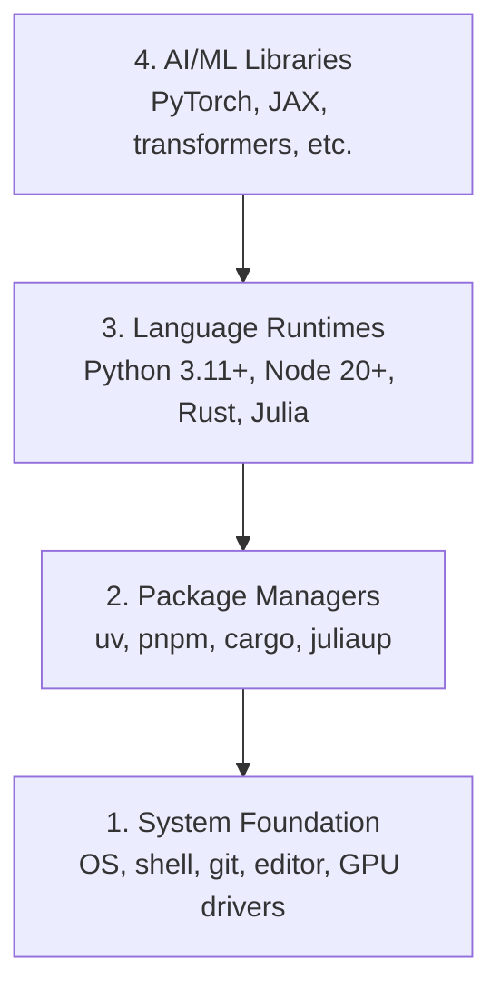

# 开发环境

> 工具会塑造你的思考方式。只要一次配置到位，后面就省掉大量反复排障的时间。

**类型:** 构建 **语言:** Python、Node.js、Rust
**先决条件:** 无
**预计时间:** ~45 分钟

## 学习目标

- 从零安装 Python 3.11+、Node.js 20+ 和 Rust 工具链
- 配置虚拟环境与包管理器，保证构建可复现
- 验证 CUDA/MPS 的 GPU 访问，并跑一次张量计算校验
- 理解四层环境栈：系统、包管理、语言运行时、AI 库

## 问题

你会在 200+ 节课里同时使用 Python、TypeScript、Rust 和 Julia 学习 AI 工程。如果环境配置不稳定，每一节课都会变成和工具链斗争，而不是学习核心概念。

很多人会跳过环境搭建，然后花几个小时排查 import errors、版本冲突和缺失 CUDA 驱动。我们会一次到位地把这部分基础打牢。

## 概念

AI 工程环境一般分为四层：



安装顺序是自底向上。每一层都依赖它下面的那一层。

## 从零构建

### 步骤 1：系统基础

检查系统并安装基础工具。

```bash
# macOS
xcode-select --install
brew install git curl wget

# Ubuntu/Debian
sudo apt update && sudo apt install -y build-essential git curl wget

# Windows (use WSL2)
wsl --install -d Ubuntu-24.04
```

### 步骤 2：用 uv 安装 Python

我们使用 `uv`，它比 pip 快 10-100 倍，并且会自动处理虚拟环境。

```bash
curl -LsSf https://astral.sh/uv/install.sh | sh

uv python install 3.12

uv venv
source .venv/bin/activate  # or .venv\Scripts\activate on Windows

uv pip install numpy matplotlib jupyter
```

验证：

```python
import sys
print(f"Python {sys.version}")

import numpy as np
print(f"NumPy {np.__version__}")
a = np.array([1, 2, 3])
print(f"Vector: {a}, dot product with itself: {np.dot(a, a)}")
```

### 步骤 3：用 pnpm 安装 Node.js

用于 TypeScript 课程，例如 Agents、MCP servers 和 Web 应用开发。

```bash
curl -fsSL https://fnm.vercel.app/install | bash
fnm install 22
fnm use 22

npm install -g pnpm

node -e "console.log('Node', process.version)"
```

### 步骤 4：安装 Rust

用于对性能要求高的课程，例如推理引擎和系统级实现。

```bash
curl --proto '=https' --tlsv1.2 -sSf https://sh.rustup.rs | sh

rustc --version
cargo --version
```

### 步骤 5：安装 Julia（可选）

用于偏数学的课程，尤其是重度数值计算部分。

```bash
curl -fsSL https://install.julialang.org | sh

julia -e 'println("Julia ", VERSION)'
```

### 步骤 6：GPU 配置（有 GPU 时）

```bash
# NVIDIA
nvidia-smi

# Install PyTorch with CUDA
uv pip install torch torchvision torchaudio --index-url https://download.pytorch.org/whl/cu124
```

```python
import torch
print(f"CUDA available: {torch.cuda.is_available()}")
if torch.cuda.is_available():
    print(f"GPU: {torch.cuda.get_device_name(0)}")
```

没有 GPU 也没关系。大多数课程都能在 CPU 上完成。训练较重的课程可以使用 Google Colab 或云 GPU。

### 步骤 7：验证全部配置

运行验证脚本：

```bash
python phases/00-setup-and-tooling/01-dev-environment/code/verify.py
```

## 使用它

完成后你的环境可以支撑本课程相关内容。各语言的覆盖范围如下：

| 语言 | 出现阶段 | 包管理器 |
|------|----------|----------|
| Python | 第 1-12 阶段（ML、DL、NLP、视觉、音频、LLM） | uv |
| TypeScript | 第 13-17 阶段（工具、Agents、Swarms、基础设施） | pnpm |
| Rust | 第 12、15-17 阶段（性能敏感系统） | cargo |
| Julia | 第 1 阶段（数学基础） | Pkg |

## 交付成果

本课产出一份验证脚本，任何人都可以用它检查自己的环境搭建是否成功。

参见 `outputs/prompt-env-check.md`，其中有一份可直接使用的 prompt，能帮助 AI 助手诊断环境问题。

## 练习

1. 运行验证脚本并修复所有失败项
2. 为本课程创建 Python 虚拟环境并安装 PyTorch
3. 用四种语言分别写一个“hello world”并运行
