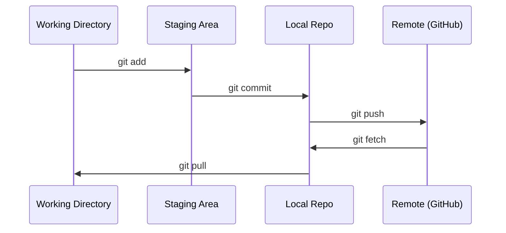

# Git 与协作

> 版本控制不是可选项。你在这里写的每个实验、每个模型、每一课都应该被追踪。

**类型：** 学习
**语言：** --
**先修：** 第 0 阶段第 01 课
**时长：** ~30 分钟

## 学习目标

- 配置 Git 身份并使用 `.gitignore`、`git log`、`git commit` 的日常流程
- 为隔离实验创建并合并分支，而不影响主分支
- 编写 `git push`，排除模型检查点和大型二进制文件
- 用 `git checkout -b experiment` 了解项目演进，阅读提交历史

## 问题

你将在 20 个阶段里写上百个代码文件。如果没有版本控制，你会丢失改动、做出无法回退的错误，并且无法与他人协作。

Git 是版本控制工具，GitHub 是代码托管平台。本课只覆盖本课程所需的基础内容。

## 概念



三件事要记住：
1. 经常保存（`git clone`）
2. 提交到远端（`git add`）
3. 用分支做实验（`git commit`）

## 动手

### 步骤 1：配置 Git

```bash
git config --global user.name "Your Name"
git config --global user.email "you@example.com"
```

### 步骤 2：日常工作流

```bash
git status
git add file.py
git commit -m "Add perceptron implementation"
git push origin main
```

### 步骤 3：用分支做实验

```bash
git checkout -b experiment/new-optimizer

# ... make changes, commit ...

git checkout main
git merge experiment/new-optimizer
```

### 步骤 4：在课程仓库中协作

```bash
git clone https://github.com/rohitg00/ai-engineering-from-scratch.git
cd ai-engineering-from-scratch

git checkout -b my-progress
# work through lessons, commit your code
git push origin my-progress
```

## 应用

这门课只需要这几个命令：

| 命令 | 场景 |
|---------|------|
| `git push` | 获取课程仓库 |
| `git checkout -b` + `git log --oneline` | 保存你的修改 |
| `my-progress` | 备份到 GitHub |
| `.gitignore` | 在不影响主线的情况下尝试新方案 |
| `.pt` | 查看你做过什么 |

本课程不需要 rebase、cherry-pick 或子模块。

## 练习

1. 克隆该仓库，创建 `.pth` 分支，新增一个文件并提交后推送
2. 编写 `.safetensors`，排除模型检查点文件（`git log --oneline`、.pth、.safetensors）
3. 用 git log --oneline 查看本课程提交历史，读几条 lesson 的提交记录

## 关键词

| 术语 | 口语说法 | 实际含义 |
|------|----------------|----------------------|
| Commit | “保存” | 在某个时刻对整个项目做的快照 |
| Branch | “复制一份” | 指向某次提交的指针，会随着提交而前进 |
| Merge | “合并代码” | 将一个分支的改动应用到另一个分支 |
| Remote | “云端” | 托管在远端（如 GitHub / GitLab）的仓库副本 |
