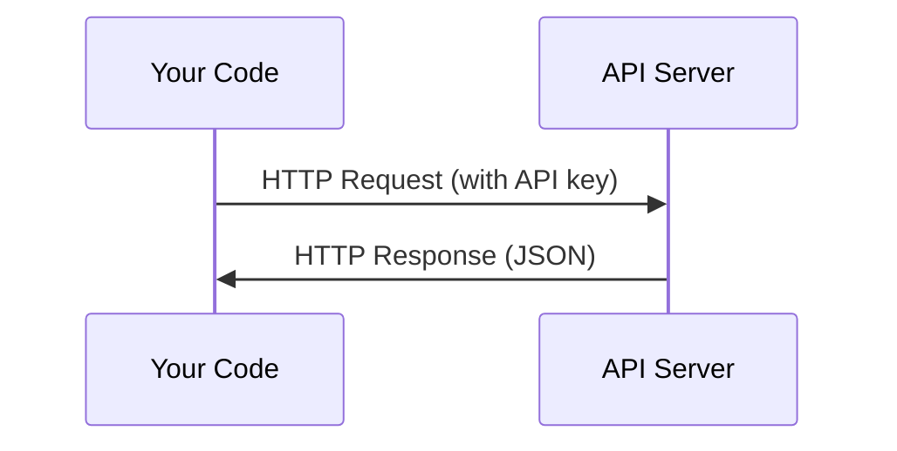

# API 与密钥

> 所有 AI API 的使用方式都一样：发请求，得响应。细节不同，但基本模式不变。

**类型:** 构建 **语言:** Python、TypeScript
**先修:** 第 0 阶段第 01 课
**时长:** ~30 分钟

## 学习目标

- 用环境变量与 `.env` 文件安全保存 API key
- 分别用 Anthropic Python SDK 与原始 HTTP 发起 LLM 调用
- 对比 SDK 与原始 HTTP 的请求/响应格式，便于调试
- 识别并处理常见 API 错误，包括鉴权与限流

## 问题

从第 11 阶段起你会调用 LLM API（Anthropic、OpenAI、Google）。在第 13 到 16 阶段还会在 agent loop 中高频调用它们。你需要先理解 API key 的工作方式、如何安全存储，以及如何发起第一次调用。

## 概念



每次 API 调用都包含：
1. 一个 endpoint（URL）
2. 一把 API key（身份鉴权）
3. 一个请求体（你要做什么）
4. 一个响应体（你得到什么）

## 动手

### 步骤 1：安全存放 API key

永远不要把 key 写进代码里。使用环境变量：

```bash
export ANTHROPIC_API_KEY="sk-ant-..."
export OPENAI_API_KEY="sk-..."
```

或者用 `.env` 文件（并把它加到 `.gitignore`）：

```
ANTHROPIC_API_KEY=sk-ant-...
OPENAI_API_KEY=sk-...
```

### 步骤 2：首次 API 调用（Python）

```python
import anthropic

client = anthropic.Anthropic()

response = client.messages.create(
    model="claude-sonnet-4-20250514",
    max_tokens=256,
    messages=[{"role": "user", "content": "What is a neural network in one sentence?"}]
)

print(response.content[0].text)
```

### 步骤 3：首次 API 调用（TypeScript）

```typescript
import Anthropic from "@anthropic-ai/sdk";

const client = new Anthropic();

const response = await client.messages.create({
  model: "claude-sonnet-4-20250514",
  max_tokens: 256,
  messages: [{ role: "user", content: "What is a neural network in one sentence?" }],
});

console.log(response.content[0].text);
```

### 步骤 4：原始 HTTP（不使用 SDK）

```python
import os
import urllib.request
import json

url = "https://api.anthropic.com/v1/messages"
headers = {
    "Content-Type": "application/json",
    "x-api-key": os.environ["ANTHROPIC_API_KEY"],
    "anthropic-version": "2023-06-01",
}
body = json.dumps({
    "model": "claude-sonnet-4-20250514",
    "max_tokens": 256,
    "messages": [{"role": "user", "content": "What is a neural network in one sentence?"}],
}).encode()

req = urllib.request.Request(url, data=body, headers=headers, method="POST")
with urllib.request.urlopen(req) as resp:
    result = json.loads(resp.read())
    print(result["content"][0]["text"])
```

这正是 SDK 在底层完成的流程。理解原始 HTTP 请求有助于你在排错时快速定位问题。

## 应用

课程内的使用场景：

| API | 适用场景 | 免费额度 |
|-----|-----------------|-----------|
| Anthropic (Claude) | 第 11-16 阶段（agents、tools） | 注册赠送 $5 |
| OpenAI | 第 11 阶段（对比实验） | 注册赠送 $5 |
| Hugging Face | 第 4-10 阶段（模型、数据集） | 免费 |

你不必一次性配置全部。按课程要求逐步开启即可。

## 交付

本课产出：
- `outputs/prompt-api-troubleshooter.md` - 常见 API 错误排查清单

## 练习

1. 申请 Anthropic API key 并完成第一条 API 调用
2. 尝试原始 HTTP 版本，并与 SDK 返回格式做对比
3. 故意使用错误的 API key，观察并理解报错信息

## 关键词

| 术语 | 口语说法 | 实际含义 |
|------|----------------|----------------------|
| API key | “API 的密码” | 标识账号身份并授权请求的唯一字符串 |
| Rate limit | “被限流了” | 每分钟/每小时请求数量上限，避免滥用并保证公平 |
| Token | “一个词” | 计费单位，输入和输出 token 独立计数并计费 |
| Streaming | “实时返回” | 不用等待完整响应，按片段（词/段）持续返回结果 |
