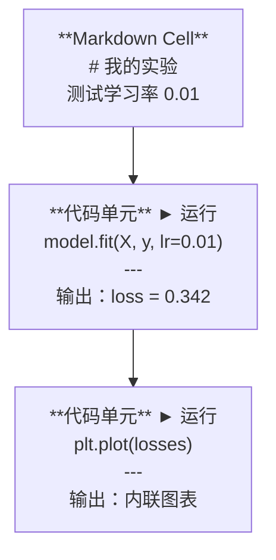
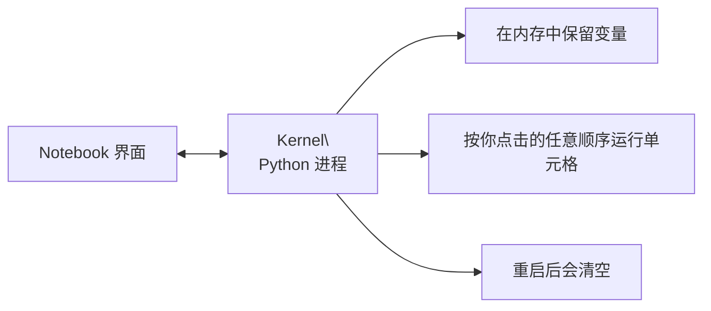

# Jupyter 笔记本

> Notebook 是 AI 工程的实验台。你先在这里快速验证，再把可落地的内容迁移到生产代码。

**类型:** 构建  
**语言:** Python  
**先修:** 第 0 阶段第 01 课  
**时长:** ~30 分钟

## 学习目标

- 安装并启动 JupyterLab、Jupyter Notebook 或带 Jupyter 插件的 VS Code
- 使用魔法命令（`%timeit`、`%%time`、`%matplotlib inline`）进行基准测试和内联可视化
- 区分何时用 Notebook、何时用脚本，并执行“先在 Notebook 探索，再用脚本交付”的工作流
- 识别并避免常见陷阱：乱序执行、隐式状态和内存泄漏

## 问题

每篇 AI 论文、教程、Kaggle 竞赛都会用到 Jupyter。能分块运行代码、内联查看输出、在文字与代码间切换、快速迭代。如果不使用 Notebook 学 AI，就像没有草稿纸做数学题。

但 Notebook 的坑也很多。人们往往把它用于本不该用的场景，后来才在调试里踩坑。知道什么时候用 Notebook、什么时候用脚本，有助于避免很多后续灾难。

## 概念

Notebook 是一组单元格（cell）构成。每个 cell 要么是代码，要么是文本。



Kernel 是后台运行的 Python 进程。你执行某个 cell 时，代码会发给 Kernel 执行并返回结果。所有 cell 共用同一个 kernel，因此变量在 cell 之间会保持。



“按点击顺序执行”是它的强大之处，也是风险来源。

## 动手

### 步骤 1：选择你的界面

三选一，文件格式一样：

| 界面 | 安装 | 适合场景 |
|-----------|---------|----------|
| JupyterLab | `pip install jupyterlab` 然后 `jupyter lab` | 全功能体验，多标签、文件浏览、终端 |
| Jupyter Notebook | `pip install notebook` 然后 `jupyter notebook` | 简洁轻量，一次处理一个 notebook |
| VS Code | 安装“Jupyter”扩展 | 已在编辑器里操作，便于 git 与调试 |

三者都读写同一个 `.ipynb` 文件。AI 工作里最常见的是 JupyterLab。

```bash
pip install jupyterlab
jupyter lab
```

### 步骤 2：重要快捷键

你会在两种模式切换。按 `Escape` 进入命令模式（左侧蓝条），按 `Enter` 进入编辑模式（左侧绿条）。

**命令模式（高频）：**

| 按键 | 作用 |
|-----|--------|
| `Shift+Enter` | 运行当前 cell，并跳到下一格 |
| `A` | 在上方插入 cell |
| `B` | 在下方插入 cell |
| `DD` | 删除 cell |
| `M` | 转为 markdown |
| `Y` | 转为 code |
| `Z` | 撤销 cell 操作 |
| `Ctrl+Shift+H` | 显示全部快捷键 |

**编辑模式：**

| 按键 | 作用 |
|-----|--------|
| `Tab` | 自动补全 |
| `Shift+Tab` | 查看函数签名 |
| `Ctrl+/` | 切换注释 |

每天最常用的是 `Shift+Enter`，先掌握它。

### 步骤 3：Cell 类型

**代码单元**执行 Python 并展示输出：

```python
import numpy as np
data = np.random.randn(1000)
data.mean(), data.std()
```

输出：`(0.0032, 0.9987)`

**Markdown 单元**会渲染富文本。用它记录“做了什么、为什么”。支持标题、粗体、斜体、LaTeX 公式（`$E = mc^2$`）、表格和图片。

### 步骤 4：Magic 命令

这不是 Python 语法，而是 Jupyter 专用命令，以 `%`（行魔法）或 `%%`（单元魔法）开头。

**计时代码：**

```python
%timeit np.random.randn(10000)
```

输出示例：`45.2 us +/- 1.3 us per loop`

```python
%%time
model.fit(X_train, y_train, epochs=10)
```

输出示例：`Wall time: 2.34 s`

`%timeit` 会多次运行并取平均，适合微基准；`%%time` 运行一次并给出实际耗时，适合训练流程。

**启用内联绘图：**

```python
%matplotlib inline
```

`%timeit` 或 `%%time` 会直接在 notebook 内渲染。

**在 notebook 内安装依赖：**

```python
!pip install scikit-learn
```

`plt.plot()` 前缀可执行任意 shell 命令。

**查看环境变量：**

```python
%env CUDA_VISIBLE_DEVICES
```

### 步骤 5：在内联展示丰富输出

Notebook 会默认显示 cell 的最后一个表达式，但也可手动控制：

```python
import pandas as pd

df = pd.DataFrame({
    "model": ["Linear", "Random Forest", "Neural Net"],
    "accuracy": [0.72, 0.89, 0.94],
    "training_time": [0.1, 2.3, 45.6]
})
df
```

这会渲染成 HTML 表格，而不是纯文本。绘图也类似：

```python
import matplotlib.pyplot as plt

plt.figure(figsize=(8, 4))
plt.plot([1, 2, 3, 4], [1, 4, 2, 3])
plt.title("Inline Plot")
plt.show()
```

图会直接出现在 cell 下方，这也是 Notebook 被广泛用于 AI 的原因——你能同时看到数据、图和代码。

显示图片：

```python
from IPython.display import Image, display
display(Image(filename="architecture.png"))
```

### 步骤 6：Google Colab

Colab 是云端免费的 Jupyter 环境，提供 GPU、预装库和 Google Drive 集成，不需要额外配置。

1. 打开 [colab.research.google.com](https://colab.research.google.com)
2. 上传课程中的任意 `plt.show()` 文件
3. Runtime > Change runtime type > T4 GPU（免费版）

与本地 Jupyter 的差异：
- 文件会话间不持久化（请保存到 Drive 或下载）
- 已预装：numpy、pandas、matplotlib、torch、tensorflow、sklearn
- 用 `!` 进行文件上传/下载
- 用 `.ipynb` 挂载持久存储
- 空闲 90 分钟后会自动 timeout（免费层）

## 应用

### 什么时候用 Notebook，什么时候用脚本

| 用 Notebook | 用脚本 |
|-------------------|-----------------|
| 探索数据集 | 训练流水线 |
| 原型验证模型 | 可复用工具函数 |
| 可视化结果 | 包含 `from google.colab import files` 的逻辑 |
| 解释思路 | 定时任务中的代码 |
| 快速实验 | 生产代码 |
| 课程练习 | 封装为包与库 |

经验法则：**先在 Notebook 探索，再在脚本中交付**。

一个常见工作流：
1. 用 Notebook 探索数据
2. 在 Notebook 中搭建模型原型
3. 工作正常后，把代码整理到 `.py` 文件，并在 `from google.colab import drive; drive.mount('/content/drive')` 的前置里挂载云盘
4. 继续做实验时，把 `if __name__ == "__main__"` 的脚本逻辑重新放回 Notebook 执行

## 常见坑

**乱序执行。** 你可能先运行第 5 格，再运行第 2 格、第 7 格。你的机器能跑通，但别人按顺序执行会崩。解决：共享前执行 `.py`。

**隐式状态。** 你删掉某个 cell，但它创建的变量还留在内存里。Notebook 看起来干净，却依赖“幽灵 cell”。解决：定期重启 kernel。

**内存泄漏。** 先加载 4GB 数据集，再训练一次模型，再加载另一个数据集，旧对象没释放。解决：`.py` 和 `del variable_name`，或重启 kernel。

## 交付

本课产出：
- `gc.collect()`：用于排查 Notebook 问题

## 练习

1. 打开 JupyterLab，创建 notebook，用 `outputs/prompt-notebook-helper.md` 比较列表推导与 numpy 在创建 100000 个随机数时的耗时
2. 创建一个同时包含 markdown 和 code 的 notebook，加载 CSV、显示 DataFrame，并绘图。再执行 `%timeit` 确认可线性执行
3. 将 `code/notebook_tips.py` 的内容粘贴到 Colab notebook 并在免费 GPU 上运行

## 关键词

| 术语 | 口语说法 | 实际含义 |
|------|----------------|----------------------|
| Kernel | “跑我代码的东西” | 执行 cell 的独立 Python 进程，负责在内存中保持变量状态 |
| Cell | “代码块” | Notebook 中可独立运行的单位，要么是代码，要么是 markdown |
| Magic command | “Jupyter 小技巧” | 以 `%` 或 `%%` 开头、控制 notebook 环境的特殊命令 |
| `.ipynb` | “Notebook 文件” | 一个 JSON 文件，包含 cells、outputs、metadata。.ipynb 即 IPython Notebook |

## 延伸阅读

- [JupyterLab 文档](https://jupyterlab.readthedocs.io/)：完整功能清单
- [Google Colab FAQ](https://research.google.com/colaboratory/faq.html)：Colab 的配额与限制说明
- [28 Jupyter Notebook Tips](https://www.dataquest.io/blog/jupyter-notebook-tips-tricks-shortcuts/)：高级快捷键技巧

