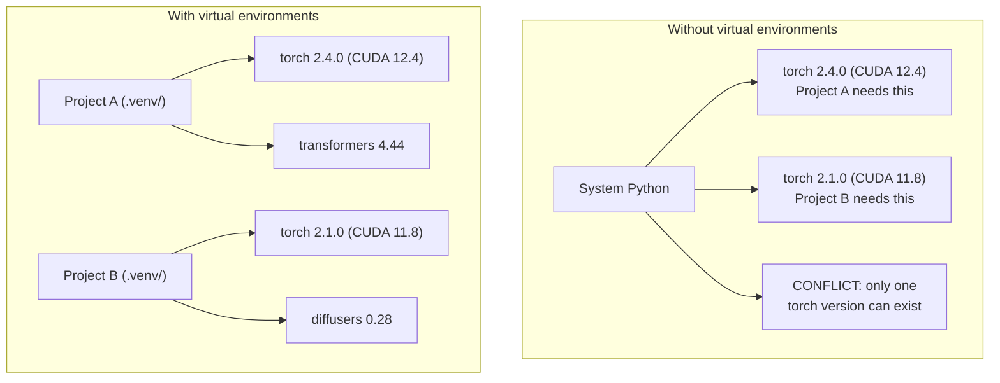

# Python 环境管理

> 依赖地狱是存在的，而虚拟环境是对症药。

**类型：** 构建  
**语言：** Shell  
**先修：** 第 0 阶段，第 01 课  
**时长：** ~30 分钟

## 学习目标

- 使用 `uv`、`venv` 或 `conda` 创建隔离的虚拟环境
- 编写带可选依赖分组的 `pyproject.toml`，并生成锁文件保障可复现
- 排查并修复常见问题：全局安装、pip/conda 混用、CUDA 版本不匹配
- 为有依赖冲突风险的项目设计分阶段环境策略

## 问题

你可能为一个微调项目装了 PyTorch 2.4，下周另一个项目又要求 PyTorch 2.1（CUDA 绑定固定）。你在全局升级，前一个项目坏了；回退后后一个项目又坏了。

这就是“依赖地狱”。AI/ML 中常见于：

- PyTorch、JAX、TensorFlow 各自有独立 CUDA 绑定
- 模型库往往固定某些框架版本
- 全局 `pip install` 会覆盖已有版本
- CUDA 11.8 的构建与 CUDA 12.x 驱动不兼容（反之亦然）

解决办法是：每个项目都用自己的隔离环境。

## 概念



## 动手

### 方案 1：uv venv（推荐）

`uv` 是最快的 Python 包管理器（比 pip 快 10-100 倍），一个工具涵盖虚拟环境、Python 版本和依赖解析。

```bash
curl -LsSf https://astral.sh/uv/install.sh | sh

uv python install 3.12

cd your-project
uv venv
source .venv/bin/activate
```

安装依赖：

```bash
uv pip install torch numpy
```

用 `pyproject.toml` 一步创建项目：

```bash
uv init my-ai-project
cd my-ai-project
uv add torch numpy matplotlib
```

### 方案 2：venv（内置）

如果你不能安装 `uv`，Python 自带 `venv`：

```bash
python3 -m venv .venv
source .venv/bin/activate  # Linux/macOS
.venv\Scripts\activate     # Windows

pip install torch numpy
```

比 `uv` 慢一些，但几乎任何 Python 环境都可用。

### 方案 3：conda（需要时）

Conda 可管理非 Python 依赖，如 CUDA toolkit、cuDNN、C 库。适用于：

- 需要特定 CUDA 版本且不想全局安装
- 在共享集群不能改系统依赖
- 库文档明确要求 `pip install`

```bash
# 安装 Miniconda（不是完整的 Anaconda）
curl -LsSf https://repo.anaconda.com/miniconda/Miniconda3-latest-Linux-x86_64.sh -o miniconda.sh
bash miniconda.sh -b

conda create -n myproject python=3.12
conda activate myproject

conda install pytorch torchvision torchaudio pytorch-cuda=12.4 -c pytorch -c nvidia
```

规则：一个环境里若用 conda，就用 conda 管理所有包。把 `code/env_setup.sh` 混进 conda 环境会引发很难排查的冲突。

### 针对本课程：按阶段分环境

你可以给整门课程只建一个环境，但不推荐。不同阶段可能需要不同甚至冲突的依赖。

推荐策略：

```
ai-engineering-from-scratch/
├── .venv/                    <-- shared lightweight env for phases 0-3
├── phases/
│   ├── 04-neural-networks/
│   │   └── .venv/            <-- PyTorch env
│   ├── 05-cnns/
│   │   └── .venv/            <-- same PyTorch env (symlink or shared)
│   ├── 08-transformers/
│   │   └── .venv/            <-- might need different transformer versions
│   └── 11-llm-apis/
│       └── .venv/            <-- API SDKs, no torch needed
```

本课程的 `pyproject.toml` 会创建基础环境。

## pyproject.toml 速览

每个 Python 项目都应该有 `pyproject.toml`，它取代了 `setup.py`、`setup.cfg` 和 `requirements.txt`。

```toml
[project]
name = "ai-engineering-from-scratch"
version = "0.1.0"
requires-python = ">=3.11"
dependencies = [
    "numpy>=1.26",
    "matplotlib>=3.8",
    "jupyter>=1.0",
    "scikit-learn>=1.4",
]

[project.optional-dependencies]
torch = ["torch>=2.3", "torchvision>=0.18"]
llm = ["anthropic>=0.39", "openai>=1.50"]
```

然后安装：

```bash
uv pip install -e ".[torch]"    # base + PyTorch
uv pip install -e ".[llm]"     # base + LLM SDKs
uv pip install -e ".[torch,llm]" # everything
```

## 锁文件

锁文件会把所有直接和间接依赖固定到精确版本。只要按锁文件安装，任何人都能重现完全一致的依赖树。

```bash
# uv generates uv.lock automatically when using uv add
uv add numpy

# pip-tools approach
uv pip compile pyproject.toml -o requirements.lock
uv pip install -r requirements.lock
```

锁文件应该提交到 git。别人克隆后按锁文件安装可得到同样版本。

## 常见错误

### 1. 全局安装

```bash
pip install torch  # BAD: installs to system Python

source .venv/bin/activate
pip install torch  # GOOD: installs to virtual environment
```

检查包安装位置：

```bash
which python       # should show .venv/bin/python, not /usr/bin/python
which pip           # should show .venv/bin/pip
```

### 2. 混用 pip 与 conda

```bash
conda create -n myenv python=3.12
conda activate myenv
conda install pytorch -c pytorch
pip install some-other-package   # BAD: can break conda's dependency tracking
conda install some-other-package # GOOD: let conda manage everything
```

若必须在 conda 中用 pip（某些包仅 pip 可得），先装完所有 conda 包，再最后装 pip 包。

### 3. 忘记激活环境

```bash
python train.py           # 使用系统 Python，会找不到依赖包
source .venv/bin/activate
python train.py           # 使用项目 Python，依赖包可用
```

终端提示符应显示环境名：

```
(.venv) $ python train.py
```

### 4. 把 `.venv` 提交到 git

```bash
echo ".venv/" >> .gitignore
```

虚拟环境通常 200MB-2GB，且不可跨机器移植。应提交 `env_setup.sh` 与锁文件。

### 5. CUDA 版本不匹配

```bash
nvidia-smi                # shows driver CUDA version (e.g., 12.4)
python -c "import torch; print(torch.version.cuda)"  # shows PyTorch CUDA version

# These must be compatible.
# PyTorch CUDA version must be <= driver CUDA version.
```

## 应用

运行环境初始化脚本创建课程环境：

```bash
bash phases/00-setup-and-tooling/06-python-environments/code/env_setup.sh
```

脚本会在仓库根目录创建 `pyproject.toml` 并安装并校验核心依赖。

## 练习

1. 运行 env_setup.sh 并确认所有检查通过
2. 再创建一个虚拟环境，安装不同版本 numpy，验证两个环境隔离
3. 为一个同时需要 PyTorch 和 Anthropic SDK 的项目编写 pyproject.toml
4. 故意不激活环境全局安装一个包，观察安装位置，再将其卸载

## 关键词

| 术语 | 口语说法 | 实际含义 |
|------|----------------|----------------------|
| 虚拟环境 | “venv” | 与系统 Python 隔离的目录，内含独立解释器与包 |
| 锁文件 | “锁定依赖” | 列出每个包及精确版本的文件，保证跨机器安装一致 |
| pyproject.toml | “新一代配置文件” | Python 项目标准配置文件，取代 setup.py/setup.cfg/requirements.txt |
| 传递依赖 | “依赖的依赖” | A 依赖 B，B 依赖 C，则 C 是 A 的间接依赖 |
| CUDA 不匹配 | “GPU 不工作” | PyTorch 编译目标 CUDA 与驱动支持 CUDA 版本不一致 |
