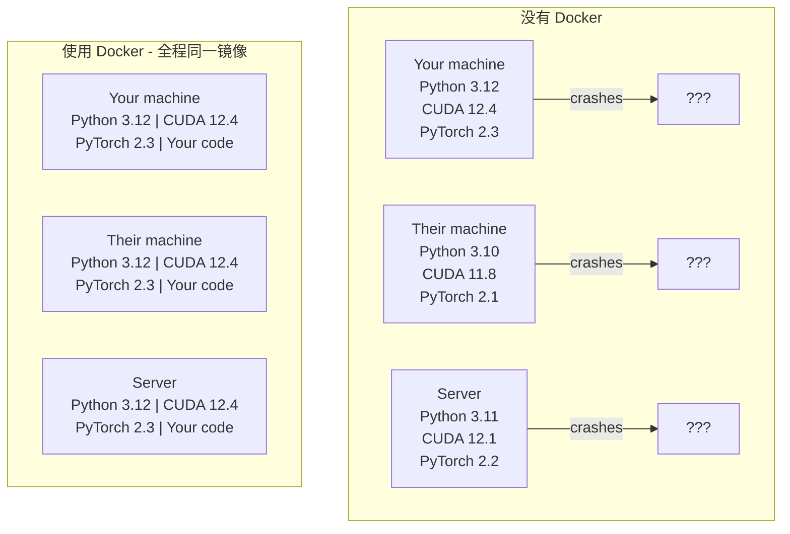

# AI 使用 Docker

> 容器让“只在我电脑上能跑”成为过去式。

**类型：** 构建  
**语言：** Docker  
**先修：** 第 0 阶段，第 01 和 03 课  
**时长：** ~60 分钟

## 学习目标

- 从 Dockerfile 构建一个支持 GPU 的镜像，内含 CUDA、PyTorch 和常用 AI 库
- 通过挂载卷把主机目录映射到容器里，在重建容器后保留模型、数据集和代码
- 配置 NVIDIA Container Toolkit，让容器内可访问 GPU
- 使用 Docker Compose 编排推理服务和向量数据库等多服务 AI 应用

## 问题

你在笔记本上用 PyTorch 2.3、CUDA 12.4 和 Python 3.12 训练了一个模型。你的同事机器上是 PyTorch 2.1、CUDA 11.8 和 Python 3.10。模型在对方机器上直接挂掉了。但如果你写的是 Dockerfile，它在两边都能跑。

AI 项目的依赖栈很容易变成噩梦。典型环境包括 Python、PyTorch、CUDA 驱动、cuDNN、系统级 C 库，以及像 flash-attn 这种要求精确编译器版本的包。Docker 会把这些东西打包到同一个镜像里，让它在各处表现一致。

## 核心概念

Docker 会把代码、运行时、库和系统工具打包成一个隔离单元，叫做容器。可把它视作轻量虚拟机，只是它共享宿主机的内核，所以启动只要几秒，不用等几分钟。



### 为什么 AI 项目比别的项目更需要 Docker

1. **GPU 驱动很脆弱。** CUDA 12.4 的代码通常不能直接在 CUDA 11.8 上运行。Docker 通过 NVIDIA Container Toolkit 让容器共享宿主机 GPU 驱动，而把 CUDA toolkit 放在容器内部管理。
2. **模型权重很大。** 一个 7B 参数模型在 fp16 下大约 14 GB。你不会想每次重建容器都重新下载它。Docker 卷能把 models 目录挂载到主机上。
3. **多服务架构很常见。** 真实的 AI 应用不只是一个 Python 脚本。它可能还包括推理服务、用于 RAG 的向量数据库，也可能有一个 Web 前端。Docker Compose 能用一条命令把它们都编排好。

### 常用术语

| 术语 | 含义 |
|------|------|
| Image | 只读模板。可视作你的配方，由 Dockerfile 构建出来。 |
| Container | 镜像的运行实例。可视作你的厨房运行环境。 |
| Dockerfile | 用于构建镜像的指令文件，按层执行。 |
| Volume | 容器重启后仍然保留的持久化存储。 |
| docker-compose | 用 YAML 定义多容器应用的工具。 |

### AI 中常见的容器形态

```text
Dev Container
  全套工具。带编辑器支持、Jupyter 和调试工具。
  用于开发和实验。

Training Container
  尽量精简。只保留训练脚本和依赖。
  在 GPU 集群上运行，不带编辑器，也不带 Jupyter。

Inference Container
  面向服务。镜像更小，冷启动更快。
  在生产环境中运行，通常放在负载均衡器后面。
```

## 动手实现

### 步骤 1：安装 Docker

```bash
# macOS
brew install --cask docker
open /Applications/Docker.app

# Ubuntu
curl -fsSL https://get.docker.com | sh
sudo usermod -aG docker $USER
# 退出并重新登录，让组权限变更生效
```

验证：

```bash
docker --version
docker run hello-world
```

### 步骤 2：安装 NVIDIA Container Toolkit（Linux + NVIDIA GPU）

这一步是为了让 Docker 容器访问 GPU。macOS 和 Windows（WSL2）用户可跳过，因为 Docker Desktop 在这些平台上处理 GPU passthrough 的方式不同。

```bash
distribution=$(. /etc/os-release;echo $ID$VERSION_ID)
curl -fsSL https://nvidia.github.io/libnvidia-container/gpgkey | sudo gpg --dearmor -o /usr/share/keyrings/nvidia-container-toolkit-keyring.gpg
curl -s -L https://nvidia.github.io/libnvidia-container/$distribution/libnvidia-container.list | \
    sed 's#deb https://#deb [signed-by=/usr/share/keyrings/nvidia-container-toolkit-keyring.gpg] https://#g' | \
    sudo tee /etc/apt/sources.list.d/nvidia-container-toolkit.list

sudo apt-get update
sudo apt-get install -y nvidia-container-toolkit
sudo nvidia-ctk runtime configure --runtime=docker
sudo systemctl restart docker
```

测试容器内的 GPU 访问：

```bash
docker run --rm --gpus all nvidia/cuda:12.4.1-base-ubuntu22.04 nvidia-smi
```

如果能看到 GPU 信息，说明 toolkit 已经生效。

### 步骤 3：理解基础镜像的选择

选对基础镜像，能省下很多调试时间。

```text
nvidia/cuda:12.4.1-devel-ubuntu22.04
  Full CUDA toolkit. Compilers included.
  用于：构建需要 `nvcc` 的包（如 flash-attn、bitsandbytes）
  大小：约 4 GB

nvidia/cuda:12.4.1-runtime-ubuntu22.04
  仅含 CUDA 运行时，不含编译器。
  用于：运行已构建好的代码
  大小：约 1.5 GB

pytorch/pytorch:2.3.1-cuda12.4-cudnn9-runtime
  已预装 PyTorch，并基于 CUDA。
  用于：跳过 PyTorch 安装步骤
  大小：约 6 GB

python:3.12-slim
  不含 CUDA，仅支持 CPU。
  用于：CPU 推理和轻量工具
  大小：约 150 MB
```

### 步骤 4：编写 AI 开发用 Dockerfile

下面是 `code/Dockerfile` 里的内容，逐段看一下：

```dockerfile
FROM nvidia/cuda:12.4.1-devel-ubuntu22.04

ENV DEBIAN_FRONTEND=noninteractive
ENV PYTHONUNBUFFERED=1

RUN apt-get update && apt-get install -y --no-install-recommends \
    python3.12 \
    python3.12-venv \
    python3.12-dev \
    python3-pip \
    git \
    curl \
    build-essential \
    && rm -rf /var/lib/apt/lists/*

RUN update-alternatives --install /usr/bin/python python /usr/bin/python3.12 1

RUN python -m pip install --no-cache-dir --upgrade pip setuptools wheel

RUN python -m pip install --no-cache-dir \
    torch==2.3.1 \
    torchvision==0.18.1 \
    torchaudio==2.3.1 \
    --index-url https://download.pytorch.org/whl/cu124

RUN python -m pip install --no-cache-dir \
    numpy \
    pandas \
    scikit-learn \
    matplotlib \
    jupyter \
    transformers \
    datasets \
    accelerate \
    safetensors

WORKDIR /workspace

VOLUME ["/workspace", "/models"]

EXPOSE 8888

CMD ["python"]
```

构建：

```bash
docker build -t ai-dev -f phases/00-setup-and-tooling/07-docker-for-ai/code/Dockerfile .
```

第一次构建会慢一些，因为要下载 CUDA 基础镜像和 PyTorch。后续构建会复用缓存层。

运行：

```bash
docker run --rm -it --gpus all \
    -v $(pwd):/workspace \
    -v ~/models:/models \
    ai-dev python -c "import torch; print(f'PyTorch {torch.__version__}, CUDA: {torch.cuda.is_available()}')"
```

在容器里启动 Jupyter：

```bash
docker run --rm -it --gpus all \
    -v $(pwd):/workspace \
    -v ~/models:/models \
    -p 8888:8888 \
    ai-dev jupyter notebook --ip=0.0.0.0 --port=8888 --no-browser --allow-root
```

### 步骤 5：用卷挂载数据和模型

卷挂载对 AI 工作非常关键。没有它们，容器停止后，14 GB 的模型下载就没了。

```bash
# Mount your code
-v $(pwd):/workspace

# Mount a shared models directory
-v ~/models:/models

# Mount datasets
-v ~/datasets:/data
```

训练脚本里从挂载路径加载：

```python
from transformers import AutoModel

model = AutoModel.from_pretrained("/models/llama-7b")
```

模型会保存在主机文件系统里。你能随时重建容器，不用重新下载。

### 步骤 6：用 Docker Compose 编排多服务 AI 应用

真正的 RAG 应用需要推理服务和向量数据库。Docker Compose 能用一条命令同时启动它们。

看 `code/docker-compose.yml`：

```yaml
services:
  ai-dev:
    build:
      context: .
      dockerfile: Dockerfile
    deploy:
      resources:
        reservations:
          devices:
            - driver: nvidia
              count: all
              capabilities: [gpu]
    volumes:
      - ../../../:/workspace
      - ~/models:/models
      - ~/datasets:/data
    ports:
      - "8888:8888"
    stdin_open: true
    tty: true
    command: jupyter notebook --ip=0.0.0.0 --port=8888 --no-browser --allow-root

  qdrant:
    image: qdrant/qdrant:v1.12.5
    ports:
      - "6333:6333"
      - "6334:6334"
    volumes:
      - qdrant_data:/qdrant/storage

volumes:
  qdrant_data:
```

启动所有服务：

```bash
cd phases/00-setup-and-tooling/07-docker-for-ai/code
docker compose up -d
```

现在，AI 开发容器能通过服务名 `qdrant` 访问向量数据库：`http://qdrant:6333`。Docker Compose 会自动创建共享网络。

在 AI 容器内测试连接：

```python
from qdrant_client import QdrantClient

client = QdrantClient(host="qdrant", port=6333)
print(client.get_collections())
```

停止所有服务：

```bash
docker compose down
```

如果再加上 `-v`，还会连 qdrant 卷一起删除：

```bash
docker compose down -v
```

### 步骤 7：AI 工作里常用的 Docker 命令

```bash
# 列出正在运行的容器
docker ps

# 列出所有镜像及其大小
docker images

# 删除未使用的镜像，回收磁盘空间
docker system prune -a

# 在运行中的容器里查看 GPU 使用情况
docker exec -it <container_id> nvidia-smi

# 从容器复制文件到宿主机
docker cp <container_id>:/workspace/results.csv ./results.csv

# 查看容器日志
docker logs -f <container_id>
```

## 使用实践

现在你已经有一个可复现的 AI 开发环境了。接下来的课程里：

- 用 `docker compose up` 同时启动开发环境和向量数据库
- 把代码、模型和数据都挂成卷，这样重建容器也不会丢
- 当某一课需要新增 Python 包时，先改 Dockerfile 再重建镜像
- 把 Dockerfile 分享给同伴，他们会得到完全一致的环境

### 没有 GPU？

去掉 `--gpus all` 参数和 NVIDIA deploy 块，容器依然也能用于 CPU 课程。PyTorch 会自动检测不到 CUDA，然后回退到 CPU。

## 练习

1. 构建 Dockerfile，并在容器内运行 `python -c "import torch; print(torch.__version__)"`
2. 启动 docker-compose 栈，并确认 qdrant 能在 AI 容器内通过 `http://qdrant:6333/collections` 访问
3. 在 Dockerfile 中加上 `flask`，重建镜像，再在 5000 端口跑一个简单 API。用 `-p 5000:5000` 做端口映射
4. 用 `docker images` 测量镜像大小。把基础镜像从 `devel` 切到 `runtime`，比较两者体积

## 关键术语

| 术语 | 常见说法 | 实际含义 |
|------|----------------|----------------------|
| Container | “轻量 VM” | 一个使用宿主内核、拥有独立文件系统和网络空间的隔离进程 |
| Image layer | “缓存步骤” | Dockerfile 的每条指令都会生成一层。没变的层会被缓存，所以重建很快 |
| NVIDIA Container Toolkit | “Docker 里的 GPU” | 一个运行时挂钩，通过 `--gpus` 参数把宿主机 GPU 暴露给容器 |
| Volume mount | “共享文件夹” | 宿主机目录映射进容器，容器停止后数据仍然保留 |
| Base image | “起始镜像” | Dockerfile 里 `FROM` 的镜像，是构建的起点，决定了预装什么 |
