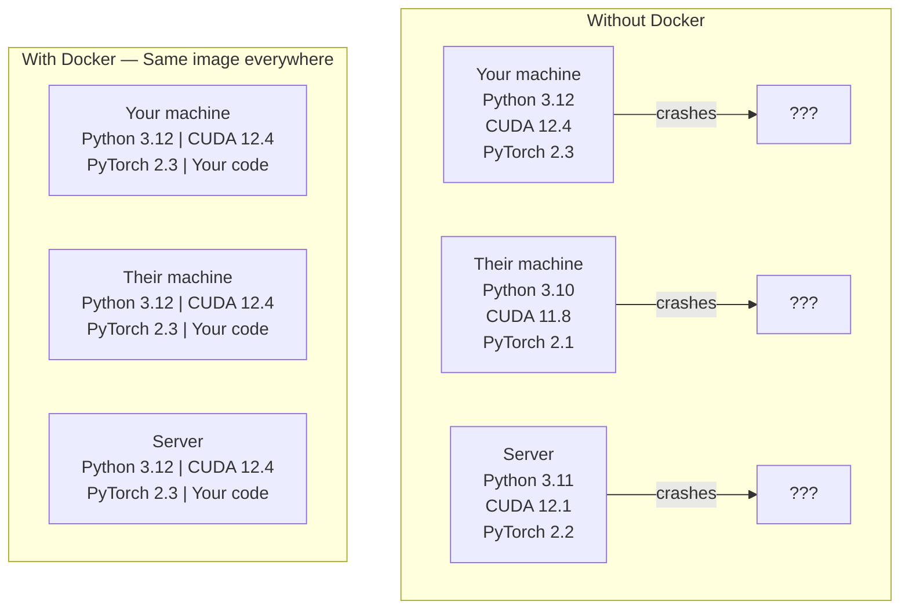

# AI 使用 Docker

> 容器让“只在我电脑上能运行”不再是常态。

**Type:** Build
**Languages:** Docker
**Prerequisites:** Phase 0, Lesson 01 and 03
**Time:** ~60 minutes

## 学习目标

- 使用 Dockerfile 构建带 CUDA、PyTorch 和常用 AI 库的 GPU 镜像
- 用 volume 映射主机目录，持久化模型、数据集和代码，避免重建后丢失
- 配置 NVIDIA Container Toolkit，让容器内可访问 GPU
- 用 Docker Compose 编排推理服务与向量数据库等多服务 AI 应用

## 问题

你在笔记本上用 PyTorch 2.3 + CUDA 12.4 + Python 3.12 训练了模型，同事环境是 PyTorch 2.1 + CUDA 11.8 + Python 3.10，模型就挂了；但你的 Dockerfile 在两边都能跑。

AI 项目依赖栈复杂：Python、PyTorch、CUDA 驱动、cuDNN、系统级 C 库以及如 flash-attn 等依赖固定编译器版本的包。Docker 把这些打进镜像，做到各处行为一致。

## 概念

Docker 把代码、运行时、库和系统工具打包为隔离单元 container。它像轻量虚拟机，但复用宿主内核，因此启动速度快很多。



### 为什么 AI 更依赖 Docker

1. **GPU 驱动脆弱**。CUDA 12.4 代码通常无法在 11.8 上直接跑通。NVIDIA Container Toolkit 允许容器共享宿主 GPU 驱动，CUDA toolkit 由容器内管理。
2. **模型文件很大**。7B 模型 fp16 下约 14GB，不希望每次重建容器都重新下载。挂载卷可将模型目录固定在主机。
3. **多服务模式常见**。真实 AI 应用不只是脚本，还包括推理服务、向量库、前端。Docker Compose 可以一条命令启动所有服务。

### 关键词

| 术语 | 含义 |
|------|---------------|
| Image | 只读模板。它是构建镜像的“食谱”，来自 Dockerfile |
| Container | image 的运行实例，类似一次“厨房运行环境” |
| Dockerfile | 定义镜像构建步骤的指令文件，按层(layer)执行 |
| Volume | 容器重启后仍保留的持久化存储 |
| docker-compose | 用 YAML 定义多容器应用的工具 |

### AI 常见容器形态

```
Dev Container
  Full toolkit. Editor support. Jupyter. Debugging tools.
  Used during development and experimentation.

Training Container
  Minimal. Just the training script and dependencies.
  Runs on GPU clusters. No editor, no Jupyter.

Inference Container
  Optimized for serving. Small image. Fast cold start.
  Runs behind a load balancer in production.
```

## 动手

### 步骤 1：安装 Docker

```bash
# macOS
brew install --cask docker
open /Applications/Docker.app

# Ubuntu
curl -fsSL https://get.docker.com | sh
sudo usermod -aG docker $USER
# Log out and back in for group change to take effect
```

验证：

```bash
docker --version
docker run hello-world
```

### 步骤 2：安装 NVIDIA Container Toolkit（Linux + NVIDIA GPU）

该步骤用于让 Docker 访问 GPU。macOS 与 Windows（WSL2）可跳过，Docker Desktop 会用不同方式处理 GPU passthrough。

```bash
distribution=$(. /etc/os-release;echo $ID$VERSION_ID)
curl -fsSL https://nvidia.github.io/libnvidia-container/gpgkey | sudo gpg --dearmor -o /usr/share/keyrings/nvidia-container-toolkit-keyring.gpg
curl -s -L https://nvidia.github.io/libnvidia-container/$distribution/libnvidia-container.list | \
    sed 's#deb https://#deb [signed-by=/usr/share/keyrings/nvidia-container-toolkit-keyring.gpg] https://#g' | \
    sudo tee /etc/apt/sources.list.d/nvidia-container-toolkit.list

sudo apt-get update
sudo apt-get install -y nvidia-container-toolkit
sudo nvidia-ctk runtime configure --runtime=docker
sudo systemctl restart docker
```

测试容器内 GPU：

```bash
docker run --rm --gpus all nvidia/cuda:12.4.1-base-ubuntu22.04 nvidia-smi
```

如果看到 GPU 信息，说明 toolkit 生效。

### 步骤 3：理解基础镜像选择

```
nvidia/cuda:12.4.1-devel-ubuntu22.04
  Full CUDA toolkit. Compilers included.
  Use for: building packages that need nvcc (flash-attn, bitsandbytes)
  Size: ~4 GB

nvidia/cuda:12.4.1-runtime-ubuntu22.04
  CUDA runtime only. No compilers.
  Use for: running pre-built code
  Size: ~1.5 GB

pytorch/pytorch:2.3.1-cuda12.4-cudnn9-runtime
  PyTorch pre-installed on top of CUDA.
  Use for: skipping the PyTorch install step
  Size: ~6 GB

python:3.12-slim
  No CUDA. CPU only.
  Use for: inference on CPU, lightweight tools
  Size: ~150 MB
```

### 步骤 4：编写 AI 开发 Dockerfile

查看 `code/Dockerfile`：

```dockerfile
FROM nvidia/cuda:12.4.1-devel-ubuntu22.04

ENV DEBIAN_FRONTEND=noninteractive
ENV PYTHONUNBUFFERED=1

RUN apt-get update && apt-get install -y --no-install-recommends \
    python3.12 \
    python3.12-venv \
    python3.12-dev \
    python3-pip \
    git \
    curl \
    build-essential \
    && rm -rf /var/lib/apt/lists/*

RUN update-alternatives --install /usr/bin/python python /usr/bin/python3.12 1

RUN python -m pip install --no-cache-dir --upgrade pip setuptools wheel

RUN python -m pip install --no-cache-dir \
    torch==2.3.1 \
    torchvision==0.18.1 \
    torchaudio==2.3.1 \
    --index-url https://download.pytorch.org/whl/cu124

RUN python -m pip install --no-cache-dir \
    numpy \
    pandas \
    scikit-learn \
    matplotlib \
    jupyter \
    transformers \
    datasets \
    accelerate \
    safetensors

WORKDIR /workspace

VOLUME ["/workspace", "/models"]

EXPOSE 8888

CMD ["python"]
```

构建：

```bash
docker build -t ai-dev -f phases/00-setup-and-tooling/07-docker-for-ai/code/Dockerfile .
```

首次构建会较慢（下载 CUDA 镜像 + PyTorch），后续可复用缓存层。

运行：

```bash
docker run --rm -it --gpus all \
    -v $(pwd):/workspace \
    -v ~/models:/models \
    ai-dev python -c "import torch; print(f'PyTorch {torch.__version__}, CUDA: {torch.cuda.is_available()}')"
```

在容器内启动 Jupyter：

```bash
docker run --rm -it --gpus all \
    -v $(pwd):/workspace \
    -v ~/models:/models \
    -p 8888:8888 \
    ai-dev jupyter notebook --ip=0.0.0.0 --port=8888 --no-browser --allow-root
```

### 步骤 5：挂载卷用于数据和模型

AI 项目离不开持久化。没挂载卷，容器重启时大量下载会丢失。

```bash
# Mount your code
-v $(pwd):/workspace

# Mount a shared models directory
-v ~/models:/models

# Mount datasets
-v ~/datasets:/data
```

训练脚本中读取挂载路径：

```python
from transformers import AutoModel

model = AutoModel.from_pretrained("/models/llama-7b")
```

模型保存在主机文件系统，随便重建容器都不用反复下载。

### 步骤 6：Docker Compose 编排多服务 AI 应用

真实 RAG 场景通常有推理服务和向量数据库。Compose 一条命令起多个服务。

见 `code/docker-compose.yml`：

```yaml
services:
  ai-dev:
    build:
      context: .
      dockerfile: Dockerfile
    deploy:
      resources:
        reservations:
          devices:
            - driver: nvidia
              count: all
              capabilities: [gpu]
    volumes:
      - ../../../:/workspace
      - ~/models:/models
      - ~/datasets:/data
    ports:
      - "8888:8888"
    stdin_open: true
    tty: true
    command: jupyter notebook --ip=0.0.0.0 --port=8888 --no-browser --allow-root

  qdrant:
    image: qdrant/qdrant:v1.12.5
    ports:
      - "6333:6333"
      - "6334:6334"
    volumes:
      - qdrant_data:/qdrant/storage

volumes:
  qdrant_data:
```

启动：

```bash
cd phases/00-setup-and-tooling/07-docker-for-ai/code
docker compose up -d
```

ai-dev 容器可以通过服务名访问 qdrant：http://qdrant:6333。Compose 会自动创建共享网络。

在 AI 容器内测试连接：

```python
from qdrant_client import QdrantClient

client = QdrantClient(host="qdrant", port=6333)
print(client.get_collections())
```

停止：

```bash
docker compose down
```

加 `http://qdrant:6333` 会连同 qdrant 数据卷一起清理：

```bash
docker compose down -v
```

### 步骤 7：AI 工作常用 Docker 命令

```bash
# List running containers
docker ps

# List all images and their sizes
docker images

# Remove unused images (reclaim disk space)
docker system prune -a

# Check GPU usage inside a running container
docker exec -it <container_id> nvidia-smi

# Copy a file from container to host
docker cp <container_id>:/workspace/results.csv ./results.csv

# View container logs
docker logs -f <container_id>
```

## 应用

你现在有了可复现的 AI 开发环境。课程后续可：

- 用 `-v` 一键启动开发容器和向量库
- 挂载代码、模型、数据，避免重建丢失
- 新课新增依赖时，先改 Dockerfile 再重建镜像
- 与同伴共享 Dockerfile，直接获得一致环境

### 没有 GPU 时

移除 `docker compose up` 和 NVIDIA deploy 块，容器依然可用于 CPU 课程。PyTorch 会自动回退到 CPU。

## 练习

1. 构建 Dockerfile，并在容器内运行 `--gpus all`
2. 启动 docker-compose，并确认 Qdrant 可在 AI 容器内通过 `python -c "import torch; print(torch.__version__)"` 访问
3. 在 Dockerfile 中加入 `http://qdrant:6333/collections` 后重建，并在 5000 端口映射测试一个简单 API
4. 用 `flask` 查看镜像大小，试着将基镜像从 `-p 5000:5000` 改为 `docker images` 对比大小

## 关键词

| 术语 | 口语说法 | 实际含义 |
|------|----------------|----------------------|
| Container | “轻量 VM” | 使用主机内核、拥有独立文件系统与网络空间的隔离进程 |
| Image layer | “缓存步骤” | Dockerfile 每条指令形成一层，未改动的层会被缓存，加速重建 |
| NVIDIA Container Toolkit | “Docker 内的 GPU” | 通过 `devel` 让容器访问宿主 GPU 的运行时能力 |
| Volume mount | “共享文件夹” | 宿主目录映射进容器，容器停止后数据仍保留 |
| Base image | “起始镜像” | Dockerfile 的 `runtime`，决定了预装组件与基础环境 |
