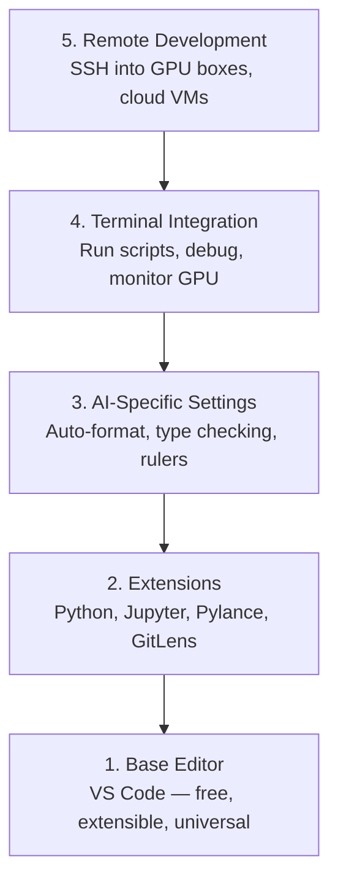

# 编辑器配置

> 编辑器是你的副驾驶。一次配置好，它就会少添乱，多干活。

**类型:** 构建
**语言:** --
**先修:** 第 0 阶段，第 01 课
**时长:** ~20 分钟

## 学习目标

- 安装 VS Code，并配好 Python、Jupyter、lint 和远程 SSH 的关键扩展
- 配置保存即格式化、类型检查和 notebook 输出滚动，适配 AI 开发流程
- 搭建 Remote SSH，在远程 GPU 机器上像本地一样编辑和调试代码
- 了解 Cursor、Windsurf、Neovim 这些替代编辑器在 AI 工作中的取舍

## 问题是什么

你会在编辑器里花上千小时：写 Python、跑 notebook、调试训练循环、SSH 到 GPU 机器。如果编辑器没配好，每次会话都会变得很费劲：没有自动补全、没有类型提示、没有内联报错、格式化要手动做，终端流程也很别扭。

把基础环境配好只要 20 分钟。跳过它，可能意味着你每天都在白白浪费 20 分钟。

## 核心概念

AI 开发常用的编辑器配置可以分成五层：



## 动手

### 第 1 步：安装 VS Code

VS Code 是推荐编辑器。它免费、跨平台，Jupyter 支持一流，扩展生态也足够覆盖 AI 工作所需。

从 [code.visualstudio.com](https://code.visualstudio.com/) 下载。

在终端里验证：

```bash
code --version
```

如果 macOS 上找不到 `code`，打开 VS Code，按 `Cmd+Shift+P`，输入 “Shell Command”，再选择 “Install 'code' command in PATH”。

### 第 2 步：安装关键扩展

在 VS Code 的集成终端里（`Ctrl+`` 或 `Cmd+``）安装这些和 AI 工作最相关的扩展：

```bash
code --install-extension ms-python.python
code --install-extension ms-python.vscode-pylance
code --install-extension ms-toolsai.jupyter
code --install-extension eamodio.gitlens
code --install-extension ms-vscode-remote.remote-ssh
code --install-extension ms-python.debugpy
code --install-extension ms-python.black-formatter
code --install-extension charliermarsh.ruff
```

它们分别负责：

| 扩展 | 用途 |
|-----------|-----|
| Python | 语言支持、虚拟环境检测、运行/调试 |
| Pylance | 快速类型检查、自动补全、导入解析 |
| Jupyter | 在 VS Code 内运行 notebook、查看变量 |
| GitLens | 查看谁改了什么、行内 git blame |
| Remote SSH | 像本地一样编辑远程 GPU 机器 |
| Debugpy | Python 单步调试 |
| Black Formatter | 保存即格式化，统一代码风格 |
| Ruff | 快速 lint，尽早发现常见错误 |

本课里的 `code/.vscode/extensions.json` 已经列好了完整推荐项。打开课程目录时，VS Code 会提示你安装这些扩展。

### 第 3 步：配置设置

你可以把本课 `code/.vscode/settings.json` 里的设置复制到本地，也可以通过 `Settings > Open Settings (JSON)` 手动配置。

AI 场景里最关键的是这些设置：

```jsonc
{
    "python.analysis.typeCheckingMode": "basic",
    "editor.formatOnSave": true,
    "editor.rulers": [88, 120],
    "notebook.output.scrolling": true,
    "files.autoSave": "afterDelay"
}
```

这些设置的重要性：

- **Basic 类型检查**：在运行前就能发现参数类型错误、张量形状不匹配和 API 参数写错
- **保存即格式化**：不用再手工整理代码，Black 会自动处理
- **88 和 120 标尺**：88 对应 Black 的换行宽度，120 用来提醒文档和注释是否过长
- **Notebook 输出滚动**：训练循环会打印很多内容，不打开滚动，输出面板会无限变高
- **自动保存**：你总会忘记保存。自动保存可以避免训练脚本跑到旧代码

### 第 4 步：终端集成

VS Code 的集成终端是你运行训练脚本、监控 GPU 和管理环境的主要入口。

建议这样配置：

```jsonc
{
    "terminal.integrated.defaultProfile.osx": "zsh",
    "terminal.integrated.defaultProfile.linux": "bash",
    "terminal.integrated.fontSize": 13,
    "terminal.integrated.scrollback": 10000
}
```

常用快捷键：

| 操作 | macOS | Linux/Windows |
|--------|-------|---------------|
| 切换终端 | `Ctrl+`` | `Ctrl+`` |
| 新建终端 | `Ctrl+Shift+`` | `Ctrl+Shift+`` |
| 拆分终端 | `Cmd+\` | `Ctrl+\` |

拆分终端很实用：一个窗口跑脚本，另一个窗口用 `nvidia-smi -l 1` 或 `watch -n 1 nvidia-smi` 盯 GPU 状态。

### 第 5 步：远程开发（SSH 到 GPU）

这是 AI 工作里最重要的扩展之一。训练任务常常跑在远程机器上，比如云主机、机房服务器、Lambda 或 Vast.ai。Remote SSH 能让你打开远程文件系统、编辑文件、运行终端和调试，就像在本机上一样。

设置步骤：

1. 安装 Remote SSH 扩展（第 2 步已经做了）
2. 按 `Ctrl+Shift+P`（或 `Cmd+Shift+P`），输入 “Remote-SSH: Connect to Host”
3. 输入 `user@your-gpu-box-ip`
4. VS Code 会自动在远端机器上安装 server 组件

如果要免密登录，可以先配置 SSH key：

```bash
ssh-keygen -t ed25519 -C "your-email@example.com"
ssh-copy-id user@your-gpu-box-ip
```

为了方便连接，可以把主机写进 `~/.ssh/config`：

```
Host gpu-box
    HostName 203.0.113.50
    User ubuntu
    IdentityFile ~/.ssh/id_ed25519
    ForwardAgent yes
```

之后直接用 `Remote-SSH: Connect to Host > gpu-box` 就能快速连接。

## 替代方案

### Cursor

[cursor.com](https://cursor.com) 是基于 VS Code 的分支，内置 AI 代码生成。它沿用同一套扩展生态和设置格式。如果你用 Cursor，这一课里的设置和清单基本可以直接复用。

### Windsurf

[windsurf.com](https://windsurf.com) 是另一个 AI-first 的 VS Code 分支。它也能复用同样的扩展、同样的设置格式，并支持 Remote SSH。

### Vim/Neovim

如果你已经熟悉 Vim 或 Neovim，并且用得很顺手，可以继续用。对 AI Python 场景，最低限度你需要配置：

- **pyright** 或 **pylsp** 做类型检查（通过 Mason 或手动安装）
- **nvim-lspconfig** 接入语言服务
- **jupyter-vim** 或 **molten-nvim** 做 notebook 风格执行
- **telescope.nvim** 做文件和符号检索
- **none-ls.nvim** 配合 black/ruff 做格式化和 lint

如果你现在还不熟悉 Vim，就不要临时切换。学习曲线会和 AI 工程本身抢注意力，直接用 VS Code 更合适。

## 应用

配好这套环境后，你的日常流程应该是：

1. 打开项目目录，或者通过 Remote SSH 连接到 GPU 机器
2. 在编辑器里写 Python，直接获得自动补全、类型提示和内联错误
3. 用 Jupyter 扩展在编辑器里运行 notebook
4. 在集成终端里运行训练脚本、执行 `uv pip install`、监控 GPU
5. 提交前用 GitLens 快速检查改动

## 练习

1. 安装 VS Code 和第 2 步列出的全部扩展
2. 把本课的 `settings.json` 复制到你的 VS Code 配置里
3. 打开一个 Python 文件，确认 Pylance 有类型提示，并且保存时会自动格式化
4. 如果你有远程机器可用，配置 Remote SSH 并打开远端目录

## 关键词

| 术语 | 口语说法 | 实际含义 |
|------|----------------|----------------------|
| LSP | “自动补全引擎” | 编辑器和语言服务之间的标准协议，提供类型信息、补全和诊断 |
| Pylance | “Python 插件” | 基于 Pyright 的微软 Python 语言服务，用于智能提示与类型检查 |
| Remote SSH | “在服务器上工作” | VS Code 在远端运行轻量 server，并把界面流回本地 |
| Format on save | “保存自动美化” | 每次保存时自动运行 Black、Ruff 等格式化工具，保证风格一致 |
