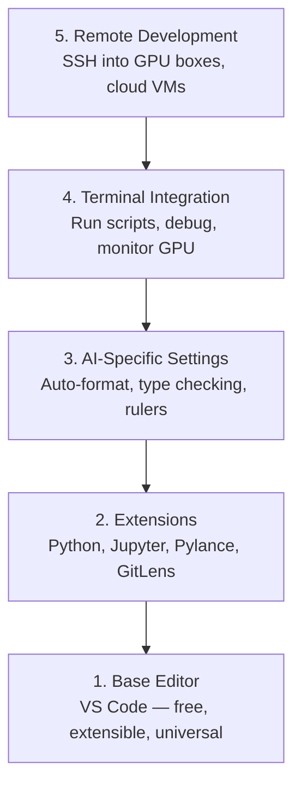

# 编辑器配置

> 编辑器是你的副驾驶。把它配置好，它会减少干扰并提升工作效率。

**类型:** Build
**语言:** --
**先修:** 第 0 阶段第 01 课
**时长:** ~20 分钟

## 学习目标

- 安装并配置 VS Code 的核心扩展：Python、Jupyter、lint、远程 SSH
- 配置自动格式化、类型检查和 notebook 输出滚动，适配 AI 工作流
- 配置 Remote SSH，在远程 GPU 机器上像本地一样编辑调试
- 了解 Cursor、Windsurf、Neovim 在 AI 开发中的取舍

## 问题

你会在编辑器里花上千小时：写 Python、跑 notebook、调试训练循环、SSH 到 GPU 机。编辑器配置不当会让每次会话都更耗力：没有自动补全、没有类型提示、无内联报错、格式要手工处理、终端不顺手。

把基础环境配好只要 20 分钟；跳过它可能每天都在浪费 20 分钟。

## 概念

AI 开发常用编辑器配置包含五个层面：



## 动手

### 步骤 1：安装 VS Code

VS Code 是推荐编辑器，免费、跨平台，Jupyter 支持一流，生态可覆盖 AI 工作流所需。

从 [code.visualstudio.com](https://code.visualstudio.com/) 下载。

终端验证：

```bash
code --version
```

如果 macOS 上找不到 `code`，打开 VS Code，`Cmd+Shift+P` 输入 “Shell Command”，选择 “Install 'code' command in PATH”。

### 步骤 2：安装关键扩展

在 VS Code 终端（`Ctrl+`` `code/.vscode/extensions.json`Cmd+``）执行：

```bash
code --install-extension ms-python.python
code --install-extension ms-python.vscode-pylance
code --install-extension ms-toolsai.jupyter
code --install-extension eamodio.gitlens
code --install-extension ms-vscode-remote.remote-ssh
code --install-extension ms-python.debugpy
code --install-extension ms-python.black-formatter
code --install-extension charliermarsh.ruff
```

作用说明：

| 扩展 | 用途 |
|-----------|-----|
| Python | 语言支持、虚拟环境检测、运行/调试 |
| Pylance | 快速类型检查、补全、导入解析 |
| Jupyter | 在 VS Code 内运行 notebook、变量查看 |
| GitLens | 看谁改了什么，行内 git blame |
| Remote SSH | 像本地一样编辑远程 GPU 机器 |
| Debugpy | Python 逐行调试 |
| Black Formatter | 保存即格式化，风格统一 |
| Ruff | 快速 lint，提前发现常见错误 |

本课的 `code/.vscode/settings.json` 包含完整推荐列表，打开课程目录时 VS Code 会提示安装。

### 步骤 3：配置设置

复制 `Settings > Open Settings (JSON)` 到本地设置，或在 ` | ` 手动配置。

AI 场景关键配置：

```jsonc
{
    "python.analysis.typeCheckingMode": "basic",
    "editor.formatOnSave": true,
    "editor.rulers": [88, 120],
    "notebook.output.scrolling": true,
    "files.autoSave": "afterDelay"
}
```

为什么重要：

- **Basic 类型检查**：能在运行前发现参数类型、张量形状等错误
- **保存即格式化**：不用手工格式，Black 自动处理
- **88 与 120 分隔线**：88 用于 Black wrap，120 用于提醒文档和注释过长
- **Notebook 输出滚动**：训练输出可能非常长，不设置会让面板无限增长
- **自动保存**：避免忘保存导致训练跑旧代码

### 步骤 4：终端集成

VS Code 集成终端是你运行训练、看 GPU、管理环境的主要入口。

设置示例：

```jsonc
{
    "terminal.integrated.defaultProfile.osx": "zsh",
    "terminal.integrated.defaultProfile.linux": "bash",
    "terminal.integrated.fontSize": 13,
    "terminal.integrated.scrollback": 10000
}
```

常用快捷键：

| 操作 | macOS | Linux/Windows |
|--------|-------|---------------|
| 切换终端 | `Cmd+\` | `Ctrl+\` |
| 新建终端 | `Ctrl+Shift+`` `nvidia-smi -l 1`Ctrl+Shift+`` ` |
| 拆分终端 | `watch -n 1 nvidia-smi` | `Ctrl+Shift+P` |

拆分终端常见用法：一边运行脚本，一边用 `Cmd+Shift+P` 或 `user@your-gpu-box-ip` 盯资源。

### 步骤 5：远程开发（SSH 到 GPU）

这是 AI 项目里最重要的插件。你会经常在云机、机房、Vast/RunPod 上训练。Remote SSH 能让你打开远程文件、运行终端、调试，就像本机一样。

配置：

1. 安装 Remote SSH（上一步完成）
2. `~/.ssh/config`（或 `Remote-SSH: Connect to Host > gpu-box`）输入 “Remote-SSH: Connect to Host”
3. 输入 `settings.json`
4. VS Code 会在远端自动安装 server 组件

无密码登录可配置 SSH key：

```bash
ssh-keygen -t ed25519 -C "your-email@example.com"
ssh-copy-id user@your-gpu-box-ip
```

把主机写进 `extensions.json` 方便快速连接：

```
Host gpu-box
    HostName 203.0.113.50
    User ubuntu
    IdentityFile ~/.ssh/id_ed25519
    ForwardAgent yes
```

之后 `uv pip install` 即可快速连接。

## 替代方案

### Cursor

[cursor.com](https://cursor.com) 是基于 VS Code 的分支，带内置 AI 生成。它沿用同样扩展生态。若你改用 Cursor，本课的设置和清单基本可直接复用。

### Windsurf

[windsurf.com](https://windsurf.com) 是另一个 AI-first 的 VS Code 分支，设置与扩展同样可复用，SSH 能力也支持。

### Vim/Neovim

如果你已经熟悉 Vim/Neovim，可以继续用，不过对 AI Python 场景你至少要配：

- **pyright** 或 **pylsp** 做类型检查（通过 Mason 或手工安装）
- **nvim-lspconfig** 接入 LSP
- **jupyter-vim** 或 **molten-nvim** 做 notebook 风格执行
- **telescope.nvim** 做文件和符号检索
- **none-ls.nvim** 配合 black/ruff 做格式和 lint

如果你当前不熟悉 Vim，建议不要切换，直接用 VS Code，避免影响学习效率。

## 应用

按本课配置后，你的日常流程应是：

1. 打开项目目录（本地或通过 Remote SSH 连接 GPU 机）
2. 在编辑器中写 Python，得到补全、类型提示和内联错误
3. 用 Jupyter 扩展在编辑器内运行 notebook
4. 在集成终端运行训练脚本、`settings.json`、GPU 监控
5. 用 GitLens 在提交前快速检查改动

## 练习

1. 安装 VS Code 与步骤 2 所有扩展
2. 将课程的 settings.json 复制到 VS Code 配置
3. 打开 Python 文件，确认 Pylance 有类型提示且保存时会自动格式化
4. 有可用远程机器时，配置 Remote SSH 并打开远端目录

## 关键词

| 术语 | 口语说法 | 实际含义 |
|------|----------------|----------------------|
| LSP | “补全引擎” | 编辑器与语言服务之间的标准协议，提供类型信息、补全和诊断 |
| Pylance | “Python 插件” | 基于 Pyright 的微软 Python 语言服务，用于智能提示与类型检查 |
| Remote SSH | “在服务器上工作” | VS Code 在远端运行轻量 server，并把界面回传到本地 |
| Format on save | “保存自动美化” | 每次保存时自动运行 Black/Ruff 等格式化工具，保证样式一致 |
