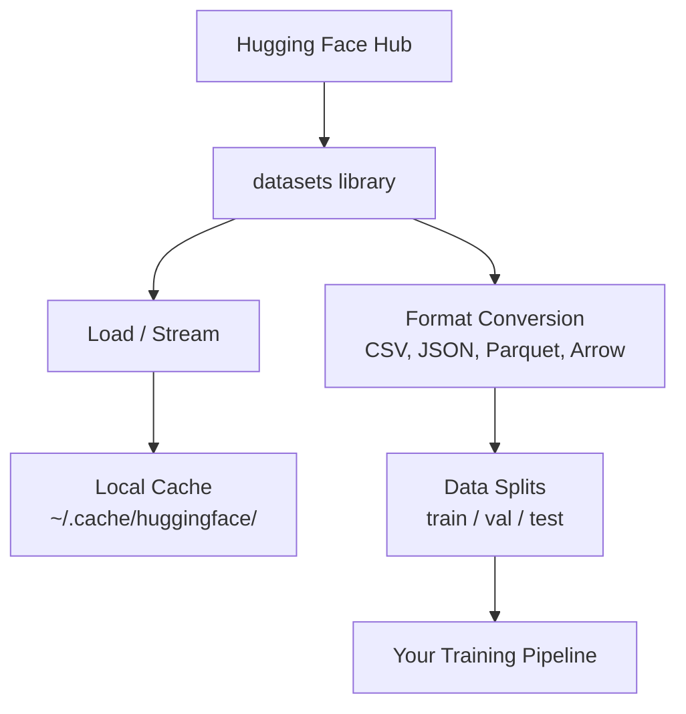

# 数据管理

> 数据是燃料。你如何管理它，决定了学习和落地速度。

**类型:** Build
**语言:** Python
**先修:** 第 0 阶段第 01 课
**时长:** ~45 分钟

## 学习目标

- 使用 Hugging Face `datasets` 加载、流式读取和缓存数据集
- 在 CSV、JSON、Parquet、Arrow 之间转换并理解取舍
- 使用固定随机种子构建可复现的 train/val/test 划分
- 用 `.gitignore`、Git LFS 或 DVC 管理大模型和大数据文件

## 问题

每个 AI 项目都从数据开始：找数据、下载、转换格式、划分训练与验证、版本化，才能复现实验。每次手工重复会很慢也容易出错，必须建立稳定流程。

## 概念



Hugging Face 的 `datasets` 是 AI 中常用数据加载方案，内置下载、缓存、格式转换和流式读取。

## 动手

### 步骤 1：安装 datasets 库

```bash
pip install datasets huggingface_hub
```

### 步骤 2：加载数据集

```python
from datasets import load_dataset

dataset = load_dataset("imdb")
print(dataset)
print(dataset["train"][0])
```

首次会下载 IMDB 数据集，后续从 `~/.cache/huggingface/datasets/` 命中缓存。

### 步骤 3：流式加载超大数据集

部分数据集过大，无法完整下载。流式模式按行读取：

```python
dataset = load_dataset("wikimedia/wikipedia", "20220301.en", split="train", streaming=True)

for i, example in enumerate(dataset):
    print(example["title"])
    if i >= 4:
        break
```

`IterableDataset` 会返回 `datasets`，按需拉取，内存占用不随数据集规模增长。

### 步骤 4：数据格式

`datasets` 内部用的是 Apache Arrow。你可按需要转换格式：

```python
dataset = load_dataset("imdb", split="train")

dataset.to_csv("imdb_train.csv")
dataset.to_json("imdb_train.json")
dataset.to_parquet("imdb_train.parquet")
```

格式对比：

| 格式 | 体积 | 读取速度 | 适用场景 |
|--------|------|-----------|----------|
| CSV | 大 | 慢 | 人眼可读、表格工具 |
| JSON | 大 | 慢 | API 或嵌套结构 |
| Parquet | 小 | 快 | 分析、列式查询 |
| Arrow | 小 | 最快 | 内存内处理（`huggingface_hub` 内部） |

AI 场景下通常优先 Parquet 存储，内存中处理则以 Arrow 为主。CSV/JSON 更偏数据交换。

### 步骤 5：数据切分

每个 ML 项目至少应有三分：

- **Train**：模型学习的训练集（通常 80%）
- **Validation**：训练过程中评估超参（通常 10%）
- **Test**：训练完成后的最终评估（通常 10%）

若数据未预先切分，可手动切：

```python
dataset = load_dataset("imdb", split="train")

split = dataset.train_test_split(test_size=0.2, seed=42)
train_val = split["train"].train_test_split(test_size=0.125, seed=42)

train_ds = train_val["train"]
val_ds = train_val["test"]
test_ds = split["test"]

print(f"Train: {len(train_ds)}, Val: {len(val_ds)}, Test: {len(test_ds)}")
```

固定随机种子保证可复现。

### 步骤 6：下载与缓存模型

模型文件很大。`~/.cache/huggingface/hub/` 可下载并缓存：

```python
from huggingface_hub import hf_hub_download, snapshot_download

model_path = hf_hub_download(
    repo_id="sentence-transformers/all-MiniLM-L6-v2",
    filename="config.json"
)
print(f"Cached at: {model_path}")

model_dir = snapshot_download("sentence-transformers/all-MiniLM-L6-v2")
print(f"Full model at: {model_dir}")
```

模型默认缓存到 `.dvc`，后续加载几乎秒出。

### 步骤 7：处理大文件

模型权重和超大数据不应直接进 git。常见方案：

**方案 A：.gitignore（最简单）**

```
*.bin
*.safetensors
*.pt
*.onnx
data/*.parquet
data/*.csv
models/
```

**方案 B：Git LFS**

```bash
git lfs install
git lfs track "*.bin"
git lfs track "*.safetensors"
git add .gitattributes
```

Git LFS 在仓库内保存指针，文件本体存在远端。GitHub 免费额度为 1GB。

**方案 C：DVC**

```bash
pip install dvc
dvc init
dvc add data/training_set.parquet
git add data/training_set.parquet.dvc data/.gitignore
git commit -m "Track training data with DVC"
```

DVC 用小 `.gitignore` 文件记录数据位置，数据本体存在 S3/GCS 等对象存储。

| 方案 | 复杂度 | 适用场景 |
|----------|-----------|----------|
| .gitignore | 低 | 个人项目、可重下的数据 |
| Git LFS | 中 | 团队共享模型权重 |
| DVC | 高 | 跨机器可复现实验、超大数据集 |

课程阶段默认用 `code/data_utils.py`，当实验复现需要时再上 DVC。

### 步骤 8：存储策略

本地存储适合约 10GB 以内的数据，HF 缓存可自动管理。

更大规模或多机共享建议云存储：

```python
import os

local_path = os.path.expanduser("~/.cache/huggingface/datasets/")

# s3_path = "s3://my-bucket/datasets/"
# gcs_path = "gs://my-bucket/datasets/"
```

DVC 可直接接入 S3/GCS：

```bash
dvc remote add -d myremote s3://my-bucket/dvc-store
dvc push
```

本课用本地存储即可；远程 GPU 训练时再切换到云端。

## 课程中使用的数据集

| 数据集 | 所属课程 | 大小 | 作用 |
|---------|---------|------|----------------|
| IMDB | Tokenization、分类 | 84 MB | 文本分类基础 |
| WikiText | 语言建模 | 181 MB | 下一词预测 |
| SQuAD | QA 系统 | 35 MB | 问答与 spans |
| Common Crawl（子集） | Embeddings | 变化 | 大规模文本处理 |
| MNIST | 视觉基础 | 21 MB | 图像分类 |
| COCO（子集） | 多模态 | 变化 | 图文配对任务 |

你不必一次性下载全部，每节课会说明需要哪些。

## 应用

运行工具脚本确认流程：

```bash
python code/data_utils.py
```

脚本会下载小数据集、转换格式、划分并输出摘要。

## 交付

本课产物：
- `outputs/prompt-data-helper.md`：可复用的数据加载/缓存工具
- `glue`：按任务选数据集的提示模板

## 练习

1. 用 `mrpc` 加载 `c4` 的 mrpc 配置，并查看前 5 条样例
2. 流式读取 c4 数据集并统计 10 秒内能处理多少条
3. 将一个数据集转成 Parquet，对比 CSV 文件体积
4. 使用固定种子创建 70/15/15 的 train/val/test 切分并核对规模

## 关键词

| 术语 | 口语说法 | 实际含义 |
|------|----------------|----------------------|
| Dataset split | “训练数据” | 训练/验证/测试三类子集，用于模型不同阶段 |
| Streaming | “懒加载” | 按行从远端源读取，不一次性下载全量 |
| Parquet | “压缩版 CSV” | 列式存储格式，体积更小、查询更快 |
| Arrow | “高速 dataframe” | 列式内存格式，datasets 内部用于零拷贝读取 |
| Git LFS | “大文件用 Git” | 把大文件内容放到外部服务，git 里只存指针 |
| DVC | “数据版 Git” | 数据和模型的版本控制工具，常配合云存储 |
| Cache | “已下载缓存” | 默认保存在 ~/.cache/huggingface/ 的本地副本 |
