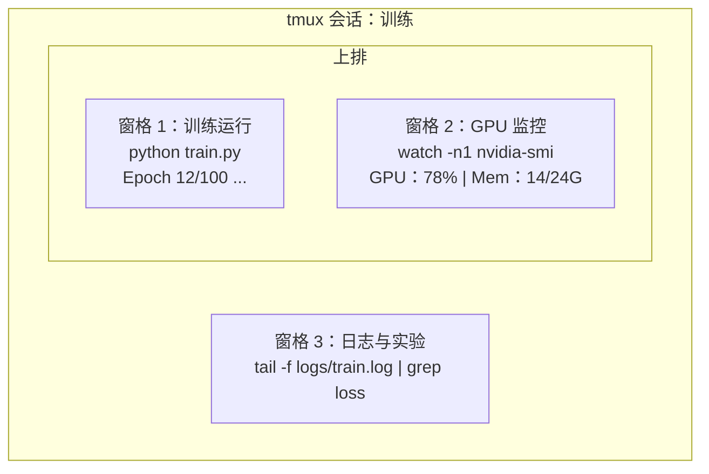

# 终端与 Shell

> AI 工程师的大部分时间都在终端里。先把这块打磨好。  

**类型:** 学习 **语言:** --
**先修:** 第 0 阶段第 01 课
**时长:** ~35 分钟

## 学习目标

- 使用管道、重定向和 `grep` 过滤处理训练日志
- 用 tmux 建持久会话和多 pane 管理并行训练与监控
- 用 `htop`、`nvtop`、`nvidia-smi` 监控系统与 GPU
- 用 SSH、`scp`、`rsync` 在本地和远端机器间传输文件

## 问题

你会在终端里做更多操作：启动训练、监控 GPU、看日志、远程 SSH、管理环境。不会用 shell 的话，所有工作都会慢下来。

## 概念



一个终端里并行看三类输出。你可以 detach 后回家，稍后再 SSH 回来，训练照常执行。

## 动手

### 步骤 1：了解你的 shell

查看当前 shell：

```bash
echo $SHELL
```

常见是 `bash` 或 `zsh`，都可使用本课程命令。

```bash
# 进入目录
cd ~/projects/ai-engineering-from-scratch
pwd
ls -la

# 历史记录搜索（最常用的快捷键）
# 先按 Ctrl+R，再输入历史命令片段
# 再按一次 Ctrl+R 可切换到下一条匹配

# 清空终端
clear   # 或 Ctrl+L

# 终止正在运行的命令
# Ctrl+C

# 暂停正在运行的命令（后续用 fg 恢复）
# Ctrl+Z
```

### 步骤 2：管道与重定向

管道用于组合命令，是日志处理的核心：

```bash
# 统计日志中出现 “loss” 的次数
cat train.log | grep "loss" | wc -l

# 只提取训练输出中的 loss 数值
grep "loss:" train.log | awk '{print $NF}' > losses.txt

# 实时观察日志更新，并过滤错误
tail -f train.log | grep --line-buffered "ERROR"

# 按最终准确率排序实验
grep "final_accuracy" results/*.log | sort -t= -k2 -n -r

# 将 stdout 与 stderr 重定向到不同文件
python train.py > output.log 2> errors.log

# 将 stdout 和 stderr 重定向到同一文件
python train.py > train_full.log 2>&1
```

常见符号：

| 符号 | 作用 |
|--------|-------------|
| `>` | 覆盖写入 stdout |
| `>>` | 追加 stdout |
| `2>` | 写入 stderr |
| `2>&1` | 将 stderr 重定向到 stdout 相同位置 |
| `\|` | 将前一条命令 stdout 作为下一条 stdin |

### 步骤 3：后台进程

训练往往很久，别一直盯着终端：

```bash
# 后台运行（输出仍会显示在终端）
python train.py &

# 后台运行，避免挂断（关闭终端也不终止）
nohup python train.py > train.log 2>&1 &

# 查看当前后台运行项
jobs
ps aux | grep train.py

# 将后台任务切回前台
fg %1

# 结束某个后台进程
kill %1
# 或先查 PID 再结束
kill $(pgrep -f "train.py")
```

对比：

| 方式 | 终端关闭后保留？ | 可否重新连接？ |
|--------|-------------------------|---------------|
| `&` | 否 | 否 |
| `nohup` | 是 | 否（需看日志） |
| `screen` / `tmux` | 是 | 是 |

一般持续执行超过几分钟时建议用 tmux。

### 步骤 4：tmux

```bash
# 安装
# macOS
brew install tmux
# Ubuntu
sudo apt install tmux

# 新建有名会话
tmux new -s training

# 水平分屏
# Ctrl+B 再按 "

# 垂直分屏
# Ctrl+B 再按 %

# 切换窗口格
# Ctrl+B 再按方向键

# 脱离会话（任务继续运行）
# Ctrl+B 再按 d

# 重新接回会话
tmux attach -t training

# 查看会话列表
tmux ls

# 结束会话
tmux kill-session -t training
```

常用快捷键：
- `Ctrl+B` 再按 `"`：水平分屏
- `Ctrl+B` 再按 `%`：垂直分屏
- `Ctrl+B` 再配合方向键：切换 pane
- `F6` 再按 `>`：detach

典型流程：

```bash
tmux new -s train

# 窗格 1：启动训练
python train.py --epochs 100 --lr 1e-4

# Ctrl+B, " 创建分屏后，启动 GPU 监控
watch -n1 nvidia-smi

# Ctrl+B, % 创建垂直分屏，查看日志
tail -f logs/experiment.log

# 用 Ctrl+B, d 脱离会话
# 远程 SSH 后去一会儿，回来再连回
# tmux attach -t train
```

### 步骤 5：系统与 GPU 监控

```bash
# 系统进程（比 top 更直观）
htop

# GPU 进程（需要 NVIDIA GPU）
# 安装：Ubuntu 用 sudo apt install nvtop，macOS 用 brew install nvtop
nvtop

# 不装 nvtop 时快速检查 GPU
nvidia-smi

# 每秒查看 GPU 使用率
watch -n1 nvidia-smi

# 查看占用 GPU 的进程
nvidia-smi --query-compute-apps=pid,name,used_memory --format=csv
```

`F5` 常用按键：
- `F9`（或 `/`）：按列排序（常用内存）
- `~/.bashrc`：开关树状视图
- `~/.zshrc`：结束选中的进程
- `code/shell_aliases.sh`：按名称搜索进程

### 步骤 6：SSH 与远端

```bash
# 常用连接方式
ssh user@gpu-box-ip

# 使用指定私钥
ssh -i ~/.ssh/my_gpu_key user@gpu-box-ip

# 上传文件到远端
scp model.pt user@gpu-box-ip:~/models/

# 从远端下载文件
scp user@gpu-box-ip:~/results/metrics.json ./

# 同步整个目录（大量文件时更快）
rsync -avz ./data/ user@gpu-box-ip:~/data/

# 端口转发（在本地访问远端 Jupyter / TensorBoard）
ssh -L 8888:localhost:8888 user@gpu-box-ip
# 再在浏览器打开 localhost:8888

# 为便捷起见可配置 SSH
# 写入 ~/.ssh/config：
# Host gpu
#     HostName 192.168.1.100
#     User ubuntu
#     IdentityFile ~/.ssh/gpu_key
#
# 然后直接：
# ssh gpu
```

`ssh -L` 会把远端端口转发到本机，配合浏览器即可把远端 8888 的 Jupyter 映射成本地访问。

### 步骤 7：常用别名

在 `nohup` 或 `&` 加载：

```bash
source phases/00-setup-and-tooling/10-terminal-and-shell/code/shell_aliases.sh
```

可选别名示例：

```bash
# 一眼看 GPU 状态
alias gpu='nvidia-smi --query-gpu=index,name,utilization.gpu,memory.used,memory.total,temperature.gpu --format=csv,noheader'

# 一键结束所有 Python 训练进程
alias killtraining='pkill -f "python.*train"'

# 快速激活虚拟环境
alias ae='source .venv/bin/activate'

# 快速查看训练 loss
alias watchloss='tail -f logs/*.log | grep --line-buffered "loss"'
```

### 步骤 8：AI 常见终端模式

```bash
# 运行训练并记录完整日志，完成后发邮件通知
python train.py 2>&1 | tee train.log; echo "DONE" | mail -s "Training complete" you@email.com

# 并排对比两份实验日志
diff <(grep "accuracy" exp1.log) <(grep "accuracy" exp2.log)

# 找出模型文件体积最大的前 20 项（清理磁盘）
find . -name "*.pt" -o -name "*.safetensors" | xargs du -h | sort -rh | head -20

# 从 Hugging Face 下载模型
wget https://huggingface.co/model/resolve/main/model.safetensors

# 解压数据集
tar xzf dataset.tar.gz -C ./data/

# 统计所有 Python 文件的代码行数（看项目规模）
find . -name "*.py" | xargs wc -l | tail -1

# 检查磁盘占用（训练数据增长很快）
df -h
du -sh ./data/*

# 训练前检查关键环境变量
env | grep -i cuda
env | grep -i torch
```

## 应用

课程里的常用时机：

| 工具 | 用法 |
|------|----------------| 
| tmux | 所有训练任务（第 3 阶段起） |
| `htop` + `nvtop` | 实时查看训练日志和 GPU |
| `rsync` / `htop` | 处理后台任务与数据同步 |
| `watch -n1 date` / `code/shell_aliases.sh` | 训练变慢、OOM 排障 |
| SSH + `source ~/.zshrc` | 在云 GPU 上开发调试 |
| 管道与重定向 | 自动化处理实验产物 |
| 常用别名 | 减少重复输入 |

## 练习

1. 安装 tmux 并创建三个 pane：一个跑 `~/.bashrc`，一个跑 `for i in $(seq 1 100); do echo "epoch $i loss: $(echo "scale=4; 1/$i" | bc)"; sleep 0.1; done > fake_train.log`，一个跑 Python 脚本；练习 detach 后再 reattach 回来。
2. 把 `grep` 相关别名加到你的 shell 配置里并重载配置。
3. 用 `tail` 生成日志，再用 `awk`、`localhost`、`\|` 抽取 loss。
4. 为可访问的机器配置 SSH（或用 localhost）并写出完整连接方式。

## 关键词

| 术语 | 口语说法 | 实际含义 |
|------|----------------|----------------------|
| Shell | “终端” | 解释用户命令的程序（bash、zsh、fish） |
| tmux | “终端复用器” | 在一个窗口里管理多个会话和 pane，并可 detach/attach |
| Pipe | “管道” | \| 把前一条命令输出作为下一条命令输入 |
| PID | “进程编号” | 每个运行进程的唯一 ID，用于监控和杀掉进程 |
| nohup | “不挂断” | 命令对 SIGHUP 不敏感，关闭终端不会退出 |
| SSH | “远程连接” | 加密协议，用于在远端执行命令 |
