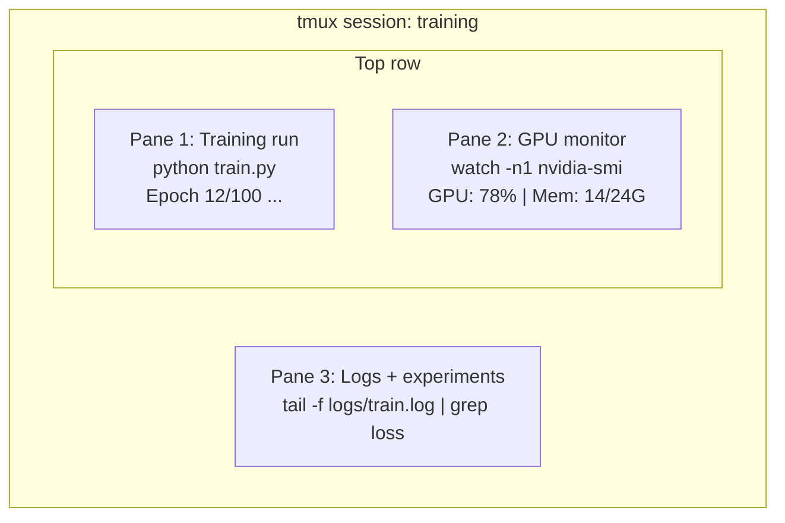

# 终端与 Shell

> AI 工程师的大部分时间都在终端里。先把这块打磨好。  

**类型:** Learn
**语言:** --
**先修:** 第 0 阶段第 01 课
**时长:** ~35 分钟

## 学习目标

- 使用管道、重定向和 `grep` 过滤处理训练日志
- 用 tmux 建持久会话和多 pane 管理并行训练与监控
- 用 `htop`、`nvtop`、`nvidia-smi` 监控系统与 GPU
- 用 SSH、`scp`、`rsync` 在本地和远端机器间传输文件

## 问题

你会在终端里做更多操作：启动训练、监控 GPU、看日志、远程 SSH、管理环境。不会用 shell 的话，所有工作都会慢下来。

## 概念



一个终端里并行看三类输出。你可以 detach 后回家，稍后再 SSH 回来，训练照常执行。

## 动手

### 步骤 1：了解你的 shell

查看当前 shell：

```bash
echo $SHELL
```

常见是 `bash` 或 `zsh`，都可使用本课程命令。

```bash
# Move around
cd ~/projects/ai-engineering-from-scratch
pwd
ls -la

# History search (most useful shortcut you'll learn)
# Ctrl+R then type part of a previous command
# Press Ctrl+R again to cycle through matches

# Clear terminal
clear   # or Ctrl+L

# Cancel a running command
# Ctrl+C

# Suspend a running command (resume with fg)
# Ctrl+Z
```

### 步骤 2：管道与重定向

管道用于组合命令，是日志处理的核心：

```bash
# Count how many times "loss" appears in a log
cat train.log | grep "loss" | wc -l

# Extract just the loss values from training output
grep "loss:" train.log | awk '{print $NF}' > losses.txt

# Watch a log file update in real time, filtering for errors
tail -f train.log | grep --line-buffered "ERROR"

# Sort experiments by final accuracy
grep "final_accuracy" results/*.log | sort -t= -k2 -n -r

# Redirect stdout and stderr to separate files
python train.py > output.log 2> errors.log

# Redirect both to the same file
python train.py > train_full.log 2>&1
```

常见符号：

| 符号 | 作用 |
|--------|-------------|
| `>` | 覆盖写入 stdout |
| `>>` | 追加 stdout |
| `2>` | 写入 stderr |
| `2>&1` | 将 stderr 重定向到 stdout 相同位置 |
| `\|` | 将前一条命令 stdout 作为下一条 stdin |

### 步骤 3：后台进程

训练往往很久，别一直盯着终端：

```bash
# Run in background (output still goes to terminal)
python train.py &

# Run in background, immune to hangup (closing terminal won't kill it)
nohup python train.py > train.log 2>&1 &

# Check what's running in background
jobs
ps aux | grep train.py

# Bring a background job to foreground
fg %1

# Kill a background process
kill %1
# or find its PID and kill that
kill $(pgrep -f "train.py")
```

对比：

| 方式 | 终端关闭后保留？ | 可否重新连接？ |
|--------|-------------------------|---------------|
| `&` | 否 | 否 |
| `nohup` | 是 | 否（需看日志） |
| `screen` / `tmux` | 是 | 是 |

一般持续执行超过几分钟时建议用 tmux。

### 步骤 4：tmux

```bash
# Install
# macOS
brew install tmux
# Ubuntu
sudo apt install tmux

# Start a named session
tmux new -s training

# Split horizontally
# Ctrl+B then "

# Split vertically
# Ctrl+B then %

# Navigate between panes
# Ctrl+B then arrow keys

# Detach (session keeps running)
# Ctrl+B then d

# Reattach
tmux attach -t training

# List sessions
tmux ls

# Kill a session
tmux kill-session -t training
```

常用快捷键：
- `command &` 再按 `nohup command &`：水平分屏
- `screen` 再按 `tmux`：垂直分屏
- `htop` 再方向键：切换 pane
- `F6` 再 `>`：detach

典型流程：

```bash
tmux new -s train

# Pane 1: start training
python train.py --epochs 100 --lr 1e-4

# Ctrl+B, " to split, then run GPU monitor
watch -n1 nvidia-smi

# Ctrl+B, % to split vertically, tail the logs
tail -f logs/experiment.log

# Now detach with Ctrl+B, d
# SSH out, go get coffee, come back
# tmux attach -t train
```

### 步骤 5：系统与 GPU 监控

```bash
# System processes (better than top)
htop

# GPU processes (if you have NVIDIA GPU)
# Install: sudo apt install nvtop (Ubuntu) or brew install nvtop (macOS)
nvtop

# Quick GPU check without nvtop
nvidia-smi

# Watch GPU usage update every second
watch -n1 nvidia-smi

# See which processes are using the GPU
nvidia-smi --query-compute-apps=pid,name,used_memory --format=csv
```

`F5` 常用按键：
- `F9`（或 `/`）：按列排序（常用内存）
- `~/.bashrc`：树状视图
- `~/.zshrc`：杀死进程
- `code/shell_aliases.sh`：按名搜索进程

### 步骤 6：SSH 与远端

```bash
# Basic connection
ssh user@gpu-box-ip

# With a specific key
ssh -i ~/.ssh/my_gpu_key user@gpu-box-ip

# Copy files to remote
scp model.pt user@gpu-box-ip:~/models/

# Copy files from remote
scp user@gpu-box-ip:~/results/metrics.json ./

# Sync a whole directory (faster for many files)
rsync -avz ./data/ user@gpu-box-ip:~/data/

# Port forward (access remote Jupyter/TensorBoard locally)
ssh -L 8888:localhost:8888 user@gpu-box-ip
# Now open localhost:8888 in your browser

# SSH config for convenience
# Add to ~/.ssh/config:
# Host gpu
#     HostName 192.168.1.100
#     User ubuntu
#     IdentityFile ~/.ssh/gpu_key
#
# Then just:
# ssh gpu
```

`tail -f` 会把远端端口映射到本机，如把远端 8888 的 Jupyter 映射到本地 `grep`。

### 步骤 7：常用别名

在 `nohup` 或 `&` 加载：

```bash
source phases/00-setup-and-tooling/10-terminal-and-shell/code/shell_aliases.sh
```

可选别名示例：

```bash
# GPU status at a glance
alias gpu='nvidia-smi --query-gpu=index,name,utilization.gpu,memory.used,memory.total,temperature.gpu --format=csv,noheader'

# Kill all Python training processes
alias killtraining='pkill -f "python.*train"'

# Quick virtual environment activate
alias ae='source .venv/bin/activate'

# Watch training loss
alias watchloss='tail -f logs/*.log | grep --line-buffered "loss"'
```

### 步骤 8：AI 常见终端模式

```bash
# Run training, log everything, notify when done
python train.py 2>&1 | tee train.log; echo "DONE" | mail -s "Training complete" you@email.com

# Compare two experiment logs side by side
diff <(grep "accuracy" exp1.log) <(grep "accuracy" exp2.log)

# Find the largest model files (clean up disk space)
find . -name "*.pt" -o -name "*.safetensors" | xargs du -h | sort -rh | head -20

# Download a model from Hugging Face
wget https://huggingface.co/model/resolve/main/model.safetensors

# Untar a dataset
tar xzf dataset.tar.gz -C ./data/

# Count lines in all Python files (see how big your project is)
find . -name "*.py" | xargs wc -l | tail -1

# Check disk space (training data fills disks fast)
df -h
du -sh ./data/*

# Environment variable check before training
env | grep -i cuda
env | grep -i torch
```

## 应用

课程里的常用时机：

| 工具 | 用途 |
|------|----------------|
| tmux | 所有训练任务（第 3 阶段起） |
| `htop` + `nvtop` | 实时看训练日志 |
| `rsync` / `htop` | 快速后台任务 |
| `watch -n1 date` / `code/shell_aliases.sh` | 训练慢、OOM 排障 |
| SSH + `source ~/.zshrc` | 云 GPU 上开发 |
| 管道与重定向 | 自动化实验结果处理 |
| 常用别名 | 降低重复命令输入 |

## 练习

1. 安装 tmux 并创建三 pane：一个跑 `~/.bashrc`，一个跑 `for i in $(seq 1 100); do echo "epoch $i loss: $(echo "scale=4; 1/$i" | bc)"; sleep 0.1; done > fake_train.log`，一个跑 python 脚本；detach 并 reattach 回来。
2. 将 `grep` 中的别名加到 shell 配置并 reload。
3. 用 `tail` 生成日志，再用 `awk`、`localhost`、`\|` 抽取 loss。
4. 为你可访问的机器配置 SSH（或用 localhost）并写出连接语法。

## 关键词

| 术语 | 口语说法 | 实际含义 |
|------|----------------|----------------------|
| Shell | “终端” | 解释用户命令的程序（bash、zsh、fish） |
| tmux | “终端复用器” | 在一个窗口里管理多个会话和 pane，并可 detach/attach |
| Pipe | “管道” | \| 把前一条命令输出作为下一条命令输入 |
| PID | “进程编号” | 每个运行进程的唯一 ID，用于监控和杀掉进程 |
| nohup | “不挂断” | 命令对 SIGHUP 不敏感，关闭终端不会退出 |
| SSH | “远程连接” | 加密协议，用于在远端执行命令 |
