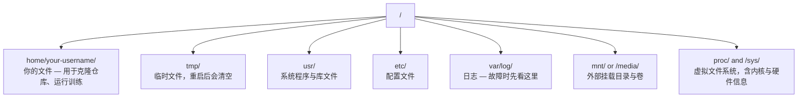

# AI 环境下的 Linux 使用

> 大多数 AI 运行在 Linux 上。你只要够用就不容易卡住。

**类型:** 学习
**语言:** --
**先修:** 第 0 阶段第 01 课
**时长:** ~30 分钟

## 学习目标

- 从命令行掌握 Linux 文件系统与常用文件操作
- 用 `chmod` / `chown` 处理“Permission denied”
- 使用 `apt` 安装系统依赖，在新 GPU 机器上快速搭建环境
- 识别 macOS 与 Linux 的差异，避免远端操作踩坑

## 问题

你本地可能在 macOS/Windows 开发，但一旦 SSH 到云 GPU、Lambda、EC2，你就会进入 Ubuntu。这个场景里没有 Finder、没有 GUI，只有终端。不能快速导航文件系统、安装包和管理进程，就会把 GPU 算力白白浪费在“怎么在 Linux 解压文件”上。

这节是一份生存清单，目标是在远端 Linux 上也能稳定操作。

## 文件系统结构

Linux 一切都在单一根目录 `/` 下：



`home` 目录相当于你在 Linux 里的用户主目录，也就是大部分日常操作所在的位置。

## 核心命令

远端 95% 场景可覆盖的 15 个命令：

### 移动与定位

```bash
pwd                         # 当前工作目录
ls                          # 查看当前目录内容
ls -la                      # 查看当前目录（含隐藏文件与详细信息）
cd /path/to/dir             # 进入目标目录
cd ~                        # 回到当前用户主目录
cd ..                       # 返回上一级目录
```

### 文件与目录

```bash
mkdir my-project            # 创建目录
mkdir -p a/b/c              # 一次性创建多层目录

cp file.txt backup.txt      # 复制文件
cp -r src/ src-backup/      # 递归复制目录

mv old.txt new.txt          # 重命名文件
mv file.txt /tmp/           # 移动文件

rm file.txt                 # 删除文件（无回收站）
rm -rf my-dir/              # 删除目录及其内容
```

`~` 是永久删除，谨慎执行。

### 查看文件

```bash
cat file.txt                # 打印整个文件
head -20 file.txt           # 查看前 20 行
tail -20 file.txt           # 查看后 20 行
tail -f log.txt             # 实时跟踪日志（Ctrl+C 停止）
less file.txt               # 分页查看文件（q 退出）
```

### 搜索

```bash
grep "error" training.log           # 查找包含 error 的行
grep -r "learning_rate" .           # 在当前目录递归查找所有文件
grep -i "cuda" config.yaml          # 不区分大小写查找

find . -name "*.py"                 # 找出当前目录下的所有 Python 文件
find . -name "*.ckpt" -size +1G     # 查找大于 1GB 的 checkpoint 文件
```

## 权限

Linux 文件都有 owner + 权限位，执行不了通常是权限问题：

```bash
ls -l train.py
# -rwxr-xr-- 1 user group 2048 Mar 19 10:00 train.py
#  ^^^             所有者权限：读、写、执行
#     ^^^          所属组权限：读、执行
#        ^^        其他用户：只读
```

看到 `/home/your-username`，优先检查权限与所有者。

## 包管理（apt）

Ubuntu 用 `apt` 安装系统软件：

```bash
chmod +x train.sh           # 赋予脚本可执行权限
chmod 755 deploy.sh         # 所有者：全部权限；其他人：读+执行
chmod 644 config.yaml       # 所有者：读写；其他人：只读

chown user:group file.txt   # 修改文件所有者（通常需要 sudo）
```

新 GPU 机常装依赖：

```bash
sudo apt update             # 刷新软件包索引（通常先执行）
sudo apt install -y htop    # 安装软件包（-y 自动同意确认）
sudo apt install -y build-essential  # 编译器等基础工具，很多 Python 包依赖
sudo apt install -y tmux    # 安装终端复用器，断开连接后保持会话

apt list --installed        # 查看已安装软件
sudo apt remove htop        # 卸载软件包
```

## 用户与 sudo

一般以普通用户登录，只有部分操作需要 root：

```bash
sudo apt update && sudo apt install -y \
    build-essential \
    git \
    curl \
    wget \
    tmux \
    htop \
    unzip \
    python3-venv
```

有 sudo 权限的机器不要整机都用 root，能不用就不用。

## 进程与 systemd

训练卡住时查看：

```bash
whoami                      # 查看当前用户
sudo command                # 以 root 身份运行一条命令
sudo su                     # 切换到 root（操作完 exit 返回，尽量少用）
```

如果有服务进程，用 systemd：

```bash
htop                        # 交互式进程查看器（q 退出）
ps aux | grep python        # 查找正在运行的 Python 进程
kill 12345                  # 平稳结束 PID 为 12345 的进程
kill -9 12345               # 强制结束（前一步无效时再用）
nvidia-smi                  # 查看 GPU 进程与显存占用
```

## 磁盘空间

GPU 机器常见硬盘紧张：

```bash
sudo systemctl start nginx          # 启动服务
sudo systemctl stop nginx           # 停止服务
sudo systemctl restart nginx        # 重启服务
sudo systemctl status nginx         # 查看服务状态
sudo systemctl enable nginx         # 配置开机自启
```

释放空间常用：

```bash
df -h                       # 查看所有已挂载磁盘的使用率
df -h /home                 # 查看 /home 的使用率

du -sh *                    # 当前目录下每项的大小
du -sh ~/.cache             # 查看缓存目录大小（如 pip、Hugging Face 模型通常在这里）
du -sh /data/checkpoints/   # 查看 checkpoint 总大小

# 找出占用最大的目录
du -h --max-depth=1 / 2>/dev/null | sort -hr | head -20
```

## 网络与文件传输

```bash
# 清理 pip 缓存
pip cache purge

# 清理 apt 缓存
sudo apt clean

# 删除不再需要的旧 checkpoint
rm -rf checkpoints/epoch_01/ checkpoints/epoch_02/
```

大文件优先用 `rsync`，支持断点续传且只传变更块。

## tmux：保持会话

```bash
# 下载文件
wget https://example.com/model.bin                   # 下载文件
curl -O https://example.com/data.tar.gz              # 同上，使用 curl 下载
curl -s https://api.example.com/health | python3 -m json.tool  # 请求 API 并格式化 JSON 输出

# 机器间传文件
scp model.bin user@remote:/data/                     # 复制文件到远端机器
scp user@remote:/data/results.csv .                  # 从远端复制文件到本地
scp -r user@remote:/data/checkpoints/ ./local-dir/   # 复制目录

# 同步目录（大文件场景比 scp 更快，失败后可续传）
rsync -avz --progress ./data/ user@remote:/data/
rsync -avz --progress user@remote:/results/ ./results/
```

远程训练请始终在 tmux 里运行。

## WSL2（Windows 用户）

```bash
tmux new -s train           # 新建名为 train 的会话
# ... 启动训练后执行：
# Ctrl+B，按 D               # 分离会话（训练继续运行）

tmux ls                     # 列出会话
tmux attach -t train        # 重新接入会话

# tmux 内部：
# Ctrl+B，按 %              # 垂直分屏
# Ctrl+B，按 "              # 水平分屏
# Ctrl+B，按方向键         # 切换面板焦点
```

WSL2 文件系统与 Windows 分区通过 `/mnt` 挂载映射。Windows 侧装 NVIDIA 驱动后，WSL2 可使用 CUDA。

## macOS 到 Linux 的常见坑

| macOS | Linux | 说明 |
|-------|-------|------|
| `apt` | `rsync` | 包名有时不同 |
| `scp` | `/mnt/c/Users/YourName/` | 远端通常无 GUI，优先 `brew install`/`sudo apt install` |
| `brew install htop`/`sudo apt install htop` | 不可用 | SSH 下通常没有剪贴板互通 |
| `brew install readline` | `sudo apt install libreadline-dev` | Linux 服务器多数是 bash |
| `open file.txt` | `xdg-open file.txt`、`cat` | 可执行路径不同 |
| `less` | `pbcopy` | macOS BSD sed 需空参数，Linux 不需要 |
| 文件名大小写 | 区分大小写 | Linux 中 `pbpaste` 与 `~/.zshrc` 是不同文件 |

## 快速参考

```bash
# 在 PowerShell（管理员）下
wsl --install -d Ubuntu-24.04

# 重启后从开始菜单打开 Ubuntu
sudo apt update && sudo apt upgrade -y
```

## 练习

1. 进入 Linux（或 WSL2）后，创建项目目录并在 `~/.bashrc` 写入 3 个空文件，然后用 `pwd` 验证当前路径
2. 用 `apt install -y htop` 安装 `htop`，运行后找出内存占用最大的进程
3. 用 tmux 启动一个会话，运行 `python -c "import torch; print(torch.__version__)"` 后分离会话，再列出会话并重新接入
4. 用 `df -h` 和 `du -sh` 对比磁盘占用，定位 cache 最大目录
5. 分别用 `scp` 与 `rsync` 各传一次 `Model.py` 到远端，比较体验差异

## 关键词

| 术语 | 口语说法 | 实际含义 |
|------|----------------|----------------------|
| `~` | 家目录 | 当前用户主目录 |
| `sudo` | 提权运行 | 用管理员权限执行单个命令 |
| `chmod` | 改权限 | 改变文件读写执行权限位 |
| `apt` | 软件源 | Ubuntu 软件包管理入口 |
| `systemctl` | 服务开关 | 管理系统服务 |

```
导航:     pwd, ls, cd, find
文件:     cp, mv, rm, mkdir, cat, head, tail, less
检索:     grep, find
权限:     chmod, chown, sudo
软件包:   apt update, apt install
进程:     htop, ps, kill, nvidia-smi
服务:     systemctl start/stop/restart/status
磁盘:     df -h, du -sh
网络:     curl, wget, scp, rsync
会话:     tmux new/attach/detach
```
 `touch` `ls -la` `htop` `sleep 300` `df -h` `du -sh ~/.cache/*` `scp` `rsync`
