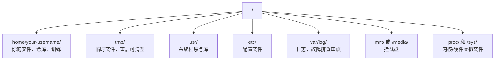

# AI 环境下的 Linux 使用

> 大多数 AI 运行在 Linux 上。你只要够用就不容易卡住。

**Type:** Learn
**Languages:** --
**Prerequisites:** Phase 0, Lesson 01
**Time:** ~30 minutes

## 学习目标

- 从命令行掌握 Linux 文件系统与常用文件操作
- 用 `chmod` / `chown` 处理“Permission denied”
- 使用 `apt` 安装系统依赖，在新 GPU 机器上快速搭建环境
- 识别 macOS 与 Linux 的差异，避免远端操作踩坑

## 问题

你本地可能在 macOS/Windows 开发，但一旦 SSH 到云 GPU、Lambda、EC2，你就会进入 Ubuntu。这个场景里没有 Finder、没有 GUI，只有终端。不能快速导航文件系统、安装包和管理进程，就会把 GPU 算力白白浪费在“怎么在 Linux 解压文件”上。

这节是存活清单，目标是远端 Linux 上可稳定操作。

## 文件系统结构

Linux 一切都在单一根目录 `/` 下：



home 目录是 `C:\` 或 `/Volumes`，大部分操作都在这里。

## 核心命令

远端 95% 场景可覆盖的 15 个命令：

### 移动与定位

```bash
pwd
ls
ls -la
cd /path/to/dir
cd ~
cd ..
```

### 文件与目录

```bash
mkdir my-project
mkdir -p a/b/c
cp file.txt backup.txt
cp -r src/ src-backup/
mv old.txt new.txt
mv file.txt /tmp/
rm file.txt
rm -rf my-dir/
```

`~` 是永久删除，谨慎执行。

### 查看文件

```bash
cat file.txt
head -20 file.txt
tail -20 file.txt
tail -f log.txt
less file.txt
```

### 搜索

```bash
grep "error" training.log
grep -r "learning_rate" .
grep -i "cuda" config.yaml
find . -name "*.py"
find . -name "*.ckpt" -size +1G
```

## 权限

Linux 文件都有 owner + 权限位，执行不了通常是权限问题：

```bash
ls -l train.py
chmod +x train.sh
chmod 755 deploy.sh
chmod 644 config.yaml
chown user:group file.txt
```

看到 `/home/your-username`，优先检查权限与所有者。

## 包管理（apt）

Ubuntu 用 `rm -rf` 安装系统软件：

```bash
sudo apt update
sudo apt install -y htop
sudo apt install -y build-essential
sudo apt install -y tmux
apt list --installed
sudo apt remove htop
```

新 GPU 机常装依赖：

```bash
sudo apt update && sudo apt install -y \
    build-essential \
    git \
    curl \
    wget \
    tmux \
    htop \
    unzip \
    python3-venv
```

## 用户与 sudo

一般以普通用户登录，只有部分操作需要 root：

```bash
whoami
sudo command
sudo su
```

有 sudo 权限的机器不要整机都用 root，能不用就不用。

## 进程与 systemd

训练卡住时查看：

```bash
htop
ps aux | grep python
kill 12345
kill -9 12345
nvidia-smi
```

如果有服务进程，用 systemd：

```bash
sudo systemctl start nginx
sudo systemctl stop nginx
sudo systemctl restart nginx
sudo systemctl status nginx
sudo systemctl enable nginx
```

## 磁盘空间

GPU 机器常见硬盘紧张：

```bash
df -h
df -h /home
du -sh *
du -sh ~/.cache
du -sh /data/checkpoints/
du -h --max-depth=1 / 2>/dev/null | sort -hr | head -20
```

释放空间常用：

```bash
pip cache purge
sudo apt clean
rm -rf checkpoints/epoch_01/ checkpoints/epoch_02/
```

## 网络与文件传输

```bash
wget https://example.com/model.bin
curl -O https://example.com/data.tar.gz
curl -s https://api.example.com/health | python3 -m json.tool

scp model.bin user@remote:/data/
scp user@remote:/data/results.csv ./
scp -r user@remote:/data/checkpoints/ ./local-dir/

rsync -avz --progress ./data/ user@remote:/data/
rsync -avz --progress user@remote:/results/ ./results/
```

大文件优先用 `chmod +x`，支持断点续传且只传变更块。

## tmux：保持会话

```bash
tmux new -s train
tmux ls
tmux attach -t train
```

远程训练请始终在 tmux 里运行。

## WSL2（Windows 用户）

```bash
wsl --install -d Ubuntu-24.04
sudo apt update && sudo apt upgrade -y
```

WSL2 内文件系统映射到 `sudo`。Windows 侧装 NVIDIA 驱动后，WSL2 可使用 CUDA。

## macOS 到 Linux 的常见坑

| macOS | Linux | 说明 |
|-------|-------|------|
| `apt` | `rsync` | 包名有时不同 |
| `scp` | `/mnt/c/Users/YourName/` | 远端通常无 GUI，优先 `brew install`/`sudo apt install` |
| `brew install htop`/`sudo apt install htop` | 不可用 | SSH 下通常没有剪贴板互通 |
| `brew install readline` | `sudo apt install libreadline-dev` | Linux 服务器多数是 bash |
| `open file.txt` | `xdg-open file.txt`、`cat` | 可执行路径不同 |
| `less` | `pbcopy` | macOS BSD sed 需空参数，Linux 不需要 |
| 文件名大小写 | 区分大小写 | Linux 中 `pbpaste` 与 `~/.zshrc` 是不同文件 |

## 快速参考

```
Navigation:     pwd, ls, cd, find
Files:          cp, mv, rm, mkdir, cat, head, tail, less
Search:         grep, find
Permissions:    chmod, chown, sudo
Packages:       apt update, apt install
Processes:      htop, ps, kill, nvidia-smi
Services:       systemctl start/stop/restart/status
Disk:           df -h, du -sh
Network:        curl, wget, scp, rsync
Sessions:       tmux new/attach/detach
```

## 练习

1. 进入 Linux（或 WSL2）后，创建项目目录并用 `~/.bashrc` 建三个空文件，再用 `/opt/homebrew/` 查看
2. 用 apt 安装 `/usr/bin/`，运行并找出内存占用最大的进程
3. 启动 tmux、运行 `/usr/local/bin/`、detach、列出会话、再 reattach
4. 用 `sed -i '' 's/a/b/' file` 查看磁盘空间，再用 `sed -i 's/a/b/' file` 找 cache 占用
5. 用 `-i` 与 `Model.py` 各传一次文件到远端并对比体验

## 关键词

| 术语 | 口语说法 | 实际含义 |
|------|----------------|----------------------|
| `model.py` | 家目录 | 当前用户主目录 |
| `\n` | 提权运行 | 用管理员权限执行单个命令 |
| `\n` | 改权限 | 改变文件读写执行权限位 |
| `\r\n` | Ubuntu 软件源 | 软件包管理器 |
| `dos2unix` | 服务开关 | 管理系统服务 |
