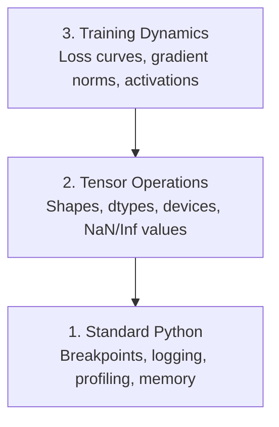

# 调试与性能分析

> 最难缠的 AI bug 往往不会直接报错。它们常在悄无声息中“学习垃圾数据”，然后给你一条看起来很漂亮的 loss 曲线。

**类型：** Build  
**语言：** Python  
**先修：** 第1课（开发环境），具备基本 PyTorch 使用基础  
**时长：** ~60 分钟

## 学习目标

- 使用有条件的 `breakpoint()` 与 `debug_print` 在训练中实时检查张量形状、数据类型和 NaN
- 用 `cProfile`、`line_profiler`、`tracemalloc` 为训练循环做性能分析并找出瓶颈
- 识别常见 AI bug：形状不匹配、loss 为 NaN、数据泄漏、张量设备不一致
- 配置 TensorBoard，观察 loss 曲线、权重直方图和梯度分布

## 问题背景

AI 代码的失败方式和普通代码不同。普通 Web 程序通常会抛异常并给出栈跟踪；一个错误的训练脚本可能却连续跑 8 小时，消耗两百刀 GPU 费用，却训练出“每个输入都预测均值”的模型，而且全程不报错。问题可能是一个放在错误设备上的张量、忘记 `.detach()`，或是标签泄漏到了特征中。

你需要一套更擅长捕获“沉默失败”的调试工具，避免把时间和算力浪费在错误的训练上。

## 核心概念

AI 调试通常分三层：



很多人会直接从第 3 层（盯着 TensorBoard）开始，但约 80% 的 AI Bug 实际发生在第 1 层和第 2 层。

## 动手实战

### 1）打印调试（它其实很有用）

打印调试常被轻视，却不该。对张量代码来说，针对性的打印语句往往比一步步调试器更有效，因为你同时能看到形状、dtype 和数值范围。

```python
def debug_print(name, tensor):
    print(f"{name}: shape={tensor.shape}, dtype={tensor.dtype}, "
          f"device={tensor.device}, "
          f"min={tensor.min().item():.4f}, max={tensor.max().item():.4f}, "
          f"mean={tensor.mean().item():.4f}, "
          f"has_nan={tensor.isnan().any().item()}")
```

在每个可疑操作后调用。如果定位到 bug，记得把打印删掉，保持训练脚本整洁。

### 2）Python 调试器（pdb 与 `breakpoint()`）

内置调试器在 AI 工作流里很容易被低估。把 `p outputs.shape` 放进训练循环，在关键时刻交互式检查张量。

```python
def training_step(model, batch, criterion, optimizer):
    inputs, labels = batch
    outputs = model(inputs)
    loss = criterion(outputs, labels)

    if loss.item() > 100 or torch.isnan(loss):
        breakpoint()

    loss.backward()
    optimizer.step()
```

调试器里常用命令：

- `p loss.item()`：检查形状
- `p torch.isnan(outputs).sum()`：查看当前 loss
- `p model.fc1.weight.grad`：统计 NaN 数量
- `c`：检查梯度
- `q` 继续，`num_workers > 0` 退出

这是条件式调试——只在异常发生时停止。对 10,000 步训练来说，这点很关键。

### 3）Python 日志

当排查不再只是快速验收时，改用日志记录。

```python
import logging

logging.basicConfig(
    level=logging.INFO,
    format="%(asctime)s [%(levelname)s] %(message)s",
    handlers=[
        logging.FileHandler("training.log"),
        logging.StreamHandler()
    ]
)
logger = logging.getLogger(__name__)

logger.info("Starting training: lr=%.4f, batch_size=%d", lr, batch_size)
logger.warning("Loss spike detected: %.4f at step %d", loss.item(), step)
logger.error("NaN loss at step %d, stopping", step)
```

日志有时间戳、级别、文件输出。训练在半夜 3 点挂掉时，你需要的是日志文件，而不是已经滚上天际线的终端输出。

### 4）计时代码片段

要优化，先知道时间都花在哪。

```python
import time

class Timer:
    def __init__(self, name=""):
        self.name = name

    def __enter__(self):
        self.start = time.perf_counter()
        return self

    def __exit__(self, *args):
        elapsed = time.perf_counter() - self.start
        print(f"[{self.name}] {elapsed:.4f}s")

with Timer("data loading"):
    batch = next(dataloader_iter)

with Timer("forward pass"):
    outputs = model(batch)

with Timer("backward pass"):
    loss.backward()
```

常见结论是：数据加载占到训练时长的 60%。这个时候通常不是 GPU 太慢，而是把 `python -m memory_profiler your_script.py` 的 `torch.cuda.empty_cache()` 设为大于 0。

### 5）cProfile 与 line_profiler

当手工计时不够用时：

```bash
python -m cProfile -s cumtime train.py
```

它会按累积耗时排序列出函数调用。若要逐行分析：

```bash
pip install line_profiler
```

```python
@profile
def train_step(model, data, target):
    output = model(data)
    loss = F.cross_entropy(output, target)
    loss.backward()
    return loss

# Run with: kernprof -l -v train.py
```

### 6）内存分析

#### CPU 内存（tracemalloc）

```python
import tracemalloc

tracemalloc.start()

# your code here
model = build_model()
data = load_dataset()

snapshot = tracemalloc.take_snapshot()
top_stats = snapshot.statistics("lineno")
for stat in top_stats[:10]:
    print(stat)
```

#### CPU 内存（memory_profiler）

```bash
pip install memory_profiler
```

```python
from memory_profiler import profile

@profile
def load_data():
    raw = read_csv("data.csv")       # watch memory jump here
    processed = preprocess(raw)       # and here
    return processed
```

用 `del tensor` 查看逐行内存使用。

#### PyTorch 的 GPU 内存

```python
import torch

if torch.cuda.is_available():
    print(torch.cuda.memory_summary())

    print(f"Allocated: {torch.cuda.memory_allocated() / 1e9:.2f} GB")
    print(f"Cached: {torch.cuda.memory_reserved() / 1e9:.2f} GB")
```

遇到 OOM（显存不足）时可按顺序尝试：

1. 缩小 batch size（总是第一步）
2. 使用 `torch.cuda.empty_cache()` 释放缓存显存
3. 大中间张量前后加 `torch.cuda.amp`，再 `[batch, features]`
4. 用 `[batch, channels, height, width]` 做混合精度，通常可减半显存
5. 对深模型开启梯度检查点（gradient checkpointing）

### 7）常见 AI Bug 与排查方式

#### 形状不匹配

最常见的 Bug。模型期望 `launch.json`，却喂进了 `check_shapes`。

```python
def check_shapes(model, sample_input):
    print(f"Input: {sample_input.shape}")
    hooks = []

    def make_hook(name):
        def hook(module, inp, out):
            in_shape = inp[0].shape if isinstance(inp, tuple) else inp.shape
            out_shape = out.shape if hasattr(out, "shape") else type(out)
            print(f"  {name}: {in_shape} -> {out_shape}")
        return hook

    for name, module in model.named_modules():
        hooks.append(module.register_forward_hook(make_hook(name)))

    with torch.no_grad():
        model(sample_input)

    for h in hooks:
        h.remove()
```

用一个样本 batch 跑一次，它会打印每一层的形状变化。

#### NaN Loss

loss 变成 NaN 通常意味着“发生了爆炸”。常见原因：

- 学习率过高
- 自定义损失中除零
- 对 0 或负数取对数
- RNN 梯度爆炸

```python
def detect_nan(model, loss, step):
    if torch.isnan(loss):
        print(f"NaN loss at step {step}")
        for name, param in model.named_parameters():
            if param.grad is not None:
                if torch.isnan(param.grad).any():
                    print(f"  NaN gradient in {name}")
                if torch.isinf(param.grad).any():
                    print(f"  Inf gradient in {name}")
        return True
    return False
```

#### 数据泄漏

模型在测试集上达到 99% 准确率。听上去很好，但多半有 Bug。

```python
def check_data_leakage(train_set, test_set, id_column="id"):
    train_ids = set(train_set[id_column].tolist())
    test_ids = set(test_set[id_column].tolist())
    overlap = train_ids & test_ids
    if overlap:
        print(f"DATA LEAKAGE: {len(overlap)} samples in both train and test")
        return True
    return False
```

还要检查时序泄漏：模型不能使用未来数据预测过去数据。切分前先按时间戳排序。

#### 设备错误

不同设备上的张量（CPU/GPU）会引发运行时错误；更隐蔽的是某个张量悄悄留在 CPU，而其它都在 GPU 上，导致训练只会“慢慢变坏”。

```python
def check_devices(model, *tensors):
    model_device = next(model.parameters()).device
    print(f"Model device: {model_device}")
    for i, t in enumerate(tensors):
        if t.device != model_device:
            print(f"  WARNING: tensor {i} on {t.device}, model on {model_device}")
```

### 8）TensorBoard 基础

TensorBoard 可以展示训练全程发生了什么。

```bash
pip install tensorboard
```

```python
from torch.utils.tensorboard import SummaryWriter

writer = SummaryWriter("runs/experiment_1")

for step in range(num_steps):
    loss = train_step(model, batch)

    writer.add_scalar("loss/train", loss.item(), step)
    writer.add_scalar("lr", optimizer.param_groups[0]["lr"], step)

    if step % 100 == 0:
        for name, param in model.named_parameters():
            writer.add_histogram(f"weights/{name}", param, step)
            if param.grad is not None:
                writer.add_histogram(f"grads/{name}", param.grad, step)

writer.close()
```

启动：

```bash
tensorboard --logdir=runs
```

重点观察：

- **Loss 不下降**：学习率过低或模型结构不匹配任务
- **Loss 大幅振荡**：学习率过高
- **Loss 变成 NaN**：数值不稳定（见上文 NaN 小节）
- **训练 loss 降，但验证 loss 升**：过拟合
- **权重直方图塌缩到 0**：梯度消失
- **梯度直方图爆炸**：需要梯度裁剪

### 9）VS Code 调试器

如果要更交互地调试，可用 VS Code `debug_print`：

```json
{
    "version": "0.2.0",
    "configurations": [
        {
            "name": "Debug Training",
            "type": "debugpy",
            "request": "launch",
            "program": "${file}",
            "console": "integratedTerminal",
            "justMyCode": false
        }
    ]
}
```

在编辑器行号栏设断点，利用 Variables 面板查看张量属性。调试控制台可在运行时执行任意 Python 表达式。对数据预处理流水线这种“每一步都想看清楚”的场景尤其有用。

## 实战应用

这是最常见 AI Bug 的调试流程：

1. **训练前**：先用样本 batch 跑一次 `breakpoint()`，确认输入输出维度符合预期
2. **前 10 步**：在 loss、outputs、gradients 上用 `outputs/prompt-debug-ai-code.md`，确认没有 NaN 且数值范围合理
3. **训练中**：记录 loss、学习率、梯度范数；用 TensorBoard 可视化
4. **出现异常**：在失败点加 `debug_tools.py`，交互式检查张量
5. **性能问题**：对比数据加载、前向、反向耗时。若接近 OOM，再做内存剖析

## 打包落地

运行该课的调试工具脚本：

```bash
python phases/00-setup-and-tooling/12-debugging-and-profiling/code/debug_tools.py
```

可参考 `cProfile` 中的提示词，用于定位 AI 特有的 bug。

## 练习

1. 运行 `tracemalloc`，逐段阅读输出。修改示例模型故意引入 NaN（提示：前向里除以 0）并观察检测器捕获过程
2. 用 `breakpoint()` 分析一个训练循环，找出最慢函数
3. 用 tracemalloc 找出数据加载流水线中哪一行分配内存最多
4. 给一个简单训练任务配置 TensorBoard，并判断模型是否过拟合
5. 在训练循环里用 breakpoint() 练习，从调试提示中查看张量形状、设备和梯度值
