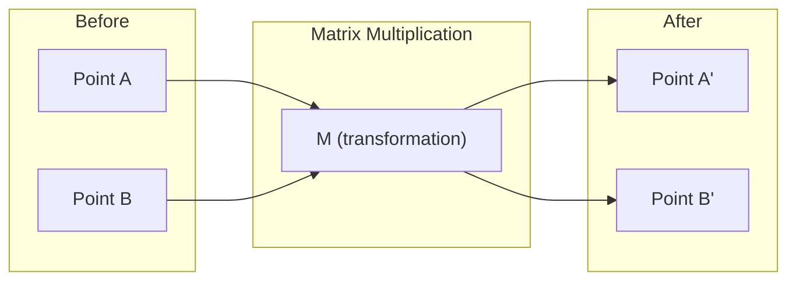
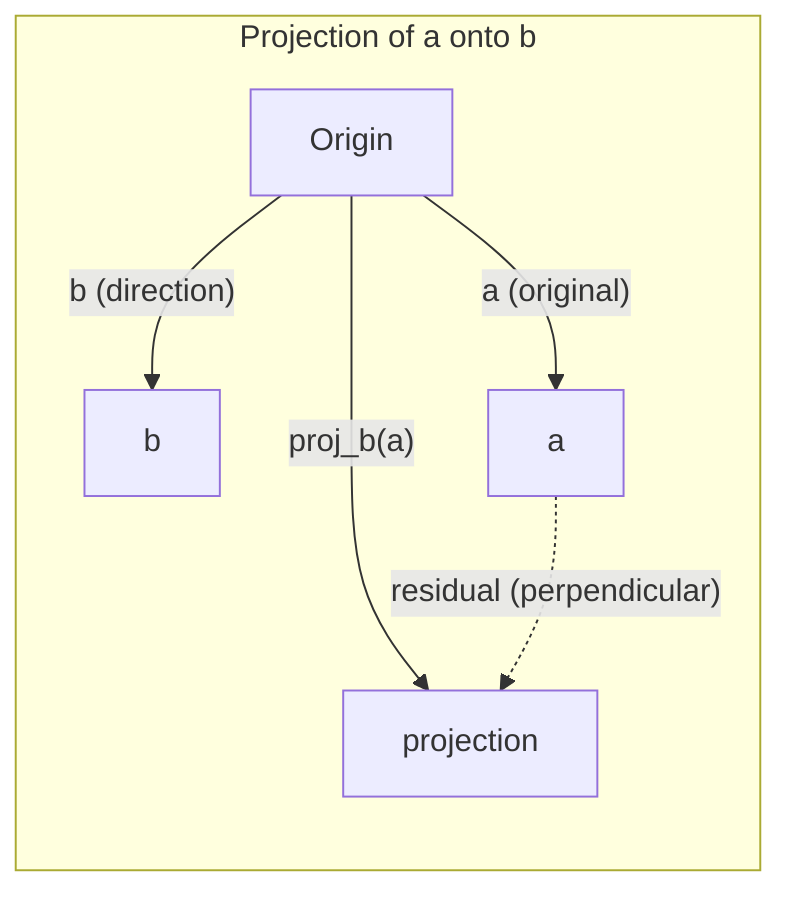

# 线性代数直�

> �个 AI 模型本质上都是披�花哨外衣的矩阵�算�

**类型�* Learn  
**语言�* Python, Julia  
**先修�* Phase 0  
**时长�* ~60 分钟

## 学习目标

- �Python 从零实现��和矩阵�算（加法�点积�矩阵乘法）
- 用几何视角解释点积�投影和 Gram-Schmidt 正交化所�的事情
- 用行��判断��组的线性相关性�秩和基�
- 将线代概念和 AI 场景连接：����注�力分数�LoRA

## 问题背景

打开任何 ML 论文，第一页通常就能看到���矩阵�点积和线性��。若没有线性代数直觉，它们看起��是符�；有了直觉，你会看到神�网络在�的其实就是在空间中移动点�

你�需�先�为数学家。你需�先�解这些�作的几何�义，�自己把它们写出��

## 核心概念

### ��既是点，也是方�

���是一个数字列表。但这些数字有�义，它们是空间中的�标�

**二维�� [3, 2]�*

| x | y | �义 |
|---|---|------|
| 3 | 2 | 该��从原点 (0,0) 指�平�上点 (3,2) |

这个��的模��3² + 2²) = �3，方���上方�

�AI 中，���以表示很多东西�
- 一个��68 维��（在嵌入空间中的“语义�义�）
- 一张图�：数百万个�素值组�的��
- 一个用户：一串�好特���

### 矩阵是��

矩阵把一个������一个��。它�以旋转�缩放�拉伸，或投影到�个方��



�AI 里，矩阵就是模型本身�
- 神�网络��是把输入映射�输出的**矩阵**
- 注�力分数是决定“关注��的**矩阵**
- 嵌入是把�映射为���*矩阵**

### 点积衡�相似�

两个��的点积告诉你它们是����正交或���

```
a · b = a�×b�+ a₂×b�+ ... + aₙ×b�

Same direction:      a · b > 0  (similar)
Perpendicular:       a · b = 0  (unrelated)
Opposite direction:  a · b < 0  (dissimilar)
```

ÕâÒ²ÊÇËÑË÷¡¢ÍƼöºÍ RAG µÄºËÐÄÂß¼­Ö®Ò»£ºÕÒµã»ý´óµÄÏòÁ¿£¨¸üÏàËÆ£©¡£?

### 线性独�

如果��组中�存在�个���以由其他��线性表示，那么这组��线性独立� 
�v1�v2�v3 独立，就能张�3 维空间；若其中�个���由其他��线性组�，张�空间维度就更低�

�AI 的�义：你的特�矩阵应尽�是线性独立的列。若两列完全线性相关（共线），模型会难以区分它们的影�，回归里就会出现多�共线性：��解�稳定，输入微��化会引�输出大幅波动�

**具体例��*

```
v1 = [1, 0, 0]
v2 = [0, 1, 0]
v3 = [2, 1, 0]   # v3 = 2*v1 + v2
```

v1 �v2 独立，彼此既�是�数也�是组�关系，�v3 = 2*v1 + v2，因�{v1, v2, v3} 是相关的。三者都�xy 平�内，�管怎么组�都到�了 [0, 0, 1]�

在数�里如果 feature_3 = 2*feature_1 + feature_2，加�feature_3 �会带�新信�，�而让法方程组奇异化，��解��唯一�

### 基底与秩

基底是一组最�的�线性独立且能张�整个空间的��。基底��个数就是空间维度�

3D 空间的标准基底是 {[1,0,0], [0,1,0], [0,0,1]}，但任何 3 个独立��都�作�3D 的�法基底。基底的选择就是�标系的选择�

矩阵�= 线性独立列�= 线性独立行数。若 rank < min(rows, cols)，称为秩�。其�义包括�
- 方程组�能无穷多解（或无解）
- ��会丢失信�
- 矩阵���

| 情况 | �| �ML 里的�义 |
|-----------|------|---------------------|
| 满秩（rank = min(m, n)�| 最大�能�| 存在唯一最�二乘解，�件数通常更稳�|
| 秩�（rank < min(m, n)�| 低于最大�| 特�冗余，��解�唯一，通常需�正则化 |
| 秩为 1 | 1 | 所有列都�是一个��的缩放，数�整体�在一�线�|
| 近似秩�（奇异值很�） | 数值上很低 | 矩阵病�，微�噪声会导致较大输出�化，�考虑 SVD 截断或岭回归 |

### 投影

�� **a** �**b** 上的投影，给出了 a �b 方�上的分��

```
proj_b(a) = (a dot b / b dot b) * b
```

残差（a - proj_b(a)）与 b 正交。这个正交分解是最�二乘方法的核心�

投影�ML 中处处��：
- 线性回归本质上是在让观测点到列空间的�离最�，这个解本身就是投�
- PCA 把数�投影到方差最大的方�
- Transformer 注�力在计算 query �key 的投影关�



**例��* a = [3, 4], b = [1, 0]

proj_b(a) = (3*1 + 4*0) / (1*1 + 0*0) * [1, 0] = 3 * [1, 0] = [3, 0]

投影去掉�y 分�，这就是最朴素的�维：丢掉�关心的方��

### Gram-Schmidt 正交�

把任�一组独立����标准正交基。标准正交�味��个��长度�1，且任�两个��正交�

步骤�
1. �第一个��并���
2. �第二个��，�去它在第一个上的投影����
3. �第三个��，�去在���个基��上的投影����
4. 继续处��续��

```
Input:  v1, v2, v3, ... (linearly independent)

u1 = v1 / |v1|

w2 = v2 - (v2 dot u1) * u1
u2 = w2 / |w2|

w3 = v3 - (v3 dot u1) * u1 - (v3 dot u2) * u2
u3 = w3 / |w3|

Output: u1, u2, u3, ... (orthonormal basis)
```

这与 QR 分解直接相关：Q 是正交基，R 记录了投影系数。QR 常用于：
- 解线性方程组（比高斯消元更稳定）
- 求特�值（QR 算法�
- 最�二乘回归（常�数值解法）

```figure
eigen-directions
```

## 动手实践

### �1 步：从零实现��（Python�

```python
class Vector:
    def __init__(self, components):
        self.components = list(components)
        self.dim = len(self.components)

    def __add__(self, other):
        return Vector([a + b for a, b in zip(self.components, other.components)])

    def __sub__(self, other):
        return Vector([a - b for a, b in zip(self.components, other.components)])

    def dot(self, other):
        return sum(a * b for a, b in zip(self.components, other.components))

    def magnitude(self):
        return sum(x**2 for x in self.components) ** 0.5

    def normalize(self):
        mag = self.magnitude()
        return Vector([x / mag for x in self.components])

    def cosine_similarity(self, other):
        return self.dot(other) / (self.magnitude() * other.magnitude())

    def __repr__(self):
        return f"Vector({self.components})"


a = Vector([1, 2, 3])
b = Vector([4, 5, 6])

print(f"a + b = {a + b}")
print(f"a · b = {a.dot(b)}")
print(f"|a| = {a.magnitude():.4f}")
print(f"cosine similarity = {a.cosine_similarity(b):.4f}")
```

### �2 步：从零实现矩阵（Python�

```python
class Matrix:
    def __init__(self, rows):
        self.rows = [list(row) for row in rows]
        self.shape = (len(self.rows), len(self.rows[0]))

    def __matmul__(self, other):
        if isinstance(other, Vector):
            return Vector([
                sum(self.rows[i][j] * other.components[j] for j in range(self.shape[1]))
                for i in range(self.shape[0])
            ])
        rows = []
        for i in range(self.shape[0]):
            row = []
            for j in range(other.shape[1]):
                row.append(sum(
                    self.rows[i][k] * other.rows[k][j]
                    for k in range(self.shape[1])
                ))
            rows.append(row)
        return Matrix(rows)

    def transpose(self):
        return Matrix([
            [self.rows[j][i] for j in range(self.shape[0])]
            for i in range(self.shape[1])
        ])

    def __repr__(self):
        return f"Matrix({self.rows})"


rotation_90 = Matrix([[0, -1], [1, 0]])
point = Vector([3, 1])

rotated = rotation_90 @ point
print(f"Original: {point}")
print(f"Rotated 90°: {rotated}")
```

### �3 步：这为什么和 AI 有关�

```python
import random

random.seed(42)
weights = Matrix([[random.gauss(0, 0.1) for _ in range(3)] for _ in range(2)])
input_vector = Vector([1.0, 0.5, -0.3])

output = weights @ input_vector
print(f"Input (3D): {input_vector}")
print(f"Output (2D): {output}")
print("这就是神�网络层的工作方�——矩阵乘法�)
```

### �4 步：Julia 实现

```julia
a = [1.0, 2.0, 3.0]
b = [4.0, 5.0, 6.0]

println("a + b = ", a + b)
println("a · b = ", a �b)       # Julia supports unicode operators
println("|a| = ", �a �a))
println("cosine = ", (a �b) / (�a �a) * �b �b)))

# Matrix-vector multiplication
W = [0.1 -0.2 0.3; 0.4 0.5 -0.1]
x = [1.0, 0.5, -0.3]
println("Wx = ", W * x)
println("This is a neural network layer.")
```

### �5 步：线性独立与投影（Python�

```python
def is_linearly_independent(vectors):
    n = len(vectors)
    dim = len(vectors[0].components)
    mat = Matrix([v.components[:] for v in vectors])
    rows = [row[:] for row in mat.rows]
    rank = 0
    for col in range(dim):
        pivot = None
        for row in range(rank, len(rows)):
            if abs(rows[row][col]) > 1e-10:
                pivot = row
                break
        if pivot is None:
            continue
        rows[rank], rows[pivot] = rows[pivot], rows[rank]
        scale = rows[rank][col]
        rows[rank] = [x / scale for x in rows[rank]]
        for row in range(len(rows)):
            if row != rank and abs(rows[row][col]) > 1e-10:
                factor = rows[row][col]
                rows[row] = [rows[row][j] - factor * rows[rank][j] for j in range(dim)]
        rank += 1
    return rank == n


def project(a, b):
    scalar = a.dot(b) / b.dot(b)
    return Vector([scalar * x for x in b.components])


def gram_schmidt(vectors):
    orthonormal = []
    for v in vectors:
        w = v
        for u in orthonormal:
            proj = project(w, u)
            w = w - proj
        if w.magnitude() < 1e-10:
            continue
        orthonormal.append(w.normalize())
    return orthonormal


v1 = Vector([1, 0, 0])
v2 = Vector([1, 1, 0])
v3 = Vector([1, 1, 1])
basis = gram_schmidt([v1, v2, v3])
for i, u in enumerate(basis):
    print(f"u{i+1} = {u}")
    print(f"  |u{i+1}| = {u.magnitude():.6f}")

print(f"u1 · u2 = {basis[0].dot(basis[1]):.6f}")
print(f"u1 · u3 = {basis[0].dot(basis[2]):.6f}")
print(f"u2 · u3 = {basis[1].dot(basis[2]):.6f}")
```

## 应用实践

�看一�NumPy 写法（你平时会�常使用）�

```python
import numpy as np

a = np.array([1, 2, 3], dtype=float)
b = np.array([4, 5, 6], dtype=float)

print(f"a + b = {a + b}")
print(f"a · b = {np.dot(a, b)}")
print(f"|a| = {np.linalg.norm(a):.4f}")
print(f"cosine = {np.dot(a, b) / (np.linalg.norm(a) * np.linalg.norm(b)):.4f}")

W = np.random.randn(2, 3) * 0.1
x = np.array([1.0, 0.5, -0.3])
print(f"Wx = {W @ x}")
```

### 秩�投影和 QR �NumPy 示例

```python
import numpy as np

A = np.array([[1, 2], [2, 4]])
print(f"Rank: {np.linalg.matrix_rank(A)}")

a = np.array([3, 4])
b = np.array([1, 0])
proj = (np.dot(a, b) / np.dot(b, b)) * b
print(f"Projection of {a} onto {b}: {proj}")

Q, R = np.linalg.qr(np.random.randn(3, 3))
print(f"Q is orthogonal: {np.allclose(Q @ Q.T, np.eye(3))}")
print(f"R is upper triangular: {np.allclose(R, np.triu(R))}")
```

### PyTorch：张�就是带梯度的��

```python
import torch

x = torch.randn(3, requires_grad=True)
y = torch.tensor([1.0, 0.0, 0.0])

similarity = torch.dot(x, y)
similarity.backward()

print(f"x = {x.data}")
print(f"y = {y.data}")
print(f"dot product = {similarity.item():.4f}")
print(f"d(dot)/dx = {x.grad}")
```

点积�x 的梯度就�y。PyTorch 自动帮你算出这一梯度。神�网络里的�一步都由这些基础�作构�：矩阵乘法�点积�投影，自动微分会把梯度沿这些路径�传�

你已�把 NumPy 里的一步步实现，用 PyTorch 的一行级 API �了对应映射，也看到了背�的计算�

## 收尾

本课会产出：
- `outputs/prompt-linear-algebra-tutor.md`：一个让 AI 辅助教学线代的�示�

## �系�

本课内容和现�AI 的若干环节一一对应�

| 概念 | 出现场景 |
|---------|------------------|
| 点积 | Transformer 的注�力分数�RAG 的余弦相似度 |
| 矩阵乘法 | �一层神�网络��个线性��|
| 线性独�| 特�选择，��多�共线�|
| �| 判断方程组是��解�LoRA 的低秩设�|
| 投影 | 线性回归�PCA 的“投影到列空间�|
| Gram-Schmidt / QR | 数值解法�特�值计�|
| 正交�| 稳定数值计算�白化��|

LoRA 值得�独�一�。它通过把��更新分解为两个低秩矩阵�微调大模型。与其直接更新一�4096×4096 的��矩阵（�16M �数），它�更新两个矩阵 4096×16 �16×4096�3.1万�数）。秩�16 的约��味���更新被�制在原高维空间中�16 维�空间里，这就是线代在工程里直接“��数��性能�的作用�

## 练习

1. 实现 `Vector.angle_between(other)`，返回两��之间的夹角（度）
2. 构造一个二维缩放矩阵，�x �标翻��y �标�为三�，并作用在�� [1, 1] �
3. 生� 5 个�机���（维�50），用余弦相似度找出最相似的两�
4. 验� Gram-Schmidt 输出确实是标准正交基：任�两个��的点积是��0，且�个��模为 1
5. 构造一个秩�2 �3x3 矩阵，用 `rank()` 验�秩，并说明其列��张�什么几何对�
6. 将��[1, 2, 3] 投影�[1, 1, 1]，解释其几何�义

## 关键术语

| 术语 | 大家常说 | 实际�义 |
|------|----------------|----------------------|
| �� | “一个箭头�| 表示 n 维空间中�个点或方�的数值列�|
| 矩阵 | “一张表�| 一个把��从一个空间映射到�一个空间的�� |
| 点积 | “乘�相加�| 衡�两个��是���的指标，是相似�索核�|
| 嵌入（Embedding�| “AI 魔法�| 将离散对象（��图��用户）映射为连续��|
| 线性独�| “它们����| ��组中没有��能由其他��线性表�|
| �| “有多少维度�| 矩阵中线性独立列（或行）的数�|
| 投影 | “影��| 一个��在�一个��方�上的分�|
| 基底 | “�标轴�| 能张�空间的最�独立��集�|
| 标准正交 | “互相垂直的�����| 互相正交且长度为 1 的��集�|

