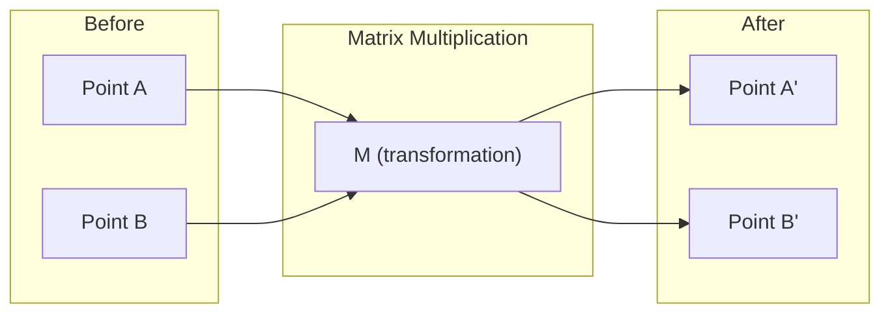
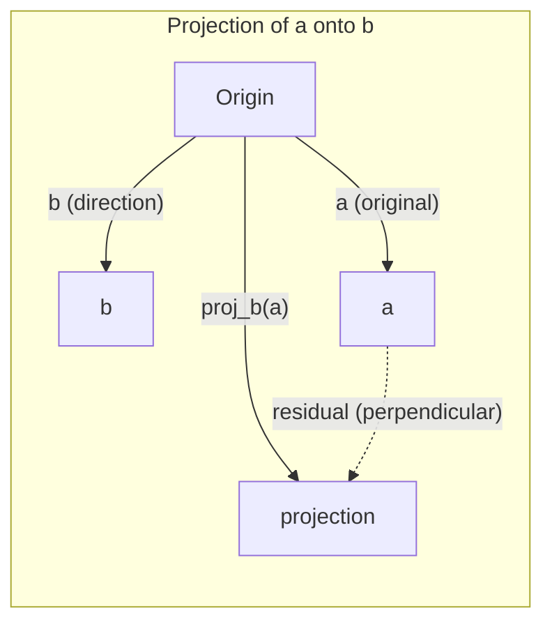

# 线性代数直觉

> 每个 AI 模型本质上都是披着花哨外衣的矩阵运算。

**类型:** 学习
**语言:** Python, Julia
**先修:** 第 0 阶段
**时长:** ~60 分钟

## 学习目标

- 用 Python 从零实现向量和矩阵运算，包括加法、点积和矩阵乘法
- 用几何直觉解释点积、投影和 Gram-Schmidt 正交化在做什么
- 用行变换判断向量组的线性相关性、秩和基
- 将线性代数概念和 AI 场景连接起来，例如词向量、注意力分数和 LoRA

## 问题背景

打开任何 ML 论文，第一页通常就能看到向量、矩阵、点积和线性变换。没有线性代数直觉时，它们只是符号；有了直觉后，你会发现神经网络做的事情其实就是在空间里移动点。

你不需要先成为数学家。你需要先理解这些操作在几何上是什么意思，然后亲手把它们写出来。

## 核心概念

### 向量就是点，也是方向

向量只是一个数字列表，但这些数字是有意义的，它们是空间中的坐标。

**二维向量 `[3, 2]`：**

| x | y | 点 |
|---|---|---|
| 3 | 2 | 这个向量从原点 `(0,0)` 指向平面上的 `(3, 2)` |

这个向量的模长是 `sqrt(3^2 + 2^2) = sqrt(13)`，方向朝右上方。

在 AI 里，向量几乎无处不在：
- 一个词 -> 一个由 768 个数字组成的向量，也就是它在 embedding 空间里的“含义”
- 一张图 -> 一个由数百万像素值组成的向量
- 一个用户 -> 一个偏好向量

### 矩阵就是变换

矩阵可以把一个向量变成另一个向量。它可以旋转、缩放、拉伸，或者投影到某个方向。



在 AI 里，矩阵本身就是模型：
- 神经网络权重 -> 把输入变成输出的矩阵
- 注意力分数 -> 决定关注谁的矩阵
- Embedding -> 把词映射成向量的矩阵

### 点积衡量相似度

两个向量的点积告诉你它们有多像。

```text
a · b = a₁×b₁ + a₂×b₂ + ... + aₙ×bₙ

同方向:      a · b > 0  （相似）
垂直:        a · b = 0  （无关）
反方向:      a · b < 0  （不相似）
```

这其实就是搜索引擎、推荐系统和 RAG 的工作方式：找到点积高的向量。

### 线性相关与线性无关

如果向量组中的任意一个向量都不能由其他向量线性组合得到，那么它们就是线性无关的。如果 `v1、v2、v3` 线性无关，它们能张成一个三维空间；如果其中一个能由其他向量组合出来，那它们只能张成一个平面。

这对 AI 很重要：你的特征矩阵最好有线性无关的列。如果两个特征完全相关，也就是线性相关，模型就分不清它们各自的作用。在回归里这会导致多重共线性，权重矩阵会变得不稳定，输入稍微变化，输出就会剧烈波动。

**具体例子：**

```text
v1 = [1, 0, 0]
v2 = [0, 1, 0]
v3 = [2, 1, 0]   # v3 = 2*v1 + v2
```

`v1` 和 `v2` 是独立的，它们互相不是倍数，也不是彼此的组合。但 `v3 = 2*v1 + v2`，所以 `{v1, v2, v3}` 是相关向量组。这三个向量都落在 `xy` 平面里。无论怎么组合，都到不了 `[0, 0, 1]`。你有三个向量，但自由度只有两个。

在数据集里，如果 `feature_3 = 2*feature_1 + feature_2`，再加上 `feature_3` 并不会给模型带来任何新信息。更糟的是，正规方程会变成奇异的，权重没有唯一解。

### 基和秩

基是一组最小的线性无关向量，但它们仍然能张成整个空间。基向量的个数就是空间的维度。

三维空间的标准基是 `{[1,0,0], [0,1,0], [0,0,1]}`。但在三维里，任意三个线性无关的向量都可以构成一组基。基的选择，就是坐标系的选择。

矩阵的秩 = 线性无关列数 = 线性无关行数。如果 `rank < min(rows, cols)`，矩阵就是秩亏的。这意味着：
- 这个方程组可能有无穷多解，或者无解
- 变换会丢失信息
- 这个矩阵不可逆

| 情况 | 秩 | 对机器学习意味着什么 |
|---|---|---|
| 满秩（`rank = min(m, n)`） | 尽可能大 | 最小二乘解唯一，模型条件良好 |
| 秩亏（`rank < min(m, n)`） | 低于最大值 | 特征冗余，权重解不唯一，需要正则化 |
| 秩为 1 | 1 | 每一列都是某个向量的缩放副本，所有数据都落在一条线上 |
| 接近秩亏（奇异值很小） | 数值上很低 | 矩阵病态，微小噪声会造成很大的输出变化，常用 SVD 截断或岭回归 |

### 投影

把向量 **a** 投影到向量 **b** 上，得到的就是 **a** 在 **b** 方向上的分量：

```text
proj_b(a) = (a dot b / b dot b) * b
```

残差 `a - proj_b(a)` 和 `b` 垂直。这个正交分解是最小二乘拟合的基础。

投影在机器学习里无处不在：
- 线性回归是在最小化观测值到列空间的距离，而解本身就是一个投影
- PCA 把数据投影到方差最大的方向上
- Transformer 的注意力是在把 query 投影到 key 上



**例子：** `a = [3, 4]`，`b = [1, 0]`

`proj_b(a) = (3*1 + 4*0) / (1*1 + 0*0) * [1, 0] = 3 * [1, 0] = [3, 0]`

这个投影把 `y` 分量去掉了。这就是最简单的降维：丢掉你不关心的方向。

### Gram-Schmidt 正交化

这个过程把任意一组线性无关向量转换成一组标准正交基。标准正交的意思是：每个向量长度为 1，而且任意两个向量都互相垂直。

算法步骤：
1. 取第一个向量，归一化
2. 取第二个向量，减去它在第一个向量上的投影，再归一化
3. 取第三个向量，减去它在前面所有向量上的投影，再归一化
4. 对剩余向量重复这个过程

```text
Input:  v1, v2, v3, ... (linearly independent)

u1 = v1 / |v1|

w2 = v2 - (v2 dot u1) * u1
u2 = w2 / |w2|

w3 = v3 - (v3 dot u1) * u1 - (v3 dot u2) * u2
u3 = w3 / |w3|

Output: u1, u2, u3, ... (orthonormal basis)
```

这就是 QR 分解的内部原理。`Q` 是标准正交基，`R` 保存了投影系数。QR 分解常用于：
- 求解线性方程组（比高斯消元更稳定）
- 计算特征值（QR 算法）
- 最小二乘回归（最常用的数值方法）

```figure
eigen-directions
```

## 动手做

### 步骤 1：从零实现向量（Python）

```python
class Vector:
    def __init__(self, components):
        self.components = list(components)
        self.dim = len(self.components)

    def __add__(self, other):
        return Vector([a + b for a, b in zip(self.components, other.components)])

    def __sub__(self, other):
        return Vector([a - b for a, b in zip(self.components, other.components)])

    def dot(self, other):
        return sum(a * b for a, b in zip(self.components, other.components))

    def magnitude(self):
        return sum(x**2 for x in self.components) ** 0.5

    def normalize(self):
        mag = self.magnitude()
        return Vector([x / mag for x in self.components])

    def cosine_similarity(self, other):
        return self.dot(other) / (self.magnitude() * other.magnitude())

    def __repr__(self):
        return f"Vector({self.components})"


a = Vector([1, 2, 3])
b = Vector([4, 5, 6])

print(f"a + b = {a + b}")
print(f"a · b = {a.dot(b)}")
print(f"|a| = {a.magnitude():.4f}")
print(f"cosine similarity = {a.cosine_similarity(b):.4f}")
```

### 步骤 2：从零实现矩阵（Python）

```python
class Matrix:
    def __init__(self, rows):
        self.rows = [list(row) for row in rows]
        self.shape = (len(self.rows), len(self.rows[0]))

    def __matmul__(self, other):
        if isinstance(other, Vector):
            return Vector([
                sum(self.rows[i][j] * other.components[j] for j in range(self.shape[1]))
                for i in range(self.shape[0])
            ])
        rows = []
        for i in range(self.shape[0]):
            row = []
            for j in range(other.shape[1]):
                row.append(sum(
                    self.rows[i][k] * other.rows[k][j]
                    for k in range(self.shape[1])
                ))
            rows.append(row)
        return Matrix(rows)

    def transpose(self):
        return Matrix([
            [self.rows[j][i] for j in range(self.shape[0])]
            for i in range(self.shape[1])
        ])

    def __repr__(self):
        return f"Matrix({self.rows})"


rotation_90 = Matrix([[0, -1], [1, 0]])
point = Vector([3, 1])

rotated = rotation_90 @ point
print(f"Original: {point}")
print(f"Rotated 90°: {rotated}")
```

### 步骤 3：这和 AI 有什么关系

```python
import random

random.seed(42)
weights = Matrix([[random.gauss(0, 0.1) for _ in range(3)] for _ in range(2)])
input_vector = Vector([1.0, 0.5, -0.3])

output = weights @ input_vector
print(f"Input (3D): {input_vector}")
print(f"Output (2D): {output}")
print("This is what a neural network layer does -- matrix multiplication.")
```

### 步骤 4：Julia 版本

```julia
a = [1.0, 2.0, 3.0]
b = [4.0, 5.0, 6.0]

println("a + b = ", a + b)
println("a · b = ", a ⋅ b)       # Julia supports unicode operators
println("|a| = ", √(a ⋅ a))
println("cosine = ", (a ⋅ b) / (√(a ⋅ a) * √(b ⋅ b)))

# Matrix-vector multiplication
W = [0.1 -0.2 0.3; 0.4 0.5 -0.1]
x = [1.0, 0.5, -0.3]
println("Wx = ", W * x)
println("This is a neural network layer.")
```

### 步骤 5：从零实现线性无关和投影（Python）

```python
def is_linearly_independent(vectors):
    n = len(vectors)
    dim = len(vectors[0].components)
    mat = Matrix([v.components[:] for v in vectors])
    rows = [row[:] for row in mat.rows]
    rank = 0
    for col in range(dim):
        pivot = None
        for row in range(rank, len(rows)):
            if abs(rows[row][col]) > 1e-10:
                pivot = row
                break
        if pivot is None:
            continue
        rows[rank], rows[pivot] = rows[pivot], rows[rank]
        scale = rows[rank][col]
        rows[rank] = [x / scale for x in rows[rank]]
        for row in range(len(rows)):
            if row != rank and abs(rows[row][col]) > 1e-10:
                factor = rows[row][col]
                rows[row] = [rows[row][j] - factor * rows[rank][j] for j in range(dim)]
        rank += 1
    return rank == n


def project(a, b):
    scalar = a.dot(b) / b.dot(b)
    return Vector([scalar * x for x in b.components])


def gram_schmidt(vectors):
    orthonormal = []
    for v in vectors:
        w = v
        for u in orthonormal:
            proj = project(w, u)
            w = w - proj
        if w.magnitude() < 1e-10:
            continue
        orthonormal.append(w.normalize())
    return orthonormal


v1 = Vector([1, 0, 0])
v2 = Vector([1, 1, 0])
v3 = Vector([1, 1, 1])
basis = gram_schmidt([v1, v2, v3])
for i, u in enumerate(basis):
    print(f"u{i+1} = {u}")
    print(f"  |u{i+1}| = {u.magnitude():.6f}")

print(f"u1 · u2 = {basis[0].dot(basis[1]):.6f}")
print(f"u1 · u3 = {basis[0].dot(basis[2]):.6f}")
print(f"u2 · u3 = {basis[1].dot(basis[2]):.6f}")
```

## 使用

再看一遍 NumPy 的写法，这才是你在实际工作里会用的方式：

```python
import numpy as np

a = np.array([1, 2, 3], dtype=float)
b = np.array([4, 5, 6], dtype=float)

print(f"a + b = {a + b}")
print(f"a · b = {np.dot(a, b)}")
print(f"|a| = {np.linalg.norm(a):.4f}")
print(f"cosine = {np.dot(a, b) / (np.linalg.norm(a) * np.linalg.norm(b)):.4f}")

W = np.random.randn(2, 3) * 0.1
x = np.array([1.0, 0.5, -0.3])
print(f"Wx = {W @ x}")
```

### 用 NumPy 看秩、投影和 QR

```python
import numpy as np

A = np.array([[1, 2], [2, 4]])
print(f"Rank: {np.linalg.matrix_rank(A)}")

a = np.array([3, 4])
b = np.array([1, 0])
proj = (np.dot(a, b) / np.dot(b, b)) * b
print(f"Projection of {a} onto {b}: {proj}")

Q, R = np.linalg.qr(np.random.randn(3, 3))
print(f"Q is orthogonal: {np.allclose(Q @ Q.T, np.eye(3))}")
print(f"R is upper triangular: {np.allclose(R, np.triu(R))}")
```

### PyTorch：张量就是带自动微分的向量

```python
import torch

x = torch.randn(3, requires_grad=True)
y = torch.tensor([1.0, 0.0, 0.0])

similarity = torch.dot(x, y)
similarity.backward()

print(f"x = {x.data}")
print(f"y = {y.data}")
print(f"dot product = {similarity.item():.4f}")
print(f"d(dot)/dx = {x.grad}")
```

点积对 `x` 的梯度就是 `y`。PyTorch 自动帮你算出来了。神经网络里的每个操作，本质上都由这些基础运算组成：矩阵乘法、点积、投影，而自动微分会沿着这些运算把梯度一路传回去。

你刚刚从零实现了 NumPy 一行代码就能做到的事情。现在你知道底层到底发生了什么。

## 输出

本课产出：
- `outputs/prompt-linear-algebra-tutor.md` -- 一个帮助 AI 通过几何直觉讲解线性代数的 prompt

## 联系

本课里的内容会直接出现在现代 AI 的这些地方：

| 概念 | 出现在哪里 |
|---|---|
| 点积 | Transformer 里的注意力分数、RAG 里的余弦相似度 |
| 矩阵乘法 | 每一层神经网络、每一次线性变换 |
| 线性无关 | 特征选择、避免多重共线性 |
| 秩 | 判断方程是否可解、LoRA（低秩适配） |
| 投影 | 线性回归（投影到列空间）、PCA |
| Gram-Schmidt / QR | 数值求解器、特征值计算 |
| 标准正交基 | 稳定的数值计算、白化变换 |

LoRA 值得单独提一句。它通过把权重更新分解成低秩矩阵来微调大语言模型。与其直接更新一个 `4096x4096` 的权重矩阵（1600 万参数），不如只更新两个 `4096x16` 和 `16x4096` 的矩阵（13.1 万参数）。`rank=16` 的约束意味着，LoRA 假设权重更新只存在于原始 4096 维空间中的一个 16 维子空间里。这就是线性代数在工程中的实际作用。

## 练习

1. 实现 `Vector.angle_between(other)`，返回两个向量夹角的度数
2. 创建一个二维缩放矩阵，让 x 坐标变成 2 倍、y 坐标变成 3 倍，然后把它作用到向量 `[1, 1]` 上
3. 给出 5 个随机词向量（维度 50），用余弦相似度找出最相似的两个
4. 验证 Gram-Schmidt 的输出确实是标准正交的：检查任意两个向量的点积是否为 0，以及每个向量的模长是否为 1
5. 构造一个秩为 2 的 3x3 矩阵。用 `rank()` 方法验证它的秩，并说明它的列向量张成了什么几何对象
6. 把向量 `[1, 2, 3]` 投影到 `[1, 1, 1]` 上。结果在几何上表示什么？

## 关键术语

| 术语 | 常见说法 | 实际含义 |
|---|---|---|
| 向量 | “一根箭头” | 表示 n 维空间中的一个点或方向的数字列表 |
| 矩阵 | “一个数字表格” | 把向量从一个空间映射到另一个空间的变换 |
| 点积 | “相乘再相加” | 衡量两个向量对齐程度的量，也是相似度搜索的核心 |
| Embedding | “某种 AI 魔法” | 表示某个对象含义的向量，比如词、图片或用户 |
| 线性无关 | “它们不重叠” | 组内没有哪个向量能由其他向量组合得到 |
| 秩 | “有多少维” | 矩阵中线性无关列（或行）的数量 |
| 投影 | “影子” | 一个向量在另一个向量方向上的分量 |
| 基 | “坐标轴” | 一组最小的、线性无关且能张成整个空间的向量 |
| 标准正交 | “互相垂直的单位向量” | 两两垂直，且每个向量长度都为 1 |
