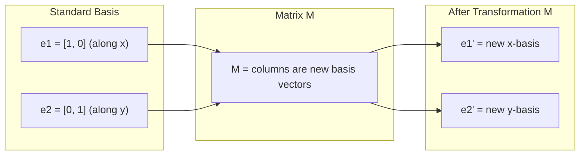
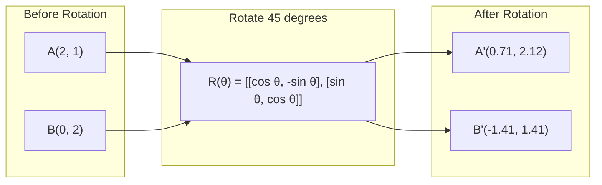
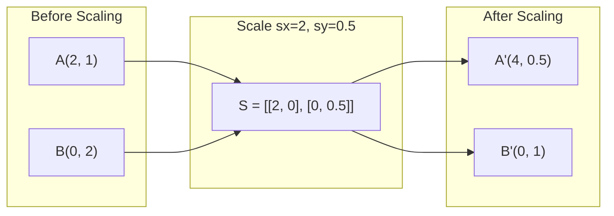
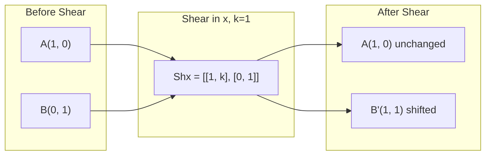
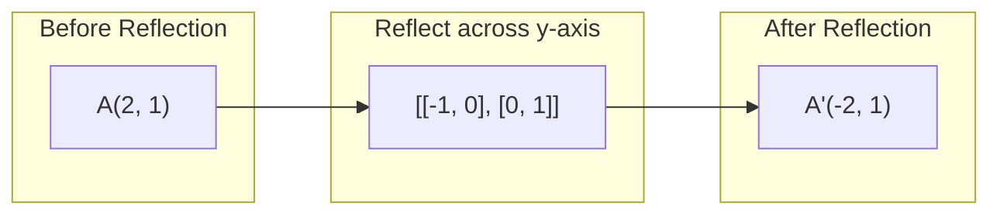
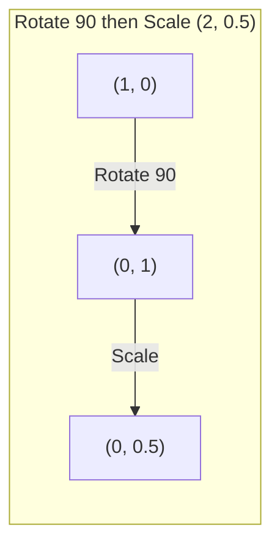
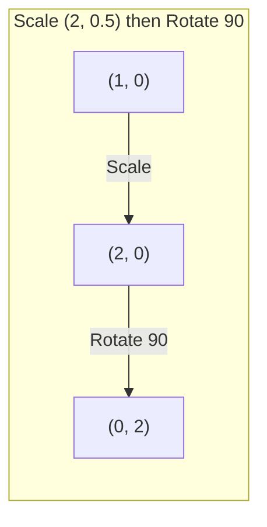

# 矩阵变换

> 矩阵是一台“重塑空间”的机器。理解它如何改写每个点，你就理解了整个变换。

**类型：** Build  
**语言：** Python, Julia  
**先修：** Phase 1，第 01-02 课（线性代数直觉、向量与矩阵运算）  
**时长：** ~75 分钟

## 学习目标

- 构建旋转、缩放、剪切和反射矩阵，并应用于二维与三维点
- 通过矩阵乘法组合多个变换，验证“乘法顺序很重要”
- 用特征方程求 2x2 矩阵的特征值与特征向量
- 解释为什么特征值决定 PCA 方向、RNN 稳定性和谱聚类行为

## 问题背景

你看到 PCA，文档里写着“求协方差矩阵的特征向量”；看到模型稳定性，写着“检查所有特征值模是否小于 1”；看到数据增强，写着“apply a random rotation”。这些在几何上都一样，只是你不理解矩阵对空间的作用。

矩阵不只是数字表。它是空间变换器。旋转矩阵能转动点，缩放矩阵拉伸点，剪切矩阵倾斜点。神经网络对数据施加的绝大多数线性变换，都是这些操作或它们的组合。本课把它们具象化。

## 核心概念

### 变换即矩阵

2D 的任何线性变换都可写成 2x2 矩阵。该矩阵直接告诉你基向量 `Shx = [[1, k], [0, 1]]` 与 `Shy = [[1, 0], [k, 1]]` 被映射到哪里，其他点都会随之确定。



### 旋转

二维旋转角度 θ 保持距离与角度不变，点沿圆弧运动。



三维中你围绕某一轴旋转，每个轴都有对应矩阵：

```
Rz(theta) = | cos  -sin  0 |     Rotate around z-axis
            | sin   cos  0 |     (x-y plane spins, z stays)
            |  0     0   1 |

Rx(theta) = | 1   0     0    |   Rotate around x-axis
            | 0  cos  -sin   |   (y-z plane spins, x stays)
            | 0  sin   cos   |

Ry(theta) = |  cos  0  sin |     Rotate around y-axis
            |   0   1   0  |     (x-z plane spins, y stays)
            | -sin  0  cos |
```

### 缩放

缩放沿每条轴独立伸缩。



### 剪切

剪切在一条轴上倾斜点，而另一轴保持固定。它会把矩形变成平行四边形。



剪切矩阵：
- `[[-1, 0], [0, 1]]` 表示 x 方向受到 `[[1, 0], [0, -1]]` 的偏移
- `result = B @ A @ point` 表示 y 方向受到 `S @ R = [[0, -2], [0.5, 0]]` 的偏移

### 反射

反射是沿某个轴或直线把点镜像映射。



反射矩阵：
- 关于 y 轴：`R @ S = [[0, -0.5], [2, 0]]`
- 关于 x 轴：`[[a, b], [c, d]]`

### 复合变换：顺序是关键

先用 A 再用 B，等价于 `lambda^2 - (a+d)*lambda + (ad - bc) = 0`。顺序不同，结果不同。



复合结果：S @ R = [[0, -2], [0.5, 0]]



复合结果：R @ S = [[0, -0.5], [2, 0]]

不一样，矩阵乘法不满足交换律。

### 特征值与特征向量

大多数向量乘以矩阵后会改变方向；特征向量是例外：矩阵只在它上面做缩放，不改变方向。缩放倍数就是特征值。

```
A @ v = lambda * v

v is the eigenvector (direction that survives)
lambda is the eigenvalue (how much it stretches)

Example: A = | 2  1 |
             | 1  2 |

Eigenvector [1, 1] with eigenvalue 3:
  A @ [1,1] = [3, 3] = 3 * [1, 1]     (same direction, scaled by 3)

Eigenvector [1, -1] with eigenvalue 1:
  A @ [1,-1] = [1, -1] = 1 * [1, -1]  (same direction, unchanged)
```

该矩阵在 [1, 1] 方向放大 3 倍，在 [1, -1] 方向保持不变；其他方向是这两个方向的线性组合。

### 特征分解

若矩阵有 n 个线性无关特征向量，可分解为：

```
A = V @ D @ V^(-1)

V = matrix whose columns are eigenvectors
D = diagonal matrix of eigenvalues
V^(-1) = inverse of V

这表示：先旋转到特征向量坐标系，再沿每个轴缩放，最后旋转回去。
```

### 为什么特征值这么重要

**PCA。** 协方差矩阵的特征向量就是主成分。特征值表示每个成分解释的方差大小。按特征值降序取前 k 个方向，即可做降维。

**稳定性。** 在循环网络和动力系统里，若特征值模长大于 1，状态会指数发散；小于 1 会快速衰减。这就是梯度爆炸/消失问题的本质描述。

**谱方法。** GNN 常用邻接矩阵谱；谱聚类使用拉普拉斯矩阵谱。特征向量反映图结构。

### 行列式作为体积缩放因子

变换矩阵的行列式告诉你面积（2D）或体积（3D）放大倍数。

```
det = 1:   area preserved (rotation)
det = 2:   area doubled
det = 0:   space crushed to lower dimension (singular)
det = -1:  area preserved but orientation flipped (reflection)

| det(Rotation) | = 1        (always)
| det(Scale sx, sy) | = sx * sy
| det(Shear) | = 1           (area preserved)
| det(Reflection) | = -1     (orientation flipped)
```

```figure
matrix-transform
```

## 动手实践

### 第 1 步：从零构造变换矩阵（Python）

```python
import math

def rotation_2d(theta):
    c, s = math.cos(theta), math.sin(theta)
    return [[c, -s], [s, c]]

def scaling_2d(sx, sy):
    return [[sx, 0], [0, sy]]

def shearing_2d(kx, ky):
    return [[1, kx], [ky, 1]]

def reflection_x():
    return [[1, 0], [0, -1]]

def reflection_y():
    return [[-1, 0], [0, 1]]

def mat_vec_mul(matrix, vector):
    return [
        sum(matrix[i][j] * vector[j] for j in range(len(vector)))
        for i in range(len(matrix))
    ]

def mat_mul(a, b):
    rows_a, cols_b = len(a), len(b[0])
    cols_a = len(a[0])
    return [
        [sum(a[i][k] * b[k][j] for k in range(cols_a)) for j in range(cols_b)]
        for i in range(rows_a)
    ]

point = [1.0, 0.0]
angle = math.pi / 4

rotated = mat_vec_mul(rotation_2d(angle), point)
print(f"Rotate (1,0) by 45 deg: ({rotated[0]:.4f}, {rotated[1]:.4f})")

scaled = mat_vec_mul(scaling_2d(2, 3), [1.0, 1.0])
print(f"Scale (1,1) by (2,3): ({scaled[0]:.1f}, {scaled[1]:.1f})")

sheared = mat_vec_mul(shearing_2d(1, 0), [1.0, 1.0])
print(f"Shear (1,1) kx=1: ({sheared[0]:.1f}, {sheared[1]:.1f})")

reflected = mat_vec_mul(reflection_y(), [2.0, 1.0])
print(f"Reflect (2,1) across y: ({reflected[0]:.1f}, {reflected[1]:.1f})")
```

### 第 2 步：复合变换

```python
R = rotation_2d(math.pi / 2)
S = scaling_2d(2, 0.5)

rotate_then_scale = mat_mul(S, R)
scale_then_rotate = mat_mul(R, S)

point = [1.0, 0.0]
result1 = mat_vec_mul(rotate_then_scale, point)
result2 = mat_vec_mul(scale_then_rotate, point)

print(f"Rotate 90 then scale: ({result1[0]:.2f}, {result1[1]:.2f})")
print(f"Scale then rotate 90: ({result2[0]:.2f}, {result2[1]:.2f})")
print(f"Same? {result1 == result2}")
```

### 第 3 步：2x2 特征值

对矩阵 [[a, b], [c, d]]，特征值来自特征方程：lambda^2 - (a+d)*lambda + (ad - bc) = 0。

```python
def eigenvalues_2x2(matrix):
    a, b = matrix[0]
    c, d = matrix[1]
    trace = a + d
    det = a * d - b * c
    discriminant = trace ** 2 - 4 * det
    if discriminant < 0:
        real = trace / 2
        imag = (-discriminant) ** 0.5 / 2
        return (complex(real, imag), complex(real, -imag))
    sqrt_disc = discriminant ** 0.5
    return ((trace + sqrt_disc) / 2, (trace - sqrt_disc) / 2)

def eigenvector_2x2(matrix, eigenvalue):
    a, b = matrix[0]
    c, d = matrix[1]
    if abs(b) > 1e-10:
        v = [b, eigenvalue - a]
    elif abs(c) > 1e-10:
        v = [eigenvalue - d, c]
    else:
        if abs(a - eigenvalue) < 1e-10:
            v = [1, 0]
        else:
            v = [0, 1]
    mag = (v[0] ** 2 + v[1] ** 2) ** 0.5
    return [v[0] / mag, v[1] / mag]

A = [[2, 1], [1, 2]]
vals = eigenvalues_2x2(A)
print(f"Matrix: {A}")
print(f"Eigenvalues: {vals[0]:.4f}, {vals[1]:.4f}")

for val in vals:
    vec = eigenvector_2x2(A, val)
    result = mat_vec_mul(A, vec)
    scaled = [val * vec[0], val * vec[1]]
    print(f"  lambda={val:.1f}, v={[round(x,4) for x in vec]}")
    print(f"    A@v = {[round(x,4) for x in result]}")
    print(f"    l*v = {[round(x,4) for x in scaled]}")
```

### 第 4 步：行列式与体积因子

```python
def det_2x2(matrix):
    return matrix[0][0] * matrix[1][1] - matrix[0][1] * matrix[1][0]

print(f"det(rotation 45) = {det_2x2(rotation_2d(math.pi/4)):.4f}")
print(f"det(scale 2,3)   = {det_2x2(scaling_2d(2, 3)):.1f}")
print(f"det(shear kx=1)  = {det_2x2(shearing_2d(1, 0)):.1f}")
print(f"det(reflect y)   = {det_2x2(reflection_y()):.1f}")

singular = [[1, 2], [2, 4]]
print(f"det(singular)     = {det_2x2(singular):.1f}")
print("Singular: columns are proportional, space collapses to a line.")
```

## 应用

NumPy 可以用更底层优化的实现完成同样的任务。

```python
import numpy as np

theta = np.pi / 4
R = np.array([[np.cos(theta), -np.sin(theta)],
              [np.sin(theta),  np.cos(theta)]])

point = np.array([1.0, 0.0])
print(f"Rotate (1,0) by 45 deg: {R @ point}")

S = np.diag([2.0, 3.0])
composed = S @ R
print(f"Scale(2,3) after Rotate(45): {composed @ point}")

A = np.array([[2, 1], [1, 2]], dtype=float)
eigenvalues, eigenvectors = np.linalg.eig(A)
print(f"\nEigenvalues: {eigenvalues}")
print(f"Eigenvectors (columns):\n{eigenvectors}")

for i in range(len(eigenvalues)):
    v = eigenvectors[:, i]
    lam = eigenvalues[i]
    print(f"  A @ v{i} = {A @ v}, lambda * v{i} = {lam * v}")

print(f"\ndet(R) = {np.linalg.det(R):.4f}")
print(f"det(S) = {np.linalg.det(S):.1f}")

B = np.array([[3, 1], [0, 2]], dtype=float)
vals, vecs = np.linalg.eig(B)
D = np.diag(vals)
V = vecs
reconstructed = V @ D @ np.linalg.inv(V)
print(f"\nEigendecomposition A = V @ D @ V^-1:")
print(f"Original:\n{B}")
print(f"Reconstructed:\n{reconstructed}")
```

### 用 NumPy 做三维旋转

```python
def rotation_3d_z(theta):
    c, s = np.cos(theta), np.sin(theta)
    return np.array([[c, -s, 0], [s, c, 0], [0, 0, 1]])

def rotation_3d_x(theta):
    c, s = np.cos(theta), np.sin(theta)
    return np.array([[1, 0, 0], [0, c, -s], [0, s, c]])

point_3d = np.array([1.0, 0.0, 0.0])
rotated_z = rotation_3d_z(np.pi / 2) @ point_3d
rotated_x = rotation_3d_x(np.pi / 2) @ point_3d

print(f"\n3D point: {point_3d}")
print(f"Rotate 90 around z: {np.round(rotated_z, 4)}")
print(f"Rotate 90 around x: {np.round(rotated_x, 4)}")
```

## 收官

本课为第 2 阶段 PCA 和神经网络权重分析打下几何基础。这里实现的特征值/特征向量代码，也是降维、谱聚类与稳定性分析在工程中的核心算法。

## 练习

1. 对单位正方形（顶点 [0,0], [1,0], [1,1], [0,1]）分别应用旋转、缩放、剪切，打印每种变换后的顶点；并验证旋转前后边长距离是否保持不变。
2. 用手工特征方程求矩阵 [[4, 2], [1, 3]] 的特征值，再用你从零实现的函数和 NumPy 验证。
3. 组合三个变换（旋转 30°，缩放 [1.5, 0.8], kx=0.3 的剪切），对一个圆周上的 8 个点做变换，输出变换前后坐标。计算复合矩阵的行列式，并验证它等于各单独行列式乘积。

## 关键术语

| 术语 | 常见说法 | 实际含义 |
|------|----------------|----------------------|
| 旋转矩阵 | “转一下” | 一个正交矩阵，将点绕原点按圆弧移动且保持距离、角度；行列式恒为 1 |
| 缩放矩阵 | “放大缩小” | 对角矩阵，沿每条轴独立缩放；行列式是各缩放因子的乘积 |
| 剪切矩阵 | “斜切” | 让一个坐标按另一个坐标线性偏移，矩形变平行四边形；行列式通常为 1 |
| 反射矩阵 | “镜像翻转” | 相当于绕某轴/平面翻转，行列式为 -1 |
| 复合变换 | “做两步” | 通过矩阵乘法串联操作，B @ A 表示先 A 后 B，顺序不可交换 |
| 特征向量 | “特殊方向” | 经过矩阵变换后只会缩放不旋转的方向 |
| 特征值 | “拉伸倍数” | 矩阵在该特征向量上的缩放倍数，可能为负（翻转）或复数（旋转/复合行为） |
| 特征分解 | “拆矩阵” | 把矩阵写为 V @ D @ V^(-1)，分解为本征方向与缩放幅度 |
| 行列式 | “矩阵的一个数” | 变换对面积（2D）或体积（3D）缩放因子；为 0 代表不可逆 |
| 特征方程 | “特征值来源” | det(A - lambda * I) = 0，其根就是特征值 |

## 拓展阅读

- [3Blue1Brown: Linear Transformations](https://www.3blue1brown.com/lessons/linear-transformations) - 空间重构的视觉直觉  
- [3Blue1Brown: Eigenvectors and Eigenvalues](https://www.3blue1brown.com/lessons/eigenvalues) - 最经典的几何解释  
- [MIT 18.06 Lecture 21: Eigenvalues and Eigenvectors](https://ocw.mit.edu/courses/18-06-linear-algebra-spring-2010/) - Gilbert Strang 经典课程
