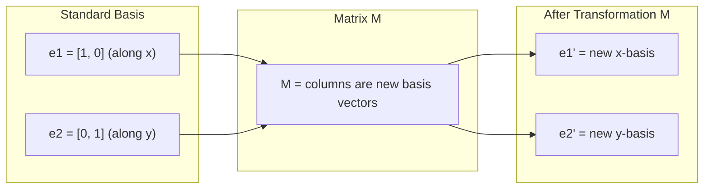
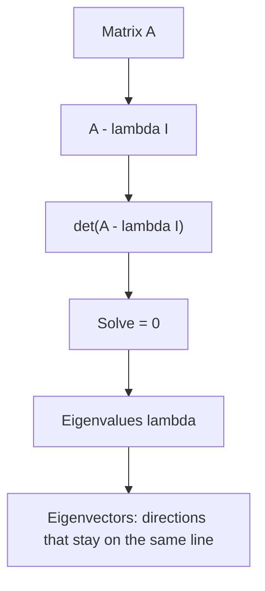

# 矩阵变换

> 矩阵是一台重塑空间的机器。理解它如何改写每个点，你就理解了整个变换。

**类型：** 构建  
**语言：** Python, Julia  
**先修：** 第 1 阶段，第 01-02 课（线性代数直觉、向量与矩阵运算）  
**时长：** ~75 分钟

## 学习目标

- 构建旋转、缩放、剪切和反射矩阵，并将它们应用到二维和三维点上
- 通过矩阵乘法组合多个变换，并验证顺序很重要
- 用特征方程求出 2x2 矩阵的特征值和特征向量
- 解释为什么特征值决定 PCA 方向、RNN 稳定性和谱聚类的行为

## 问题背景

你看到 PCA，文档里写着“求协方差矩阵的特征向量”；看到模型稳定性，写着“检查所有特征值的模是否小于 1”；看到数据增强，写着“apply a random rotation”。这些在几何上其实都是一回事，只是你还不理解矩阵对空间做了什么。

矩阵不只是数字表。它是空间变换器。旋转矩阵能转动点，缩放矩阵能拉伸点，剪切矩阵能倾斜点。神经网络对数据施加的大多数线性变换，本质上都是这些操作，或者它们的组合。本课把这些操作具体化。

## 核心概念

### 变换就是矩阵

二维中的任意线性变换都能写成一个 `2x2` 矩阵。这个矩阵会直接告诉你基向量 `[1, 0]` 和 `[0, 1]` 会被映射到哪里，其他点也就随之确定了。



矩阵变换的核心规律是：矩阵的列向量就是变换后基向量的位置。只要知道这两列，整个变换就确定了。

### 旋转矩阵

在二维中，旋转 `theta` 的标准矩阵是：

```text
R(theta) = [[cos(theta), -sin(theta)],
            [sin(theta),  cos(theta)]]
```

这会把点绕原点逆时针旋转 `theta` 弧度。旋转矩阵保持长度和角度不变，因此它是正交矩阵，而且行列式等于 1。

### 缩放矩阵

缩放矩阵会改变大小。二维缩放矩阵通常写成：

```text
S = [[sx, 0],
     [0, sy]]
```

它沿 `x` 轴缩放 `sx` 倍，沿 `y` 轴缩放 `sy` 倍。如果 `sx` 和 `sy` 相同，就是等比缩放；如果不同，就是非等比缩放。

### 剪切矩阵

剪切会把图形“斜着推”。二维剪切矩阵可以写成：

```text
Shx = [[1, k],
       [0, 1]]

Shy = [[1, 0],
       [k, 1]]
```

剪切会保持平行关系，但会改变角度。原本的矩形会变成平行四边形。

### 反射矩阵

反射矩阵会把图形镜像翻转。例如，关于 `x` 轴反射的矩阵是：

```text
[[1, 0],
 [0,-1]]
```

关于 `y` 轴反射的矩阵是：

```text
[[-1, 0],
 [ 0, 1]]
```

### 组合变换

矩阵乘法可以把多个变换串起来。顺序很重要：`B @ A` 表示先做 `A`，再做 `B`。如果你先旋转再缩放，和先缩放再旋转，结果通常不一样。

### 特征向量与特征值

如果一个向量经过矩阵变换后，只发生缩放而不改变方向，那么这个向量就是特征向量，对应的缩放倍数就是特征值。

```text
A v = lambda v
```

这个等式非常关键。它表示：矩阵 `A` 在特征向量 `v` 的方向上，只会把向量拉长或压缩 `lambda` 倍。

特征值和特征向量的重要性在于：它们告诉你矩阵“真正偏爱哪些方向”。PCA 里，主成分就是最大特征值对应的方向。RNN 是否稳定，也和特征值的模长有关。谱聚类也是在看图拉普拉斯矩阵的特征向量。

### 特征方程

要找特征值，可以解：

```text
det(A - lambda * I) = 0
```

这叫特征方程。它的解就是特征值。对于 `2x2` 矩阵，你可以手工展开并求出两个特征值。



## 动手做

### 步骤 1：从零实现旋转、缩放和剪切

```python
import math


def rotate(point, theta):
    x, y = point
    c = math.cos(theta)
    s = math.sin(theta)
    return [c * x - s * y, s * x + c * y]


def scale(point, sx, sy):
    x, y = point
    return [sx * x, sy * y]


def shear_x(point, k):
    x, y = point
    return [x + k * y, y]


def shear_y(point, k):
    x, y = point
    return [x, y + k * x]


points = [[1, 0], [0, 1], [1, 1], [-1, 1]]
angle = math.pi / 4  # 45 degrees

print("=== Rotation ===")
for p in points:
    print(f"{p} -> {rotate(p, angle)}")

print("\n=== Scaling ===")
for p in points:
    print(f"{p} -> {scale(p, 2, 0.5)}")

print("\n=== Shear X ===")
for p in points:
    print(f"{p} -> {shear_x(p, 1.0)}")
```

### 步骤 2：从零实现矩阵类

```python
class Matrix:
    def __init__(self, rows):
        self.rows = [list(row) for row in rows]
        self.n_rows = len(rows)
        self.n_cols = len(rows[0])

    def __matmul__(self, other):
        if isinstance(other, list):
            x, y = other
            return [
                self.rows[0][0] * x + self.rows[0][1] * y,
                self.rows[1][0] * x + self.rows[1][1] * y,
            ]
        elif isinstance(other, Matrix):
            result = [[0 for _ in range(other.n_cols)] for _ in range(self.n_rows)]
            for i in range(self.n_rows):
                for j in range(other.n_cols):
                    for k in range(self.n_cols):
                        result[i][j] += self.rows[i][k] * other.rows[k][j]
            return Matrix(result)
        else:
            raise TypeError("Unsupported operand type")

    def determinant(self):
        if self.n_rows == 2 and self.n_cols == 2:
            a, b = self.rows[0]
            c, d = self.rows[1]
            return a * d - b * c
        raise NotImplementedError("Only 2x2 determinant implemented")

    def transpose(self):
        return Matrix([[self.rows[j][i] for j in range(self.n_rows)] for i in range(self.n_cols)])

    def __repr__(self):
        return f"Matrix({self.rows})"


rotation_90 = Matrix([[0, -1], [1, 0]])
point = [3, 1]
print(rotation_90 @ point)
```

### 步骤 3：特征值和特征向量

```python
def eigenvalues_2x2(matrix):
    a, b = matrix.rows[0]
    c, d = matrix.rows[1]
    trace = a + d
    det = a * d - b * c
    discriminant = trace ** 2 - 4 * det
    if discriminant < 0:
        return []
    sqrt_disc = discriminant ** 0.5
    return [(trace + sqrt_disc) / 2, (trace - sqrt_disc) / 2]


def eigenvector_2x2(matrix, eigenvalue):
    a, b = matrix.rows[0]
    c, d = matrix.rows[1]
    if abs(b) > 1e-10:
        return [eigenvalue - d, b]
    if abs(c) > 1e-10:
        return [c, eigenvalue - a]
    return [1, 0]


A = Matrix([[4, 2], [1, 3]])
vals = eigenvalues_2x2(A)
print(f"Eigenvalues: {vals}")
for lam in vals:
    vec = eigenvector_2x2(A, lam)
    print(f"lambda={lam:.4f}, eigenvector={vec}")
```

### 步骤 4：组合变换

```python
rotation_45 = Matrix([
    [math.cos(math.pi / 4), -math.sin(math.pi / 4)],
    [math.sin(math.pi / 4),  math.cos(math.pi / 4)],
])
scale_2 = Matrix([[2, 0], [0, 2]])
shear = Matrix([[1, 1], [0, 1]])

combined = shear @ scale_2 @ rotation_45
print(combined)
print("det(combined) =", combined.determinant())
print("det(shear) * det(scale_2) * det(rotation_45) =", 
      shear.determinant() * scale_2.determinant() * rotation_45.determinant())
```

### 步骤 5：为什么这和 AI 有关

```python
import random

random.seed(42)
weights = Matrix([[random.gauss(0, 0.1) for _ in range(3)] for _ in range(2)])
input_vector = [1.0, 0.5, -0.3]

output = weights @ input_vector
print(f"Input (3D): {input_vector}")
print(f"Output (2D): {output}")
print("This is what a neural network layer does -- matrix multiplication.")
```

### 步骤 6：Julia 版本

```julia
a = [1.0, 2.0, 3.0]
b = [4.0, 5.0, 6.0]

println("a + b = ", a + b)
println("a · b = ", a ⋅ b)
println("|a| = ", √(a ⋅ a))
println("cosine = ", (a ⋅ b) / (√(a ⋅ a) * √(b ⋅ b)))

W = [0.1 -0.2 0.3; 0.4 0.5 -0.1]
x = [1.0, 0.5, -0.3]
println("Wx = ", W * x)
println("This is a neural network layer.")
```

## 使用

```python
import numpy as np

A = np.array([[1, 2], [2, 4]])
print(f"Rank: {np.linalg.matrix_rank(A)}")

a = np.array([3, 4])
b = np.array([1, 0])
proj = (np.dot(a, b) / np.dot(b, b)) * b
print(f"Projection of {a} onto {b}: {proj}")

Q, R = np.linalg.qr(np.random.randn(3, 3))
print(f"Q is orthogonal: {np.allclose(Q @ Q.T, np.eye(3))}")
print(f"R is upper triangular: {np.allclose(R, np.triu(R))}")
```

### PyTorch：张量就是带自动微分的向量

```python
import torch

x = torch.randn(3, requires_grad=True)
y = torch.tensor([1.0, 0.0, 0.0])

similarity = torch.dot(x, y)
similarity.backward()

print(f"x = {x.data}")
print(f"y = {y.data}")
print(f"dot product = {similarity.item():.4f}")
print(f"d(dot)/dx = {x.grad}")
```

点积对 `x` 的梯度就是 `y`。PyTorch 会自动帮你算出来。神经网络里的每一步，其实都由这些基础操作构成：矩阵乘法、点积、投影，而自动微分会把梯度沿着这些操作一路传回去。

你刚刚从零实现了 NumPy 一行代码就能做到的事情。现在你知道底层到底发生了什么。

## 输出

本课产出：
- `outputs/prompt-linear-algebra-tutor.md` -- 一个帮助 AI 通过几何直觉讲解线性代数的 prompt

## 联系

本课里的概念会直接出现在现代 AI 的这些地方：

| 概念 | 出现在哪里 |
|---|---|
| 点积 | Transformer 里的注意力分数、RAG 里的余弦相似度 |
| 矩阵乘法 | 每一层神经网络、每一次线性变换 |
| 线性无关 | 特征选择、避免多重共线性 |
| 秩 | 判断方程是否可解、LoRA（低秩适配） |
| 投影 | 线性回归（投影到列空间）、PCA |
| Gram-Schmidt / QR | 数值求解器、特征值计算 |
| 标准正交基 | 稳定的数值计算、白化变换 |

LoRA 值得单独提一句。它通过把权重更新分解成低秩矩阵来微调大语言模型。与其直接更新一个 `4096x4096` 的权重矩阵（1600 万参数），不如只更新两个 `4096x16` 和 `16x4096` 的矩阵（13.1 万参数）。`rank=16` 的约束意味着，LoRA 假设权重更新只存在于原始 4096 维空间中的一个 16 维子空间里。这就是线性代数在工程中的实际作用。

## 练习

1. 实现 `Vector.angle_between(other)`，返回两个向量夹角的度数
2. 创建一个二维缩放矩阵，让 x 坐标变成 2 倍、y 坐标变成 3 倍，然后把它作用到向量 `[1, 1]` 上
3. 给出 5 个随机词向量（维度 50），用余弦相似度找出最相似的两个
4. 验证 Gram-Schmidt 的输出确实是标准正交的：检查任意两个向量的点积是否为 0，以及每个向量的模长是否为 1
5. 构造一个秩为 2 的 3x3 矩阵。用 `rank()` 方法验证它的秩，并说明它的列向量张成了什么几何对象
6. 把向量 `[1, 2, 3]` 投影到 `[1, 1, 1]` 上。结果在几何上表示什么？

## 关键术语

| 术语 | 常见说法 | 实际含义 |
|---|---|---|
| 向量 | “一根箭头” | 表示 n 维空间中的一个点或方向的数字列表 |
| 矩阵 | “一个数字表格” | 把向量从一个空间映射到另一个空间的变换 |
| 点积 | “相乘再相加” | 衡量两个向量对齐程度的量，也是相似度搜索的核心 |
| Embedding | “某种 AI 魔法” | 表示某个对象含义的向量，比如词、图片或用户 |
| 线性无关 | “它们不重叠” | 组内没有哪个向量能由其他向量组合得到 |
| 秩 | “有多少维” | 矩阵中线性无关列（或行）的数量 |
| 投影 | “影子” | 一个向量在另一个向量方向上的分量 |
| 基 | “坐标轴” | 一组最小的、线性无关且能张成整个空间的向量 |
| 标准正交 | “互相垂直的单位向量” | 两两垂直，且每个向量长度都为 1 |
