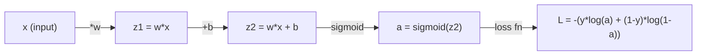
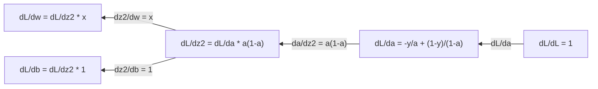
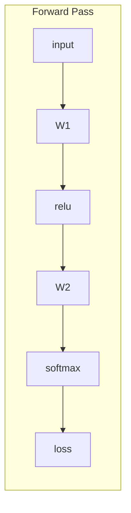
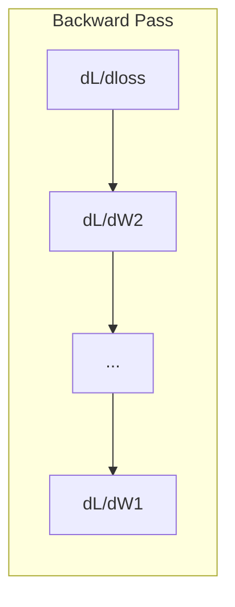

# 机器学习中的微积分

> 导数告诉你“往哪边下坡”。这就是神经网络学习所需要的一切。

**类型:** 学习  
**语言:** Python  
**先修:** 第 1 阶段第 01-03 课  
**用时:** ~60 分钟

## 学习目标

- 计算常见机器学习函数的数值导数与解析导数，例如 `x^2`、sigmoid、交叉熵
- 从零实现一维和二维梯度下降，用于最小化损失函数
- 推导线性回归模型的梯度，并通过手动更新参数完成训练
- 解释 Hessian 矩阵、泰勒展开，以及它们与优化方法的关系

## 问题

你有一个包含数百万参数的神经网络。每个参数都像一个旋钮。你需要知道每个旋钮该往哪个方向转，才能让模型稍微不那么错。微积分给你的就是这个方向。

如果没有微积分，训练神经网络就只能靠随机试错和祈祷。有了导数，你就能准确知道每个参数怎样影响误差。每次更新都能朝正确方向走一点。

## 核心概念

### 什么是导数

导数描述变化率。对于函数 `y = f(x)`，导数 `f'(x)` 告诉你：如果把 `x` 轻轻推一下，`y` 会变化多少。

几何上，导数就是某点处切线的斜率。

**`f(x) = x^2`：**

| x | f(x) | f'(x)（斜率） |
|---|------|---------------|
| 0 | 0    | 0（在底部，平的） |
| 1 | 1    | 2 |
| 2 | 4    | 4（该点切线斜率） |
| 3 | 9    | 6 |

在 `x=2` 时，斜率是 4。把 `x` 往右挪一点，`y` 大约会增加 4 倍于这个位移。在 `x=0` 时，斜率为 0，说明你已经在碗底。

严格定义如下：

```text
f'(x) = lim   f(x + h) - f(x)
        h->0  -----------------
                     h
```

编码时通常不会真的算极限，而是直接取一个很小的 `h` 来估算，这就是数值导数。

### 偏导数：一次只看一个变量

真实函数往往有多个输入。神经网络的损失会依赖成千上万个参数。偏导数的做法是：保持其他变量不变，只对某一个变量求导。

```text
f(x, y) = x^2 + 3xy + y^2

df/dx = 2x + 3y     (把 y 当常数)
df/dy = 3x + 2y     (把 x 当常数)
```

每个偏导数都在回答同一个问题：如果我只改这一个参数，损失会怎么变？

### 梯度：所有偏导数的向量

梯度把所有偏导数放进一个向量里。对于 `f(x, y, z)`，梯度是：

```text
grad f = [ df/dx, df/dy, df/dz ]
```

梯度指向函数上升最快的方向。要最小化函数，就往相反方向走。

**`f(x, y) = x^2 + y^2` 的等高线图：**

这个函数是一个碗，等高线是同心圆。最小值在 `(0, 0)`。

| 点 | grad f | -grad f（下降方向） |
|----|--------|----------------------|
| (1, 1) | [2, 2]（指向上坡，远离最小值） | [-2, -2]（指向下坡，朝向最小值） |
| (0, 0) | [0, 0]（已经在底部） | [0, 0] |

这就是梯度下降：先算梯度，再取反方向，再走一步。

### 与优化的关系

训练神经网络本质上就是优化。你有一个损失函数 `L(w1, w2, ..., wn)`，它衡量模型有多错。你的目标是把它最小化。

```text
梯度下降更新公式：

  w_new = w_old - learning_rate * dL/dw

对每个权重：
  1. 计算损失对这个权重的偏导数
  2. 从权重里减去它的一小部分
  3. 重复
```

学习率决定步长。太大会跨过最优点，太小会走得很慢。

**损失曲面的一维切片：**

随着权重 `w` 变化，损失函数 `L(w)` 会形成一条峰谷曲线。

| 概念 | 含义 |
|------|------|
| 全局最小值 | 整条曲线上的最低点，也就是最佳解 |
| 局部最小值 | 比周围低，但不一定是全局最低 |
| 斜率 | 梯度下降会沿着斜率往下走 |

梯度下降总是沿斜率往下走。它可能会卡在局部最小值，但在高维空间里，这通常不是最主要的问题。

### 数值导数 vs 解析导数

求导有两种常见方式。

解析法：手工套用微积分规则。比如 `f(x) = x^2`，导数就是 `f'(x) = 2x`。精确，而且快。

数值法：根据定义做近似。取很小的 `h` 计算 `f(x+h)` 和 `f(x-h)`。

```text
Numerical (central difference):

f'(x) ~= f(x + h) - f(x - h)
          -----------------------
                  2h

h = 0.0001 works well in practice
```

数值导数适用范围广，但速度较慢。解析导数更快，但你得先推公式。神经网络框架会用第三种方式：自动微分，它会机械地算出精确导数。第三阶段会专门讲。

### 简单函数的手工导数

下面这些导数会在机器学习里反复出现。

```text
Function        Derivative       Used in
--------        ----------       -------
f(x) = x^2     f'(x) = 2x      Loss functions (MSE)
f(x) = wx + b  f'(w) = x        Linear layer (gradient w.r.t. weight)
                f'(b) = 1        Linear layer (gradient w.r.t. bias)
                f'(x) = w        Linear layer (gradient w.r.t. input)
f(x) = e^x     f'(x) = e^x     Softmax, attention
f(x) = ln(x)   f'(x) = 1/x     Cross-entropy loss
f(x) = 1/(1+e^-x)  f'(x) = f(x)(1-f(x))   Sigmoid activation
```

对于 `f(x) = x^2`：

```text
f(x) = x^2    f'(x) = 2x

  x    f(x)   f'(x)   meaning
  -2    4      -4      slope tilts left (decreasing)
  -1    1      -2      slope tilts left (decreasing)
   0    0       0      flat (minimum!)
   1    1       2      slope tilts right (increasing)
   2    4       4      slope tilts right (increasing)
```

对于 `f(w) = wx + b`，取 `x = 3, b = 1`：

```text
f(w) = 3w + 1    f'(w) = 3

The derivative with respect to w is just x.
If x is big, a small change in w causes a big change in output.
```

### 链式法则

当函数嵌套在一起时，链式法则告诉你怎么求导。

```text
If y = f(g(x)), then dy/dx = f'(g(x)) * g'(x)

Example: y = (3x + 1)^2
  outer: f(u) = u^2       f'(u) = 2u
  inner: g(x) = 3x + 1    g'(x) = 3
  dy/dx = 2(3x + 1) * 3 = 6(3x + 1)
```

神经网络就是一串函数：输入 -> 线性 -> 激活 -> 线性 -> 激活 -> 损失。反向传播就是把链式法则从输出端一路用回输入端。这就是整个算法。

### Hessian 矩阵

梯度告诉你斜率，Hessian 告诉你曲率。

Hessian 是二阶偏导数组成的矩阵。对于函数 `f(x1, x2, ..., xn)`，Hessian 的第 `(i, j)` 项是：

```text
H[i][j] = d^2f / (dx_i * dx_j)
```

对于二元函数 `f(x, y)`：

```text
H = | d^2f/dx^2    d^2f/dxdy |
    | d^2f/dydx    d^2f/dy^2 |
```

**临界点上 Hessian 告诉你什么（梯度为 0）：**

| Hessian 性质 | 含义 | 示例形状 |
|-------------|------|---------|
| 正定（全部特征值 > 0） | 局部最小值 | 向上开的碗 |
| 负定（全部特征值 < 0） | 局部最大值 | 向下开的碗 |
| 不定（正负特征值混合） | 鞍点 | 马鞍形 |

**例子：** `f(x, y) = x^2 - y^2`（鞍点函数）

```text
df/dx = 2x       df/dy = -2y
d^2f/dx^2 = 2    d^2f/dy^2 = -2    d^2f/dxdy = 0

H = | 2   0 |
    | 0  -2 |

Eigenvalues: 2 and -2 (one positive, one negative)
--> Saddle point at (0, 0)
```

对比 `f(x, y) = x^2 + y^2`（碗形函数）：

```text
H = | 2  0 |
    | 0  2 |

Eigenvalues: 2 and 2 (both positive)
--> Local minimum at (0, 0)
```

**Hessian 为什么重要：**

牛顿法会用 Hessian 来比梯度下降做出更好的步长决策。它不只是跟着斜率走，还会考虑曲率：

```text
Newton's update:    w_new = w_old - H^(-1) * gradient
Gradient descent:   w_new = w_old - lr * gradient
```

牛顿法通常收敛更快，因为 Hessian 会对梯度做“重标定” - 陡峭方向步子更小，平坦方向步子更大。

问题在于：如果神经网络有 N 个参数，Hessian 就是 `N x N` 的矩阵。100 万个参数意味着 1 万亿个元素，所以通常不可行。这就是为什么我们要用近似方法。

| 方法 | 使用的信息 | 代价 | 收敛特性 |
|------|------------|------|---------|
| 梯度下降 | 只用一阶导数 | 每步 O(N) | 慢（线性） |
| 牛顿法 | 完整 Hessian | 每步 O(N^3) | 快（二次） |
| L-BFGS | 用历史梯度近似 Hessian | 每步 O(N) | 中（超线性） |
| Adam | 每个参数自适应学习率（近似对角 Hessian） | 每步 O(N) | 中等 |
| 自然梯度 | Fisher 信息矩阵（统计意义上的 Hessian） | 每步 O(N^2) | 快 |

实际中，Adam 是深度学习里的默认优化器。它会跟踪每个参数梯度的均值和方差，以低成本近似二阶信息。

### 泰勒展开近似

任何光滑函数在某一点附近都能用多项式近似：

```text
f(x + h) = f(x) + f'(x)*h + (1/2)*f''(x)*h^2 + (1/6)*f'''(x)*h^3 + ...
```

项数越多，近似越好，但通常只在 `x` 附近有效。

**泰勒展开为什么重要：**

- **一阶泰勒 = 梯度下降。** 当你使用 `f(x + h) ~ f(x) + f'(x)h` 时，就是在做线性近似。梯度下降会在这个近似模型下选择 `h = -lr * f'(x)`。
- **二阶泰勒 = 牛顿法。** 使用 `f(x + h) ~ f(x) + f'(x)h + (1/2)*f''(x)h^2` 时，你得到的是二次模型。最小化它会得到 `h = -f'(x)/f''(x)`，也就是牛顿步。
- **损失函数设计。** MSE 和交叉熵通常是光滑的，所以泰勒展开行为稳定。这不是偶然。光滑损失会让优化更可预测。

```text
Approximation order    What it captures    Optimization method
-------------------    -----------------   -------------------
0th order (constant)   Just the value      Random search
1st order (linear)     Slope               Gradient descent
2nd order (quadratic)  Curvature           Newton's method
Higher orders          Finer structure     Rarely used in ML
```

关键点：所有基于梯度的优化，本质上都是先对损失做局部近似，再朝这个近似的最小值走一步。

### 机器学习里的积分

导数描述变化率，积分描述累积，也就是曲线下的面积。

在机器学习里，你很少手算积分，但它无处不在：

**概率。** 对连续随机变量，密度为 `p(x)`：

```text
P(a < X < b) = integral from a to b of p(x) dx
```

概率密度曲线在 `[a, b]` 下的面积，就是落在这个区间的概率。

**期望。** 概率加权后的平均值：

```text
E[f(X)] = integral of f(x) * p(x) dx
```

数据分布上的期望损失，本质上就是积分。训练时，我们通常最小化它的经验近似。

**KL 散度。** 衡量两个分布有多不一样：

```text
KL(p || q) = integral of p(x) * log(p(x) / q(x)) dx
```

它常见于 VAE、知识蒸馏和贝叶斯推断。

**归一化常数。** 在贝叶斯推断里：

```text
p(w | data) = p(data | w) * p(w) / integral of p(data | w) * p(w) dw
```

分母是对所有参数可能值的积分。它通常没法解析求出，这就是为什么要用 MCMC 和变分推断这类近似方法。

| 积分概念 | 在机器学习里的位置 |
|----------|--------------------|
| 曲线下面积 | 由概率密度函数得到概率 |
| 期望 | 损失函数、风险最小化 |
| KL 散度 | VAE、策略优化、蒸馏 |
| 归一化 | 贝叶斯后验、softmax 分母 |
| 边缘似然 | 模型比较、ELBO |

### 计算图中的多变量链式法则

链式法则不只适用于一条线上的标量函数。神经网络里，变量会分叉和汇合。下面是一个简单前向传播中的导数流向：



反向传播会从右到左算梯度：



每条边都乘上那条边对应的局部导数。任意参数的梯度，都是从损失走到这个参数的路径上所有局部导数的乘积。路径分叉和汇合时，要把分支贡献加起来，这就是多变量链式法则。

这就是反向传播：通过计算图，从输出到输入，系统地应用链式法则。

### 雅可比矩阵

当一个函数把向量映射到向量时，比如神经网络的一层，导数就是矩阵。雅可比矩阵包含每个输出对每个输入的所有偏导数。

对 `f: R^n -> R^m`，Jacobian `J` 是一个 `m x n` 矩阵：

| | x1 | x2 | ... | xn |
|---|---|---|---|---|
| f1 | df1/dx1 | df1/dx2 | ... | df1/dxn |
| f2 | df2/dx1 | df2/dx2 | ... | df2/dxn |
| ... | ... | ... | ... | ... |
| fm | dfm/dx1 | dfm/dx2 | ... | dfm/dxn |

神经网络里你不会手算 Jacobian，PyTorch 会帮你做。但知道它的存在，有助于理解反向传播里的形状关系：如果一层把 `R^n` 映射到 `R^m`，它的 Jacobian 就是 `m x n`，梯度会通过它的转置向后传播。

### 为什么这对神经网络重要

神经网络中的每个权重都会得到梯度。梯度告诉你该怎样调整这个权重，才能减少损失。





每个权重更新：

- `W1 = W1 - lr * dL/dW1`
- `W2 = W2 - lr * dL/dW2`

前向传播计算预测和损失。反向传播计算每个权重上的损失梯度。然后每个权重沿着下坡方向走一小步。重复上百万次，这就是深度学习。

```figure
derivative-tangent
```

## 动手实现

### 步骤 1：从零实现数值导数

```python
def numerical_derivative(f, x, h=1e-7):
    return (f(x + h) - f(x - h)) / (2 * h)

def f(x):
    return x ** 2

for x in [-2, -1, 0, 1, 2]:
    numerical = numerical_derivative(f, x)
    analytical = 2 * x
    print(f"x={x:2d}  f'(x) numerical={numerical:.6f}  analytical={analytical:.1f}")
```

数值导数会和解析导数在很多小数位上都非常接近。

### 步骤 2：偏导数和梯度

```python
def numerical_gradient(f, point, h=1e-7):
    gradient = []
    for i in range(len(point)):
        point_plus = list(point)
        point_minus = list(point)
        point_plus[i] += h
        point_minus[i] -= h
        partial = (f(point_plus) - f(point_minus)) / (2 * h)
        gradient.append(partial)
    return gradient

def f_multi(point):
    x, y = point
    return x**2 + 3*x*y + y**2

grad = numerical_gradient(f_multi, [1.0, 2.0])
print(f"Numerical gradient at (1,2): {[f'{g:.4f}' for g in grad]}")
print(f"Analytical gradient at (1,2): [2*1+3*2, 3*1+2*2] = [{2*1+3*2}, {3*1+2*2}]")
```

### 步骤 3：用梯度下降找 `f(x)=x^2` 的最小值

```python
x = 5.0
lr = 0.1
for step in range(20):
    grad = 2 * x
    x = x - lr * grad
    print(f"step {step:2d}  x={x:8.4f}  f(x)={x**2:10.6f}")
```

从 `x=5` 开始，每一步都会更靠近 `x=0`，也就是最小值。

### 步骤 4：二维函数上的梯度下降

```python
def f_2d(point):
    x, y = point
    return x**2 + y**2

point = [4.0, 3.0]
lr = 0.1
for step in range(30):
    grad = numerical_gradient(f_2d, point)
    point = [p - lr * g for p, g in zip(point, grad)]
    loss = f_2d(point)
    if step % 5 == 0 or step == 29:
        print(f"step {step:2d}  point=({point[0]:7.4f}, {point[1]:7.4f})  f={loss:.6f}")
```

### 步骤 5：比较数值导数和解析导数

```python
import math

test_functions = [
    ("x^2",      lambda x: x**2,          lambda x: 2*x),
    ("x^3",      lambda x: x**3,          lambda x: 3*x**2),
    ("sin(x)",   lambda x: math.sin(x),   lambda x: math.cos(x)),
    ("e^x",      lambda x: math.exp(x),   lambda x: math.exp(x)),
    ("1/x",      lambda x: 1/x,           lambda x: -1/x**2),
]

x = 2.0
print(f"{'Function':<12} {'Numerical':>12} {'Analytical':>12} {'Error':>12}")
print("-" * 50)
for name, f, df in test_functions:
    num = numerical_derivative(f, x)
    ana = df(x)
    err = abs(num - ana)
    print(f"{name:<12} {num:12.6f} {ana:12.6f} {err:12.2e}")
```

### 步骤 6：数值计算 Hessian

```python
def hessian_2d(f, x, y, h=1e-5):
    fxx = (f(x + h, y) - 2 * f(x, y) + f(x - h, y)) / (h ** 2)
    fyy = (f(x, y + h) - 2 * f(x, y) + f(x, y - h)) / (h ** 2)
    fxy = (f(x + h, y + h) - f(x + h, y - h) - f(x - h, y + h) + f(x - h, y - h)) / (4 * h ** 2)
    return [[fxx, fxy], [fxy, fyy]]

def saddle(x, y):
    return x ** 2 - y ** 2

def bowl(x, y):
    return x ** 2 + y ** 2

H_saddle = hessian_2d(saddle, 0.0, 0.0)
H_bowl = hessian_2d(bowl, 0.0, 0.0)
print(f"Saddle Hessian: {H_saddle}")  # [[2, 0], [0, -2]] -- mixed signs
print(f"Bowl Hessian:   {H_bowl}")    # [[2, 0], [0, 2]]  -- both positive
```

鞍点函数的 Hessian 特征值是 2 和 -2，说明它是鞍点。碗形函数的 Hessian 特征值都是 2，说明它是最小点。

### 步骤 7：观察泰勒近似

```python
import math

def taylor_approx(f, f_prime, f_double_prime, x0, h, order=2):
    result = f(x0)
    if order >= 1:
        result += f_prime(x0) * h
    if order >= 2:
        result += 0.5 * f_double_prime(x0) * h ** 2
    return result

x0 = 0.0
for h in [0.1, 0.5, 1.0, 2.0]:
    true_val = math.sin(h)
    t1 = taylor_approx(math.sin, math.cos, lambda x: -math.sin(x), x0, h, order=1)
    t2 = taylor_approx(math.sin, math.cos, lambda x: -math.sin(x), x0, h, order=2)
    print(f"h={h:.1f}  sin(h)={true_val:.4f}  order1={t1:.4f}  order2={t2:.4f}")
```

在 `x0=0` 附近，`sin(x) ~ x`（一阶泰勒）。当 `h` 很小时近似很好，`h` 大时就会变差。这也是梯度下降更依赖小学习率的原因：每一步都默认线性近似足够准确。

### 步骤 8：为什么这对神经网络重要

```python
import random

random.seed(42)

w = random.gauss(0, 1)
b = random.gauss(0, 1)
lr = 0.01

xs = [1.0, 2.0, 3.0, 4.0, 5.0]
ys = [3.0, 5.0, 7.0, 9.0, 11.0]

for epoch in range(200):
    total_loss = 0
    dw = 0
    db = 0
    for x, y in zip(xs, ys):
        pred = w * x + b
        error = pred - y
        total_loss += error ** 2
        dw += 2 * error * x
        db += 2 * error
    dw /= len(xs)
    db /= len(xs)
    total_loss /= len(xs)
    w -= lr * dw
    b -= lr * db
    if epoch % 40 == 0 or epoch == 199:
        print(f"epoch {epoch:3d}  w={w:.4f}  b={b:.4f}  loss={total_loss:.6f}")

print(f"\nLearned: y = {w:.2f}x + {b:.2f}")
print(f"Actual:  y = 2x + 1")
```

每个基于梯度的训练循环都遵循同样的结构：预测、计算损失、计算梯度、更新权重。

## 实际使用

有了 NumPy，同样的事情会更快也更简洁：

```python
import numpy as np

x = np.array([1, 2, 3, 4, 5], dtype=float)
y = np.array([3, 5, 7, 9, 11], dtype=float)

w, b = np.random.randn(), np.random.randn()
lr = 0.01

for epoch in range(200):
    pred = w * x + b
    error = pred - y
    loss = np.mean(error ** 2)
    dw = np.mean(2 * error * x)
    db = np.mean(2 * error)
    w -= lr * dw
    b -= lr * db

print(f"Learned: y = {w:.2f}x + {b:.2f}")
```

你已经从零实现了梯度下降。PyTorch 会自动算梯度，但更新循环的逻辑是一样的。

## 练习

1. 用 `numerical_derivative` 再调用一次，写出 `numerical_second_derivative(f, x)`。验证 `x^3` 在 `x=2` 时的二阶导数是 12。
2. 用梯度下降求 `f(x, y) = (x - 3)^2 + (y + 1)^2` 的最小值，起点为 `(0, 0)`，应收敛到 `(3, -1)`。
3. 给梯度下降加上动量：维护一个累计历史梯度的速度向量。比较在 `f(x)=x^4 - 3x^2` 上，有无动量时的收敛速度。

## 术语表

| 术语 | 常见说法 | 实际含义 |
|------|----------|---------|
| 导数 | “斜率” | 某点处函数的变化率，也就是输入变化一单位时输出的平均变化趋势 |
| 偏导数 | “某一个变量的导数” | 在其他变量保持不变时，对某个变量求导 |
| 梯度 | “最陡上升方向” | 所有偏导数组成的向量，指向函数增长最快的方向 |
| 梯度下降 | “往下走” | 用参数减去学习率乘以梯度来降低损失，是神经网络训练的核心 |
| 学习率 | “步长” | 决定每步下降的幅度。过大会发散，过小会收敛很慢 |
| 链式法则 | “导数乘法” | 复合函数求导规则：`df/dx = df/dg * dg/dx`，是反向传播的数学基础 |
| 雅可比 | “导数矩阵” | 向量到向量映射时，输出对输入的全部偏导数组成的矩阵 |
| 数值导数 | “有限差分” | 用两个相邻点的函数值计算斜率，得到导数近似 |
| 反向传播 | “反向自动微分” | 从输出到输入逐层应用链式法则求梯度，是神经网络学习的核心 |
| Hessian | “二阶导数矩阵” | 所有二阶偏导数组成的矩阵，描述函数曲率；在临界点处，正定表示局部最小值 |
| 泰勒级数 | “多项式近似” | 用导数在某点附近近似函数：`f(x+h) ~ f(x) + f'(x)h + 1/2 f''(x)h^2 + ...`，解释梯度下降与牛顿法为何有效 |
| 积分 | “曲线下的面积” | 在区间上累积一个量；在机器学习里用于概率、期望和 KL 散度 |

## 延伸阅读

- [3Blue1Brown: Essence of Calculus](https://www.3blue1brown.com/topics/calculus) - 直观理解导数、积分和链式法则
- [Stanford CS231n: Backpropagation](https://cs231n.github.io/optimization-2/) - 理解梯度如何在神经网络层中传播

