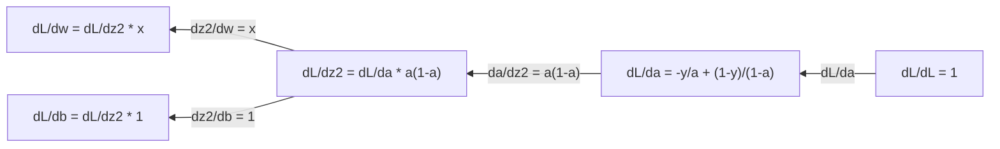
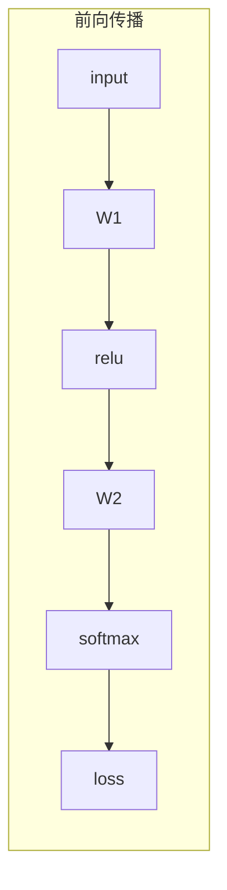
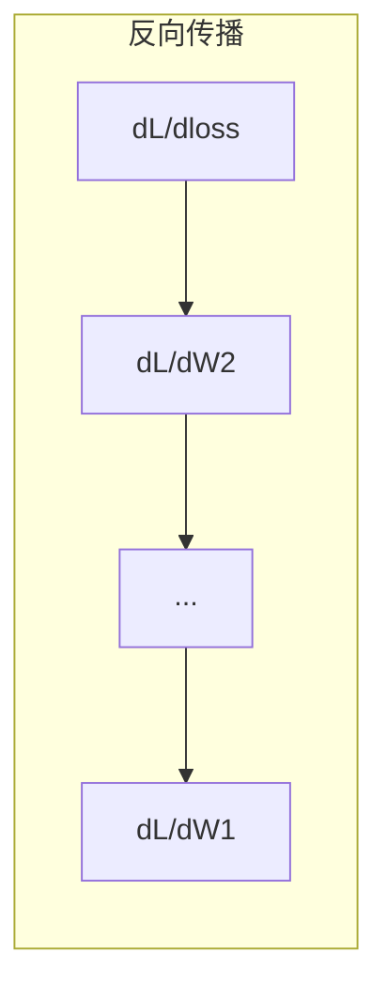

# 机器学习中的微积分

> 导数告诉你“下坡方向”。这正是神经网络需要学习的一切。

**类型：** Learn  
**语言：** Python  
**先修：** 第1阶段第01-03课  
**用时：** ~60 分钟

## 学习目标

- 计算常见机器学习函数的数值导数与解析导数（如 `x^2`、sigmoid、交叉熵）
- 从零实现一维和二维情况下的梯度下降，最小化损失函数
- 推导线性回归模型的梯度，并通过手动参数更新完成训练
- 解释 Hessian 矩阵与泰勒展开，并说明它们与优化方法的关系

## 问题

你有一个拥有数百万参数的神经网络。每个参数就像一个旋钮。你需要知道该如何转动每一个旋钮，让模型的误差略有下降。微积分正是给你答案的工具。

没有微积分时，训练神经网络意味着瞎试随机扰动并祈祷。通过导数，你就能准确知道每个参数如何影响误差，进而每次都把旋钮往正确方向转动。

## 核心概念

### 什么是导数？

导数描述“变化率”。对于函数 `y = f(x)`，导数 `f'(x)` 告诉你：如果把 `x` 稍微改动一点，`y` 会改动多少。

几何上，导数是某点处切线的斜率。

**`f(x) = x^2`:**

| x | f(x) | f'(x)（斜率） |
|---|------|---------------|
| 0 | 0    | 0（在谷底时平坦） |
| 1 | 1    | 2 |
| 2 | 4    | 4（该点切线斜率） |
| 3 | 9    | 6 |

在 `x=2` 时斜率是 4。若将 `x` 稍微向右移动，`y` 大约会增加 4 倍这段位移。  
在 `x=0` 时斜率是 0，说明处在“碗底”。

严格定义如下：

```text
f'(x) = lim   f(x + h) - f(x)
        h->0  -----------------
                     h
```

编码时我们通常跳过严格极限，直接用一个很小的 `h` 估算，这就是数值导数。

### 偏导数：一次只看一个变量

真实世界函数往往有多个输入。神经网络损失依赖成千上万个参数。偏导数的做法是：保持其他变量不变，只对某一个变量求导。

```text
f(x, y) = x^2 + 3xy + y^2

df/dx = 2x + 3y     （视 y 为常数）
df/dy = 3x + 2y     （视 x 为常数）
```

每个偏导数回答：如果我只微调这个参数，损失会如何变化？

### 梯度：所有偏导数组成的向量

梯度就是把所有偏导数放进一个向量。对 `f(x, y, z)`，梯度为：

```text
grad f = [ df/dx, df/dy, df/dz ]
```

梯度方向是函数上升最快方向；要最小化函数，就往相反方向走。

**`f(x,y) = x^2 + y^2` 的等高线示意：**

该函数是“碗形”，等高线是同心圆。最小值在 `(0, 0)`。

| 点 | grad f | `-grad f`（下降方向） |
|---|--------|------------------------|
| (1, 1) | [2, 2]（指向上坡、远离谷底） | [-2, -2]（指向下坡、朝向谷底） |
| (0, 0) | [0, 0]（谷底平坦） | [0, 0] |

这就是“梯度下降”的图像：先算梯度，再取反向，再走一步。

### 与优化的连接

训练神经网络本质上是优化。你有一个损失函数 `L(w1, w2, ..., wn)` 来衡量模型错误程度，你要做的是最小化它。

```text
梯度下降更新公式：

  w_new = w_old - learning_rate * dL/dw

对每个参数：
  1. 求该参数的偏导数
  2. 从参数中减去学习率倍数的偏导数
  3. 重复
```

学习率决定步长。太大可能越过最优点，太小则会非常慢。

**损失曲面（1D 切片）：**

随着权重 `w` 变化，损失函数 `L(w)` 形成峰谷曲线。

| 概念 | 含义 |
|------|------|
| 全局最小值 | 整条曲线上最低点（最优解） |
| 局部最小值 | 低于邻域但非全局最低 |
| 斜率 | 从任何起点开始，梯度下降都沿下坡方向前进 |

梯度下降总是沿斜率下滑。它可能卡在局部最小值，但在高维（百万级参数）下通常不是最主要问题。

### 数值导数 vs 解析导数

求导有两种方式。

解析法：手工应用微积分规则。比如 `f(x) = x^2`，导数就是 `f'(x)=2x`，精确且快。

数值法：用定义近似。取很小的 `h` 计算 `f(x+h)` 与 `f(x-h)`。

```text
数值（中心差分）：

f'(x) ~= f(x + h) - f(x - h)
          -----------------------
                     2h

h = 0.0001 在实践中通常够用
```

数值导数适用范围广但较慢。解析导数快，但你必须先推公式。神经网络框架会用第三种方式：自动微分（automatic differentiation），它会机械式地算出精确导数。第三阶段会专门讲。

### 常见函数的手工导数

这些导数在机器学习里反复出现：

```text
函数              导数                    常见用途
--------------   ---------------------   ----------------------------
f(x) = x^2       f'(x) = 2x            损失函数（MSE）
f(x) = wx + b    f'(w) = x             线性层（权重梯度）
                  f'(b) = 1             线性层（偏置梯度）
                  f'(x) = w             线性层（输入梯度）
f(x) = e^x       f'(x) = e^x           Softmax、注意力
f(x) = ln(x)     f'(x) = 1/x           交叉熵相关推导
f(x) = 1/(1+e^-x)  f'(x)=f(x)(1-f(x))  Sigmoid 激活
```

对于 `f(x)=x^2`：

```text
x    f(x)   f'(x)   含义
-2    4     -4      斜率向左（函数下降）
-1    1     -2      斜率向左（函数下降）
 0    0      0      平坦（最小点）
 1    1      2      斜率向右（函数上升）
 2    4      4      斜率向右（函数上升）
```

对于 `f(w)=wx+b`，取 `x=3, b=1`：

```text
f(w) = 3w + 1    f'(w) = 3

对 w 的导数就是 x。
如果 x 很大，w 的微小变化会放大到更大的输出变化。
```

### 链式法则

当函数复合时，链式法则告诉你如何求导。

```text
若 y = f(g(x))，则 dy/dx = f'(g(x)) * g'(x)

例子：y = (3x + 1)^2
  外层: f(u) = u^2       f'(u) = 2u
  内层: g(x) = 3x + 1    g'(x) = 3
  dy/dx = 2(3x + 1) * 3 = 6(3x + 1)
```

神经网络就是一连串复合函数：输入→线性→激活→线性→激活→损失。反向传播就是把链式法则从输出端反复应用到输入端的过程，这就是完整算法。

### Hessian 矩阵

梯度告诉你斜率，Hessian 告诉你曲率。

Hessian 是二阶偏导数组成的矩阵。对函数 `f(x1, x2, ..., xn)`，元素 `(i, j)` 为：

```text
H[i][j] = d^2f / (dx_i * dx_j)
```

对两元函数 `f(x,y)`：

```text
H = | d^2f/dx^2    d^2f/dxdy |
    | d^2f/dydx    d^2f/dy^2 |
```

**Hessian 在临界点（梯度为 0）时的含义：**

| Hessian 性质 | 含义 | 示例形状 |
|-------------|------|---------|
| 正定（全部特征值 > 0） | 局部最小值 | 向上开的碗 |
| 负定（全部特征值 < 0） | 局部最大值 | 向下开的碗 |
| 不定（正负特征值混合） | 鞍点 | 马鞍面 |

**示例：** `f(x, y) = x^2 - y^2`（鞍点函数）

```text
df/dx = 2x       df/dy = -2y
d^2f/dx^2 = 2    d^2f/dy^2 = -2    d^2f/dxdy = 0

H = | 2   0 |
    | 0  -2 |

特征值：2 与 -2（正负各一）→ (0,0) 为鞍点
```

再看 `f(x, y) = x^2 + y^2`（碗形）：

```text
H = | 2  0 |
    | 0  2 |

特征值：2 与 2（均为正）→ (0,0) 为局部最小
```

**Hessian 在机器学习中的意义：**

牛顿法（Newton）用 Hessian 来做比梯度下降更优的步长决策。它不只是跟随斜率，还考虑曲率：

```text
Newton 更新：   w_new = w_old - H^(-1) * gradient
梯度下降：     w_new = w_old - lr * gradient
```

Newton 通常收敛更快，因为 Hessian 会“重标定”梯度——陡峭方向步长变小，平缓方向步长变大。

但问题是：N 参数模型的 Hessian 是 `N x N`。100 万参数意味着 1 万亿项的矩阵，所以通常不可行，这就需要近似。

| 方法 | 使用信息 | 计算代价 | 收敛特性 |
|------|----------|----------|---------|
| 梯度下降 | 一阶导数 | 每步 O(N) | 慢（线性） |
| 牛顿法 | 完整 Hessian | 每步 O(N^3) | 快（二次） |
| L-BFGS | 用历史梯度近似 Hessian | 每步 O(N) | 中（超线性） |
| Adam | 每参数自适应学习率（近似对角 Hessian） | 每步 O(N) | 中等 |
| 自然梯度 | Fisher 信息矩阵（统计 Hessian） | 每步 O(N^2) | 快 |

实践中，Adam 是深度学习里的默认优化器。它通过保存每个参数梯度的均值和方差，便宜地近似二阶信息。

### 泰勒展开近似

任何光滑函数在某点附近都能用多项式近似：

```text
f(x + h) = f(x) + f'(x)*h + (1/2)*f''(x)*h^2 + (1/6)*f'''(x)*h^3 + ...
```

项数越多，近似越好，但通常只在点 `x` 附近有效。

**为什么泰勒展开重要：**

- **一阶泰勒 = 梯度下降。** 若用 `f(x+h) ~ f(x) + f'(x)h`，就是线性近似。梯度下降在这个模型下取 `h = -lr * f'(x)`。
- **二阶泰勒 = 牛顿法。** 用 `f(x+h) ~ f(x) + f'(x)h + 1/2 f''(x)h^2`，得到二次模型，最小化后 `h = -f'(x)/f''(x)`，即牛顿步。
- **损失函数设计。** MSE 与交叉熵通常是光滑函数，意味着泰勒展开行为稳定，优化更可控，这不是偶然。

```text
近似阶次     捕捉内容            对应优化方法
-----------   -------------------  -------------------
0阶（常数）   只看取值            随机搜索
1阶（线性）   斜率                梯度下降
2阶（平方）   曲率                牛顿法
更高阶        细节结构            在 ML 中少见
```

关键点：基于梯度的优化本质上都在做一件事——对损失做局部近似，再向该近似最小值迈一步。

### ML 中的积分

导数描述变化率，积分描述累积，也就是曲线下的面积。

在 ML 中你很少手工算积分，但它无处不在：

**概率。** 对连续随机变量密度 `p(x)`：

```text
P(a < X < b) = ∫[a,b] p(x) dx
```

概率密度曲线在区间 `[a,b]` 下的面积即该区间概率。

**期望。** 按概率加权后的平均值：

```text
E[f(X)] = ∫ f(x) * p(x) dx
```

数据分布上的期望损失本质是积分，训练时通常最小化其经验近似。

**KL 散度。** 衡量两个分布差异：

```text
KL(p || q) = ∫ p(x) * log(p(x) / q(x)) dx
```

常见于 VAE、蒸馏、贝叶斯推断。

**归一化常数。** 在贝叶斯里：

```text
p(w | data) = p(data | w) * p(w) / ∫ p(data | w) * p(w) dw
```

分母是对所有参数可能值的积分，通常难以解析求解，这也是 MCMC、变分推断要上场的原因。

| 积分概念 | ML 中出现位置 |
|----------|---------------|
| 曲线下面积 | 由概率密度函数构造概率 |
| 期望 | 损失函数、风险最小化 |
| KL 散度 | VAE、策略优化、蒸馏 |
| 归一化 | 贝叶斯后验、softmax 分母 |
| 边缘似然 | 模型比较、ELBO |

### 计算图中的多变量链式法则

链式法则不仅适用于标量串联，神经网络中变量还会分叉和汇合。看一个前向传播中的导数流向：


反向传播从右到左计算梯度：



每条边都乘以该边对应的局部导数。任一参数的梯度，是从损失到该参数路径上所有局部导数的乘积。路径分叉/汇合时，需要把分支贡献相加（多变量链式法则）。

这就是反向传播：通过计算图从输出到输入系统性应用链式法则。

### 雅可比矩阵

当函数把向量映射到向量（例如神经网络一层）时，导数是矩阵。雅可比矩阵包含每个输出对每个输入的偏导数。

对 `f: R^n -> R^m`，雅可比 `J` 是 `m x n` 矩阵：

|    | x1 | x2 | ... | xn |
|----|----|----|-----|----|
| f1 | df1/dx1 | df1/dx2 | ... | df1/dxn |
| f2 | df2/dx1 | df2/dx2 | ... | df2/dxn |
| ... | ... | ... | ... | ... |
| fm | dfm/dx1 | dfm/dx2 | ... | dfm/dxn |

你通常不会为神经网络手算雅可比，PyTorch 会替你完成。理解它有助于把握反向传播中的形状关系：如果一层映射 `R^n -> R^m`，它的雅可比是 `m x n`，梯度会经过其转置向后传播。

### 为什么这对神经网络重要

神经网络中的每个参数都有梯度。梯度告诉你如何调整该参数以减少损失。





每个参数更新：
- `W1 = W1 - lr * dL/dW1`
- `W2 = W2 - lr * dL/dW2`

前向传播计算预测与损失。反向传播计算每个权重上的损失梯度；然后每个参数沿“下坡”方向迈一小步，重复上百万次。这就是深度学习。

```figure
derivative-tangent
```

## 动手

### 步骤 1：从零实现数值导数

```python
def numerical_derivative(f, x, h=1e-7):
    return (f(x + h) - f(x - h)) / (2 * h)

def f(x):
    return x ** 2

for x in [-2, -1, 0, 1, 2]:
    numerical = numerical_derivative(f, x)
    analytical = 2 * x
    print(f"x={x:2d}  f'(x) numerical={numerical:.6f}  analytical={analytical:.1f}")
```

数值导数在小数位上会与解析导数非常接近。

### 步骤 2：偏导数和梯度

```python
def numerical_gradient(f, point, h=1e-7):
    gradient = []
    for i in range(len(point)):
        point_plus = list(point)
        point_minus = list(point)
        point_plus[i] += h
        point_minus[i] -= h
        partial = (f(point_plus) - f(point_minus)) / (2 * h)
        gradient.append(partial)
    return gradient

def f_multi(point):
    x, y = point
    return x**2 + 3*x*y + y**2

grad = numerical_gradient(f_multi, [1.0, 2.0])
print(f"Numerical gradient at (1,2): {[f'{g:.4f}' for g in grad]}")
print(f"Analytical gradient at (1,2): [2*1+3*2, 3*1+2*2] = [{2*1+3*2}, {3*1+2*2}]")
```

### 步骤 3：用梯度下降找 `f(x)=x^2` 的最小值

```python
x = 5.0
lr = 0.1
for step in range(20):
    grad = 2 * x
    x = x - lr * grad
    print(f"step {step:2d}  x={x:8.4f}  f(x)={x**2:10.6f}")
```

从 `x=5` 开始，每一步都会更靠近 `x=0`（最小值）。

### 步骤 4：二维函数上的梯度下降

```python
def f_2d(point):
    x, y = point
    return x**2 + y**2

point = [4.0, 3.0]
lr = 0.1
for step in range(30):
    grad = numerical_gradient(f_2d, point)
    point = [p - lr * g for p, g in zip(point, grad)]
    loss = f_2d(point)
    if step % 5 == 0 or step == 29:
        print(f"step {step:2d}  point=({point[0]:7.4f}, {point[1]:7.4f})  f={loss:.6f}")
```

### 步骤 5：数值导数与解析导数对比

```python
import math

test_functions = [
    ("x^2",      lambda x: x**2,          lambda x: 2*x),
    ("x^3",      lambda x: x**3,          lambda x: 3*x**2),
    ("sin(x)",   lambda x: math.sin(x),   lambda x: math.cos(x)),
    ("e^x",      lambda x: math.exp(x),   lambda x: math.exp(x)),
    ("1/x",      lambda x: 1/x,           lambda x: -1/x**2),
]

x = 2.0
print(f"{'Function':<12} {'Numerical':>12} {'Analytical':>12} {'Error':>12}")
print("-" * 50)
for name, f, df in test_functions:
    num = numerical_derivative(f, x)
    ana = df(x)
    err = abs(num - ana)
    print(f"{name:<12} {num:12.6f} {ana:12.6f} {err:12.2e}")
```

### 步骤 6：数值计算 Hessian

```python
def hessian_2d(f, x, y, h=1e-5):
    fxx = (f(x + h, y) - 2 * f(x, y) + f(x - h, y)) / (h ** 2)
    fyy = (f(x, y + h) - 2 * f(x, y) + f(x, y - h)) / (h ** 2)
    fxy = (f(x + h, y + h) - f(x + h, y - h) - f(x - h, y + h) + f(x - h, y - h)) / (4 * h ** 2)
    return [[fxx, fxy], [fxy, fyy]]

def saddle(x, y):
    return x ** 2 - y ** 2

def bowl(x, y):
    return x ** 2 + y ** 2

H_saddle = hessian_2d(saddle, 0.0, 0.0)
H_bowl = hessian_2d(bowl, 0.0, 0.0)
print(f"Saddle Hessian: {H_saddle}")  # [[2, 0], [0, -2]] -- 混合符号
print(f"Bowl Hessian:   {H_bowl}")    # [[2, 0], [0, 2]]  -- 全正
```

鞍点函数的 Hessian 特征值是 2 与 -2（正负混合），说明是鞍点；  
碗形函数的 Hessian 特征值都是 2，说明是最小点。

### 步骤 7：观察泰勒近似

```python
import math

def taylor_approx(f, f_prime, f_double_prime, x0, h, order=2):
    result = f(x0)
    if order >= 1:
        result += f_prime(x0) * h
    if order >= 2:
        result += 0.5 * f_double_prime(x0) * h ** 2
    return result

x0 = 0.0
for h in [0.1, 0.5, 1.0, 2.0]:
    true_val = math.sin(h)
    t1 = taylor_approx(math.sin, math.cos, lambda x: -math.sin(x), x0, h, order=1)
    t2 = taylor_approx(math.sin, math.cos, lambda x: -math.sin(x), x0, h, order=2)
    print(f"h={h:.1f}  sin(h)={true_val:.4f}  order1={t1:.4f}  order2={t2:.4f}")
```

在 `x0=0` 附近，`sin(x) ≈ x`（一阶泰勒）。当 `h` 很小近似非常好，`h` 大时会变差。  
这也是梯度下降更依赖小学习率的原因：每一步都假设线性近似足够准确。

### 步骤 8：为什么这对神经网络很重要

```python
import random

random.seed(42)

w = random.gauss(0, 1)
b = random.gauss(0, 1)
lr = 0.01

xs = [1.0, 2.0, 3.0, 4.0, 5.0]
ys = [3.0, 5.0, 7.0, 9.0, 11.0]

for epoch in range(200):
    total_loss = 0
    dw = 0
    db = 0
    for x, y in zip(xs, ys):
        pred = w * x + b
        error = pred - y
        total_loss += error ** 2
        dw += 2 * error * x
        db += 2 * error
    dw /= len(xs)
    db /= len(xs)
    total_loss /= len(xs)
    w -= lr * dw
    b -= lr * db
    if epoch % 40 == 0 or epoch == 199:
        print(f"epoch {epoch:3d}  w={w:.4f}  b={b:.4f}  loss={total_loss:.6f}")

print(f"\nLearned: y = {w:.2f}x + {b:.2f}")
print(f"Actual:  y = 2x + 1")
```

每个基于梯度的训练循环都遵循同一结构：预测→计算损失→计算梯度→更新权重。

## 使用实践

有了 NumPy，同样操作更快也更简洁：

```python
import numpy as np

x = np.array([1, 2, 3, 4, 5], dtype=float)
y = np.array([3, 5, 7, 9, 11], dtype=float)

w, b = np.random.randn(), np.random.randn()
lr = 0.01

for epoch in range(200):
    pred = w * x + b
    error = pred - y
    loss = np.mean(error ** 2)
    dw = np.mean(2 * error * x)
    db = np.mean(2 * error)
    w -= lr * dw
    b -= lr * db

print(f"Learned: y = {w:.2f}x + {b:.2f}")
```

你已经从零手工实现了梯度下降。PyTorch 会自动计算梯度，但更新循环逻辑是一致的。

## 练习

1. 用 `numerical_derivative` 再调用一次，编写 `numerical_second_derivative(f, x)`。验证 `x^3` 在 `x=2` 的二阶导数是 12。
2. 用梯度下降求 `f(x, y) = (x - 3)^2 + (y + 1)^2` 的最小值，起点 `(0, 0)`，应收敛到 `(3, -1)`。
3. 给梯度下降加上动量：维护一个累积历史梯度的速度向量。比较在 `f(x)=x^4 - 3x^2` 上加速前后的收敛速度。

## 关键术语

| 术语 | 常见说法 | 实际含义 |
|------|----------|---------|
| 导数 | “斜率” | 某点处函数变化率，即输入变化一单位时输出平均变化倾向 |
| 偏导数 | “某一个变量的导数” | 在其他变量保持不变时，对某变量求导 |
| 梯度 | “最陡上升方向” | 所有偏导数构成的向量，指向函数增长最快方向 |
| 梯度下降 | “往下走” | 用 `参数 -= lr * 梯度` 降低损失，神经网络训练核心 |
| 学习率 | “步长” | 决定每步下降幅度，过大会发散，过小会收敛很慢 |
| 链式法则 | “导数乘法” | 复合函数求导规则：`df/dx = df/dg * dg/dx`，是反向传播数学基础 |
| 雅可比 | “导数矩阵” | 向量到向量映射时，输出对输入的全部偏导数组成矩阵 |
| 数值导数 | “有限差分” | 用两个相邻点函数值计算斜率近似导数 |
| 反向传播 | “反向自动微分” | 从输出到输入逐层应用链式法则求梯度，网络学习的核心 |
| Hessian | “二阶导数矩阵” | 全部二阶偏导数组成的矩阵，描述函数曲率；在临界点正定表示局部最小 |
| 泰勒级数 | “多项式近似” | 用导数在某点附近近似函数：`f(x+h) ~ f(x) + f'(x)h + 1/2 f''(x)h^2 + ...`，解释为何梯度下降与牛顿法成立 |
| 积分 | “曲线下的面积” | 在区间上累积量，在 ML 中用于概率、期望和 KL 散度 |

## 延伸阅读

- [3Blue1Brown: Essence of Calculus](https://www.3blue1brown.com/topics/calculus) - 视觉化地理解导数、积分与链式法则
- [Stanford CS231n: Backpropagation](https://cs231n.github.io/optimization-2/) - 理解梯度如何在神经网络层中传递
