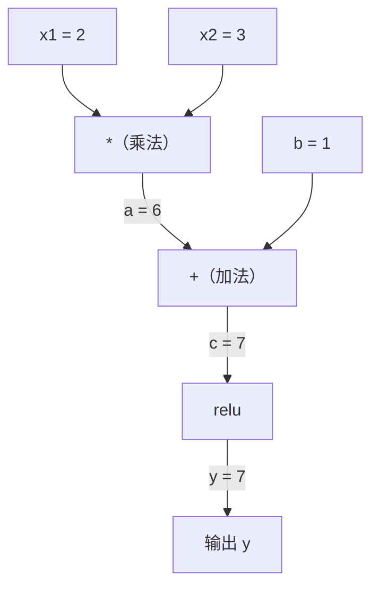
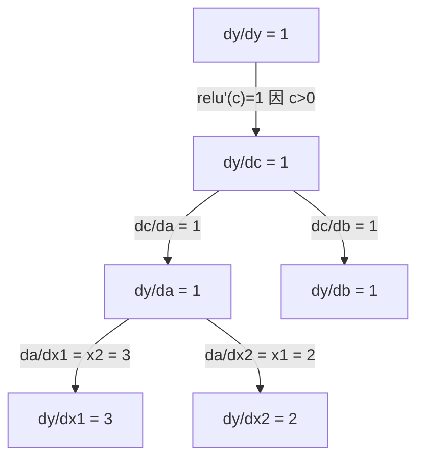

# 链式法则与自动微分

> 链式法则是所有可学习神经网络背后的“发动机”。

**类型：** Build  
**语言：** Python  
**先修：** 第1阶段第04课（导数与梯度）  
**用时：** ~90 分钟

## 学习目标

- 构建一个极简 autograd 引擎（Value 类），记录运算并通过反向自动微分计算梯度
- 用拓扑排序实现计算图的前向传播与反向传播
- 只用从零实现的 autograd 引擎在 XOR 数据上构建并训练多层感知机
- 用梯度检查将自动微分结果与数值有限差分结果对比验证正确性

## 问题

你能算简单函数的导数，但神经网络并不是一个简单函数。它是上百个函数的组合：矩阵乘、加偏置、激活、再一次矩阵乘、softmax、交叉熵损失。输出本质上是“函数套函数”。

训练网络时，需要每个参数的损失梯度。对于数百万参数，手算几乎不可能；数值法（有限差分）又太慢。

链式法则给你数学公式，自动微分给你算法。它们让你能在与一次前向传播同阶的时间内，通过任意函数复合计算精确梯度。

PyTorch、TensorFlow、JAX 正是这样工作的。你将从零做一个微型版本。

## 核心概念

### 链式法则

若 `y = f(g(x))`，则

```
dy/dx = dy/dg * dg/dx = f'(g(x)) * g'(x)
```

把链条上的导数逐项相乘，每一段贡献其局部导数。

示例：`y = sin(x^2)`

```
g(x) = x^2       g'(x) = 2x
f(g) = sin(g)     f'(g) = cos(g)

dy/dx = cos(x^2) * 2x
```

更深层组合时，链式法则可以继续展开：

```
y = f(g(h(x)))

dy/dx = f'(g(h(x))) * g'(h(x)) * h'(x)
```

神经网络里的每一层都是这条链上的一个环节。

### 计算图

计算图把链式法则可视化。每个操作是一个结点。数据向前流动，梯度向后流动。

**前向传播（计算数值）：**



**反向传播（计算梯度）：**



反向传播在每个结点上应用链式法则，把梯度从输出端传播到输入端。

### Forward Mode 与 Reverse Mode

图上的链式法则有两种应用方式。

**Forward mode** 从输入开始把导数向前推。它先算 `dx/dx = 1`，再穿过每个操作。输入少、输出多时更合适。

```
Forward mode: seed dx/dx = 1, 向前传播

  x = 2       (dx/dx = 1)
  a = x^2     (da/dx = 2x = 4)
  y = sin(a)  (dy/dx = cos(a) * da/dx = cos(4) * 4 = -2.615)
```

**Reverse mode** 从输出开始把梯度向后拉。它先算 `dy/dy = 1`，再反向通过每个操作传播。输入多、输出少时更合适。

```
Reverse mode: seed dy/dy = 1, 反向传播

  y = sin(a)  (dy/dy = 1)
  a = x^2     (dy/da = cos(a) = cos(4) = -0.654)
  x = 2       (dy/dx = dy/da * da/dx = -0.654 * 4 = -2.615)
```

神经网络有大量输入（权重）和一个输出（损失），reverse mode 可以一次反向把所有梯度算完，所以反向传播使用 reverse mode。

| 模式 | Seed | 方向 | 适合场景 |
|------|------|------|---------|
| Forward | `dx_i/dx_i = 1` | 输入 -> 输出 | 输入少，输出多 |
| Reverse | `dy/dy = 1` | 输出 -> 输入 | 输入多，输出少（神经网络） |

### 双数（Dual Number）与 Forward Mode

Forward mode 可以用对偶数很优雅地实现。对偶数形式为 `a + b*epsilon`，其中 `epsilon^2 = 0`。

```
对偶数：(值, 导数)

(2, 1) 表示：值为 2，关于 x 的导数为 1

运算规则：
  (a, a') + (b, b') = (a+b, a'+b')
  (a, a') * (b, b') = (a*b, a'*b + a*b')
  sin(a, a')         = (sin(a), cos(a)*a')
```

将输入变量以导数 1 初始化，导数会在每个操作中自动传播。

### 构建 Autograd 引擎

一个 autograd 引擎至少需要三件事：

1. **值封装。** 每个数值都用对象存储它的数值和梯度。
2. **图记录。** 每个操作记录输入和局部梯度函数。
3. **反向传播。** 拓扑排序图结构，再反向遍历，在每个结点应用链式法则。

这正是 PyTorch `autograd` 在做的事：`torch.Tensor` 在 `requires_grad=True` 时封装值、记录操作，`backward()` 时计算梯度。

### PyTorch Autograd 内部机制

你写一段 PyTorch 代码时：

```python
x = torch.tensor(2.0, requires_grad=True)
y = x ** 2 + 3 * x + 1
y.backward()
print(x.grad)  # 7.0 = 2*x + 3 = 2*2 + 3
```

PyTorch 内部发生的事情：

1. 为 `x` 创建一个 `Tensor` 结点，`requires_grad=True`
2. 每次操作（`**`、`*`、`+`）都会创建新结点并记录反向函数
3. `y.backward()` 触发 recorded graph 的 reverse-mode 自动微分
4. 每个结点的 `grad_fn` 计算局部梯度并向父结点传递
5. 梯度在 `.grad` 中通过“加法”累加（不是覆盖）

该图是动态的（define-by-run）。每次前向传播都会重建新图，所以 PyTorch 可以在模型里支持控制流（if/else、循环）。

```figure
chain-rule
```

## 动手实现

### 步骤 1：Value 类

```python
class Value:
    def __init__(self, data, children=(), op=''):
        self.data = data
        self.grad = 0.0
        self._backward = lambda: None
        self._prev = set(children)
        self._op = op

    def __repr__(self):
        return f"Value(data={self.data:.4f}, grad={self.grad:.4f})"
```

每个 `Value` 保存数值、梯度（初始 0）、一个 backward 回调，以及产生该值的子结点。

### 步骤 2：带梯度追踪的算术运算

```python
    def __add__(self, other):
        other = other if isinstance(other, Value) else Value(other)
        out = Value(self.data + other.data, (self, other), '+')
        def _backward():
            self.grad += out.grad
            other.grad += out.grad
        out._backward = _backward
        return out

    def __mul__(self, other):
        other = other if isinstance(other, Value) else Value(other)
        out = Value(self.data * other.data, (self, other), '*')
        def _backward():
            self.grad += other.data * out.grad
            other.grad += self.data * out.grad
        out._backward = _backward
        return out

    def relu(self):
        out = Value(max(0, self.data), (self,), 'relu')
        def _backward():
            self.grad += (1.0 if out.data > 0 else 0.0) * out.grad
        out._backward = _backward
        return out
```

每个操作创建一个闭包，知道如何计算局部梯度并乘以上游梯度（`out.grad`）。`+=` 处理一个值被多个操作共享使用的情况。

### 步骤 3：反向传播

```python
    def backward(self):
        topo = []
        visited = set()
        def build_topo(v):
            if v not in visited:
                visited.add(v)
                for child in v._prev:
                    build_topo(child)
                topo.append(v)
        build_topo(self)

        self.grad = 1.0
        for v in reversed(topo):
            v._backward()
```

拓扑排序保证每个结点在把梯度传给子结点前已完整收集了所需梯度。起始梯度固定为 1.0（`dy/dy = 1`）。

### 步骤 4：更完整的引擎操作

基础 Value 类只支持加法、乘法和 ReLU。完整的 autograd 引擎还需要更多操作。下面是搭神经网络常见的补充：

```python
    def __neg__(self):
        return self * -1

    def __sub__(self, other):
        return self + (-other)

    def __radd__(self, other):
        return self + other

    def __rmul__(self, other):
        return self * other

    def __rsub__(self, other):
        return other + (-self)

    def __pow__(self, n):
        out = Value(self.data ** n, (self,), f'**{n}')
        def _backward():
            self.grad += n * (self.data ** (n - 1)) * out.grad
        out._backward = _backward
        return out

    def __truediv__(self, other):
        return self * (other ** -1) if isinstance(other, Value) else self * (Value(other) ** -1)

    def exp(self):
        import math
        e = math.exp(self.data)
        out = Value(e, (self,), 'exp')
        def _backward():
            self.grad += e * out.grad
        out._backward = _backward
        return out

    def log(self):
        import math
        out = Value(math.log(self.data), (self,), 'log')
        def _backward():
            self.grad += (1.0 / self.data) * out.grad
        out._backward = _backward
        return out

    def tanh(self):
        import math
        t = math.tanh(self.data)
        out = Value(t, (self,), 'tanh')
        def _backward():
            self.grad += (1 - t ** 2) * out.grad
        out._backward = _backward
        return out
```

**每个操作为何重要：**

| 操作 | 反向公式 | 常见用途 |
|------|----------|----------|
| `__sub__` | 复用加法+取负 | 损失计算（pred - target） |
| `__pow__` | n * x^(n-1) | 多项式激活、MSE（误差平方） |
| `__truediv__` | 复用乘法 + pow(-1) | 归一化、学习率缩放 |
| `exp` | exp(x) * 上游梯度 | Softmax、对数似然 |
| `log` | (1/x) * 上游梯度 | 交叉熵损失、对数概率 |
| `tanh` | (1 - tanh^2) * 上游梯度 | 经典激活函数 |

巧妙之处在于：`__sub__` 和 `__truediv__` 是基于已有操作定义的，因此能通过底层加法/乘法/pow 的链式法则自然得到正确梯度。

### 步骤 5：从零构建 MLP

有了完整的 Value 类后，你就可以造神经网络，不用 PyTorch，不用 NumPy，只有 Value 和链式法则。

```python
import random

class Neuron:
    def __init__(self, n_inputs):
        self.w = [Value(random.uniform(-1, 1)) for _ in range(n_inputs)]
        self.b = Value(0.0)

    def __call__(self, x):
        act = sum((wi * xi for wi, xi in zip(self.w, x)), self.b)
        return act.tanh()

    def parameters(self):
        return self.w + [self.b]

class Layer:
    def __init__(self, n_inputs, n_outputs):
        self.neurons = [Neuron(n_inputs) for _ in range(n_outputs)]

    def __call__(self, x):
        return [n(x) for n in self.neurons]

    def parameters(self):
        return [p for n in self.neurons for p in n.parameters()]

class MLP:
    def __init__(self, sizes):
        self.layers = [Layer(sizes[i], sizes[i+1]) for i in range(len(sizes)-1)]

    def __call__(self, x):
        for layer in self.layers:
            x = layer(x)
        return x[0] if len(x) == 1 else x

    def parameters(self):
        return [p for layer in self.layers for p in layer.parameters()]
```

一个 `Neuron` 计算 `tanh(w1*x1 + w2*x2 + ... + b)`，`Layer` 是若干神经元的列表，`MLP` 叠多个层。每个参数都是 `Value`，所以 `loss.backward()` 会把梯度传播到每个参数。

**在 XOR 上训练：**

```python
random.seed(42)
model = MLP([2, 4, 1])  # 2 输入，4 隐藏单元，1 输出

xs = [[0, 0], [0, 1], [1, 0], [1, 1]]
ys = [-1, 1, 1, -1]  # XOR 模式（tanh 下用 -1/1）

for step in range(100):
    preds = [model(x) for x in xs]
    loss = sum((p - y) ** 2 for p, y in zip(preds, ys))

    for p in model.parameters():
        p.grad = 0.0
    loss.backward()

    lr = 0.05
    for p in model.parameters():
        p.data -= lr * p.grad

    if step % 20 == 0:
        print(f"step {step:3d}  loss = {loss.data:.4f}")

print("\nPredictions after training:")
for x, y in zip(xs, ys):
    print(f"  input={x}  target={y:2d}  pred={model(x).data:6.3f}")
```

这就是 micrograd：纯 Python 下用自动微分完成完整训练循环。商业深度学习框架在大规模下做的是同一件事。

### 步骤 6：梯度检查

如何确认你的 autodiff 正确？把它和数值导数对比，这就是梯度检查。

```python
def gradient_check(build_expr, x_val, h=1e-7):
    x = Value(x_val)
    y = build_expr(x)
    y.backward()
    autodiff_grad = x.grad

    y_plus = build_expr(Value(x_val + h)).data
    y_minus = build_expr(Value(x_val - h)).data
    numerical_grad = (y_plus - y_minus) / (2 * h)

    diff = abs(autodiff_grad - numerical_grad)
    return autodiff_grad, numerical_grad, diff
```

在复杂表达式上测试：

```python
def expr(x):
    return (x ** 3 + x * 2 + 1).tanh()

ad, num, diff = gradient_check(expr, 0.5)
print(f"Autodiff:  {ad:.8f}")
print(f"Numerical: {num:.8f}")
print(f"Difference: {diff:.2e}")
# 差值应小于 1e-5
```

实现新算子时一定要做梯度检查。若 backward 有 bug，数值检验能抓出来。认真做过的深度学习实现都在开发期做过这种检查。

**何时做梯度检查：**

| 场景 | 是否做梯度检查 |
|------|----------------|
| 给 autograd 增加新操作 | 是，必须 |
| 训练循环无法收敛故障排查 | 是，先检查梯度 |
| 线上训练 | 否，太慢（每参数需要两次前向） |
| autograd 单元测试 | 是，建议自动化 |

### 步骤 7：与手算对比验证

```python
x1 = Value(2.0)
x2 = Value(3.0)
a = x1 * x2          # a = 6.0
b = a + Value(1.0)    # b = 7.0
y = b.relu()          # y = 7.0

y.backward()

print(f"y = {y.data}")          # 7.0
print(f"dy/dx1 = {x1.grad}")   # 3.0 (= x2)
print(f"dy/dx2 = {x2.grad}")   # 2.0 (= x1)
```

手工验证：`y = relu(x1*x2 + 1)`，因为 `x1*x2 + 1 = 7 > 0`，所以 ReLU 等于恒等。
`dy/dx1 = x2 = 3`，`dy/dx2 = x1 = 2`，引擎结论一致。

## 实践使用

### 与 PyTorch 对照

```python
import torch

x1 = torch.tensor(2.0, requires_grad=True)
x2 = torch.tensor(3.0, requires_grad=True)
a = x1 * x2
b = a + 1.0
y = torch.relu(b)
y.backward()

print(f"PyTorch dy/dx1 = {x1.grad.item()}")  # 3.0
print(f"PyTorch dy/dx2 = {x2.grad.item()}")  # 2.0
```

梯度一致。你的引擎能和 PyTorch 得到同样结果，因为本质数学是一样的：通过链式法则做 reverse-mode 自动微分。

### 再看复杂表达式

```python
a = Value(2.0)
b = Value(-3.0)
c = Value(10.0)
f = (a * b + c).relu()  # relu(2*(-3) + 10) = relu(4) = 4

f.backward()
print(f"df/da = {a.grad}")  # -3.0 (= b)
print(f"df/db = {b.grad}")  #  2.0 (= a)
print(f"df/dc = {c.grad}")  #  1.0
```

## 交付内容

本课会产出：
- `outputs/skill-autodiff.md`：用于构建与调试 autograd 系统的技能说明
- `code/autodiff.py`：你可以继续扩展的极简 autograd 引擎

本节构建的 Value 类是第3阶段神经网络训练循环的基础。

## 练习

1. 为 Value 类补上 `__pow__`，实现 `x ** n`；并验证 `x=2` 时 `d/dx(x^3)=12.0`。

2. 增加 `tanh` 激活函数。验证 `tanh'(0) = 1`，`tanh'(2) = 0.0707`（近似）。

3. 为单神经元构建计算图：`y = relu(w1*x1 + w2*x2 + b)`。计算五个梯度并与 PyTorch 对照验证。

4. 用对偶数实现 forward-mode 自动微分。创建 `Dual` 类，并验证它和你当前的 reverse-mode 引擎得到相同导数。

## 关键术语

| 术语 | 常见说法 | 实际含义 |
|------|----------|---------|
| 链式法则 | “导数相乘” | 复合函数求导时，导数等于每一层局部导数在对应点的乘积 |
| 计算图 | “网络图” | 一个有向无环图，结点是操作，边承载前向数值或反向梯度 |
| Forward mode | “把导数向前推” | 从输入到输出传播导数；每个输入变量需要一次前向扫描 |
| Reverse mode | “反向传播” | 从输出到输入传播梯度；每个输出变量一次反向扫描 |
| Autograd | “自动梯度” | 记录值的操作并构建图，再通过链式法则精确计算梯度 |
| 对偶数 | “值+导数” | 形如 `a + b*epsilon`（`epsilon^2 = 0`）的数，能在算术运算中携带导数 |
| 拓扑排序 | “依赖顺序” | 按依赖关系排序图结点，确保反向传播时父结点在子结点之后 |
| 梯度累加 | “相加，不是覆盖” | 一个值被多个操作使用时，梯度是所有入梯度贡献之和 |
| 动态计算图 | “运行时定义” | 每次前向都重建计算图，允许模型里写 Python 控制流（PyTorch 风格） |
| 梯度检查 | “数值校验” | 把 autodiff 的梯度和有限差分梯度对比，验证实现正确性 |
| MLP | “多层感知机” | 包含一个或多个隐藏层的神经网络；每个神经元做加权和后激活 |
| 神经元 | “加权和+激活” | 基础单元：`output = activation(w1*x1 + w2*x2 + ... + b)`，权重和偏置可学习 |

## 拓展阅读

- [3Blue1Brown: Backpropagation calculus](https://www.youtube.com/watch?v=tIeHLnjs5U8) - 视觉化理解神经网络中的链式法则
- [PyTorch Autograd mechanics](https://pytorch.org/docs/stable/notes/autograd.html) - 深入理解真实系统的工作方式
- [Baydin et al., Automatic Differentiation in Machine Learning: a Survey](https://arxiv.org/abs/1502.05767) - 综述参考
