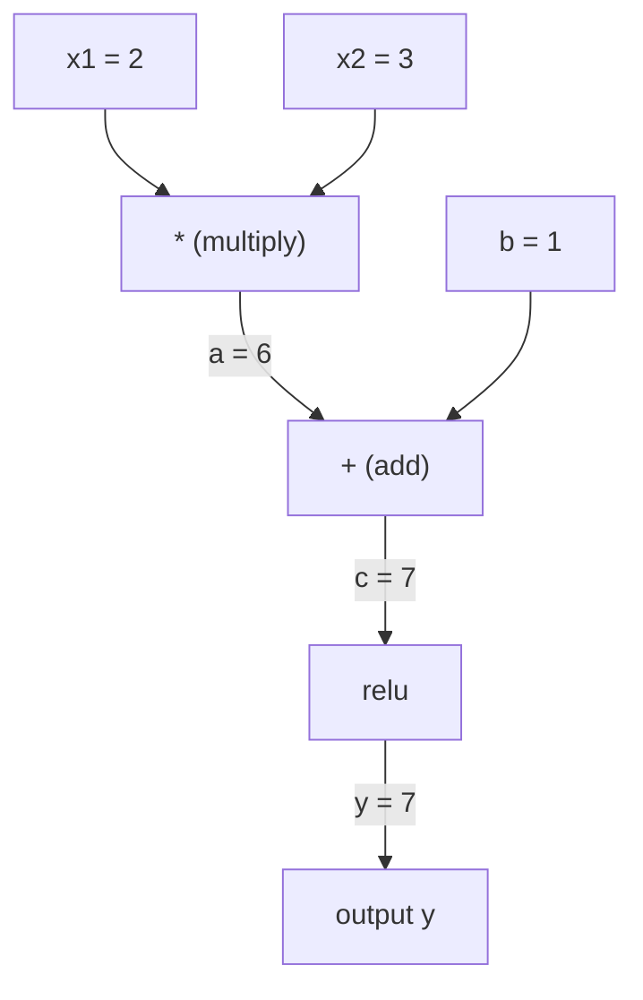
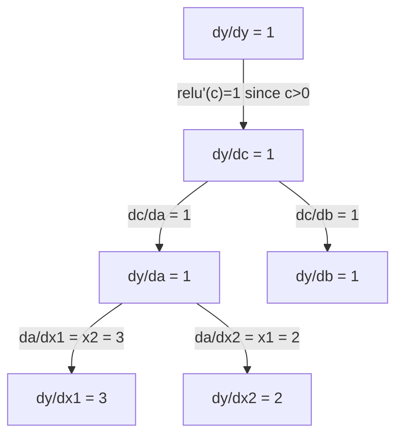

# 链式法则与自动微分

> 链式法则是所有能学习的神经网络背后的引擎。

**类型:** 构建
**语言:** Python
**先修:** 第 1 阶段，第 04 课（导数与梯度）
**时长:** ~90 分钟

## 学习目标

- 构建一个最小化的自动微分引擎（`Value` 类），记录运算并通过反向模式自动微分计算梯度
- 使用拓扑排序实现计算图的前向与反向传播
- 只用从零实现的自动微分引擎搭建并训练一个用于 XOR 的多层感知机
- 通过与数值有限差分比较，验证自动微分的正确性

## 问题是什么

你能求出简单函数的导数。但神经网络不是简单函数。它是成百上千个函数的复合：矩阵乘法、加偏置、应用激活函数、再次矩阵乘法、softmax、交叉熵损失。输出是函数的函数的函数。

要训练网络，你需要损失函数对每一个权重的梯度。手工推导对数百万个参数来说根本不现实。用数值方法（有限差分）又太慢。

链式法则提供数学基础，自动微分提供算法实现。二者结合后，你就能在与一次前向传播同量级的时间里，计算任意函数复合上的精确梯度。

这就是 PyTorch、TensorFlow 和 JAX 的工作方式。你会从零构建一个迷你版本。

## 核心概念

### 链式法则

如果 `y = f(g(x))`，那么 `y` 对 `x` 的导数是：

```
dy/dx = dy/dg * dg/dx = f'(g(x)) * g'(x)
```

沿着这条链把各段导数相乘。每一环都贡献自己的局部导数。

例子：`y = sin(x^2)`

```
g(x) = x^2       g'(x) = 2x
f(g) = sin(g)     f'(g) = cos(g)

dy/dx = cos(x^2) * 2x
```

对于更深的复合，链条会继续延伸：

```
y = f(g(h(x)))

dy/dx = f'(g(h(x))) * g'(h(x)) * h'(x)
```

神经网络中的每一层，都是这条链上的一环。

### 计算图

计算图让链式法则变得可视化。每个运算都是一个节点，数据沿图向前流动，梯度沿图向后流动。

**前向传播（计算数值）：**



**反向传播（计算梯度）：**



反向传播在每个节点应用链式法则，把梯度从输出传回输入。

### 前向模式与反向模式

沿着计算图应用链式法则有两种方式。

**前向模式**从输入开始，把导数向前传播。它先计算 `dx/dx = 1`，再沿每个运算继续传播。适合输入少、输出多的场景。

```
Forward mode: seed dx/dx = 1, propagate forward

  x = 2       (dx/dx = 1)
  a = x^2     (da/dx = 2x = 4)
  y = sin(a)  (dy/dx = cos(a) * da/dx = cos(4) * 4 = -2.615)
```

**反向模式**从输出开始，把梯度向后回传。它先计算 `dy/dy = 1`，再沿每个运算逆向传播。适合输入多、输出少的场景。

```
Reverse mode: seed dy/dy = 1, propagate backward

  y = sin(a)  (dy/dy = 1)
  a = x^2     (dy/da = cos(a) = cos(4) = -0.654)
  x = 2       (dy/dx = dy/da * da/dx = -0.654 * 4 = -2.615)
```

神经网络有数百万个输入（权重）和一个输出（损失）。反向模式只需一次反向传播就能计算所有梯度。这就是反向传播使用反向模式的原因。

| Mode | Seed | Direction | Best when |
|------|------|-----------|-----------|
| Forward | `dx_i/dx_i = 1` | Input to output | Few inputs, many outputs |
| Reverse | `dy/dy = 1` | Output to input | Many inputs, few outputs (neural nets) |

### 用对偶数实现前向模式

前向模式能用双数优雅地实现。双数的形式是 `a + b*epsilon`，其中 `epsilon^2 = 0`。

```
Dual number: (value, derivative)

(2, 1) means: value is 2, derivative w.r.t. x is 1

Arithmetic rules:
  (a, a') + (b, b') = (a+b, a'+b')
  (a, a') * (b, b') = (a*b, a'*b + a*b')
  sin(a, a')         = (sin(a), cos(a)*a')
```

给输入变量的导数种子设为 1，导数就会在每个运算中自动传播。

### 构建自动微分引擎

一个自动微分引擎需要三样东西：

1. **值包装。** 把每个数字包进对象里，保存数值和梯度。
2. **图记录。** 每个运算记录它的输入和局部梯度函数。
3. **反向传播。** 对计算图做拓扑排序，然后按逆序遍历，在每个节点应用链式法则。

这正是 PyTorch 的 `autograd` 所做的事。`torch.Tensor` 类会包装数值，在 `requires_grad=True` 时记录运算，并在调用 `.backward()` 时计算梯度。

### PyTorch 的自动微分是如何工作的

当你写出这样的 PyTorch 代码时：

```python
x = torch.tensor(2.0, requires_grad=True)
y = x ** 2 + 3 * x + 1
y.backward()
print(x.grad)  # 7.0 = 2*x + 3 = 2*2 + 3
```

PyTorch 内部会：

1. 为 `x` 创建一个 `requires_grad=True` 的 `Tensor` 节点
2. 每个运算（`**`、`*`、`+`）都会创建新节点并记录反向函数
3. `y.backward()` 触发记录图上的反向模式自动微分
4. 每个节点的 `grad_fn` 计算局部梯度并传给父节点
5. 梯度通过加法累积到 `.grad` 属性里，而不是直接覆盖

这个图是动态的（define-by-run）。每次前向传播都会重新构建一张新图。这也是 PyTorch 能在模型里支持条件分支（if/else、循环）的原因。

```figure
chain-rule
```

## 动手实现

### 第 1 步：`Value` 类

```python
class Value:
    def __init__(self, data, children=(), op=''):
        self.data = data
        self.grad = 0.0
        self._backward = lambda: None
        self._prev = set(children)
        self._op = op

    def __repr__(self):
        return f"Value(data={self.data:.4f}, grad={self.grad:.4f})"
```

每个 `Value` 都保存数值、梯度（初始为零）、反向函数，以及产生它的子节点指针。

### 第 2 步：支持梯度追踪的算术运算

```python
    def __add__(self, other):
        other = other if isinstance(other, Value) else Value(other)
        out = Value(self.data + other.data, (self, other), '+')
        def _backward():
            self.grad += out.grad
            other.grad += out.grad
        out._backward = _backward
        return out

    def __mul__(self, other):
        other = other if isinstance(other, Value) else Value(other)
        out = Value(self.data * other.data, (self, other), '*')
        def _backward():
            self.grad += other.data * out.grad
            other.grad += self.data * out.grad
        out._backward = _backward
        return out

    def relu(self):
        out = Value(max(0, self.data), (self,), 'relu')
        def _backward():
            self.grad += (1.0 if out.data > 0 else 0.0) * out.grad
        out._backward = _backward
        return out
```

每个运算都会创建一个闭包，它知道如何计算局部梯度，并乘以上游梯度（`out.grad`）。`+=` 处理的是一个值被多个运算使用的情况。

### 第 3 步：反向传播

```python
    def backward(self):
        topo = []
        visited = set()
        def build_topo(v):
            if v not in visited:
                visited.add(v)
                for child in v._prev:
                    build_topo(child)
                topo.append(v)
        build_topo(self)

        self.grad = 1.0
        for v in reversed(topo):
            v._backward()
```

拓扑排序确保每个节点在把梯度传给子节点前，自己的梯度已经完全计算完毕。种子梯度是 1.0（`dy/dy = 1`）。

### 第 4 步：补全引擎所需的更多运算

基础的 `Value` 类能处理加法、乘法和 relu。真正的自动微分引擎需要更多运算。下面这些操作是构建神经网络时必须的：

```python
    def __neg__(self):
        return self * -1

    def __sub__(self, other):
        return self + (-other)

    def __radd__(self, other):
        return self + other

    def __rmul__(self, other):
        return self * other

    def __rsub__(self, other):
        return other + (-self)

    def __pow__(self, n):
        out = Value(self.data ** n, (self,), f'**{n}')
        def _backward():
            self.grad += n * (self.data ** (n - 1)) * out.grad
        out._backward = _backward
        return out

    def __truediv__(self, other):
        return self * (other ** -1) if isinstance(other, Value) else self * (Value(other) ** -1)

    def exp(self):
        import math
        e = math.exp(self.data)
        out = Value(e, (self,), 'exp')
        def _backward():
            self.grad += e * out.grad
        out._backward = _backward
        return out

    def log(self):
        import math
        out = Value(math.log(self.data), (self,), 'log')
        def _backward():
            self.grad += (1.0 / self.data) * out.grad
        out._backward = _backward
        return out

    def tanh(self):
        import math
        t = math.tanh(self.data)
        out = Value(t, (self,), 'tanh')
        def _backward():
            self.grad += (1 - t ** 2) * out.grad
        out._backward = _backward
        return out
```

**为什么每个操作都重要：**

| Operation | Backward rule | Used in |
|-----------|--------------|---------|
| `__sub__` | Reuses add + neg | Loss computation (pred - target) |
| `__pow__` | n * x^(n-1) | Polynomial activations, MSE (error^2) |
| `__truediv__` | Reuses mul + pow(-1) | Normalization, learning rate scaling |
| `exp` | exp(x) * upstream | Softmax, log-likelihood |
| `log` | (1/x) * upstream | Cross-entropy loss, log probabilities |
| `tanh` | (1 - tanh^2) * upstream | Classic activation function |

巧妙之处在于：`__sub__` 和 `__truediv__` 都是基于已有操作定义的。由于链式法则会沿着底层加法/乘法/幂运算自动组合，所以它们天然就有正确梯度。

### 第 5 步：从零实现迷你 MLP

有了完整的 `Value` 类，你就能搭建神经网络了。不用 PyTorch，不用 NumPy。只靠 `Value` 和链式法则。

```python
import random

class Neuron:
    def __init__(self, n_inputs):
        self.w = [Value(random.uniform(-1, 1)) for _ in range(n_inputs)]
        self.b = Value(0.0)

    def __call__(self, x):
        act = sum((wi * xi for wi, xi in zip(self.w, x)), self.b)
        return act.tanh()

    def parameters(self):
        return self.w + [self.b]

class Layer:
    def __init__(self, n_inputs, n_outputs):
        self.neurons = [Neuron(n_inputs) for _ in range(n_outputs)]

    def __call__(self, x):
        return [n(x) for n in self.neurons]

    def parameters(self):
        return [p for n in self.neurons for p in n.parameters()]

class MLP:
    def __init__(self, sizes):
        self.layers = [Layer(sizes[i], sizes[i+1]) for i in range(len(sizes)-1)]

    def __call__(self, x):
        for layer in self.layers:
            x = layer(x)
        return x[0] if len(x) == 1 else x

    def parameters(self):
        return [p for layer in self.layers for p in layer.parameters()]
```

`Neuron` 计算 `tanh(w1*x1 + w2*x2 + ... + b)`。`Layer` 是神经元列表。`MLP` 把多层串起来。每个权重都是 `Value`，所以调用 `loss.backward()` 会把梯度传到每一个参数。

**在 XOR 上训练：**

```python
random.seed(42)
model = MLP([2, 4, 1])  # 2 inputs, 4 hidden neurons, 1 output

xs = [[0, 0], [0, 1], [1, 0], [1, 1]]
ys = [-1, 1, 1, -1]  # XOR pattern (using -1/1 for tanh)

for step in range(100):
    preds = [model(x) for x in xs]
    loss = sum((p - y) ** 2 for p, y in zip(preds, ys))

    for p in model.parameters():
        p.grad = 0.0
    loss.backward()

    lr = 0.05
    for p in model.parameters():
        p.data -= lr * p.grad

    if step % 20 == 0:
        print(f"step {step:3d}  loss = {loss.data:.4f}")

print("\nPredictions after training:")
for x, y in zip(xs, ys):
    print(f"  input={x}  target={y:2d}  pred={model(x).data:6.3f}")
```

这就是 micrograd。一个完整的、纯 Python 的神经网络训练循环，带自动微分。所有商用深度学习框架本质上做的也是同一件事，只是规模大得多。

### 第 6 步：梯度检查

怎么确认你的自动微分是对的？拿它和数值导数对比。这叫梯度检查。

```python
def gradient_check(build_expr, x_val, h=1e-7):
    x = Value(x_val)
    y = build_expr(x)
    y.backward()
    autodiff_grad = x.grad

    y_plus = build_expr(Value(x_val + h)).data
    y_minus = build_expr(Value(x_val - h)).data
    numerical_grad = (y_plus - y_minus) / (2 * h)

    diff = abs(autodiff_grad - numerical_grad)
    return autodiff_grad, numerical_grad, diff
```

拿一个复杂表达式来测试：

```python
def expr(x):
    return (x ** 3 + x * 2 + 1).tanh()

ad, num, diff = gradient_check(expr, 0.5)
print(f"Autodiff:  {ad:.8f}")
print(f"Numerical: {num:.8f}")
print(f"Difference: {diff:.2e}")
# Difference should be < 1e-5
```

在实现新操作时，梯度检查至关重要。如果你的 backward 有 bug，数值检查会把它抓出来。每一个严肃的深度学习实现都会在开发阶段运行梯度检查。

**什么时候使用梯度检查：**

| Situation | Do gradient check? |
|-----------|-------------------|
| Adding a new operation to your autograd | Yes, always |
| Debugging a training loop that won't converge | Yes, check gradients first |
| Production training | No, too slow (2x forward passes per parameter) |
| Unit tests for autograd code | Yes, automate it |

### 第 7 步：与手工计算对照验证

```python
x1 = Value(2.0)
x2 = Value(3.0)
a = x1 * x2          # a = 6.0
b = a + Value(1.0)    # b = 7.0
y = b.relu()          # y = 7.0

y.backward()

print(f"y = {y.data}")          # 7.0
print(f"dy/dx1 = {x1.grad}")   # 3.0 (= x2)
print(f"dy/dx2 = {x2.grad}")   # 2.0 (= x1)
```

手算检查：`y = relu(x1*x2 + 1)`。由于 `x1*x2 + 1 = 7 > 0`，relu 等同于恒等函数。
`dy/dx1 = x2 = 3`。`dy/dx2 = x1 = 2`。这个引擎是对的。

## 用起来

### 与 PyTorch 对照验证

```python
import torch

x1 = torch.tensor(2.0, requires_grad=True)
x2 = torch.tensor(3.0, requires_grad=True)
a = x1 * x2
b = a + 1.0
y = torch.relu(b)
y.backward()

print(f"PyTorch dy/dx1 = {x1.grad.item()}")  # 3.0
print(f"PyTorch dy/dx2 = {x2.grad.item()}")  # 2.0
```

梯度完全一致。你的引擎会得到和 PyTorch 一样的结果，因为数学本身就是一样的：通过链式法则做反向模式自动微分。

### 更复杂的表达式

```python
a = Value(2.0)
b = Value(-3.0)
c = Value(10.0)
f = (a * b + c).relu()  # relu(2*(-3) + 10) = relu(4) = 4

f.backward()
print(f"df/da = {a.grad}")  # -3.0 (= b)
print(f"df/db = {b.grad}")  #  2.0 (= a)
print(f"df/dc = {c.grad}")  #  1.0
```

## 上线交付

这一课会产出：
- `outputs/skill-autodiff.md` -- 一个用于构建和调试自动微分系统的 skill
- `code/autodiff.py` -- 一个可以继续扩展的最小自动微分引擎

这里实现的 `Value` 类，是 Phase 3 中神经网络训练循环的基础。

## 练习

1. 给 `Value` 类增加 `__pow__`，这样就能计算 `x ** n`。验证在 `x=2` 时，`d/dx(x^3)` 等于 `12.0`。

2. 增加 `tanh` 作为激活函数。验证 `tanh'(0) = 1`，以及 `tanh'(2) = 0.0707`（近似）。

3. 为单个神经元构建计算图：`y = relu(w1*x1 + w2*x2 + b)`。计算全部五个梯度，并与 PyTorch 验证一致。

4. 使用双数实现前向模式自动微分。创建一个 `Dual` 类，并验证它给出的导数与反向模式引擎一致。

## 关键术语

| Term | What people say | What it actually means |
|------|----------------|----------------------|
| Chain rule | "Multiply the derivatives" | The derivative of composed functions equals the product of each function's local derivative, evaluated at the right point |
| Computational graph | "The network diagram" | A directed acyclic graph where nodes are operations and edges carry values (forward) or gradients (backward) |
| Forward mode | "Push derivatives forward" | Autodiff that propagates derivatives from inputs to outputs. One pass per input variable. |
| Reverse mode | "Backpropagation" | Autodiff that propagates gradients from outputs to inputs. One pass per output variable. |
| Autograd | "Automatic gradients" | A system that records operations on values, builds a graph, and computes exact gradients via the chain rule |
| Dual numbers | "Value plus derivative" | Numbers of the form a + b*epsilon (epsilon^2 = 0) that carry derivative information through arithmetic |
| Topological sort | "Dependency order" | Ordering graph nodes so every node comes after all its dependencies. Required for correct gradient propagation. |
| Gradient accumulation | "Add, don't replace" | When a value feeds into multiple operations, its gradient is the sum of all incoming gradient contributions |
| Dynamic graph | "Define by run" | A computation graph rebuilt on every forward pass, allowing Python control flow inside models (PyTorch style) |
| Gradient checking | "Numerical verification" | Comparing autodiff gradients against numerical finite-difference gradients to verify correctness. Essential for debugging. |
| MLP | "Multi-layer perceptron" | A neural network with one or more hidden layers of neurons. Each neuron computes a weighted sum plus bias, then applies an activation function. |
| Neuron | "Weighted sum + activation" | The basic unit: output = activation(w1*x1 + w2*x2 + ... + b). The weights and bias are learnable parameters. |

## 延伸阅读

- [3Blue1Brown: Backpropagation calculus](https://www.youtube.com/watch?v=tIeHLnjs5U8) -- visual explanation of the chain rule in neural networks
- [PyTorch Autograd mechanics](https://pytorch.org/docs/stable/notes/autograd.html) -- how the real system works
- [Baydin et al., Automatic Differentiation in Machine Learning: a Survey](https://arxiv.org/abs/1502.05767) -- comprehensive reference
