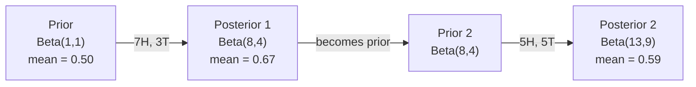

# 贝叶斯定理

> 概率是在描述“你预期会怎样”，贝叶斯定理是在描述“你学到了什么”。

**类型：** 构建  
**语言：** Python  
**先修：** 第1阶段第06课（概率基础）  
**用时：** ~75 分钟

## 学习目标

- 用先验、似然和证据计算后验概率
- 从零实现带拉普拉斯平滑和对数空间计算的朴素贝叶斯文本分类器
- 对比 MLE 与 MAP，并说明 MAP 与 L2 正则化的对应关系
- 使用 Beta-Binomial 共轭先验实现贝叶斯 A/B 测试的顺序更新

## 问题

一份医疗测试准确率为 99%。你测出阳性，你真的有病的概率是多少？

很多人会直接说 99%。真实答案取决于疾病的基率。如果 1 万人里只有 1 人患病，阳性结果实际患病概率只有约 1%。其余约 99% 的阳性是健康人里的误报。

这不是文字游戏，这是贝叶斯定理。每一个垃圾邮件过滤器、每一个医疗诊断、每个量化不确定性的机器学习模型，都会用到这套推理：先有一个先验，看到证据后更新。

如果你不理解这一点，容易误读模型输出、设置错阈值，并发布过于自信的预测。

## 核心概念

### 从联合概率到贝叶斯公式

你在第06课里已经知道条件概率是：

```
P(A|B) = P(A and B) / P(B)
```

对称地有：

```
P(B|A) = P(A and B) / P(A)
```

这两个式子分子都一样：`code/bayes.py`。两边相等并重排得：

```
P(A and B) = P(A|B) * P(B) = P(B|A) * P(A)

Therefore:

P(A|B) = P(B|A) * P(A) / P(B)
```

这就是贝叶斯公式。四个量，一个方程。

### 四个部分

| 成分 | 名称 | 含义 |
|------|------|------|
| P(A\|B) | 后验 | 看到证据 B 后，关于 A 的更新信念 |
| P(B\|A) | 似然 | 在 A 为真时，证据 B 出现的可能性 |
| P(A) | 先验 | 未看证据前，对 A 的信念 |
| P(B) | 证据 | 在所有可能情形下出现 B 的总概率 |

证据项 P(B) 起归一化作用。可用全概率公式展开：

```
P(B) = P(B|A) * P(A) + P(B|not A) * P(not A)
```

### 医疗检测示例

一种疾病每 10,000 人有 1 人患病。检测准确率 99%（能找出 99% 患病者，1% 健康者误报）。

```
P(sick)          = 0.0001     (prior: disease is rare)
P(positive|sick) = 0.99       (likelihood: test catches it)
P(positive|healthy) = 0.01    (false positive rate)

P(positive) = P(positive|sick) * P(sick) + P(positive|healthy) * P(healthy)
            = 0.99 * 0.0001 + 0.01 * 0.9999
            = 0.000099 + 0.009999
            = 0.010098

P(sick|positive) = P(positive|sick) * P(sick) / P(positive)
                 = 0.99 * 0.0001 / 0.010098
                 = 0.0098
                 = 0.98%
```

不到 1%。当事件稀有时，即便测试准确也会有大量误报，这就是医生为什么要复查的原因。

### 垃圾邮件示例

你收到一封包含单词“lottery”的邮件，它是不是垃圾邮件？

```
P(spam)                = 0.3      (30% of email is spam)
P("lottery"|spam)      = 0.05     (5% of spam emails contain "lottery")
P("lottery"|not spam)  = 0.001    (0.1% of legitimate emails contain "lottery")

P("lottery") = 0.05 * 0.3 + 0.001 * 0.7
             = 0.015 + 0.0007
             = 0.0157

P(spam|"lottery") = 0.05 * 0.3 / 0.0157
                  = 0.955
                  = 95.5%
```

一个词把概率从 30% 提升到 95.5%。真实的垃圾邮件过滤器会把贝叶斯思想同时应用到上百个词上。

### 朴素贝叶斯：独立性假设

朴素贝叶斯把“给定类别后，特征条件独立”作为假设，扩展到多特征：

```
P(class | feature_1, feature_2, ..., feature_n)
  = P(class) * P(feature_1|class) * P(feature_2|class) * ... * P(feature_n|class)
    / P(feature_1, feature_2, ..., feature_n)
```

“朴素”在于这个独立性假设。文本里词不是独立的（例如 “New” 和 “York” 会相关），但分类器只要能正确排序类别，结果仍然常常很好。

分母对所有类别相同，可省略，仅比较分子：

```
score(class) = P(class) * product of P(feature_i | class)
```

取得分最高的类别作为预测。

### 最大似然估计（MLE）

P(feature|class) 怎么从训练数据得到？计数即可。

```
P("free"|spam) = (number of spam emails containing "free") / (total spam emails)
```

这就是 MLE：找一组参数让观测数据概率最大。对离散计数来说就是相对频率。

问题：如果某个词在训练集中没出现，MLE 会给它 0 概率，整段乘积就会归零。拉普拉斯平滑解决这个问题：

```
P(word|class) = (count(word, class) + 1) / (total_words_in_class + vocabulary_size)
```

给每个计数都加 1，确保无词概率为 0。

### 最大后验估计（MAP）

MLE 在最大化：

```
P(parameters|data) proportional to P(data|parameters) * P(parameters)
```

MAP 在最大化：

```figure
bayes-update
```

根据贝叶斯定理：

```python
def bayes(prior, likelihood, false_positive_rate):
    evidence = likelihood * prior + false_positive_rate * (1 - prior)
    posterior = likelihood * prior / evidence
    return posterior

result = bayes(prior=0.0001, likelihood=0.99, false_positive_rate=0.01)
print(f"P(sick|positive) = {result:.4f}")
```

MAP 在参数上加上先验。如果你认为参数应更小，可通过先验对大参数进行惩罚。这与机器学习中的正则化等价；岭回归中的 L2 惩罚就是对权重的高斯先验。

| 估计方法 | 优化目标 | 对应机器学习含义 |
|----------|----------|------------------|
| MLE | P(data\|params) | 无正则训练 |
| MAP | P(data\|params) * P(params) | L2/L1 正则 |

### 贝叶斯与频率学派：实际差异

频率学派把参数当作固定未知量，问“我多次重复实验会怎样”；贝叶斯把参数当作分布，问“看到数据后，我对参数有何信念”。

实际工程上差异如下：

| 方面 | 频率学派 | 贝叶斯 |
|------|---------|--------|
| 输出 | 点估计 | 分布 |
| 不确定性 | 置信区间（关于估计过程） | 可信区间（关于参数本身） |
| 小样本 | 容易过拟合 | 先验起到正则作用 |
| 计算 | 通常更快 | 往往需要采样（如 MCMC） |

大多数生产系统仍是频率学派（SGD、点估计）；但在需要可校准不确定性的场景（医疗决策、安全关键系统）或数据稀缺（小样本、冷启动）时，贝叶斯更有优势。

### 贝叶斯为何重要

关系比“类比”更深：

- **先验就是正则化。** 权重的高斯先验对应 L2，拉普拉斯先验对应 L1。每次加正则项，就是在做“参数应落在某范围内”的贝叶斯假设。
- **后验就是不确定性。** 单一预测概率不能说明模型对该估计有多自信；贝叶斯输出一条分布，例如“我认为 spam 概率在 0.8 到 0.95 之间”。
- **贝叶斯更新即在线学习。** 今天的后验可作为明天的先验，模型可增量更新，不必每次重训全部历史数据。
- **模型比较也可贝叶斯。** BIC、边缘似然、Bayes factor 都用贝叶斯思想在比较模型，且能抑制过拟合。

```python
import math
from collections import defaultdict

class NaiveBayes:
    def __init__(self, smoothing=1.0):
        self.smoothing = smoothing
        self.class_counts = defaultdict(int)
        self.word_counts = defaultdict(lambda: defaultdict(int))
        self.class_word_totals = defaultdict(int)
        self.vocab = set()

    def train(self, documents, labels):
        for doc, label in zip(documents, labels):
            self.class_counts[label] += 1
            words = doc.lower().split()
            for word in words:
                self.word_counts[label][word] += 1
                self.class_word_totals[label] += 1
                self.vocab.add(word)

    def predict(self, document):
        words = document.lower().split()
        total_docs = sum(self.class_counts.values())
        vocab_size = len(self.vocab)
        best_class = None
        best_score = float("-inf")
        for cls in self.class_counts:
            score = math.log(self.class_counts[cls] / total_docs)
            for word in words:
                count = self.word_counts[cls].get(word, 0)
                total = self.class_word_totals[cls]
                score += math.log((count + self.smoothing) / (total + self.smoothing * vocab_size))
            if score > best_score:
                best_score = score
                best_class = cls
        return best_class
```

## 动手实践

### 步骤1：贝叶斯函数

```python
train_docs = [
    "win free money now",
    "free lottery ticket winner",
    "claim your prize today free",
    "urgent offer free cash",
    "congratulations you won free",
    "meeting tomorrow at noon",
    "project update attached",
    "can we schedule a call",
    "quarterly report review",
    "lunch on thursday sounds good",
    "team standup notes attached",
    "please review the pull request",
]

train_labels = [
    "spam", "spam", "spam", "spam", "spam",
    "ham", "ham", "ham", "ham", "ham", "ham", "ham",
]

classifier = NaiveBayes()
classifier.train(train_docs, train_labels)

test_messages = [
    "free money waiting for you",
    "meeting rescheduled to friday",
    "you won a free prize",
    "please review the attached report",
]

for msg in test_messages:
    print(f"  '{msg}' -> {classifier.predict(msg)}")
```

### 步骤2：朴素贝叶斯分类器

```python
def show_top_words(classifier, cls, n=5):
    vocab_size = len(classifier.vocab)
    total = classifier.class_word_totals[cls]
    probs = {}
    for word in classifier.vocab:
        count = classifier.word_counts[cls].get(word, 0)
        probs[word] = (count + classifier.smoothing) / (total + classifier.smoothing * vocab_size)
    sorted_words = sorted(probs.items(), key=lambda x: x[1], reverse=True)
    for word, prob in sorted_words[:n]:
        print(f"    {word}: {prob:.4f}")

print("\nTop spam words:")
show_top_words(classifier, "spam")
print("\nTop ham words:")
show_top_words(classifier, "ham")
```

对数空间可避免下溢。许多小概率连乘会过小，直接相乘会掉到浮点数下限；对数空间下变加法，数值更稳定，数学等价。

### 步骤3：训练 spam 数据

```python
from sklearn.feature_extraction.text import CountVectorizer
from sklearn.naive_bayes import MultinomialNB
from sklearn.metrics import classification_report

vectorizer = CountVectorizer()
X_train = vectorizer.fit_transform(train_docs)
clf = MultinomialNB()
clf.fit(X_train, train_labels)

X_test = vectorizer.transform(test_messages)
predictions = clf.predict(X_test)
for msg, pred in zip(test_messages, predictions):
    print(f"  '{msg}' -> {pred}")
```

### 步骤4：查看学习到的概率

```
Prior:     Beta(a, b)
Data:      s successes, f failures
Posterior: Beta(a + s, b + f)
```

## 使用实践

Scikit-learn 提供生产可用的朴素贝叶斯实现：



同一算法，CountVectorizer 负责分词和词汇表，MultinomialNB 内部处理平滑和对数概率。你手写的版本用不到第三方库也能实现同一逻辑。

## 交付内容

本节的 NaiveBayes 类完整演示了流程：分词、用 Laplace 平滑估计概率、对数空间预测。code/bayes.py 内的代码可在标准库下完整运行。

### 共轭先验

当先验分布与后验分布属于同一分布族时，先验称为“共轭先验”。这会让贝叶斯更新在代数上更干净，直接得到封闭形式后验而无需数值积分。

| 似然 | 共轭先验 | 后验 | 示例 |
|------|---------|--------|------|
| Bernoulli | Beta(a, b) | Beta(a + successes, b + failures) | 硬币偏置估计 |
| Normal（已知方差） | Normal(mu_0, sigma_0) | Normal(加权均值, 更小方差) | 传感器校准 |
| Poisson | Gamma(a, b) | Gamma(a + counts_sum, b + n) | 到达率建模 |
| Multinomial | Dirichlet(alpha) | Dirichlet(alpha + counts) | 主题模型、语言模型 |

这为什么重要：没有共轭先验时，通常要用蒙特卡洛采样或变分推断近似后验；有共轭先验时，只需按公式更新即可。

实际应用中最常见的是 Beta 分布。Beta(a, b) 表达对概率参数的信念。其均值是 a/(a+b)，a+b 越大，分布越集中（越自信）。

Beta 先验的特例：
- Beta(1, 1)：均匀先验，表示对参数没有先验偏好
- Beta(10, 10)：在 0.5 附近有峰，表明你强烈认为参数接近 0.5
- Beta(1, 10)：偏向 0，认为参数很小

更新规则非常简单：

```
1. Draw 100,000 samples from Beta(51, 951)  -> samples_A
2. Draw 100,000 samples from Beta(66, 936)  -> samples_B
3. P(B > A) = fraction of samples where B > A
```

无需积分、无需采样，只需加法。

### 顺序贝叶斯更新

贝叶斯推断天然适合顺序学习：今天的后验就是明天的先验。真实系统可以逐步学习，不用反复重放历史所有原始数据。

具体示例：估计一枚硬币是否公平。

**第1天：无数据。**
从 Beta(1, 1) 开始（均匀先验），无先验偏见。
- 后验均值：0.5
- 密度在 [0,1] 区间近似平坦

**第2天：观察到 7 次正面、3 次反面。**
后验 = Beta(1 + 7, 1 + 3) = Beta(8, 4)
- 后验均值：8/12 = 0.667
- 数据表明更偏向正面

**第3天：再观察到 5 次正面、5 次反面。**
把昨日后验当作今日先验：
后验 = Beta(8 + 5, 4 + 5) = Beta(13, 9)
- 后验均值：13/22 = 0.591
- 新增平衡数据把估计拉回 0.5


观测顺序不影响结果。若把 Beta(1,1) 与全部 12 次正面、8 次反面一次性更新，仍会得到 Beta(13,9)。顺序更新与批量更新数学上等价，但顺序更新更适合在线决策和省存储。

这也是生产端在线学习的基础。推荐系统的 Thompson Sampling、多臂老虎机、流式异常检测都依赖这个模式。

### 与 A/B 测试的关系

A/B 测试本质上就是贝叶斯推断。

场景：测试两个按钮颜色，A（蓝）与 B（绿），想知道哪个点击率更高。

贝叶斯 A/B 流程：

1. **先验。** 两组都用 Beta(1, 1)，无先验偏好。
2. **观测数据。** A: 1000 次曝光中 50 次点击；B: 1000 次曝光中 65 次点击。
3. **后验。**
   - A: Beta(1 + 50, 1 + 950) = Beta(51, 951)，均值 0.051
   - B: Beta(1 + 65, 1 + 935) = Beta(66, 936)，均值 0.066
4. **决策。** 计算 P(B > A)：B 的真实转化率更高的概率。

P(B > A) 可通过蒙特卡洛近似：


若 P(B > A) > 0.95，上线 B；若介于 0.05~0.95，继续采样；若 P(B > A) < 0.05，上线 A。

相比频率派 A/B 的好处：
- 直接得到“B 更好概率 97%”这样的概率表达
- 不再受 p-value 语义困惑（不是“未拒绝原假设”）
- 可任意时点查看结果而不容易膨胀假阳性（无“边看边停”偏差）
- 可引入先验知识（例如历史经验提示转化率大约在 3%~8%）

| 方面 | 频率派 A/B | 贝叶斯 A/B |
|------|-----------|-----------|
| 输出 | p-value | P(B > A) |
| 含义 | “如果 A=B，这组数据有多罕见” | “B 比 A 更好的概率是多少” |
| 提前停止 | 易膨胀假阳性 | 在适当先验与模型下可随时停止 |
| 先验知识 | 不纳入 | 通过 Beta 先验表达 |
| 判定规则 | p < 0.05 | P(B > A) > 阈值 |

## 练习

1. **多重测试。** 同一个人连续做两次独立检测（均 99% 准确，患病率 1/10000）。第一次阳性后，第二次阳性时 P(sick)是多少？用第一次后验作为第二次先验计算。
2. **平滑影响。** 用 smoothing=0.01, 0.1, 1.0, 10.0 运行分类器。顶级词概率如何变化？若 smoothing=0 且某词仅在 ham 中出现，会发生什么？
3. **增加特征。** 给 NaiveBayes 再加一个长度特征（short/long），与词计数一起用。估计 P(short|spam) 和 P(short|ham) 并计入得分。
4. **手工做 MAP。** 已观察到 10 次抛 7 正，且先验为 Beta(2,2)，请手算 MAP。与 MLE 估计（7/10）比较。

## 关键术语

| 术语 | 常见说法 | 实际含义 |
|------|---------|---------|
| 先验（Prior） | “先验猜测” | 看证据前对假设的信念；在 ML 中对应正则化先验 |
| 似然（Likelihood） | “拟合度” | P(evidence\|hypothesis)，给定假设下观测到证据的概率 |
| 后验（Posterior） | “更新后的信念” | P(hypothesis\|evidence)，先验×似然并归一化后的结果 |
| 证据（Evidence） | “归一化常数” | P(data)，使后验和为 1 |
| 朴素贝叶斯 | “那个简单分类器” | 假设特征在类别条件下独立的分类器；尽管假设粗糙仍常表现很好 |
| 拉普拉斯平滑 | “加一平滑” | 对每个特征计数都加常数，避免未见词导致概率为 0 |
| MLE | “直接用频率” | 最大化 P(data\|params)，无先验；小样本下易过拟合 |
| MAP | “带先验的 MLE” | 最大化 P(data\|params) * P(params)，等价于正则化 MLE |
| 对数概率 | “在 log 空间算” | 用 log(P) 代替 P，避免多个小概率相乘导致下溢 |
| 假阳性 | “误报” | 模型判定正，但真实为负；基率谬误的重要来源 |

## 延伸阅读

- [3Blue1Brown: Bayes' theorem](https://www.youtube.com/watch?v=HZGCoVF3YvM) - 用医疗检验案例直观讲解贝叶斯公式
- [Stanford CS229: Generative Learning Algorithms](https://cs229.stanford.edu/notes2022fall/cs229-notes2.pdf) - 朴素贝叶斯与判别模型的关系
- [Think Bayes](https://greenteapress.com/wp/think-bayes/) - 免费书籍，含 Python 示例的贝叶斯统计
- [scikit-learn Naive Bayes](https://scikit-learn.org/stable/modules/naive_bayes.html) - 生产可用实现与各变体适用场景
