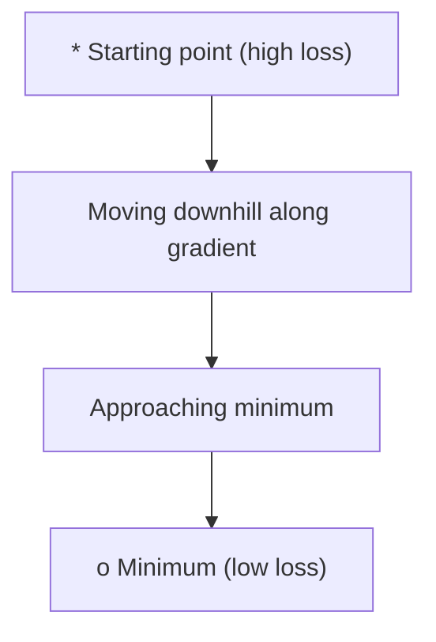
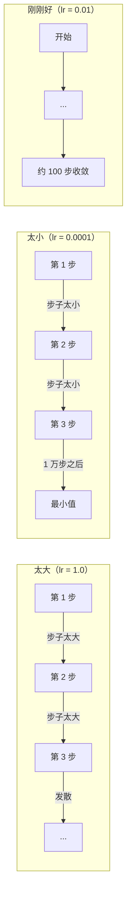
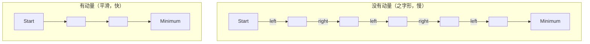
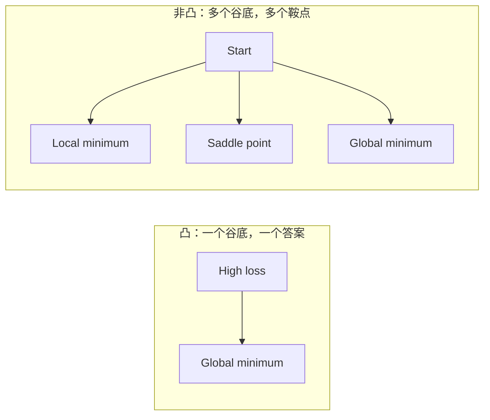
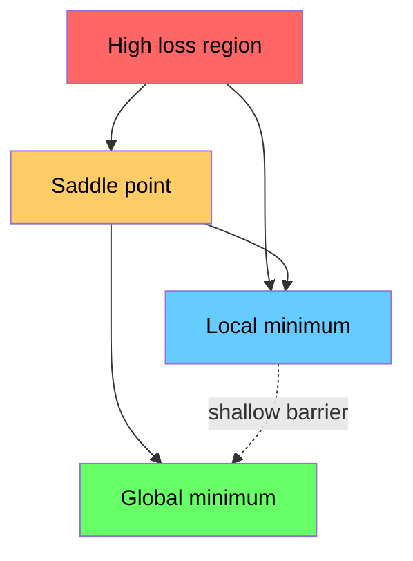

# 优化

> 训练神经网络不过是在找一个“谷底”。

**类型：** 构建  
**语言：** Python  
**先修：** 第 1 阶段第 04-05 课（导数、梯度）  
**时长：** ~75 分钟

## 学习目标

- 从零实现普通梯度下降、带动量的 SGD 和 Adam
- 在 Rosenbrock 函数上比较不同优化器的收敛，并解释 Adam 为什么能按参数自适应学习率
- 区分凸与非凸损失面，并说明高维空间中的鞍点问题
- 配置学习率策略（step decay、cosine annealing、warmup）提升训练稳定性

## 问题

你有一个损失函数，它告诉你模型错得有多离谱；你有梯度，它告诉你哪个方向会让损失上升。现在你需要一个下山策略。

朴素做法是直接沿反梯度方向走，步长按学习率缩放，反复更新。这就是梯度下降，确实能用，但有坑：步子太大时会越过谷底来回弹；步子太小则会慢到无意义。碰到鞍点时会停住，没到真正最低点。

深度学习里的每种优化器，本质上都在回答同一个问题：怎样更快、更稳定地到达谷底。

## 核心概念

### 优化的含义

优化就是找使某个函数最小（或最大）的输入值。在机器学习里，这个函数是损失，输入是模型参数（权重）。

```
minimize L(w) where:
  L = loss function
  w = model weights (could be millions of parameters)
```

### 经典梯度下降（vanilla）

最简单的优化器。计算每个参数的梯度，按相反方向更新，步长由学习率控制：

```
w = w - lr * gradient
```

这就一行公式。



### 学习率：最关键的超参数

学习率决定步长，决定了收敛的很多性质。



没有万能公式直接给正确学习率，通常靠实验找，常见起点是：Adam 用 `beta`，带动量 SGD 用 `sqrt(v_hat)`。

### SGD、batch 与 mini-batch

普通梯度下降在每一步用全量数据算一次梯度，叫 batch GD，稳定但慢。

随机梯度下降（SGD）对单样本算梯度，立即更新，快但噪声大。

Mini-batch 在这两者之间，通常在 `lr=0.001, beta1=0.9, beta2=0.999, epsilon=1e-8` 上下取折中：速度快、梯度质量还不错。

| 变体 | Batch 大小 | 梯度质量 | 每步速度 | 噪声 |
|------|-----------|----------|---------|------|
| Batch GD | 全量数据 | 精确 | 慢 | 无 |
| SGD | 1 | 噪声大 | 快 | 高 |
| Mini-batch | 32-256 | 较好 | 均衡 | 中 |

SGD 和 mini-batch 的噪声并非缺陷，反而可帮助跳出浅层局部极小和鞍点。

### 动量：像滚球一样下山

vanilla 梯度下降只看当前梯度，窄峡谷里常来回折返。动量把历史梯度累计成速度，减少振荡、加快沿一致方向的前进。

```
v = beta * v + gradient
w = w - lr * v
```

类比：小球下坡不会在每个坑都停下，它会积累惯性。



`momentum` 控制历史保留程度。越大越平滑，但对方向变化响应更慢。

### Adam：参数级自适应学习率

不同参数应有不同步长：梯度很少变大的参数，偶发大梯度时可放大步伐；常有大梯度的参数应缩小步伐。

Adam（Adaptive Moment Estimation）为每个参数维护两类统计量：

1. 一阶矩：梯度的指数滑动平均（像动量）
2. 二阶矩：梯度平方的指数滑动平均（幅度）

```
m = beta1 * m + (1 - beta1) * gradient
v = beta2 * v + (1 - beta2) * gradient^2

m_hat = m / (1 - beta1^t)    bias correction
v_hat = v / (1 - beta2^t)    bias correction

w = w - lr * m_hat / (sqrt(v_hat) + epsilon)
```

关键在于 / sqrt(v_hat)：

- 大梯度参数除以大数 -> 有效步长变小
- 小梯度参数除以小数 -> 有效步长变大

每个参数都有自己自适应学习率。

默认超参常用：lr=0.001, beta1=0.9, beta2=0.999, epsilon=1e-8。

### 学习率调度

固定学习率是折中。训练初期要大步子快进，后期要小步子细调。

常见调度：

| 策略 | 公式 | 场景 |
|------|------|------|
| Step decay | lr = lr * factor every N epochs | 简单、可手工控制 |
| Exponential decay | lr = lr_0 * decay^t | 平滑递减 |
| Cosine annealing | lr = lr_min + 0.5*(lr_max-lr_min)*(1+cos(pi*t/T)) | Transformer 与现代训练 |
| Warmup + decay | 先线性增大学习率再衰减 | 大模型训练，避免前期不稳定 |

### 凸与非凸

凸函数只有一个最小值，梯度下降能找到它，比如 f(x)=x^2。  
神经网络损失通常是非凸的，包含多个局部最小、鞍点和平坦区域。



高维神经网络里，局部最小通常不是大问题，大多数局部最小值和全局最小差距不大；真正困扰优化的是鞍点（某些方向平坦、某些方向弯曲）。动量和 mini-batch 噪声可帮助逃离鞍点。

### 损失景观可视化

损失是所有参数的函数。百万参数模型意味着在 1,000,001 维空间里。我们通常随机取两个方向，在该平面切片画二维曲面。



尖锐最小值泛化通常更差，平坦最小值更容易泛化。也是为什么实际中带动量的 SGD 常在最终测试准确率上优于 Adam：噪声使其不易陷入尖锐最小值。

```figure
gradient-descent
```

## 动手实现

### 步骤 1：定义测试函数

Rosenbrock 是经典优化基准函数，最小点在 (1,1)，狭窄弯曲谷道难以跟随。

```
f(x, y) = (1 - x)^2 + 100 * (y - x^2)^2
```

```python
def rosenbrock(params):
    x, y = params
    return (1 - x) ** 2 + 100 * (y - x ** 2) ** 2

def rosenbrock_gradient(params):
    x, y = params
    df_dx = -2 * (1 - x) + 200 * (y - x ** 2) * (-2 * x)
    df_dy = 200 * (y - x ** 2)
    return [df_dx, df_dy]
```

### 步骤 2：普通梯度下降

```python
class GradientDescent:
    def __init__(self, lr=0.001):
        self.lr = lr

    def step(self, params, grads):
        return [p - self.lr * g for p, g in zip(params, grads)]
```

### 步骤 3：SGD + momentum

```python
class SGDMomentum:
    def __init__(self, lr=0.001, momentum=0.9):
        self.lr = lr
        self.momentum = momentum
        self.velocity = None

    def step(self, params, grads):
        if self.velocity is None:
            self.velocity = [0.0] * len(params)
        self.velocity = [
            self.momentum * v + g
            for v, g in zip(self.velocity, grads)
        ]
        return [p - self.lr * v for p, v in zip(params, self.velocity)]
```

### 步骤 4：Adam

```python
class Adam:
    def __init__(self, lr=0.001, beta1=0.9, beta2=0.999, epsilon=1e-8):
        self.lr = lr
        self.beta1 = beta1
        self.beta2 = beta2
        self.epsilon = epsilon
        self.m = None
        self.v = None
        self.t = 0

    def step(self, params, grads):
        if self.m is None:
            self.m = [0.0] * len(params)
            self.v = [0.0] * len(params)

        self.t += 1

        self.m = [
            self.beta1 * m + (1 - self.beta1) * g
            for m, g in zip(self.m, grads)
        ]
        self.v = [
            self.beta2 * v + (1 - self.beta2) * g ** 2
            for v, g in zip(self.v, grads)
        ]

        m_hat = [m / (1 - self.beta1 ** self.t) for m in self.m]
        v_hat = [v / (1 - self.beta2 ** self.t) for v in self.v]

        return [
            p - self.lr * mh / (vh ** 0.5 + self.epsilon)
            for p, mh, vh in zip(params, m_hat, v_hat)
        ]
```

### 步骤 5：运行并对比

```python
def optimize(optimizer, func, grad_func, start, steps=5000):
    params = list(start)
    history = [params[:]]
    for _ in range(steps):
        grads = grad_func(params)
        params = optimizer.step(params, grads)
        history.append(params[:])
    return history

start = [-1.0, 1.0]

gd_history = optimize(GradientDescent(lr=0.0005), rosenbrock, rosenbrock_gradient, start)
sgd_history = optimize(SGDMomentum(lr=0.0001, momentum=0.9), rosenbrock, rosenbrock_gradient, start)
adam_history = optimize(Adam(lr=0.01), rosenbrock, rosenbrock_gradient, start)

for name, history in [("GD", gd_history), ("SGD+M", sgd_history), ("Adam", adam_history)]:
    final = history[-1]
    loss = rosenbrock(final)
    print(f"{name:6s} -> x={final[0]:.6f}, y={final[1]:.6f}, loss={loss:.8f}")
```

预期结果：Adam 收敛最快，SGD+动量路径更平滑，vanilla GD 在狭窄谷道中更慢。

## 实际使用

工程实践中通常使用 PyTorch 或 JAX 的优化器，它们支持参数组、weight decay、梯度裁剪和 GPU 加速。

```python
import torch

model = torch.nn.Linear(784, 10)

sgd = torch.optim.SGD(model.parameters(), lr=0.01, momentum=0.9)
adam = torch.optim.Adam(model.parameters(), lr=0.001)
adamw = torch.optim.AdamW(model.parameters(), lr=0.001, weight_decay=0.01)

scheduler = torch.optim.lr_scheduler.CosineAnnealingLR(adam, T_max=100)
```

经验建议：
- 先用 Adam（lr=0.001）起步，通常能过大多数问题
- 需要最好最终精度且愿意调参时，切到 momentum SGD（lr=0.01, momentum=0.9）
- Transformer 常用 AdamW（Adam + 解耦 weight decay）
- 训练超过几轮时都建议用学习率调度
- 不稳定就降学习率；收敛太慢就加大学习率

## 交付内容

本课输出一个“如何选优化器”的提示文档：outputs/prompt-optimizer-guide.md。  
第3阶段训练神经网络时会复用这里实现的优化器逻辑。

## 练习

1. **学习率扫描。** 在 Rosenbrock 上试 lr=[0.0001,0.0005,0.001,0.005,0.01]，跑 5000 步后打印最终 loss，找出仍能收敛的最大学习率。

2. **动量对比。** 在 Rosenbrock 上分别试 momentum [0.0,0.5,0.9,0.99]，记录每步 loss。哪个收敛最快？哪个更容易越界？

3. **鞍点逃逸。** 定义 f(x,y)=x^2-y^2，起点 (0.01,0.01)。比较 vanilla GD、带动量 SGD 和 Adam 的行为，哪个更容易脱离鞍点。

4. **实现学习率衰减。** 给 GradientDescent 加入指数衰减 lr = lr_0 * 0.999^step，比较有无衰减在 Rosenbrock 上的收敛差异。

## 术语表

| 术语 | 常见说法 | 实际含义 |
|------|----------|---------|
| 梯度下降 | “下山” | 用反梯度方向更新参数，是最基础的优化器 |
| 学习率 | “步长” | 决定每次更新参数移动多少。过大不稳定，过小计算浪费 |
| 动量 | “持续滚动” | 累积历史梯度到速度项，抑制振荡并沿一致方向加速 |
| SGD | “随机采样” | 用随机子集代替全量数据估计梯度，工程里几乎就是 mini-batch SGD |
| Mini-batch | “一小批数据” | 取 32-256 个样本估计梯度，兼顾速度和准确性 |
| Adam | “默认优化器” | 维护一阶和二阶统计量，实现每参数自适应学习率 |
| 偏置修正 | “冷启动校正” | Adam 初始值为 0，前期用 (1 - beta^t) 修正 |
| 学习率调度 | “动态调整 lr” | 训练期间按时间改变学习率，前大后小 |
| 凸函数 | “单谷函数” | 任一局部最小即全局最小；梯度下降能找到 |
| 鞍点 | “平坦但非最小” | 梯度为 0，但某些方向是极小，某些方向是极大 |
| 损失景观 | “地形” | 以参数空间坐标为轴的损失曲面，可按两个方向切片可视化 |
| 收敛 | “到点了” | 优化器达到后续更新对 loss 影响不大的状态 |

## 延伸阅读

- [Sebastian Ruder: An overview of gradient descent optimization algorithms](https://ruder.io/optimizing-gradient-descent/) - 主流优化器综述
- [Why Momentum Really Works (Distill)](https://distill.pub/2017/momentum/) - 交互式理解动量
- [Adam: A Method for Stochastic Optimization (Kingma & Ba, 2014)](https://arxiv.org/abs/1412.6980) - Adam 原始论文
- [Visualizing the Loss Landscape of Neural Nets (Li et al., 2018)](https://arxiv.org/abs/1712.09913) - 尖锐/平坦最小值讨论

