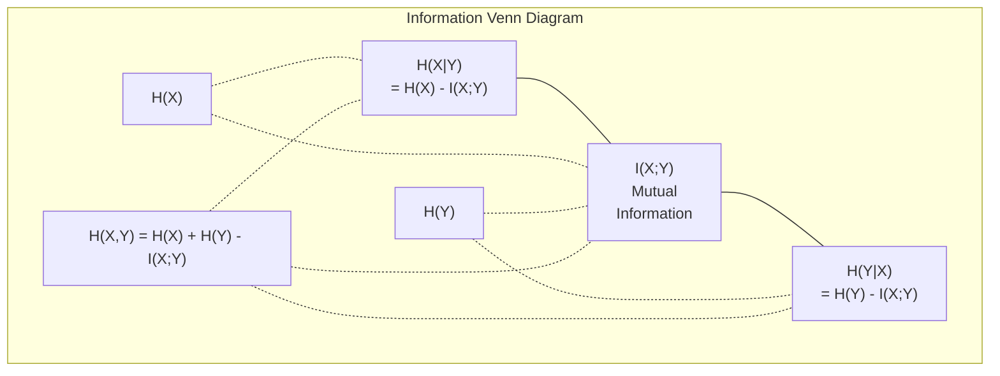

# 信息论

> 信息论在度量“惊奇感”；损失函数也都建立在这个思想上。

**类型：** Learn  
**语言：** Python  
**先修：** 第1阶段第06课（概率）  
**用时：** ~60 分钟

## 学习目标

- 从零推导并计算熵、交叉熵、KL 散度，理解三者关系
- 推导为何最小化交叉熵等价于最大化对数似然
- 计算特征与目标之间的互信息，用于特征筛选排序
- 解释困惑度（perplexity）作为语言模型每步有效候选词数量的含义

## 问题

你在每个分类模型里都会用 `CrossEntropyLoss()`。你在每篇语言模型论文里都能看到“perplexity”。你在 VAE、蒸馏、RLHF 里会看到 KL 散度。它们看起来不相关，实际上是同一套思想的不同外衣。

信息论给了我们一套语言，来描述不确定性、压缩和预测。Claude Shannon 在 1948 年为了通信问题提出它。后来人们发现，训练神经网络本质上也是通信问题：模型在一条“有噪声的通道”——已学习的权重——里，试图把真实标签传达出来。

这节课从基础公式开始推导，让你知道这些公式从哪里来、为什么成立。

## 核心概念

### 信息量（惊奇度）

一个越不容易发生的事件，携带的信息越多。抛硬币正面？没什么惊喜。中彩票？很惊讶。

事件概率为 p 的信息量定义为：

```
I(x) = -log(p(x))
```

底数用 2 时单位是 bit；用自然对数时是 nat。思想相同，只是单位不同。

```
Event              Probability    Surprise (bits)
Fair coin heads    0.5            1.0
Rolling a 6        0.167          2.58
1-in-1000 event    0.001          9.97
Certain event      1.0            0.0
```

确定事件的信息为 0，因为它早已知晓。

### 熵（平均惊奇度）

熵是分布中所有可能结果信息量的期望。

```
H(P) = -sum( p(x) * log(p(x)) )  for all x
```

公平硬币（2 分类）具有最大熵：1 bit。偏置硬币（99% 正面）熵低：0.08 bits。你几乎可以确信会出现正面，因此每一次投掷几乎不提供新信息。

```
Fair coin:    H = -(0.5 * log2(0.5) + 0.5 * log2(0.5)) = 1.0 bit
Biased coin:  H = -(0.99 * log2(0.99) + 0.01 * log2(0.01)) = 0.08 bits
```

熵就是分布中“不可再压缩”的不确定性。

### 交叉熵（你每天都在用的损失）

交叉熵是：当你用分布 Q 去编码真实由分布 P 生成的事件时，平均会有多少惊奇。

```
H(P, Q) = -sum( p(x) * log(q(x)) )  for all x
```

P 是真实分布（标签），Q 是模型预测。若 Q 与 P 完全匹配，交叉熵等于熵；任一不匹配都会变大。

在分类任务里，P 是 one-hot 向量（真实类别概率为 1，其他为 0）。此时交叉熵可简化为：

```
H(P, Q) = -log(q(true_class))
```

这就是分类交叉熵损失的全部。尽量把真实类别的概率推高。

### KL 散度（分布差异）

KL 散度刻画用 Q 代替 P 会多多少外部惊奇：

```
D_KL(P || Q) = sum( p(x) * log(p(x) / q(x)) )  for all x
             = H(P, Q) - H(P)
```

交叉熵 = 熵 + KL。由于真实分布熵在训练中固定，最小化交叉熵等价于最小化 KL；也就是把模型分布推向真实分布。

KL 不对称：`torch.nn.CrossEntropyLoss()`，它不是严格数学距离。

### 互信息

互信息衡量知道一个变量能减少多少另一个变量的不确定性。

```
I(X; Y) = H(X) - H(X|Y)
        = H(X) + H(Y) - H(X, Y)
```

如果 X 与 Y 独立，互信息为 0：知道一个不告诉你任何关于另一个的信息。若完全相关，互信息等于任一变量的熵。

在特征筛选里，若特征和目标的互信息高，说明该特征有用；若很低，通常只是噪声。

### 条件熵

`cross_entropy_loss` 表示在已观察 X 后，Y 仍有多少不确定性。

```
H(Y|X) = H(X,Y) - H(X)
```

两个极端：
- 若 X 完全决定 Y，则 H(Y|X)=0。例如：X 是摄氏温度，Y 是华氏温度。
- 若 X 对 Y 毫无说明力，则 H(Y|X)=H(Y)。例如：X 是抛硬币，Y 是明天天气。

条件熵始终非负且不超过 H(Y)：

```
0 <= H(Y|X) <= H(Y)
```

在机器学习中，决策树中会频繁出现这个量。每次分裂时，算法选择让 H(Y|X) 最小的特征，即去除标签不确定性最多的特征。

### 联合熵

H(X, Y) 是变量联合分布的熵。

```
H(X,Y) = -sum sum p(x,y) * log(p(x,y))   for all x, y
```

关键性质：

```
H(X,Y) <= H(X) + H(Y)
```

当 X 与 Y 独立时取等号。若它们共享信息，联合熵会小于两者熵之和；“缺少”的那部分就是互信息。



关系汇总：
- H(X,Y) = H(X) + H(Y|X) = H(Y) + H(X|Y)
- I(X;Y) = H(X) - H(X|Y) = H(Y) - H(Y|X)
- H(X,Y) = H(X) + H(Y) - I(X;Y)

### 互信息（深挖）

互信息 I(X;Y) 定量回答：知道一个变量后，不确定性能减少多少。

```
I(X;Y) = H(X) - H(X|Y)
       = H(Y) - H(Y|X)
       = H(X) + H(Y) - H(X,Y)
       = sum sum p(x,y) * log(p(x,y) / (p(x) * p(y)))
```

性质：
- I(X;Y) >= 0。观察某个变量不会让你“丢失”信息。
- I(X;Y) = 0 当且仅当 X 与 Y 独立。
- I(X;Y) = I(Y;X)，它是对称的，和 KL 不同。
- I(X;X) = H(X)，变量与自身共享全部信息。

**特征筛选中的 MI。** 在机器学习里希望找到对目标有信息增益的特征。互信息给出一个通用方案：

1. 对每个特征 X_i，计算 I(X_i; Y)，其中 Y 是目标。
2. 按 MI 分数从高到低排序。
3. 保留前 k 个特征。

它能处理任意依赖关系：线性、非线性、单调或非单调。皮尔逊相关只看线性关系，MI 看“任何统计依赖”。

| 方法 | 可检测关系 | 复杂度 | 能否处理离散变量 |
|------|------------|--------|-------------------|
| Pearson 相关系数 | 线性关系 | O(n) | 否 |
| Spearman 相关系数 | 单调关系 | O(n log n) | 否 |
| 互信息 | 任意统计依赖 | O(n log n) + 分箱 | 是 |

### Label Smoothing 与交叉熵

标准分类通常使用硬标签：[0, 0, 1, 0]。真类是 1，其他 0。Label smoothing 改成软标签：

```
soft_target = (1 - epsilon) * hard_target + epsilon / num_classes
```

当 epsilon = 0.1、4 分类时：
- 硬标签：[0, 0, 1, 0]
- 软标签：[0.025, 0.025, 0.925, 0.025]

从信息论角度看，label smoothing 增加了目标分布的熵。硬 one-hot 的熵是 0（无不确定性），软标签则有正熵。

它的优势：
- 避免模型 logit 推到极端（完美拟合 one-hot 在交叉熵下会要求无穷大 logit）
- 起到正则化作用，模型不会过于自信
- 改善校准，输出概率更能反映真实不确定性
- 缩小训练与推理行为差距

加了 smoothing 后交叉熵可写为：

```
L = (1 - epsilon) * CE(hard_target, prediction) + epsilon * H_uniform(prediction)
```

第二项惩罚偏离均匀分布的预测，相当于对置信度直接正则。

### 为什么交叉熵是“分类损失”

三种视角，结论一样：

**信息论视角。** 交叉熵度量你用模型分布编码真实分布时，多浪费了多少比特。最小化它就是让模型更高效地编码现实。

**最大似然视角。** 对 N 个样本和真标签 y_i：

```
Likelihood     = product( q(y_i) )
Log-likelihood = sum( log(q(y_i)) )
Negative log-likelihood = -sum( log(q(y_i)) )
```

最后一行就是交叉熵损失。最小化交叉熵 = 在模型下最大化训练数据似然。

**梯度视角。** 交叉熵对 logits 的梯度就是 (predicted - true)，干净、稳定、易计算。这也是它和 softmax 的天然配对关系。

### Bits 还是 Nats

区别仅在 log 的底数：

```
log base 2   -> bits      (information theory tradition)
log base e   -> nats      (machine learning convention)
log base 10  -> hartleys  (rarely used)
```

1 nat = 1/ln(2) bits，即 1.4427 bits。PyTorch 和 TensorFlow 默认用自然对数（nats）。

### 困惑度

困惑度是交叉熵的指数形式。它告诉你模型在不确定时，相当于在多少个等可能候选里做选择。

```
Perplexity = 2^H(P,Q)   (if using bits)
Perplexity = e^H(P,Q)   (if using nats)
```

困惑度 50 的语言模型，平均上相当于每步在 50 个 token 中均匀选一个。越小越好。

GPT-2 在常见基准上约 30；主流现代模型在高资源域可到个位数。

```figure
entropy-kl
```

## 动手构建

### 步骤1：信息量与熵

```python
import math

def information_content(p, base=2):
    if p <= 0 or p > 1:
        return float('inf') if p <= 0 else 0.0
    return -math.log(p) / math.log(base)

def entropy(probs, base=2):
    return sum(
        p * information_content(p, base)
        for p in probs if p > 0
    )

fair_coin = [0.5, 0.5]
biased_coin = [0.99, 0.01]
fair_die = [1/6] * 6

print(f"Fair coin entropy:   {entropy(fair_coin):.4f} bits")
print(f"Biased coin entropy: {entropy(biased_coin):.4f} bits")
print(f"Fair die entropy:    {entropy(fair_die):.4f} bits")
```

### 步骤2：交叉熵与 KL 散度

```python
def cross_entropy(p, q, base=2):
    total = 0.0
    for pi, qi in zip(p, q):
        if pi > 0:
            if qi <= 0:
                return float('inf')
            total += pi * (-math.log(qi) / math.log(base))
    return total

def kl_divergence(p, q, base=2):
    return cross_entropy(p, q, base) - entropy(p, base)

true_dist = [0.7, 0.2, 0.1]
good_model = [0.6, 0.25, 0.15]
bad_model = [0.1, 0.1, 0.8]

print(f"Entropy of true dist:     {entropy(true_dist):.4f} bits")
print(f"CE (good model):          {cross_entropy(true_dist, good_model):.4f} bits")
print(f"CE (bad model):           {cross_entropy(true_dist, bad_model):.4f} bits")
print(f"KL divergence (good):     {kl_divergence(true_dist, good_model):.4f} bits")
print(f"KL divergence (bad):      {kl_divergence(true_dist, bad_model):.4f} bits")
```

### 步骤3：把交叉熵看成分类损失

```python
def softmax(logits):
    max_logit = max(logits)
    exps = [math.exp(z - max_logit) for z in logits]
    total = sum(exps)
    return [e / total for e in exps]

def cross_entropy_loss(true_class, logits):
    probs = softmax(logits)
    return -math.log(probs[true_class])

logits = [2.0, 1.0, 0.1]
true_class = 0

probs = softmax(logits)
loss = cross_entropy_loss(true_class, logits)

print(f"Logits:      {logits}")
print(f"Softmax:     {[f'{p:.4f}' for p in probs]}")
print(f"True class:  {true_class}")
print(f"Loss:        {loss:.4f} nats")
print(f"Perplexity:  {math.exp(loss):.2f}")
```

### 步骤4：交叉熵 = 负对数似然

```python
import random

random.seed(42)

n_samples = 1000
n_classes = 3
true_labels = [random.randint(0, n_classes - 1) for _ in range(n_samples)]
model_logits = [[random.gauss(0, 1) for _ in range(n_classes)] for _ in range(n_samples)]

ce_loss = sum(
    cross_entropy_loss(label, logits)
    for label, logits in zip(true_labels, model_logits)
) / n_samples

nll = -sum(
    math.log(softmax(logits)[label])
    for label, logits in zip(true_labels, model_logits)
) / n_samples

print(f"Cross-entropy loss:      {ce_loss:.6f}")
print(f"Negative log-likelihood: {nll:.6f}")
print(f"Difference:              {abs(ce_loss - nll):.2e}")
```

### 步骤5：互信息

```python
def mutual_information(joint_probs, base=2):
    rows = len(joint_probs)
    cols = len(joint_probs[0])

    margin_x = [sum(joint_probs[i][j] for j in range(cols)) for i in range(rows)]
    margin_y = [sum(joint_probs[i][j] for i in range(rows)) for j in range(cols)]

    mi = 0.0
    for i in range(rows):
        for j in range(cols):
            pxy = joint_probs[i][j]
            if pxy > 0:
                mi += pxy * math.log(pxy / (margin_x[i] * margin_y[j])) / math.log(base)
    return mi

independent = [[0.25, 0.25], [0.25, 0.25]]
dependent = [[0.45, 0.05], [0.05, 0.45]]

print(f"MI (independent): {mutual_information(independent):.4f} bits")
print(f"MI (dependent):   {mutual_information(dependent):.4f} bits")
```

## 实际应用

NumPy 下这套公式如何落地：

```python
import numpy as np

def np_entropy(p):
    p = np.asarray(p, dtype=float)
    mask = p > 0
    result = np.zeros_like(p)
    result[mask] = p[mask] * np.log(p[mask])
    return -result.sum()

def np_cross_entropy(p, q):
    p, q = np.asarray(p, dtype=float), np.asarray(q, dtype=float)
    mask = p > 0
    return -(p[mask] * np.log(q[mask])).sum()

def np_kl_divergence(p, q):
    return np_cross_entropy(p, q) - np_entropy(p)

true = np.array([0.7, 0.2, 0.1])
pred = np.array([0.6, 0.25, 0.15])
print(f"Entropy:    {np_entropy(true):.4f} nats")
print(f"Cross-ent:  {np_cross_entropy(true, pred):.4f} nats")
print(f"KL div:     {np_kl_divergence(true, pred):.4f} nats")
```

你已经从零实现了 torch.nn.CrossEntropyLoss() 内部在做的事情。现在你能理解为什么训练时损失会下降：模型分布与真实分布在“浪费的信息量”上越来越接近。

## 练习

1. 假设英文字母均匀分布（26 个字母），计算其熵。然后再用真实字母频率估计一次。哪一个更高？为什么？
2. 某模型对一个样本的 logits 是 [5.0, 2.0, 0.5]，真实类别是 1。手工计算交叉熵损失，并用 cross_entropy_loss 验证。什么 logits 可使损失为 0？
3. 证明 KL 散度不对称。随便取两个分布 P、Q，分别计算 D_KL(P || Q) 与 D_KL(Q || P)，解释为什么不同。
4. 实现一个函数，给定若干 (true_token_index, predicted_logits) 计算整段序列的困惑度（perplexity）。

## 关键术语

| 术语 | 常见说法 | 实际含义 |
|------|----------|---------|
| 信息量 | “惊喜” | 编码一个事件所需的信息量，即 -log(p) |
| 熵 | “随机性” | 对分布所有可能结果取平均的惊奇度，表示不可约不确定性 |
| 交叉熵 | “那种常用损失” | 用模型分布 Q 去编码真实分布 P 时的平均惊奇度 |
| KL 散度 | “分布间距离” | 用 Q 代替 P 额外浪费的信息位数；等于交叉熵减熵。非对称 |
| 互信息 | “X 和 Y 有多相关” | 知道 Y 后，X 的不确定性减少多少；为 0 则独立 |
| Softmax | “把 logit 变概率” | 对实数向量指数归一化，映射到有效概率分布 |
| 困惑度 | “模型有多困惑” | 交叉熵的指数值，即每步等效选择的词表规模 |
| Bits | “Shannon 单位” | 用对数底 2 表示的信息量；1 bit 可区分一次公平硬币 |
| Nats | “机器学习默认单位” | 用自然对数表示的信息量；PyTorch/TensorFlow 默认 |
| Negative log-likelihood | “NLL 损失” | 与 one-hot 标签下的交叉熵完全一致；最小化它最大化正确预测概率 |

## 延伸阅读

- [Shannon 1948: A Mathematical Theory of Communication](https://people.math.harvard.edu/~ctm/home/text/others/shannon/entropy/entropy.pdf)（通信理论原典，依然清晰）
- [Visual Information Theory（Chris Olah）](https://colah.github.io/posts/2015-09-Visual-Information/)（熵与 KL 的可视化入门）
- [PyTorch CrossEntropyLoss 文档](https://pytorch.org/docs/stable/generated/torch.nn.CrossEntropyLoss.html)（框架实现细节）
