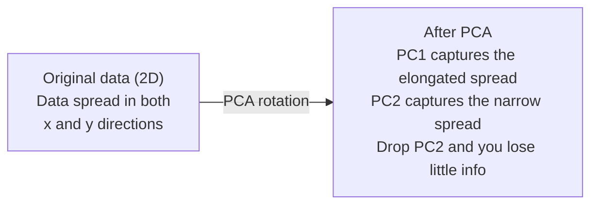

# 降维

> 高维数据有结构，合适的角度能把它看出来。

**类型：** Build  
**语言：** Python  
**先修：** 第1阶段第01课（线性代数直觉）、第02课（向量、矩阵与运算）、第03课（特征值与特征向量）、第06课（概率与分布）  
**用时：** ~90 分钟

## 学习目标

- 从零实现 PCA：中心化数据、计算协方差矩阵、特征分解、投影
- 使用方差解释比例和肘部法则选择主成分个数
- 对比 PCA、t-SNE、UMAP 在 MNIST 2D 可视化中的优缺点
- 使用带 RBF 核的核 PCA 分离标准 PCA 处理不了的非线性结构

## 问题

每个样本有 784 个特征。可能是手写数字像素，也可能是基因表达值，或者用户行为特征。你无法直接可视化 784 维，更别说直接理解。

但这 784 个特征中，大量是冗余的。手写“7”的本质信息并不需要 784 个独立数值，只要几个关键度量：笔画角度、横杠长度、倾斜程度。剩下大多是噪声。

降维就是找这个“更小的曲面”。它把 784 维数据压成 2、10 或 50 维，同时尽量保留重要结构。

## 核心概念

### 维度诅咒

高维空间很反直觉，主要有三点：

**距离失去意义。** 在高维里，任意两个随机点之间距离趋于相近。若每对点距离几乎一样，近邻搜索就失效。

```
Dimension    Avg distance ratio (max/min between random points)
2            ~5.0
10           ~1.8
100          ~1.2
1000         ~1.02
```

**体积集中在角落。** d 维单位超立方体有 `n_neighbors` 个角。100 维时体积几乎都在远离中心的角落，样本更稀薄。

**需要指数级更多数据。** 要在更高维保持同样采样密度，维度从 2 到 20 可能要增加 `min_dist` 倍数据。实际永远不够。降维把数据密度拉回可处理范围。

### PCA：找出最重要方向

主成分分析（PCA）会找数据变化最大的方向。它旋转坐标系，让第一轴承载最大方差，第二轴次之，依次类推。

算法流程：

```
1. Center the data        (subtract the mean from each feature)
2. Compute covariance     (how features move together)
3. Eigendecomposition     (find the principal directions)
4. Sort by eigenvalue     (biggest variance first)
5. Project               (keep top k eigenvectors, drop the rest)
```

为什么是特征值分解？协方差矩阵是对称半正定矩阵，特征向量构成互相正交的一组方向。特征值告诉每个方向的方差大小。最大特征值对应的特征向量就是最大方差方向。



- PCA 前：点云在 x、y 两轴上都比较分散
- PCA 后：坐标系旋转，PC1 与最大扩展方向一致，PC2 与最小扩展方向一致
- 降维：丢掉 PC2，基本上只在 PC1 上投影，损失很小

### 方差解释比例

每个主成分承接总方差的一部分，解释比例如下：

```
Component    Eigenvalue    Explained ratio    Cumulative
PC1          4.73          0.473              0.473
PC2          2.51          0.251              0.724
PC3          1.12          0.112              0.836
PC4          0.89          0.089              0.925
...
```

累积解释比例达到 0.95 时，说明保留的成分能解释约 95% 信息，剩下多为噪声。

### 如何选取主成分数

常用策略：

1. **阈值法。** 保留到累计解释比例达到 90%~95%
2. **肘部法则。** 画每个成分解释方差曲线，找突降点
3. **下游指标。** 把 PCA 当预处理，扫描 k，看下游模型准确率，找准确率平台期

### t-SNE：保留局部邻域

t-Distributed Stochastic Neighbor Embedding（t-SNE）面向可视化。它把高维映射到 2D/3D，同时尽量保留“谁是邻居”关系。

直觉是：在原空间按距离给点对分配概率，近点概率高，远点低；然后在低维空间找到一种布局，使概率结构尽量一致。高维中的邻域关系在 2D 中尽可能保留。

t-SNE 特性：
- 非线性，可展开 PCA 做不到的复杂流形
- 随机性：多次运行会有不同布局
- `outputs/skill-dimensionality-reduction.md` 控制每个点看多少邻居（常见 5~50）
- 输出中簇间距离未必有严格含义，主要看簇结构
- 大数据上较慢，默认接近 `inverse_transform`

### UMAP：更快且更保全全局结构

UMAP（Uniform Manifold Approximation and Projection）与 t-SNE 类似，但有优势：
- 更快：用近邻图近似，避免全量两两距离计算
- 更保全全局关系：簇间相对位置往往比 t-SNE 更有意义

UMAP 在高维先构建加权图（“模糊拓扑表示”），再在低维中寻找尽量保持该图结构的布局。

关键参数：
- `sklearn.datasets.make_classification`：局部结构的邻居数，类似 perplexity；更大更偏全局结构
- min_dist：低维点簇压缩程度，越小簇更紧

### 该用哪个

| 方法 | 场景 | 保留内容 | 速度 |
|------|------|----------|------|
| PCA | 模型训练前预处理 | 全局方差 | 快，适合超大样本 |
| PCA | 快速探索性可视化 | 线性结构 | 快 |
| t-SNE | 论文级 2D 视图 | 局部邻域 | 慢（通常适合 <10k） |
| UMAP | 大规模 2D 可视化 | 局部 + 部分全局结构 | 中等（可扩展到百万级） |
| PCA | 作为模型输入特征压缩 | 按方差排序的方向 | 快 |
| t-SNE/UMAP | 看簇结构 | 簇的分离 | 中到慢 |

经验：预处理和压缩用 PCA；需要 2D 展现结构时用 t-SNE 或 UMAP。

### 核 PCA

标准 PCA 只能建模线性子空间——旋转坐标后丢弃轴。但若数据在非线性流形上，比如二维圆环，任何直线都分不开两环。标准 PCA 解决不了。

核 PCA 使用核函数隐式把数据映射到高维特征空间，再在该空间做 PCA（核技巧），对应 SVM 的核心思路。

步骤：
1. 计算核矩阵 K_ij = k(x_i, x_j)
2. 在特征空间对核矩阵中心化
3. 对中心化核矩阵做特征值分解
4. 用前 k 个特征向量（除以 sqrt(eigenvalue)）作为投影坐标

常见核函数：

| 核函数 | 公式 | 适用 |
|--------|------|------|
| RBF（高斯） | exp(-gamma * ||x - y||^2) | 大多数非线性、平滑流形 |
| 多项式 | (x · y + c)^d | 多项式关系 |
| Sigmoid | tanh(alpha * x · y + c) | 类神经网络映射 |

核 PCA 何时优于标准 PCA：

| 维度 | 标准 PCA | 核 PCA |
|------|----------|--------|
| 数据结构 | 线性子空间 | 非线性流形 |
| 速度 | O(min(n^2 d, d^2 n)) | O(n^2 d + n^3) |
| 可解释性 | 成分是特征的线性组合 | 成分较难直接按特征解释 |
| 可扩展性 | 可应对百万级 | 核矩阵是 n × n，内存受限 |
| 重构 | 有直接逆变换 | 需 pre-image 近似 |

经典示例：二维同心圆。标准 PCA 会将两圆投影到重叠线段；RBF 核 PCA 则能把内外环映射到不同区域，变得可线性分离。

### 重构误差

你降到 k 维后，丢失多少信息？

1. 降维：X_reduced = X @ W_k
2. 重构：X_hat = X_reduced @ W_k^T
3. 用均方误差衡量：mean((X - X_hat)^2)

对于 PCA，重构误差和特征值有清晰关系：

```
Reconstruction error = sum of eigenvalues NOT included
Total variance = sum of ALL eigenvalues
Fraction lost = (sum of dropped eigenvalues) / (sum of all eigenvalues)
```

每个成分解释比例为：

```
explained_ratio_k = eigenvalue_k / sum(all eigenvalues)
```

累计解释比例与维度数的曲线就是肘部曲线。可用位置：
- 曲线开始变平（边际收益变小）
- 累积方差越过阈值（通常 0.90 或 0.95）
- 下游任务表现进入平台期

重构误差也可用于异常检测：误差高的样本是异常点，不符合训练子空间，是生产中 PCA 异常检测思路之一。

```figure
pca-axes
```

## 动手构建

### 步骤1：从零实现 PCA

```python
import numpy as np

class PCA:
    def __init__(self, n_components):
        self.n_components = n_components
        self.components = None
        self.mean = None
        self.eigenvalues = None
        self.explained_variance_ratio_ = None

    def fit(self, X):
        self.mean = np.mean(X, axis=0)
        X_centered = X - self.mean

        cov_matrix = np.cov(X_centered, rowvar=False)

        eigenvalues, eigenvectors = np.linalg.eigh(cov_matrix)

        sorted_idx = np.argsort(eigenvalues)[::-1]
        eigenvalues = eigenvalues[sorted_idx]
        eigenvectors = eigenvectors[:, sorted_idx]

        self.components = eigenvectors[:, :self.n_components].T
        self.eigenvalues = eigenvalues[:self.n_components]
        total_var = np.sum(eigenvalues)
        self.explained_variance_ratio_ = self.eigenvalues / total_var

        return self

    def transform(self, X):
        X_centered = X - self.mean
        return X_centered @ self.components.T

    def fit_transform(self, X):
        self.fit(X)
        return self.transform(X)
```

### 步骤2：合成数据测试

```python
np.random.seed(42)
n_samples = 500

t = np.random.uniform(0, 2 * np.pi, n_samples)
x1 = 3 * np.cos(t) + np.random.normal(0, 0.2, n_samples)
x2 = 3 * np.sin(t) + np.random.normal(0, 0.2, n_samples)
x3 = 0.5 * x1 + 0.3 * x2 + np.random.normal(0, 0.1, n_samples)

X_synthetic = np.column_stack([x1, x2, x3])

pca = PCA(n_components=2)
X_reduced = pca.fit_transform(X_synthetic)

print(f"Original shape: {X_synthetic.shape}")
print(f"Reduced shape:  {X_reduced.shape}")
print(f"Explained variance ratios: {pca.explained_variance_ratio_}")
print(f"Total variance captured: {sum(pca.explained_variance_ratio_):.4f}")
```

### 步骤3：MNIST 2D 查看

```python
from sklearn.datasets import fetch_openml

mnist = fetch_openml("mnist_784", version=1, as_frame=False, parser="auto")
X_mnist = mnist.data[:5000].astype(float)
y_mnist = mnist.target[:5000].astype(int)

pca_mnist = PCA(n_components=50)
X_pca50 = pca_mnist.fit_transform(X_mnist)
print(f"50 components capture {sum(pca_mnist.explained_variance_ratio_):.2%} of variance")

pca_2d = PCA(n_components=2)
X_pca2d = pca_2d.fit_transform(X_mnist)
print(f"2 components capture {sum(pca_2d.explained_variance_ratio_):.2%} of variance")
```

### 步骤4：和 sklearn 对比

```python
from sklearn.decomposition import PCA as SklearnPCA
from sklearn.manifold import TSNE

sklearn_pca = SklearnPCA(n_components=2)
X_sklearn_pca = sklearn_pca.fit_transform(X_mnist)

print(f"\nOur PCA explained variance:     {pca_2d.explained_variance_ratio_}")
print(f"Sklearn PCA explained variance: {sklearn_pca.explained_variance_ratio_}")

diff = np.abs(np.abs(X_pca2d) - np.abs(X_sklearn_pca))
print(f"Max absolute difference: {diff.max():.10f}")

tsne = TSNE(n_components=2, perplexity=30, random_state=42)
X_tsne = tsne.fit_transform(X_mnist)
print(f"\nt-SNE output shape: {X_tsne.shape}")
```

### 步骤5：对比 UMAP

```python
try:
    from umap import UMAP

    reducer = UMAP(n_components=2, n_neighbors=15, min_dist=0.1, random_state=42)
    X_umap = reducer.fit_transform(X_mnist)
    print(f"UMAP output shape: {X_umap.shape}")
except ImportError:
    print("Install umap-learn: pip install umap-learn")
```

## 应用

PCA 作为分类器前处理：

```python
from sklearn.decomposition import PCA as SklearnPCA
from sklearn.linear_model import LogisticRegression
from sklearn.model_selection import train_test_split
from sklearn.metrics import accuracy_score

X_train, X_test, y_train, y_test = train_test_split(
    X_mnist, y_mnist, test_size=0.2, random_state=42
)

results = {}
for k in [10, 30, 50, 100, 200]:
    pca_k = SklearnPCA(n_components=k)
    X_tr = pca_k.fit_transform(X_train)
    X_te = pca_k.transform(X_test)

    clf = LogisticRegression(max_iter=1000, random_state=42)
    clf.fit(X_tr, y_train)
    acc = accuracy_score(y_test, clf.predict(X_te))
    var_captured = sum(pca_k.explained_variance_ratio_)
    results[k] = (acc, var_captured)
    print(f"k={k:>3d}  accuracy={acc:.4f}  variance={var_captured:.4f}")
```

准确率常见会在远低于 784 维时就进入平台期，而这个平台点就是实用的操作点。

## 交付

这课的交付是：
- outputs/skill-dimensionality-reduction.md：给定任务选择合适降维方法的提示文档

## 练习

1. 给 PCA 类加上 inverse_transform，分别用 10、50、200 维重构 MNIST，打印每个 k 的重构均方误差。
2. 在同一 MNIST 子集上用 perplexity 为 5、30、100 做 t-SNE，对比输出变化。为什么 perplexity 会影响聚类紧密性？
3. 生成一个含 50 个特征但只有 5 个有效信息特征的数据（可用 sklearn.datasets.make_classification），做 PCA 并验证解释方差曲线是否提示“本质维度约为 5”。

## 关键术语

| 术语 | 常见说法 | 实际含义 |
|------|----------|----------|
| 维度诅咒 | “特征太多了” | 维度上升时，距离、体积、数据密度行为都反直觉，模型需要指数级更多数据 |
| PCA | “降维” | 旋转坐标系让主轴按方差排序，再丢弃低方差轴 |
| 主成分 | “最重要方向” | 协方差矩阵的特征向量，表示数据方差最大的方向 |
| 方差解释比例 | “这成分有多少信息” | 一个主成分承载的总方差占比；前 k 个加总即保留比例 |
| 协方差矩阵 | “特征相关性” | 对称矩阵，(i,j) 表示特征 i 与 j 的协同变化；对角线是方差 |
| t-SNE | “聚类图” | 非线性方法，通过保持成对邻域概率把高维映射到 2D，主要用于可视化 |
| UMAP | “更快的 t-SNE” | 基于拓扑的数据方法，同时保留局部及部分全局结构，扩展性更好 |
| Perplexity | “t-SNE 参数” | 控制每个点有效考虑的邻居数量，低值偏局部，高值偏全局 |
| 流形 | “数据所在表面” | 低维结构嵌入在高维空间中的集合，像纸条在 3D 中的褶皱 |

## 延伸阅读

- [A Tutorial on Principal Component Analysis](https://arxiv.org/abs/1404.1100)（Shlens）—从零推导 PCA 的清晰教程
- [How to Use t-SNE Effectively](https://distill.pub/2016/misread-tsne/)（Wattenberg 等）—交互式 t-SNE 原理与参数陷阱
- [UMAP 文档](https://umap-learn.readthedocs.io/)—UMAP 官方文档与实践指南
