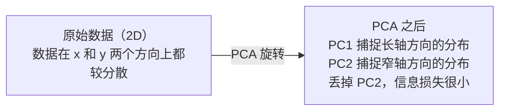

# 降维

> 高维数据是有结构的，关键在于用对视角把它看出来。

**类型：** 构建  
**语言：** Python  
**先修：** 第 1 阶段，第 01 课（线性代数直觉），第 02 课（向量、矩阵与运算），第 03 课（特征值与特征向量），第 06 课（概率与分布）  
**时长：** ~90 分钟

## 学习目标

- 从零实现 PCA：中心化数据、计算协方差矩阵、做特征分解并完成投影
- 使用方差解释比例和肘部法则选择主成分数量
- 对比 PCA、t-SNE 和 UMAP 在 2D 可视化 MNIST 数字时的差异与取舍
- 使用带 RBF 核的 kernel PCA，处理标准 PCA 不能直接分开的非线性结构

## 问题

每个样本有 784 个特征。它可能是手写数字像素、基因表达值，也可能是用户行为信号。784 维既无法直观可视化，也很难直接理解。

但这 784 个特征里，大部分其实是冗余的。真正有用的信息通常分布在一个更小的低维流形上。手写“7”并不需要 784 个独立数字来描述，它只需要少数几个关键量：笔画角度、横杠长度、倾斜程度。其余大多是噪声。

降维就是去找那个更小的“表面”。它把 784 维数据压缩到 2、10 或 50 维，同时尽量保留重要结构。

## 核心概念

### 维度诅咒

高维空间非常反直觉，维度一高，下面三件事就开始失真。

**距离失去意义。** 在高维里，任意两个随机点之间的距离会趋于接近。如果所有点到彼此的距离都差不多，近邻搜索就不好用了。

```text
维度    随机点之间的平均距离比（最大/最小）
2       ~5.0
10      ~1.8
100     ~1.2
1000    ~1.02
```

**体积集中在角落。** d 维单位超立方体有 2^d 个角。到了 100 维，几乎所有体积都跑到角落里，远离中心。数据会向边缘稀释，模型在内部区域拿不到足够样本。

**需要指数级更多数据。** 想在更高维里维持同样的样本密度，从 2D 到 20D 可能要多出 10^18 倍数据。现实里永远不够用。降维能把数据密度拉回可处理范围。

### PCA：找出最重要的方向

主成分分析（PCA）会找出数据变化最大的方向。它旋转坐标系，让第一轴承载最多方差，第二轴次之，以此类推。

算法流程：

```text
1. 对数据中心化        （每个特征减去均值）
2. 计算协方差          （看特征如何一起变化）
3. 做特征分解          （找出主方向）
4. 按特征值排序        （方差最大的排在前面）
5. 投影                （保留前 k 个特征向量，去掉其余部分）
```

为什么要做特征分解？因为协方差矩阵是对称且半正定的。它的特征向量是特征空间里互相正交的方向，特征值告诉你每个方向能解释多少方差。最大特征值对应的特征向量，就是最大方差方向。



- **PCA 之前：** 点云在 x、y 两个方向上都比较分散
- **PCA 之后：** 坐标系旋转，PC1 对齐最大方差方向，PC2 对齐最小方差方向
- **降维：** 丢掉 PC2，相当于把数据投影到 PC1 上，信息损失很小

### 解释方差比例

每个主成分只承载总方差的一部分。解释方差比例可以告诉你它到底保留了多少信息。

```text
Component    Eigenvalue    Explained ratio    Cumulative
PC1          4.73          0.473              0.473
PC2          2.51          0.251              0.724
PC3          1.12          0.112              0.836
PC4          0.89          0.089              0.925
...
```

当累计解释方差达到 0.95 时，说明这些主成分已经覆盖了 95% 的信息，后面大多只是噪声。

### 如何选择主成分数量

常见有三种办法：

1. **阈值法。** 保留到累计解释方差达到 90% 到 95%。
2. **肘部法则。** 画出每个主成分的解释方差曲线，找陡降点。
3. **下游性能。** 把 PCA 当预处理，扫描不同的 k，观察模型准确率。准确率进入平台期的位置，就是合适的 k。

### t-SNE：保留局部结构

t-Distributed Stochastic Neighbor Embedding（t-SNE）主要用于可视化。它把高维数据映射到 2D 或 3D，同时尽量保留“谁和谁是邻居”这件事。

直觉上，它先在原空间里根据距离给点对分配概率：近点概率高，远点概率低；然后在低维空间里寻找一种布局，让这种概率结构尽量一致。这样，784 维里的邻居在 2D 中也尽量还是邻居。

t-SNE 的特点：
- 非线性，能展开 PCA 做不到的复杂流形
- 随机性较强，多次运行结果会不同
- `perplexity` 控制考虑多少邻居，常见范围是 5 到 50
- 输出里簇与簇之间的距离没有严格意义，主要看簇本身
- 大数据上较慢，默认是 O(n^2)

### UMAP：更快，也更能保留全局结构

Uniform Manifold Approximation and Projection（UMAP）和 t-SNE 类似，但有两个优势：
- 更快：它用近邻图近似，而不是计算全部两两距离
- 全局结构更好：输出里各簇的相对位置通常比 t-SNE 更有意义

UMAP 先在高维空间构建加权图，也就是“模糊拓扑表示”，再在低维里寻找一个尽量保留这张图结构的布局。

关键参数：
- `n_neighbors`：定义局部结构的邻居数，类似 perplexity；值越大，越偏向保留全局结构
- `min_dist`：控制低维中点簇压得多紧；越小，簇越密

### 用哪个

| 方法 | 场景 | 保留内容 | 速度 |
|------|------|----------|------|
| PCA | 训练前预处理 | 全局方差 | 快，且可扩展到百万级样本 |
| PCA | 快速探索式可视化 | 线性结构 | 快 |
| t-SNE | 论文级 2D 图 | 局部邻域 | 慢（通常 < 10k 样本更合适） |
| UMAP | 大规模 2D 可视化 | 局部 + 部分全局结构 | 中等（可扩展到百万级） |
| PCA | 模型输入压缩 | 按方差排序的方向 | 快 |
| t-SNE / UMAP | 看簇结构 | 簇的分离 | 中到慢 |

经验法则：预处理和压缩用 PCA；需要在 2D 里看结构时，用 t-SNE 或 UMAP。

### Kernel PCA

标准 PCA 只能找线性子空间：它会旋转坐标系，然后丢掉一些轴。但如果数据落在非线性流形上呢？比如 2D 里的圆，任何直线都分不开。标准 PCA 解决不了。

Kernel PCA 会把 PCA 放到核函数诱导的高维特征空间里执行，但不显式计算那个空间中的坐标。这就是核技巧，也是 SVM 背后的同一个想法。

算法流程：
1. 计算核矩阵 K，其中 K_ij = k(x_i, x_j)
2. 在特征空间里对核矩阵做中心化
3. 对中心化后的核矩阵做特征分解
4. 取前几个特征向量，并按 1/sqrt(eigenvalue) 缩放，作为投影结果

常见核函数：

| Kernel | 公式 | 适用场景 |
|--------|---------|----------|
| RBF (Gaussian) | exp(-gamma * ||x - y||^2) | 大多数非线性数据、平滑流形 |
| Polynomial | (x . y + c)^d | 多项式关系 |
| Sigmoid | tanh(alpha * x . y + c) | 类神经网络映射 |

标准 PCA 和 kernel PCA 的取舍：

| Criterion | 标准 PCA | Kernel PCA |
|-----------|-------------|------------|
| Data structure | Linear subspace | Nonlinear manifold |
| Speed | O(min(n^2 d, d^2 n)) | O(n^2 d + n^3) |
| Interpretability | Components are linear combinations of features | Components lack direct feature interpretation |
| Scalability | Works on millions of samples | Kernel matrix is n x n, memory-limited |
| Reconstruction | Direct inverse transform | Requires pre-image approximation |

经典例子是同心圆。二维里两圈点，一圈套一圈。标准 PCA 会把它们投到同一条直线上，分类几乎没用。带 RBF 核的 kernel PCA 则能把内外圈映射到不同区域，让它们线性可分。

### 重构误差

降维到底做得好不好？你把 784 维压成 50 维，损失了什么？

可以用重构误差衡量：
1. 先把数据投影到 k 维：`X_reduced = X @ W_k`
2. 再重构：`X_hat = X_reduced @ W_k^T`
3. 计算 MSE：`mean((X - X_hat)^2)`

对 PCA 来说，重构误差和解释方差之间有很清楚的关系：

```text
Reconstruction error = sum of eigenvalues NOT included
Total variance = sum of ALL eigenvalues
Fraction lost = (sum of dropped eigenvalues) / (sum of all eigenvalues)
```

每个主成分的解释方差比例是：

```text
explained_ratio_k = eigenvalue_k / sum(all eigenvalues)
```

把累计解释方差和主成分数量画出来，就能得到“肘部曲线”。合适的主成分数量通常满足：
- 曲线开始变平，收益递减
- 累计方差达到阈值，通常是 0.90 或 0.95
- 下游任务性能进入平台期

重构误差不只是用于选择 k。它还可以做异常检测：重构误差高的样本，通常是不符合已学子空间的离群点。这也是生产系统里常见的基于 PCA 的异常检测思路。

```figure
pca-axes
```

## 动手实现

### 第 1 步：从零实现 PCA

```python
import numpy as np

class PCA:
    def __init__(self, n_components):
        self.n_components = n_components
        self.components = None
        self.mean = None
        self.eigenvalues = None
        self.explained_variance_ratio_ = None

    def fit(self, X):
        self.mean = np.mean(X, axis=0)
        X_centered = X - self.mean

        cov_matrix = np.cov(X_centered, rowvar=False)

        eigenvalues, eigenvectors = np.linalg.eigh(cov_matrix)

        sorted_idx = np.argsort(eigenvalues)[::-1]
        eigenvalues = eigenvalues[sorted_idx]
        eigenvectors = eigenvectors[:, sorted_idx]

        self.components = eigenvectors[:, :self.n_components].T
        self.eigenvalues = eigenvalues[:self.n_components]
        total_var = np.sum(eigenvalues)
        self.explained_variance_ratio_ = self.eigenvalues / total_var

        return self

    def transform(self, X):
        X_centered = X - self.mean
        return X_centered @ self.components.T

    def fit_transform(self, X):
        self.fit(X)
        return self.transform(X)
```

### 第 2 步：在合成数据上测试

```python
np.random.seed(42)
n_samples = 500

t = np.random.uniform(0, 2 * np.pi, n_samples)
x1 = 3 * np.cos(t) + np.random.normal(0, 0.2, n_samples)
x2 = 3 * np.sin(t) + np.random.normal(0, 0.2, n_samples)
x3 = 0.5 * x1 + 0.3 * x2 + np.random.normal(0, 0.1, n_samples)

X_synthetic = np.column_stack([x1, x2, x3])

pca = PCA(n_components=2)
X_reduced = pca.fit_transform(X_synthetic)

print(f"Original shape: {X_synthetic.shape}")
print(f"Reduced shape:  {X_reduced.shape}")
print(f"Explained variance ratios: {pca.explained_variance_ratio_}")
print(f"Total variance captured: {sum(pca.explained_variance_ratio_):.4f}")
```

### 第 3 步：把 MNIST 压到 2D

```python
from sklearn.datasets import fetch_openml

mnist = fetch_openml("mnist_784", version=1, as_frame=False, parser="auto")
X_mnist = mnist.data[:5000].astype(float)
y_mnist = mnist.target[:5000].astype(int)

pca_mnist = PCA(n_components=50)
X_pca50 = pca_mnist.fit_transform(X_mnist)
print(f"50 components capture {sum(pca_mnist.explained_variance_ratio_):.2%} of variance")

pca_2d = PCA(n_components=2)
X_pca2d = pca_2d.fit_transform(X_mnist)
print(f"2 components capture {sum(pca_2d.explained_variance_ratio_):.2%} of variance")
```

### 第 4 步：和 sklearn 对照

```python
from sklearn.decomposition import PCA as SklearnPCA
from sklearn.manifold import TSNE

sklearn_pca = SklearnPCA(n_components=2)
X_sklearn_pca = sklearn_pca.fit_transform(X_mnist)

print(f"\n我们的 PCA 解释方差：     {pca_2d.explained_variance_ratio_}")
print(f"Sklearn PCA 解释方差：{sklearn_pca.explained_variance_ratio_}")

diff = np.abs(np.abs(X_pca2d) - np.abs(X_sklearn_pca))
print(f"Max absolute difference: {diff.max():.10f}")

tsne = TSNE(n_components=2, perplexity=30, random_state=42)
X_tsne = tsne.fit_transform(X_mnist)
print(f"\nt-SNE 输出形状：{X_tsne.shape}")
```

### 第 5 步：对比 UMAP

```python
try:
    from umap import UMAP

    reducer = UMAP(n_components=2, n_neighbors=15, min_dist=0.1, random_state=42)
    X_umap = reducer.fit_transform(X_mnist)
    print(f"UMAP 输出形状：{X_umap.shape}")
except ImportError:
    print("安装 umap-learn：pip install umap-learn")
```

## 用起来

把 PCA 当作分类器前的预处理：

```python
from sklearn.decomposition import PCA as SklearnPCA
from sklearn.linear_model import LogisticRegression
from sklearn.model_selection import train_test_split
from sklearn.metrics import accuracy_score

X_train, X_test, y_train, y_test = train_test_split(
    X_mnist, y_mnist, test_size=0.2, random_state=42
)

results = {}
for k in [10, 30, 50, 100, 200]:
    pca_k = SklearnPCA(n_components=k)
    X_tr = pca_k.fit_transform(X_train)
    X_te = pca_k.transform(X_test)

    clf = LogisticRegression(max_iter=1000, random_state=42)
    clf.fit(X_tr, y_train)
    acc = accuracy_score(y_test, clf.predict(X_te))
    var_captured = sum(pca_k.explained_variance_ratio_)
    results[k] = (acc, var_captured)
    print(f"k={k:>3d}  准确率={acc:.4f}  方差保留={var_captured:.4f}")
```

性能通常会远早于 784 维就进入平台期。那个平台点就是你的工作点。

## 上线交付

本课产出：
- `outputs/skill-dimensionality-reduction.md` - 一个用于选择合适降维方法的 skill

## 练习

1. 给 PCA 类补上 `inverse_transform`。把 MNIST 从 10、50、200 个主成分重构回来，并打印每种情况下的重构误差（相对于原始图像的均方差）。

2. 在同一个 MNIST 子集上分别用 perplexity 为 5、30、100 跑 t-SNE。描述输出如何变化，并解释为什么 perplexity 会影响簇的紧密程度。

3. 构造一个 50 个特征的数据集，其中只有 5 个真正有信息（可用 `sklearn.datasets.make_classification` 生成）。对它做 PCA，看看解释方差曲线能否正确识别出数据本质上只有 5 维。

## 关键术语

| 术语 | 常见说法 | 实际含义 |
|------|----------------|------------------------|
| Curse of dimensionality | "Too many features" | 维度升高后，距离、体积和数据密度的行为都会变得反直觉；模型需要指数级更多的数据来补偿。 |
| PCA | "Reduce dimensions" | 旋转坐标系，让坐标轴对齐最大方差方向，然后丢掉低方差轴。 |
| Principal component | "An important direction" | 协方差矩阵的一个特征向量，也就是数据在特征空间里变化最明显的方向。 |
| Explained variance ratio | "How much info this component has" | 某个主成分解释的总方差比例。把前 k 个比例加起来，就能看出保留了多少信息。 |
| Covariance matrix | "How features correlate" | 一个对称矩阵，其中 (i,j) 项表示特征 i 和特征 j 如何一起变化；对角线是各自方差。 |
| t-SNE | "That cluster plot" | 一种非线性方法，把高维数据映射到 2D，同时保留点对之间的邻域概率。适合可视化，不适合预处理。 |
| UMAP | "Faster t-SNE" | 一种基于拓扑数据分析的非线性方法，能保留局部结构，也能保留部分全局结构；通常比 t-SNE 更可扩展。 |
| Perplexity | "A t-SNE knob" | 控制每个点会考虑多少个有效邻居。perplexity 低时更强调局部结构，perplexity 高时更强调更大尺度的模式。 |
| Manifold | "The surface the data lives on" | 嵌入在高维空间中的低维流形。把一张纸揉皱后放在 3D 空间里，它本质上仍是 2D 流形。 |

## 延伸阅读

- [A Tutorial on Principal Component Analysis](https://arxiv.org/abs/1404.1100)（Shlens）- 从零推导 PCA 的清晰教程
- [How to Use t-SNE Effectively](https://distill.pub/2016/misread-tsne/)（Wattenberg 等）- t-SNE 常见误区和参数选择的交互式指南
- [UMAP documentation](https://umap-learn.readthedocs.io/) - 来自 UMAP 作者的理论与实践说明
