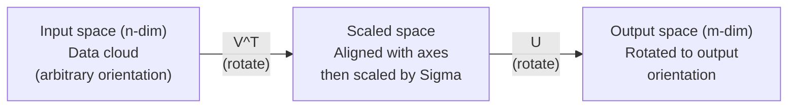
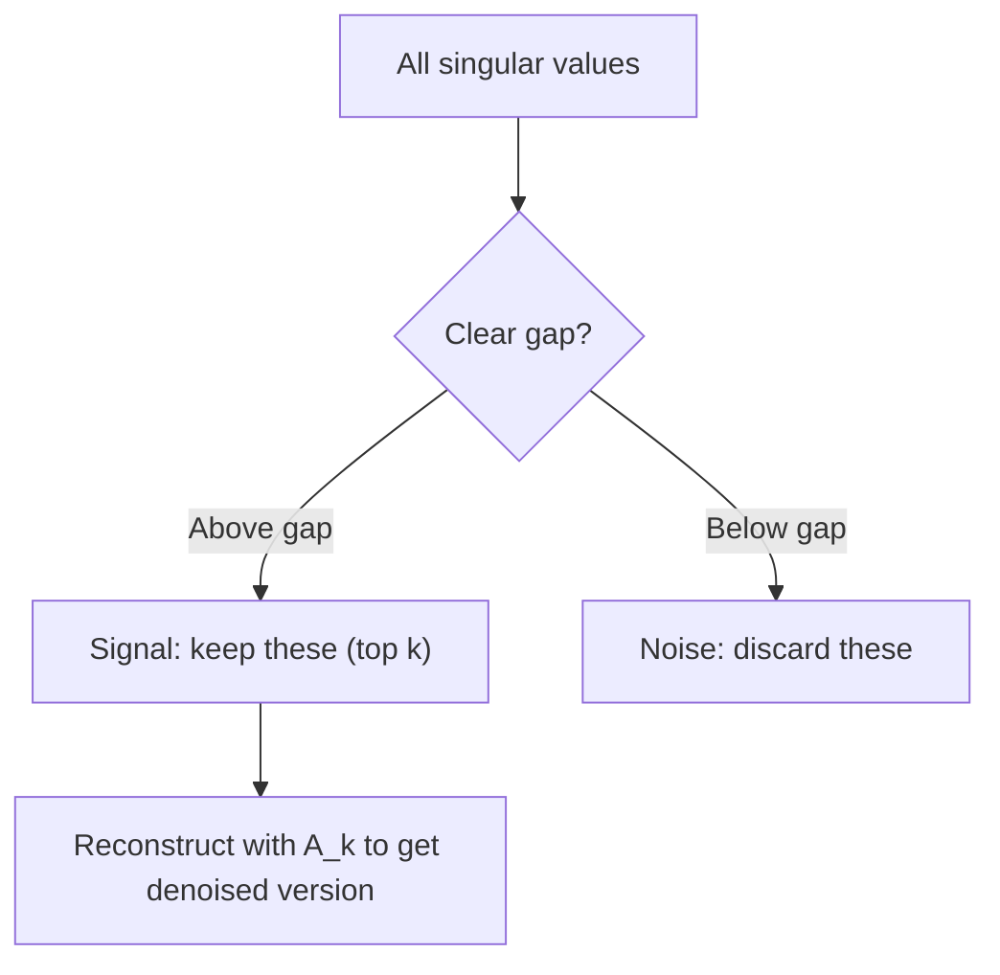

# 奇异值分解

> SVD 是线性代数里的瑞士军刀。任何矩阵都有 SVD。做数据的人基本都离不开它。

**类型:** 构建
**语言:** Python, Julia
**先修:** 第 1 阶段，第 01 课（线性代数直觉），第 02 课（向量与矩阵运算），第 03 课（矩阵变换）
**时长:** ~120 分钟

## 学习目标

- 通过幂迭代实现 SVD，并解释 U、Sigma 和 V^T 的几何含义
- 使用截断 SVD 做图像压缩，并衡量压缩率与重构误差
- 通过 SVD 计算 Moore-Penrose 伪逆，求解超定最小二乘系统
- 将 SVD 与 PCA、推荐系统中的潜在因子，以及 NLP 中的潜在语义分析联系起来

## 问题是什么

你有一个 1000x2000 的矩阵。它可能是用户-电影评分表，也可能是文档-词项频次表，还可能是一张图像的像素矩阵。你想压缩它、去噪、挖掘隐藏结构，或者用它解最小二乘问题。特征分解只适用于方阵，而且即使是方阵，也要求矩阵有一组完整的线性无关特征向量。

SVD 适用于任何矩阵。无论形状、秩还是其他条件如何，都能分解。它把矩阵拆成三个因子，直接揭示“这个矩阵对空间做了什么”。这是线性代数里最通用、也最实用的分解。

## 核心概念

### SVD 的几何作用

任何矩阵，不管形状如何，本质上都在连续做三件事：旋转、缩放、再旋转。SVD 把这件事显式写出来。

```text
A = U * Sigma * V^T

      m x n     m x m    m x n    n x n
     (any)    (rotate)  (scale)  (rotate)
```

对任意矩阵 A，SVD 可以拆成：
- V^T 旋转输入空间里的向量（n 维）
- Sigma 沿每个轴做缩放（拉伸或压缩）
- U 把结果旋转到输出空间（m 维）



可以把它想成这样：你把一个矩阵交给 SVD，它会告诉你“这个矩阵先用 V^T 旋转输入球，再用 Sigma 把它拉成椭球，最后用 U 把椭球转到输出方向”。奇异值就是椭球各轴的长度。

### 完整分解

对于一个形状为 m x n 的矩阵 A：

```text
A = U * Sigma * V^T

where:
  U     is m x m, orthogonal (U^T U = I)
  Sigma is m x n, diagonal (singular values on the diagonal)
  V     is n x n, orthogonal (V^T V = I)

The singular values sigma_1 >= sigma_2 >= ... >= sigma_r > 0
where r = rank(A)
```

U 的列称为左奇异向量，V 的列称为右奇异向量，Sigma 的对角元称为奇异值。它们都非负，并且通常按从大到小排序。

### 左奇异向量、奇异值、右奇异向量

SVD 的三个部分各自对应清晰的几何含义。

**右奇异向量（V 的列）：** 它们构成输入空间 R^n 的一组正交基。它们是输入空间里的方向，矩阵会把这些方向映射到输出空间中的正交方向。可以把它们理解成域空间的“自然坐标系”。

**奇异值（Sigma 的对角元）：** 它们是缩放系数。第 i 个奇异值表示矩阵沿第 i 个右奇异向量方向的伸缩倍数。奇异值为 0 说明该方向被矩阵完全压扁了。

**左奇异向量（U 的列）：** 它们构成输出空间 R^m 的一组正交基。第 i 个左奇异向量就是第 i 个右奇异向量经过矩阵映射后的方向，已经包含缩放效果。

它们之间的关系是：

```text
A * v_i = sigma_i * u_i

The matrix A takes the i-th right singular vector v_i,
scales it by sigma_i, and maps it to the i-th left singular vector u_i.
```

这给了你一幅按坐标逐个理解矩阵作用的图景。

### 外积形式

SVD 可以写成若干个秩 1 矩阵的和：

```text
A = sigma_1 * u_1 * v_1^T + sigma_2 * u_2 * v_2^T + ... + sigma_r * u_r * v_r^T

Each term sigma_i * u_i * v_i^T is a rank-1 matrix (an outer product).
The full matrix is the sum of r such matrices, where r is the rank.
```

这也是低秩近似的基础。每一项都在增加一层结构。第一项抓住最重要的模式，第二项抓住次重要的模式，以此类推。把这个和式截断，就能得到某个秩下的最佳近似。

```text
Rank-1 approx:    A_1 = sigma_1 * u_1 * v_1^T
                  (captures the dominant pattern)

Rank-2 approx:    A_2 = sigma_1 * u_1 * v_1^T + sigma_2 * u_2 * v_2^T
                  (captures the two most important patterns)

Rank-k approx:    A_k = sum of top k terms
                  (optimal by the Eckart-Young theorem)
```

### 与特征分解的关系

SVD 和特征分解关系非常紧密。A 的奇异值和奇异向量，直接来自 A^T A 和 A A^T 的特征值、特征向量。

```text
A^T A = V * Sigma^T * U^T * U * Sigma * V^T
      = V * Sigma^T * Sigma * V^T
      = V * D * V^T

where D = Sigma^T * Sigma is a diagonal matrix with sigma_i^2 on the diagonal.

So:
- The right singular vectors (V) are eigenvectors of A^T A
- The singular values squared (sigma_i^2) are eigenvalues of A^T A

Similarly:
A A^T = U * Sigma * V^T * V * Sigma^T * U^T
      = U * Sigma * Sigma^T * U^T

So:
- The left singular vectors (U) are eigenvectors of A A^T
- The eigenvalues of A A^T are also sigma_i^2
```

这个关系说明三件事：
1. 奇异值一定是实数且非负，因为它们是半正定矩阵特征值的平方根。
2. 当然可以通过对 A^T A 做特征分解来求 SVD，但这会把条件数平方，损失数值精度。专门的 SVD 算法会避开这个问题。
3. 当 A 是方阵且对称半正定时，SVD 和特征分解本质上是同一件事。

### 截断 SVD：低秩近似

Eckart-Young-Mirsky 定理指出，A 的最佳秩 k 近似（无论是 Frobenius 范数还是谱范数意义上）都可以通过只保留前 k 个奇异值及其向量得到：

```text
A_k = U_k * Sigma_k * V_k^T

where:
  U_k     is m x k  (first k columns of U)
  Sigma_k is k x k  (top-left k x k block of Sigma)
  V_k     is n x k  (first k columns of V)

Approximation error = sigma_{k+1}  (in spectral norm)
                    = sqrt(sigma_{k+1}^2 + ... + sigma_r^2)  (in Frobenius norm)
```

这不只是“一个不错的近似”，而是能证明的最佳秩 k 近似。没有别的秩 k 矩阵能比它更接近原矩阵。

| Component | Relative magnitude | Kept in rank-3 approx? |
|-----------|-------------------|------------------------|
| sigma_1 | Largest | Yes |
| sigma_2 | Large | Yes |
| sigma_3 | Medium-large | Yes |
| sigma_4 | Medium | No (error) |
| sigma_5 | Medium-small | No (error) |
| sigma_6 | Small | No (error) |
| sigma_7 | Very small | No (error) |
| sigma_8 | Tiny | No (error) |

只保留前 3 项时，A_3 会捕捉前三个奇异值；误差来自剩余项（sigma_4 到 sigma_8）。

如果奇异值衰减很快，小 k 就能覆盖矩阵的大部分信息；如果衰减很慢，说明矩阵没有明显的低秩结构。

### 用 SVD 做图像压缩

灰度图像本质上就是像素强度矩阵。一个 800x600 的图像有 480,000 个数值，SVD 可以用更少的参数近似它。

```text
Original image: 800 x 600 = 480,000 values

SVD with rank k:
  U_k:      800 x k values
  Sigma_k:  k values
  V_k:      600 x k values
  Total:    k * (800 + 600 + 1) = k * 1401 values

  k=10:   14,010 values   (2.9% of original)
  k=50:   70,050 values  (14.6% of original)
  k=100: 140,100 values  (29.2% of original)

  The compression ratio improves as k gets smaller,
  but visual quality degrades.
```

关键点在于：自然图像的奇异值通常衰减得很快。前几个奇异值捕捉整体轮廓、形状和渐变，后面的项更多对应细节和噪声。截断到秩 50 往往能得到几乎看不出差别的图像，同时节省大约 85% 的存储。

### 用 SVD 做推荐系统

Netflix Prize 让这件事变得家喻户晓。你会得到一个用户-电影评分矩阵，但其中大部分条目是缺失的。

```text
             Movie1  Movie2  Movie3  Movie4  Movie5
  User1      [  5      ?       3       ?       1  ]
  User2      [  ?      4       ?       2       ?  ]
  User3      [  3      ?       5       ?       ?  ]
  User4      [  ?      ?       ?       4       3  ]

  ? = unknown rating
```

思路是：这个评分矩阵近似低秩。用户口味并不是完全独立的，背后通常只有少数潜在因子在起作用，比如动作/剧情、老片/新片、理性/感性偏好等。

对填补后的评分矩阵做 SVD，可以分解成：
- U：潜在因子空间中的用户画像
- Sigma：各个潜在因子的权重
- V^T：潜在因子空间中的电影画像

某个用户对某部电影的预测评分，可以看成该用户画像和电影画像的点积，并按奇异值加权。低秩近似会自然填补缺失值。

实际工程里，通常会用 Simon Funk 的增量式 SVD 或 ALS（交替最小二乘）这类能直接处理缺失值的方法。但核心思想是一样的：通过 SVD 做潜在因子分解。

### NLP 里的 SVD：潜在语义分析

潜在语义分析（LSA），也叫潜在语义索引（LSI），就是把 SVD 用到词项-文档矩阵上。

```text
             Doc1   Doc2   Doc3   Doc4
  "cat"      [  3      0      1      0  ]
  "dog"      [  2      0      0      1  ]
  "fish"     [  0      4      1      0  ]
  "pet"      [  1      1      1      1  ]
  "ocean"    [  0      3      0      0  ]

After SVD with rank k=2:

  Each document becomes a point in 2D "concept space."
  Each term becomes a point in the same 2D space.
  Documents about similar topics cluster together.
  Terms with similar meanings cluster together.

  "cat" and "dog" end up near each other (land pets).
  "fish" and "ocean" end up near each other (water concepts).
  Doc1 and Doc3 cluster if they share similar topics.
```

LSA 是最早成功从原始文本中捕捉语义相似性的方法之一。它之所以有效，是因为同义词往往会在相似文档中共同出现，所以 SVD 会把它们归到同一个潜在维度里。现代词向量（Word2Vec、GloVe）可以看作这个思想的后继者。

### 用 SVD 做降噪

噪声数据里，有用信号通常集中在前几个奇异值，噪声则分散在所有奇异值上。截断 SVD 可以去掉噪声底板。

**干净信号的奇异值：**

| Component | Magnitude | Type |
|-----------|-----------|------|
| sigma_1 | Very large | Signal |
| sigma_2 | Large | Signal |
| sigma_3 | Medium | Signal |
| sigma_4 | Near zero | Negligible |
| sigma_5 | Near zero | Negligible |

**带噪信号的奇异值：**

| Component | Magnitude | Type |
|-----------|-----------|------|
| sigma_1 | Very large | Signal |
| sigma_2 | Large | Signal |
| sigma_3 | Medium | Signal |
| sigma_4 | Small | Noise |
| sigma_5 | Small | Noise |
| sigma_6 | Small | Noise |
| sigma_7 | Small | Noise |



这在信号处理、科学测量和数据清洗里都很常见。只要矩阵里混入了加性噪声，截断 SVD 都是分离信号和噪声的可靠方法。

### 用 SVD 求伪逆

Moore-Penrose 伪逆 A+ 把矩阵求逆推广到了非方阵和奇异矩阵。用 SVD 计算它非常直接。

```text
If A = U * Sigma * V^T, then:

A+ = V * Sigma+ * U^T

where Sigma+ is formed by:
  1. Transpose Sigma (swap rows and columns)
  2. Replace each non-zero diagonal entry sigma_i with 1/sigma_i
  3. Leave zeros as zeros

For A (m x n):      A+ is (n x m)
For Sigma (m x n):  Sigma+ is (n x m)
```

伪逆可以求解最小二乘问题。如果 Ax = b 没有精确解（超定系统），那么 x = A+ b 就是最小二乘解，也就是使 ||Ax - b|| 最小的解。

```text
Overdetermined system (more equations than unknowns):

  [1  1]         [3]
  [2  1] x   =   [5]       No exact solution exists.
  [3  1]         [6]

  x_ls = A+ b = V * Sigma+ * U^T * b

  This gives the x that minimizes the sum of squared residuals.
  Same result as the normal equations (A^T A)^(-1) A^T b,
  but numerically more stable.
```

### 数值稳定性优势

对 A^T A 做特征分解，会把奇异值平方（A^T A 的特征值就是 sigma_i^2）。这会把条件数也平方，从而放大数值误差。

```text
Example:
  A has singular values [1000, 1, 0.001]
  Condition number of A: 1000 / 0.001 = 10^6

  A^T A has eigenvalues [10^6, 1, 10^{-6}]
  Condition number of A^T A: 10^6 / 10^{-6} = 10^{12}

  Computing SVD directly: works with condition number 10^6
  Computing via A^T A:     works with condition number 10^{12}
                           (6 extra digits of precision lost)
```

现代 SVD 算法（例如 Golub-Kahan 双对角化）是直接作用在 A 上的，不会显式构造 A^T A。这也是为什么总是应该优先用 `np.linalg.svd(A)`，而不是 `np.linalg.eig(A.T @ A)`。

### 与 PCA 的关系

PCA 本质上就是对中心化数据做 SVD。这不是类比，而是同一件计算。

```text
Given data matrix X (n_samples x n_features), centered (mean subtracted):

Covariance matrix: C = (1/(n-1)) * X^T X

PCA finds eigenvectors of C. But:

  X = U * Sigma * V^T    (SVD of X)

  X^T X = V * Sigma^2 * V^T

  C = (1/(n-1)) * V * Sigma^2 * V^T

So the principal components are exactly the right singular vectors V.
The explained variance for each component is sigma_i^2 / (n-1).

In sklearn, PCA is implemented using SVD, not eigendecomposition.
It is faster and more numerically stable.
```

这意味着你在第 10 课里学到的降维，本质上就是 SVD 在底层发挥作用。PCA 是机器学习中最常见的 SVD 应用之一。

```figure
svd-rank-reconstruction
```

## 动手实现

### 第 1 步：用幂迭代从零实现 SVD

思路很简单：先找最大奇异值及其向量，可以对 A^T A（或 A A^T）做幂迭代；然后做 deflation，把它消掉，再重复找下一个奇异值。

```python
import numpy as np

def power_iteration(M, num_iters=100):
    n = M.shape[1]
    v = np.random.randn(n)
    v = v / np.linalg.norm(v)

    for _ in range(num_iters):
        Mv = M @ v
        v = Mv / np.linalg.norm(Mv)

    eigenvalue = v @ M @ v
    return eigenvalue, v

def svd_from_scratch(A, k=None):
    m, n = A.shape
    if k is None:
        k = min(m, n)

    sigmas = []
    us = []
    vs = []

    A_residual = A.copy().astype(float)

    for _ in range(k):
        AtA = A_residual.T @ A_residual
        eigenvalue, v = power_iteration(AtA, num_iters=200)

        if eigenvalue < 1e-10:
            break

        sigma = np.sqrt(eigenvalue)
        u = A_residual @ v / sigma

        sigmas.append(sigma)
        us.append(u)
        vs.append(v)

        A_residual = A_residual - sigma * np.outer(u, v)

    U = np.column_stack(us) if us else np.empty((m, 0))
    S = np.array(sigmas)
    V = np.column_stack(vs) if vs else np.empty((n, 0))

    return U, S, V
```

### 第 2 步：测试并和 NumPy 对照

```python
np.random.seed(42)
A = np.random.randn(5, 4)

U_ours, S_ours, V_ours = svd_from_scratch(A)
U_np, S_np, Vt_np = np.linalg.svd(A, full_matrices=False)

print("Our singular values:", np.round(S_ours, 4))
print("NumPy singular values:", np.round(S_np, 4))

A_reconstructed = U_ours @ np.diag(S_ours) @ V_ours.T
print(f"Reconstruction error: {np.linalg.norm(A - A_reconstructed):.8f}")
```

### 第 3 步：图像压缩演示

```python
def compress_image_svd(image_matrix, k):
    U, S, Vt = np.linalg.svd(image_matrix, full_matrices=False)
    compressed = U[:, :k] @ np.diag(S[:k]) @ Vt[:k, :]
    return compressed

image = np.random.seed(42)
rows, cols = 200, 300
image = np.random.randn(rows, cols)

for k in [1, 5, 10, 20, 50]:
    compressed = compress_image_svd(image, k)
    error = np.linalg.norm(image - compressed) / np.linalg.norm(image)
    original_size = rows * cols
    compressed_size = k * (rows + cols + 1)
    ratio = compressed_size / original_size
    print(f"k={k:>3d}  error={error:.4f}  storage={ratio:.1%}")
```

### 第 4 步：降噪

```python
np.random.seed(42)
clean = np.outer(np.sin(np.linspace(0, 4*np.pi, 100)),
                 np.cos(np.linspace(0, 2*np.pi, 80)))
noise = 0.3 * np.random.randn(100, 80)
noisy = clean + noise

U, S, Vt = np.linalg.svd(noisy, full_matrices=False)
denoised = U[:, :5] @ np.diag(S[:5]) @ Vt[:5, :]

print(f"Noisy error:    {np.linalg.norm(noisy - clean):.4f}")
print(f"Denoised error: {np.linalg.norm(denoised - clean):.4f}")
print(f"Improvement:    {(1 - np.linalg.norm(denoised - clean) / np.linalg.norm(noisy - clean)):.1%}")
```

### 第 5 步：伪逆

```python
A = np.array([[1, 1], [2, 1], [3, 1]], dtype=float)
b = np.array([3, 5, 6], dtype=float)

U, S, Vt = np.linalg.svd(A, full_matrices=False)
S_inv = np.diag(1.0 / S)
A_pinv = Vt.T @ S_inv @ U.T

x_svd = A_pinv @ b
x_lstsq = np.linalg.lstsq(A, b, rcond=None)[0]
x_pinv = np.linalg.pinv(A) @ b

print(f"SVD pseudoinverse solution:  {x_svd}")
print(f"np.linalg.lstsq solution:   {x_lstsq}")
print(f"np.linalg.pinv solution:    {x_pinv}")
```

## 用起来

完整可运行的示例在 `code/svd.py` 里。运行它可以看到 SVD 在图像压缩、推荐系统、潜在语义分析和降噪上的应用。

```bash
python svd.py
```

Julia 版本在 `code/svd.jl` 中，演示了如何使用 Julia 原生的 `svd()` 和 `LinearAlgebra` 包实现同样的概念。

```bash
julia svd.jl
```

## 上线交付

本课产出：
- `outputs/skill-svd.md` - 一个用于判断何时以及如何在真实项目中使用 SVD 的 skill

## 练习

1. 不用幂迭代，自己实现完整的 SVD。你可以先对 A^T A 做特征分解，得到 V 和奇异值，再用 U = A V Sigma^{-1} 算出 U。把这个版本与幂迭代版本、NumPy 的结果都对比一下数值精度。

2. 读取一张真实灰度图（或把彩色图转成灰度图）。分别用秩 1、5、10、25、50、100 压缩，计算每个秩对应的压缩率和相对误差，找出视觉上还能接受的秩。

3. 做一个小型推荐系统。构造一个 10x8 的用户-电影评分矩阵，保留部分已知项，用行均值填补缺失值。计算 SVD，重构一个秩 3 近似，并用它预测缺失评分，检查预测是否合理。

4. 构造一个 100x50 的词项-文档矩阵，包含 3 个合成主题，每个主题关联 5 个词，再加噪声。做 SVD，检查前 3 个奇异值是否明显大于后面的项。把文档投影到 3D 潜在空间，看看同主题文档是否会聚在一起。

5. 生成一个干净的低秩矩阵（秩 3，大小 50x40），再加上不同强度的高斯噪声（sigma = 0.1, 0.5, 1.0, 2.0）。对每种噪声水平，在 k=1 到 40 之间扫描，测量相对干净矩阵的重构误差，找出最优截断秩，并观察它如何随噪声变化。

## 关键术语

| Term | What people say | What it actually means |
|------|----------------|------------------------|
| SVD | "Factor any matrix" | 把 A 分解成 U Sigma V^T，其中 U 和 V 正交，Sigma 是非负对角矩阵。适用于任意形状的矩阵。 |
| Singular value | "How important this component is" | Sigma 的第 i 个对角元，表示矩阵沿第 i 个主方向的伸缩程度；始终非负，并按降序排列。 |
| Left singular vector | "Output direction" | U 的一列。对应第 i 个右奇异向量映射到的输出方向（再乘以 sigma_i 缩放）。 |
| Right singular vector | "Input direction" | V 的一列。对应矩阵把输入空间中的方向映射到第 i 个左奇异向量的方向（再乘以 sigma_i 缩放）。 |
| Truncated SVD | "Low-rank approximation" | 只保留前 k 个奇异值及其向量。根据 Eckart-Young 定理，它给出原矩阵的最佳秩 k 近似。 |
| Rank | "True dimensionality" | 非零奇异值的数量，表示矩阵实际使用了多少个独立方向。 |
| Pseudoinverse | "Generalized inverse" | V Sigma+ U^T。把非零奇异值取倒数，零保持为零。可用于求解非方阵或奇异矩阵的最小二乘问题。 |
| Condition number | "How sensitive to errors" | sigma_max / sigma_min。条件数越大，输入里的微小变化会被放大得越厉害；SVD 能直接看出来。 |
| Latent factor | "Hidden variable" | SVD 在低秩空间中发现的维度。推荐系统里可能对应题材偏好，NLP 里可能对应主题。 |
| Frobenius norm | "Total matrix size" | 所有元素平方和再开方，等于奇异值平方和再开方。常用于衡量近似误差。 |
| Eckart-Young theorem | "SVD gives the best compression" | 对任意目标秩 k，截断 SVD 都能在所有秩 k 矩阵里把近似误差压到最小。 |
| Power iteration | "Find the biggest eigenvector" | 不断用矩阵乘随机向量再归一化，会收敛到最大特征值对应的特征向量。它是很多 SVD 算法的基础。 |

## 延伸阅读

- [Gilbert Strang: Linear Algebra and Its Applications, Chapter 7](https://math.mit.edu/~gs/linearalgebra/) - 关于 SVD 与应用的系统讲解
- [3Blue1Brown: But what is the SVD?](https://www.youtube.com/watch?v=vSczTbgc8Rc) - SVD 的几何直觉
- [We Recommend a Singular Value Decomposition](https://www.ams.org/publicoutreach/feature-column/fcarc-svd) - 美国数学学会提供的通俗概览
- [Netflix Prize and Matrix Factorization](https://sifter.org/~simon/journal/20061211.html) - Simon Funk 关于推荐系统里 SVD 的原始博文
- [Latent Semantic Analysis](https://en.wikipedia.org/wiki/Latent_semantic_analysis) - SVD 在 NLP 中的经典应用
- [Numerical Linear Algebra by Trefethen and Bau](https://people.maths.ox.ac.uk/trefethen/text.html) - 理解 SVD 算法及其数值性质的经典教材
