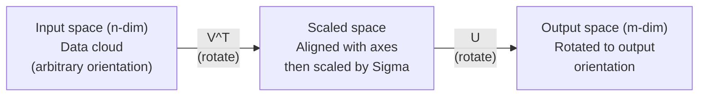
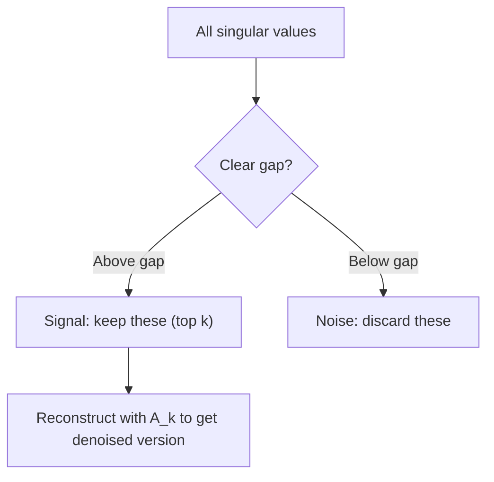

# 奇异值分�

> SVD 是线性代数中的�士军刀。�个矩阵都�SVD。�个数�科学家都需�它�

**类�:** �建 **语言:** Python, Julia  
**先修:** 阶段1，课�01（线性代数直觉）�2（���矩阵�算）�3（矩阵��）  
**预估时间:** ~120 分钟

## 学习目标

- 使用幂迭代法å®�ç�° SVD，并解释 Uã€�Î?å’?Váµ€ 的几何å�«ä¹? 
- 使用截断 SVD 进行图��缩，并比较�缩����误差  
- 通过 SVD 计算 Moore-Penrose 伪逆，求解超定最�二乘方程组  
- �SVD �PCA���系统（潜在因�）以�NLP 中的潜在语义分�建立�系

## 问题

你有一�`np.linalg.svd(A)` 的矩阵。它�能是用�电影评分表，也�能是文档-�项频次表，或是一张图�的�素值矩阵。你需��缩它��噪�挖�潜在结�，或者用它求解最�二乘问题� 
特�值分解�适用�方阵，并且通常�求矩阵拥有一组完备的线性无关特����

SVD 适用�任�形状�秩的矩阵。它将矩阵拆分为三个因�，显�刻画矩阵对空间的几何作用。这是线性代数中最通用�也最�用的分解之一�

## 核心概念

### SVD 的几何��

任何矩阵（�论形状）都�以看作三步�作：旋转�缩放�旋转。SVD 就把这三步显�写出��

```
A = U * Sigma * V^T

      m x n     m x m    m x n    n x n
     (any)    (rotate)  (scale)  (rotate)
```

对任�矩�A，SVD 将其分解为：
- `np.linalg.eig(A.T @ A)` 在输入空间（n 维）中旋转��；
- `code/svd.py` 沿�主轴缩放（拉伸或�缩）；
- `code/svd.jl` 将结�旋转到输出空间（m 维）�



直观�解是：�SVD 一个矩阵，它会告诉你“这个矩阵先�`svd()` 将输入��云转��个方�，��`LinearAlgebra` 拉伸�椭�，�用 `outputs/skill-svd.md` 旋转到输出方�。奇异值就是椭�轴长。�

### 完整分解

对�形状�m x n 的矩�A�

```
A = U * Sigma * V^T

where:
  U     is m x m, orthogonal (U^T U = I)
  Sigma is m x n, diagonal (singular values on the diagonal)
  V     is n x n, orthogonal (V^T V = I)

ÆæÒìÖµÂú×ã sigma_1 >= sigma_2 >= ... >= sigma_r > 0£¬ÆäÖĞ r = rank(A)
```

U µÄÁĞÏòÁ¿³ÆΪ×óÆæÒìÏòÁ¿£»V µÄÁĞÏòÁ¿³ÆΪÓÒÆæÒìÏòÁ¿£»Sigma ¶Ô½ÇÏßÉϵÄÊı³ÆΪÆæÒìÖµ¡£ÆæÒìÖµ×ÜÊǷǸºµÄ£¬Í¨³£°´½µĞòÅÅÁĞ¡£?

### 左奇异���奇异值��奇异��

SVD 的三组分��自有清晰的几何�义�

**�奇异��（V 的列�** 它们��输入空间 R^n 的一组正交基。它们是输入空间中的方�，�过矩阵映射�会对�到输出空间中的�些正交方�。�以把它们看作输入空间的“自然�标系��

**奇异值（Sigma 的对角元�** 它们是缩放系数。第 i 个奇异值表示矩阵沿�i 个�奇异��方�的伸缩�数。奇异值为 0 �味�该方�被矩阵完全���

**左奇异��（U 的列�** 它们��输出空间 R^m 的一组正交基。第 i 个左奇异��是第 i 个�奇异��映射�的方�（包�Sigma 缩放之�）�

三者关系：

```
A * v_i = sigma_i * u_i

¾ØÕó A »á°ÑµÚ i ¸öÓÒÆæÒìÏòÁ¿ v_i ³ËÉÏ sigma_i£¬ÔÙÓ³Éäµ½µÚ i ¸ö×óÆæÒìÏòÁ¿ u_i¡£
```

ÕâÑù¾ÍÄÜ°´×ø±êÖ±¹ÛÀí½âÈÎÒâ¾ØÕóÔÚ×öʲô¡£?

### 外积形�

SVD 还�写�若干�矩阵之和�

```
A = sigma_1 * u_1 * v_1^T + sigma_2 * u_2 * v_2^T + ... + sigma_r * u_r * v_r^T

Each term sigma_i * u_i * v_i^T is a rank-1 matrix (an outer product).
ÍêÕû¾ØÕó¾ÍÊÇÕâ r ¸ö¾ØÕóµÄºÍ£¬ÆäÖĞ r ÊÇÖÈ¡£
```

这也是�秩近似的基础。�加一项就�加一层结�：第一项抓�最主�模�，第二项抓�次�模�，以此类�。截断该和��在给定秩下�得最佳近似�

```
Rank-1 approx:    A_1 = sigma_1 * u_1 * v_1^T
                  (captures the dominant pattern)

Rank-2 approx:    A_2 = sigma_1 * u_1 * v_1^T + sigma_2 * u_2 * v_2^T
                  (captures the two most important patterns)

Rank-k approx:    A_k = sum of top k terms
                  (optimal by the Eckart-Young theorem)
```

### �特�分解的关系

SVD �特�分解高度相关。A 的奇异值�奇异��直��自 A^T A �A A^T 的特��特����

```
A^T A = V * Sigma^T * U^T * U * Sigma * V^T
      = V * Sigma^T * Sigma * V^T
      = V * D * V^T

where D = Sigma^T * Sigma is a diagonal matrix with sigma_i^2 on the diagonal.

So:
- The right singular vectors (V) are eigenvectors of A^T A
- The singular values squared (sigma_i^2) are eigenvalues of A^T A

Similarly:
A A^T = U * Sigma * V^T * V * Sigma^T * U^T
      = U * Sigma * Sigma^T * U^T

So:
- The left singular vectors (U) are eigenvectors of A A^T
- The eigenvalues of A A^T are also sigma_i^2
```

该关系说�三件事�
1. 奇异值始终为�数且�负（它们是�正定矩阵特�值平方根）�
2. �以通过 A^T A 的特�分解求 SVD，但这会把�件数平方并�失精度。工程中通常用专门的 SVD 算法��这一步�
3. �A 为对称�正定方阵时，SVD �特�分解等价�

### 截断 SVD ��秩近�

Eckart-Young-Mirsky 定�指出：在 Frobenius 范数和谱范数下，矩阵 A 的最优秩-k 近似由� k 个奇异值�其对应����：

```
A_k = U_k * Sigma_k * V_k^T

where:
  U_k     is m x k  (first k columns of U)
  Sigma_k is k x k  (top-left k x k block of Sigma)
  V_k     is n x k  (first k columns of V)

Approximation error = sigma_{k+1}  (in spectral norm)
                    = sqrt(sigma_{k+1}^2 + ... + sigma_r^2)  (in Frobenius norm)
```

这�仅是“�错的近似�，而是 **最�* 的秩-k 近似。没有任何秩-k 矩阵能更�近�矩阵�

| 分� | 相对�级 | �留到秩3近似�|
|------|----------|------------------|
| sigma_1 | 最�| �|
| sigma_2 | 很大 | �|
| sigma_3 | 中大 | �|
| sigma_4 | 中等 | �（误差�|
| sigma_5 | 中� | �（误差�|
| sigma_6 | �| �（误差�|
| sigma_7 | 很� | �（误差�|
| sigma_8 | �� | �（误差�|

�留�项时，A_3 抓��三个奇异值；误差�自其余项（sigma_4 �sigma_8）� 
如�奇异值衰�快，少�k 就能覆盖矩阵主�信�；衰�慢则说�矩阵缺少�秩结��

### �SVD �缩图�

�度图�是�素值矩阵。一�800x600 的图�有 480,000 个数值，SVD �用更少�数近似它�

```
Original image: 800 x 600 = 480,000 values

SVD with rank k:
  U_k:      800 x k values
  Sigma_k:  k values
  V_k:      600 x k values
  Total:    k * (800 + 600 + 1) = k * 1401 values

  k=10:   14,010 values   (2.9% of original)
  k=50:   70,050 values  (14.6% of original)
  k=100: 140,100 values  (29.2% of original)

  The compression ratio improves as k gets smaller,
  but visual quality degrades.
```

关键点：自然图�的奇异值通常衰�很快。�几项��整体形状和��，��的项更多是细节和噪声。k=50 往往�在�留大致内容的�时，将存储��约 85%�

### ��系统中的 SVD

Netflix Prize 让这方法广为人知。你会有一个用�电影评分矩阵，且缺失值很多：

```
             Movie1  Movie2  Movie3  Movie4  Movie5
  User1      [  5      ?       3       ?       1  ]
  User2      [  ?      4       ?       2       ?  ]
  User3      [  3      ?       5       ?       ?  ]
  User4      [  ?      ?       ?       4       3  ]

  ? = unknown rating
```

核心�想：该评分矩阵近似�秩。用户�好并�完全独立，��少�潜在因素�制（如动作/剧情��好新旧片�格���感性�好）�

对填补�的评分矩阵� SVD �：
- U: 用户在潜在因�空间中的画�
- Sigma: �潜在因�的���
- V^T: 电影在潜在因�空间中的画�

用户对电影的预测评分�由对应用户画��电影画�的点积（按奇异值加�）得到，�秩��自然会补�缺失项�

�际应用常用 Simon Funk 的��SVD �ALS（交替最�二乘）直�处�缺失数�，但核心�想�是通过 SVD 的潜在因�分解���

### NLP 中的 SVD：潜在语义分�（LSA�

潜在语义分�（LSA�潜在语义索引（LSI）就是把 SVD 用��项-文档矩阵�

```
             Doc1   Doc2   Doc3   Doc4
  "cat"      [  3      0      1      0  ]
  "dog"      [  2      0      0      1  ]
  "fish"     [  0      4      1      0  ]
  "pet"      [  1      1      1      1  ]
  "ocean"    [  0      3      0      0  ]

After SVD with rank k=2:

  Each document becomes a point in 2D "concept space."
  Each term becomes a point in the same 2D space.
  Documents about similar topics cluster together.
  Terms with similar meanings cluster together.

  "cat" and "dog" end up near each other (land pets).
  "fish" and "ocean" end up near each other (water concepts).
  Doc1 and Doc3 cluster if they share similar topics.
```

LSA 是早期在�始文本上��语义相似性的�功方法，�因在��义�往往在相似文档中共�，因�SVD 把它们放到�一潜在维度中。�代�嵌入（Word2Vec�GloVe）�被视为这一�想的演化方��

### SVD 在�噪中的应�

噪声通常分散在所有奇异值上，而有用信�集中在�几项。截断���噪声底��

**纯信�的奇异值示�*

| 分� | 幅度 | 类� |
|------|------|------|
| sigma_1 | �常�| 信� |
| sigma_2 | �| 信� |
| sigma_3 | 中等 | 信� |
| sigma_4 | �近 0 | �忽�|
| sigma_5 | �近 0 | �忽�|

**�噪信�（噪声扩散到所有分�）**

| 分� | 幅度 | 类� |
|------|------|------|
| sigma_1 | �常�| 信� |
| sigma_2 | �| 信� |
| sigma_3 | 中等 | 信� |
| sigma_4 | �| 噪声 |
| sigma_5 | �| 噪声 |
| sigma_6 | �| 噪声 |
| sigma_7 | �| 噪声 |



该方法用�信�处��科学测��数�清洗：对加性噪声污染的矩阵，截�SVD 是分离信��噪声的��手段�

### 通过 SVD 计算伪�

Moore-Penrose 伪�A+ 将“求逆��广到�方阵和奇异矩阵。SVD 让计算�常直��

```
If A = U * Sigma * V^T, then:

A+ = V * Sigma+ * U^T

where Sigma+ is formed by:
  1. Transpose Sigma (swap rows and columns)
  2. Replace each non-zero diagonal entry sigma_i with 1/sigma_i
  3. Leave zeros as zeros

For A (m x n):      A+ is (n x m)
For Sigma (m x n):  Sigma+ is (n x m)
```

伪逆�解最�二乘问题：�Ax=b 无精确解（超定系统），则 x = A+ b 是最�二乘解，最�化 ||Ax - b||�

```
Overdetermined system (more equations than unknowns):

  [1  1]         [3]
  [2  1] x   =   [5]       No exact solution exists.
  [3  1]         [6]

  x_ls = A+ b = V * Sigma+ * U^T * b

  This gives the x that minimizes the sum of squared residuals.
  Same result as the normal equations (A^T A)^(-1) A^T b,
  but numerically more stable.
```

### 数值稳定性优�

直��A^T A 特�分解会平方奇异值（其特�值为 sigma_i^2），也会平方�件数，放大数值误差�

```
ʾÀı£º
  A has singular values [1000, 1, 0.001]
  Condition number of A: 1000 / 0.001 = 10^6

  A^T A has eigenvalues [10^6, 1, 10^{-6}]
  Condition number of A^T A: 10^6 / 10^{-6} = 10^{12}

  Computing SVD directly: works with condition number 10^6
  Computing via A^T A:     works with condition number 10^{12}
                           (6 extra digits of precision lost)
```

�代 SVD 算法（如 Golub-Kahan �对角化）直�处�A，�会显���A^T A，所以数值更稳。一般建议始终使�np.linalg.svd(A)，而��np.linalg.eig(A.T @ A)�

### �PCA 的��

对中心化�的数�，PCA 本质上就�SVD，�是类比而是�一计算�

```
Given data matrix X (n_samples x n_features), centered (mean subtracted):

Covariance matrix: C = (1/(n-1)) * X^T X

PCA finds eigenvectors of C. But:

  X = U * Sigma * V^T    (SVD of X)

  X^T X = V * Sigma^2 * V^T

  C = (1/(n-1)) * V * Sigma^2 * V^T

ËùÒÔÖ÷³É·Ö¾ÍÊÇÓÒÆæÒìÏòÁ¿ V¡£
ÿ¸öÖ÷³É·ÖµÄ½âÊÍ·½²îΪ sigma_i^2 / (n-1)¡£

ÔÚ sklearn ÖĞ£¬PCA ÊÇÓà SVD ʵÏֵģ¬¶ø²»ÊÇÓÃÌØÕ÷·Ö½â¡£
ÕâÑù¸ü¿ì£¬Ò²¸üÊıÖµÎȶ¨¡£
```

这�味��0课的�维本质上就是在更底层用 SVD ��的；PCA 是机器学习中最常��SVD 应用之一�

```figure
svd-rank-reconstruction
```

## ��

### 步骤 1：用幂迭代�零��SVD

�路：先找最大奇异值�对应��（��A^T A �A A^T �幂迭代），然��deflation（�除）����

```python
import numpy as np

def power_iteration(M, num_iters=100):
    n = M.shape[1]
    v = np.random.randn(n)
    v = v / np.linalg.norm(v)

    for _ in range(num_iters):
        Mv = M @ v
        v = Mv / np.linalg.norm(Mv)

    eigenvalue = v @ M @ v
    return eigenvalue, v

def svd_from_scratch(A, k=None):
    m, n = A.shape
    if k is None:
        k = min(m, n)

    sigmas = []
    us = []
    vs = []

    A_residual = A.copy().astype(float)

    for _ in range(k):
        AtA = A_residual.T @ A_residual
        eigenvalue, v = power_iteration(AtA, num_iters=200)

        if eigenvalue < 1e-10:
            break

        sigma = np.sqrt(eigenvalue)
        u = A_residual @ v / sigma

        sigmas.append(sigma)
        us.append(u)
        vs.append(v)

        A_residual = A_residual - sigma * np.outer(u, v)

    U = np.column_stack(us) if us else np.empty((m, 0))
    S = np.array(sigmas)
    V = np.column_stack(vs) if vs else np.empty((n, 0))

    return U, S, V
```

### 步骤 2：� NumPy 比较验�

```python
np.random.seed(42)
A = np.random.randn(5, 4)

U_ours, S_ours, V_ours = svd_from_scratch(A)
U_np, S_np, Vt_np = np.linalg.svd(A, full_matrices=False)

print("Our singular values:", np.round(S_ours, 4))
print("NumPy singular values:", np.round(S_np, 4))

A_reconstructed = U_ours @ np.diag(S_ours) @ V_ours.T
print(f"Reconstruction error: {np.linalg.norm(A - A_reconstructed):.8f}")
```

### 步骤 3：图��缩示�

```python
def compress_image_svd(image_matrix, k):
    U, S, Vt = np.linalg.svd(image_matrix, full_matrices=False)
    compressed = U[:, :k] @ np.diag(S[:k]) @ Vt[:k, :]
    return compressed

image = np.random.seed(42)
rows, cols = 200, 300
image = np.random.randn(rows, cols)

for k in [1, 5, 10, 20, 50]:
    compressed = compress_image_svd(image, k)
    error = np.linalg.norm(image - compressed) / np.linalg.norm(image)
    original_size = rows * cols
    compressed_size = k * (rows + cols + 1)
    ratio = compressed_size / original_size
    print(f"k={k:>3d}  error={error:.4f}  storage={ratio:.1%}")
```

### 步骤 4：�噪示�

```python
np.random.seed(42)
clean = np.outer(np.sin(np.linspace(0, 4*np.pi, 100)),
                 np.cos(np.linspace(0, 2*np.pi, 80)))
noise = 0.3 * np.random.randn(100, 80)
noisy = clean + noise

U, S, Vt = np.linalg.svd(noisy, full_matrices=False)
denoised = U[:, :5] @ np.diag(S[:5]) @ Vt[:5, :]

print(f"Noisy error:    {np.linalg.norm(noisy - clean):.4f}")
print(f"Denoised error: {np.linalg.norm(denoised - clean):.4f}")
print(f"Improvement:    {(1 - np.linalg.norm(denoised - clean) / np.linalg.norm(noisy - clean)):.1%}")
```

### 步骤 5：伪逆示�

```python
A = np.array([[1, 1], [2, 1], [3, 1]], dtype=float)
b = np.array([3, 5, 6], dtype=float)

U, S, Vt = np.linalg.svd(A, full_matrices=False)
S_inv = np.diag(1.0 / S)
A_pinv = Vt.T @ S_inv @ U.T

x_svd = A_pinv @ b
x_lstsq = np.linalg.lstsq(A, b, rcond=None)[0]
x_pinv = np.linalg.pinv(A) @ b

print(f"SVD pseudoinverse solution:  {x_svd}")
print(f"np.linalg.lstsq solution:   {x_lstsq}")
print(f"np.linalg.pinv solution:    {x_pinv}")
```

## 使用

code/svd.py 中有完整示例，�直��行查看图��缩���系统�LSA ��噪效��

```bash
python svd.py
```

Julia 版本�code/svd.jl，演示了使用 Julia �生 svd() �LinearAlgebra 的���

```bash
julia svd.jl
```

## 交付

本课目标产出�
- outputs/skill-svd.md：说�在真�项目中何时以�如何使�SVD 的技能文�

## 练习

1. �使用幂迭代，�零��完�SVD。你�以先对 A^T A �特�分解得�V 和奇异值，�用 U = A V Sigma^{-1} 计算 U。比较该���幂迭代版本�NumPy 的数值差异�

2. 读�一张真��度图（或转为�度图）。�试秩�1��0�5�0�00 的�缩，计算�缩����误差，找出视觉上���的秩�

3. �建一�10x8 的用�电影评分矩阵，�留部分已知项。用行�值填充缺失值，�SVD 并��秩3近似，用��结�预测缺失评分并检查是����

4. 生�一�100x50 的文��项矩阵，包�3 个��主题（�个主题 5 个�），�加噪声。� SVD，验��三个奇异值显著大�剩余项。将文档投影到三维潜在空间，检查�一主题文档是��类�

5. 生æˆ�一个秩ä¸?çš?50x40 干净ä½�秩矩阵并加高斯噪声（Ï?= 0.1, 0.5, 1.0, 2.0）。对æ¯�个噪声水平，在 k=1..40 扫æ��，绘制é‡�æ�„误差并找出最ä¼?k ä¸�噪声水平的关系å�˜åŒ–ã€?

## 关键术语

| 术语 | 常�说法 | �际�义 |
|------|---------|----------|
| SVD | “分解任�矩阵�| �A 分解�U Sigma V^T，其�U�V 正交，Sigma �负对角。对任�形状矩阵都适用 |
| 奇异�| “这个方�有多���| Sigma 的第 i 个对角元，表示矩阵沿�i 个主方�的伸缩程度，�负且��|
| 左奇异��| “输出方��| U 的一列，表示�i 个�奇异��在输出空间中的归宿方�（�sigma_i 缩放�） |
| �奇异��| “输入方��| V 的一列，表示输入空间中�矩阵映射到第 i 个左奇异��的方�|
| 截断 SVD | “�秩近似�| ��留� k 个奇异值和对应��，得到秩k的最优近似（Eckart-Young 定����|
| �| “真正的维数�| �零奇异值的数�，表示矩阵�际�用的独立方��|
| 伪�| “广义逆�| V Sigma+ U^T，对�零奇异值�倒数，其余��，求解�方阵/奇异矩阵的最�二�|
| �件�| “对误差的�感性�| sigma_max / sigma_min，数值越大，输入微��化会放大为输出更大�化；SVD �直���|
| 潜在因� | “�����| SVD 在�秩空间中��的维度；��系统里�对应题��好，NLP里�对应主题 |
| Frobenius 范数 | “矩阵总�度�| 所有元素平方和�开方，等�奇异值平方和开方，常用�近似误�|
| Eckart-Young 定� | “SVD 给最佳�缩�| 对任�目标秩 k，截�SVD 在所有秩k矩阵里误差最�|
| 幂迭�| “找最大特����| ��乘以矩阵并归一化，会收敛到最大特�值对应的特���，是很多 SVD 算法基础 |

## 延伸阅读

- [Gilbert Strang: Linear Algebra and Its Applications, Chapter 7](https://math.mit.edu/~gs/linearalgebra/) - 深入讲解 SVD �应� 
- [3Blue1Brown: But what is the SVD?](https://www.youtube.com/watch?v=vSczTbgc8Rc) - SVD 的几何直� 
- [We Recommend a Singular Value Decomposition](https://www.ams.org/publicoutreach/feature-column/fcarc-svd) - AMS 的通俗 SVD 介�  
- [Netflix Prize and Matrix Factorization](https://sifter.org/~simon/journal/20061211.html) - Simon Funk 关���系统 SVD 的开创性�� 
- [Latent Semantic Analysis](https://en.wikipedia.org/wiki/Latent_semantic_analysis) - NLP �SVD 的�典应� 
- [Numerical Linear Algebra by Trefethen and Bau](https://people.maths.ox.ac.uk/trefethen/text.html) - �解 SVD 算法�数值性质的标准教�


