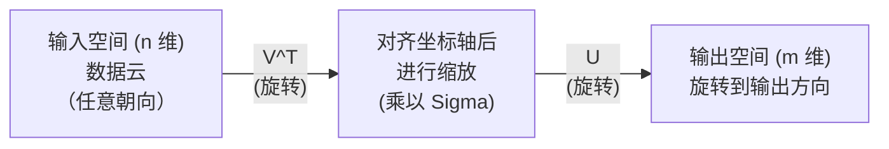
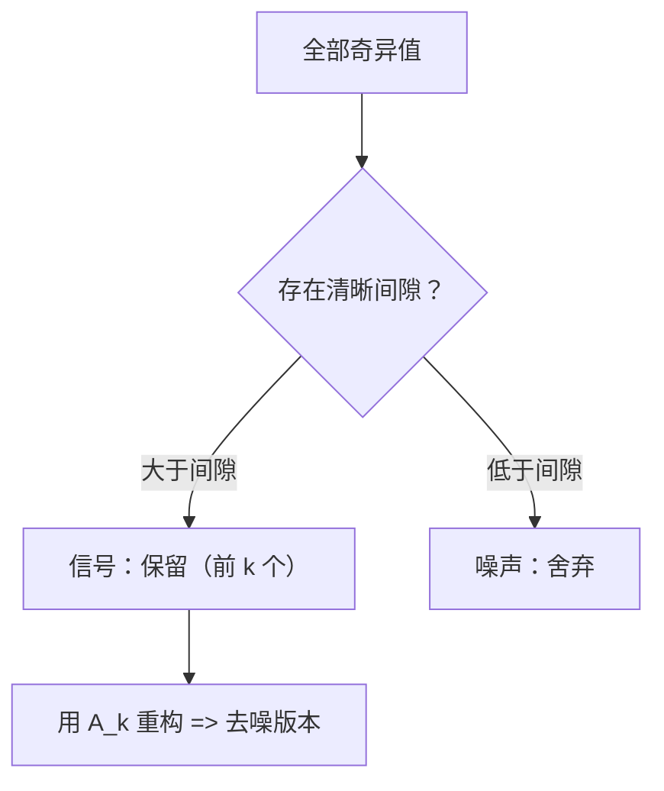

# 奇异值分解

> SVD 是线性代数中的瑞士军刀。每个矩阵都有 SVD。每个数据科学家都需要它。

**类型:** Build  
**语言:** Python, Julia  
**先修:** 阶段1，课程 01（线性代数直觉）、02（向量与矩阵运算）、03（矩阵变换）  
**预估时间:** ~120 分钟

## 学习目标

- 使用幂迭代法实现 SVD，并解释 U、Σ 和 Vᵀ 的几何含义  
- 使用截断 SVD 进行图像压缩，并比较压缩率与重构误差  
- 通过 SVD 计算 Moore-Penrose 伪逆，求解超定最小二乘方程组  
- 将 SVD 与 PCA、推荐系统（潜在因子）以及 NLP 中的潜在语义分析建立联系

## 问题

你有一个 `1000x2000` 的矩阵。它可能是用户-电影评分表，也可能是文档-词项频次表，或是一张图像的像素值矩阵。你需要压缩它、去噪、挖掘潜在结构，或者用它求解最小二乘问题。  
特征值分解只适用于方阵，并且通常要求矩阵拥有一组完备的线性无关特征向量。

SVD 适用于任意形状与秩的矩阵。它将矩阵拆分为三个因子，显式刻画矩阵对空间的几何作用。这是线性代数中最通用、也最实用的分解之一。

## 核心概念

### SVD 的几何意义

任何矩阵（不论形状）都可以看作三步操作：旋转、缩放、旋转。SVD 就把这三步显式写出来。

```text
A = U * Sigma * V^T

      m x n     m x m    m x n    n x n
     (任意)    (旋转)   (缩放)   (旋转)
```

对任意矩阵 A，SVD 将其分解为：
- `V^T` 在输入空间（n 维）中旋转向量；
- `Sigma` 沿各主轴缩放（拉伸或压缩）；
- `U` 将结果旋转到输出空间（m 维）。



直观理解是：给 SVD 一个矩阵，它会告诉你“这个矩阵先用 `V^T` 将输入向量云转向某个方向，再由 `Sigma` 拉伸成椭球，再用 `U` 旋转到输出方向。奇异值就是椭球轴长。”

### 完整分解

对于形状为 `m x n` 的矩阵 A：

```text
A = U * Sigma * V^T

其中:
  U     是 m x m 的正交矩阵 (U^T U = I)
  Sigma 是 m x n 的对角矩阵（对角线上是奇异值）
  V     是 n x n 的正交矩阵 (V^T V = I)

奇异值 sigma_1 >= sigma_2 >= ... >= sigma_r > 0
其中 r = rank(A)
```

`U` 的列向量称为左奇异向量；`V` 的列向量称为右奇异向量；`Sigma` 对角线上的数称为奇异值。奇异值始终非负，通常按降序排序。

### 左奇异向量、奇异值、右奇异向量

SVD 的三组分量各自有清晰的几何含义。

**右奇异向量（`V` 的列）:** 它们构成输入空间 `R^n` 的一组正交基。它们是输入空间中的方向，经过矩阵映射后会对齐到输出空间中的某些正交方向。可以把它们看作输入空间的“自然坐标系”。

**奇异值（`Sigma` 的对角元）:** 它们是缩放系数。第 `i` 个奇异值表示矩阵沿第 `i` 个右奇异向量方向的伸缩倍数。奇异值为 0 意味着该方向被矩阵完全压扁。

**左奇异向量（`U` 的列）:** 它们构成输出空间 `R^m` 的一组正交基。第 `i` 个左奇异向量是第 `i` 个右奇异向量映射后的方向（包含 `Sigma` 缩放之后）。

三者关系：

```text
A * v_i = sigma_i * u_i

矩阵 A 取第 i 个右奇异向量 v_i，
按 sigma_i 缩放后映射到第 i 个左奇异向量 u_i。
```

这样就能按坐标对应理解任何矩阵在做什么。

### 外积形式

SVD 还可写成若干秩1矩阵之和：

```text
A = sigma_1 * u_1 * v_1^T + sigma_2 * u_2 * v_2^T + ... + sigma_r * u_r * v_r^T

每一项 sigma_i * u_i * v_i^T 都是秩1矩阵（外积）。
完整矩阵是这 r 个秩1项之和，其中 r 是矩阵秩。
```

这也是低秩近似的基础。每加一项就增加一层结构：第一项抓住最主要模式，第二项抓住次要模式，以此类推。截断该和式可在给定秩下获得最佳近似。

```text
秩1近似:   A_1 = sigma_1 * u_1 * v_1^T
            （抓住主导模式）

秩2近似:   A_2 = sigma_1 * u_1 * v_1^T + sigma_2 * u_2 * v_2^T
            （抓住两大主导模式）

秩k近似:   A_k = 前 k 项之和
            （Eckart-Young 定理保证最优）
```

### 与特征分解的关系

SVD 与特征分解高度相关。A 的奇异值与奇异向量直接来自 `A^T A` 与 `A A^T` 的特征值/特征向量。

```text
A^T A = V * Sigma^T * U^T * U * Sigma * V^T
      = V * Sigma^T * Sigma * V^T
      = V * D * V^T

其中 D = Sigma^T * Sigma，是对角矩阵，包含 sigma_i^2。

因此:
- 右奇异向量 V 是 A^T A 的特征向量
- sigma_i^2 是 A^T A 的特征值

同理:
A A^T = U * Sigma * V^T * V * Sigma^T * U^T
      = U * Sigma * Sigma^T * U^T

因此:
- 左奇异向量 U 是 A A^T 的特征向量
- A A^T 的特征值也为 sigma_i^2
```

该关系说明三件事：
1. 奇异值始终为实数且非负（它们是半正定矩阵特征值平方根）。
2. 可以通过 `A^T A` 的特征分解求 SVD，但这会把条件数平方并损失精度。工程中通常用专门的 SVD 算法避免这一步。
3. 当 A 为对称半正定方阵时，SVD 与特征分解等价。

### 截断 SVD 与低秩近似

Eckart-Young-Mirsky 定理指出：在 Frobenius 范数和谱范数下，矩阵 A 的最优秩-k 近似由前 k 个奇异值及其对应向量构成：

```text
A_k = U_k * Sigma_k * V_k^T

其中:
  U_k:     m x k（U 的前 k 列）
  Sigma_k: k x k（Sigma 的左上角 kxk 块）
  V_k:     n x k（V 的前 k 列）

近似误差（谱范数）= sigma_{k+1}
近似误差（Frobenius 范数）= sqrt(sigma_{k+1}^2 + ... + sigma_r^2)
```

这不仅是“不错的近似”，而是 **最优** 的秩-k 近似。没有任何秩-k 矩阵能更接近原矩阵。

| 分量 | 相对量级 | 保留到秩3近似？ |
|------|----------|------------------|
| sigma_1 | 最大 | 是 |
| sigma_2 | 很大 | 是 |
| sigma_3 | 中大 | 是 |
| sigma_4 | 中等 | 否（误差） |
| sigma_5 | 中小 | 否（误差） |
| sigma_6 | 小 | 否（误差） |
| sigma_7 | 很小 | 否（误差） |
| sigma_8 | 极小 | 否（误差） |

保留前3项时，`A_3` 抓住前三个奇异值；误差来自其余项（`sigma_4` 到 `sigma_8`）。  
如果奇异值衰减快，少量 k 就能覆盖矩阵主要信息；衰减慢则说明矩阵缺少低秩结构。

### 用 SVD 压缩图像

灰度图像是像素值矩阵。一张 `800x600` 的图像有 `480,000` 个数值，SVD 可用更少参数近似它。

```text
原始图像: 800 x 600 = 480,000

截断SVD（秩 k）:
  U_k:      800 x k
  Sigma_k:  k
  V_k:      600 x k
  总参数:   k * (800 + 600 + 1) = k * 1401

  k=10:   14,010 参数（原始的 2.9%）
  k=50:   70,050 参数（原始的 14.6%）
  k=100: 140,100 参数（原始的 29.2%）

  k 越小压缩率越高，
  但视觉质量会下降。
```

关键点：自然图像的奇异值通常衰减很快。前几项捕捉整体形状和渐变，后面的项更多是细节和噪声。`k=50` 往往可在保留大致内容的同时，将存储降低约 85%。

### 推荐系统中的 SVD

Netflix Prize 让这方法广为人知。你会有一个用户-电影评分矩阵，且缺失值很多：

```text
             电影1  电影2  电影3  电影4  电影5
用户1        [  5      ?     3       ?      1]
用户2        [  ?      4     ?       2      ?]
用户3        [  3      ?     5       ?      ?]
用户4        [  ?      ?     ?       4      3]

  ?: 未知评分
```

核心思想：该评分矩阵近似低秩。用户偏好并非完全独立，只受少量潜在因素控制（如动作/剧情、偏好新旧片风格、理性/感性偏好）。

对填补后的评分矩阵做 SVD 后：
- `U`: 用户在潜在因子空间中的画像
- `Sigma`: 各潜在因子的重要性
- `V^T`: 电影在潜在因子空间中的画像

用户对电影的预测评分可由对应用户画像与电影画像的点积（按奇异值加权）得到，低秩重构自然会补齐缺失项。

实际应用常用 Simon Funk 的增量 SVD 或 ALS（交替最小二乘）直接处理缺失数据，但核心思想仍是通过 SVD 的潜在因子分解实现。

### NLP 中的 SVD：潜在语义分析（LSA）

潜在语义分析（LSA）/潜在语义索引（LSI）就是把 SVD 用于词项-文档矩阵。

```text
             文档1 文档2 文档3 文档4
“cat”       [  3     0     1     0 ]
“dog”       [  2     0     0     1 ]
“fish”      [  0     4     1     0 ]
“pet”       [  1     1     1     1 ]
“ocean”     [  0     3     0     0 ]

设定秩 k=2 后:

  每篇文档映射到二维“概念空间”点；
  每个词也映射到同一二维空间；
  主题接近的文档会聚在一起；
  语义接近的词也会聚在一起。

  “cat” 与 “dog” 相互接近（陆生宠物）；
  “fish” 与 “ocean” 相互接近（水域语义）；
  文档1与文档3若主题相似也会聚类。
```

LSA 是早期在原始文本上捕获语义相似性的成功方法，原因在于同义词往往在相似文档中共现，因此 SVD 把它们放到同一潜在维度中。现代词嵌入（Word2Vec、GloVe）可被视为这一思想的演化方向。

### SVD 在降噪中的应用

噪声通常分散在所有奇异值上，而有用信号集中在前几项。截断可去掉噪声底板。

**纯信号的奇异值示例**

| 分量 | 幅度 | 类型 |
|------|------|------|
| sigma_1 | 非常大 | 信号 |
| sigma_2 | 大 | 信号 |
| sigma_3 | 中等 | 信号 |
| sigma_4 | 接近 0 | 可忽略 |
| sigma_5 | 接近 0 | 可忽略 |

**含噪信号（噪声扩散到所有分量）**

| 分量 | 幅度 | 类型 |
|------|------|------|
| sigma_1 | 非常大 | 信号 |
| sigma_2 | 大 | 信号 |
| sigma_3 | 中等 | 信号 |
| sigma_4 | 小 | 噪声 |
| sigma_5 | 小 | 噪声 |
| sigma_6 | 小 | 噪声 |
| sigma_7 | 小 | 噪声 |



该方法用于信号处理、科学测量与数据清洗：对加性噪声污染的矩阵，截断 SVD 是分离信号与噪声的可靠手段。

### 通过 SVD 计算伪逆

Moore-Penrose 伪逆 `A+` 将“求逆”推广到非方阵和奇异矩阵。SVD 让计算非常直接。

```text
若 A = U * Sigma * V^T，则

A+ = V * Sigma+ * U^T

其中 Sigma+ 构造如下:
  1. 转置 Sigma（交换行列）
  2. 对每个非零对角元 sigma_i 取倒数 1/sigma_i
  3. 零元素保持为 0

若 A 为 m x n，则:
  A+ 为 n x m
  Sigma+ 为 n x m
```

伪逆可解最小二乘问题：若 `Ax=b` 无精确解（超定系统），则 `x = A+ b` 是最小二乘解，最小化 `||Ax - b||`。

```text
超定系统（方程数 > 未知数）:

  [1  1]         [3]
  [2  1] x   =   [5]   无精确解
  [3  1]         [6]

  x_ls = A+ b = V * Sigma+ * U^T * b

  得到的 x 使平方残差和最小；
  与正规方程 (A^T A)^(-1) A^T b 同解；
  但数值更稳定。
```

### 数值稳定性优势

直接对 `A^T A` 特征分解会平方奇异值（其特征值为 `sigma_i^2`），也会平方条件数，放大数值误差。

```text
示例:
  A 的奇异值为 [1000, 1, 0.001]
  A 的条件数 = 1000/0.001 = 10^6

  A^T A 的特征值: [10^6, 1, 10^-6]
  A^T A 的条件数 = 10^6 / 10^-6 = 10^12

  直接算 SVD 的条件数: 10^6
  经 A^T A 计算的条件数: 10^12
  （额外损失约 6 位有效数字）
```

现代 SVD 算法（如 Golub-Kahan 双对角化）直接处理 A，不会显式构造 `A^T A`，所以数值更稳。一般建议始终使用 `np.linalg.svd(A)`，而不是 `np.linalg.eig(A.T @ A)`。

### 与 PCA 的连接

对中心化后的数据，PCA 本质上就是 SVD，不是类比而是同一计算。

```text
给定数据矩阵 X (n_samples x n_features)，先中心化（减均值）:

协方差矩阵: C = (1/(n-1)) * X^T X

PCA 求的是 C 的特征向量，但:

  X = U * Sigma * V^T    （X 的 SVD）

  X^T X = V * Sigma^2 * V^T

  C = (1/(n-1)) * V * Sigma^2 * V^T

因此主成分向量即右奇异向量 V。
每个分量解释方差 = sigma_i^2 / (n-1)。

在 sklearn 中 PCA 通常用 SVD 实现，而不是特征分解；
它更快、数值更稳定。
```

这意味着第10课的降维本质上就是在更底层用 SVD 实现的；PCA 是机器学习中最常见的 SVD 应用之一。

```figure
svd-rank-reconstruction
```

## 实现

### 步骤 1：用幂迭代从零实现 SVD

思路：先找最大奇异值及对应向量（可对 `A^T A` 或 `A A^T` 做幂迭代），然后做 deflation（去除）再重复。

```python
import numpy as np

def power_iteration(M, num_iters=100):
    n = M.shape[1]
    v = np.random.randn(n)
    v = v / np.linalg.norm(v)

    for _ in range(num_iters):
        Mv = M @ v
        v = Mv / np.linalg.norm(Mv)

    eigenvalue = v @ M @ v
    return eigenvalue, v

def svd_from_scratch(A, k=None):
    m, n = A.shape
    if k is None:
        k = min(m, n)

    sigmas = []
    us = []
    vs = []

    A_residual = A.copy().astype(float)

    for _ in range(k):
        AtA = A_residual.T @ A_residual
        eigenvalue, v = power_iteration(AtA, num_iters=200)

        if eigenvalue < 1e-10:
            break

        sigma = np.sqrt(eigenvalue)
        u = A_residual @ v / sigma

        sigmas.append(sigma)
        us.append(u)
        vs.append(v)

        A_residual = A_residual - sigma * np.outer(u, v)

    U = np.column_stack(us) if us else np.empty((m, 0))
    S = np.array(sigmas)
    V = np.column_stack(vs) if vs else np.empty((n, 0))

    return U, S, V
```

### 步骤 2：与 NumPy 比较验证

```python
np.random.seed(42)
A = np.random.randn(5, 4)

U_ours, S_ours, V_ours = svd_from_scratch(A)
U_np, S_np, Vt_np = np.linalg.svd(A, full_matrices=False)

print("Our singular values:", np.round(S_ours, 4))
print("NumPy singular values:", np.round(S_np, 4))

A_reconstructed = U_ours @ np.diag(S_ours) @ V_ours.T
print(f"Reconstruction error: {np.linalg.norm(A - A_reconstructed):.8f}")
```

### 步骤 3：图像压缩示例

```python
def compress_image_svd(image_matrix, k):
    U, S, Vt = np.linalg.svd(image_matrix, full_matrices=False)
    compressed = U[:, :k] @ np.diag(S[:k]) @ Vt[:k, :]
    return compressed

image = np.random.seed(42)
rows, cols = 200, 300
image = np.random.randn(rows, cols)

for k in [1, 5, 10, 20, 50]:
    compressed = compress_image_svd(image, k)
    error = np.linalg.norm(image - compressed) / np.linalg.norm(image)
    original_size = rows * cols
    compressed_size = k * (rows + cols + 1)
    ratio = compressed_size / original_size
    print(f"k={k:>3d}  error={error:.4f}  storage={ratio:.1%}")
```

### 步骤 4：降噪示例

```python
np.random.seed(42)
clean = np.outer(np.sin(np.linspace(0, 4*np.pi, 100)),
                 np.cos(np.linspace(0, 2*np.pi, 80)))
noise = 0.3 * np.random.randn(100, 80)
noisy = clean + noise

U, S, Vt = np.linalg.svd(noisy, full_matrices=False)
denoised = U[:, :5] @ np.diag(S[:5]) @ Vt[:5, :]

print(f"Noisy error:    {np.linalg.norm(noisy - clean):.4f}")
print(f"Denoised error: {np.linalg.norm(denoised - clean):.4f}")
print(f"Improvement:    {(1 - np.linalg.norm(denoised - clean) / np.linalg.norm(noisy - clean)):.1%}")
```

### 步骤 5：伪逆示例

```python
A = np.array([[1, 1], [2, 1], [3, 1]], dtype=float)
b = np.array([3, 5, 6], dtype=float)

U, S, Vt = np.linalg.svd(A, full_matrices=False)
S_inv = np.diag(1.0 / S)
A_pinv = Vt.T @ S_inv @ U.T

x_svd = A_pinv @ b
x_lstsq = np.linalg.lstsq(A, b, rcond=None)[0]
x_pinv = np.linalg.pinv(A) @ b

print(f"SVD pseudoinverse solution:  {x_svd}")
print(f"np.linalg.lstsq solution:   {x_lstsq}")
print(f"np.linalg.pinv solution:    {x_pinv}")
```

## 使用

`code/svd.py` 中有完整示例，可直接运行查看图像压缩、推荐系统、LSA 与降噪效果。

```bash
python svd.py
```

Julia 版本在 `code/svd.jl`，演示了使用 Julia 原生 `svd()` 与 `LinearAlgebra` 的实现。

```bash
julia svd.jl
```

## 交付

本课目标产出：
- `outputs/skill-svd.md`：说明在真实项目中何时以及如何使用 SVD 的技能文档

## 练习

1. 不使用幂迭代，从零实现完整 SVD。你可以先对 `A^T A` 做特征分解得到 `V` 和奇异值，再用 `U = A V Sigma^{-1}` 计算 `U`。比较该实现与幂迭代版本及 NumPy 的数值差异。

2. 读取一张真实灰度图（或转为灰度图）。尝试秩为 1、5、10、25、50、100 的压缩，计算压缩率与重构误差，找出视觉上可接受的秩。

3. 构建一个 10x8 的用户-电影评分矩阵，保留部分已知项。用行均值填充缺失值，做 SVD 并重构秩3近似，用重构结果预测缺失评分并检查是否合理。

4. 生成一个 `100x50` 的文档-词项矩阵，包含 3 个合成主题（每个主题 5 个词），再加噪声。做 SVD，验证前三个奇异值显著大于剩余项。将文档投影到三维潜在空间，检查同一主题文档是否聚类。

5. 生成一个秩为3的 `50x40` 干净低秩矩阵并加高斯噪声（σ = 0.1, 0.5, 1.0, 2.0）。对每个噪声水平，在 `k=1..40` 扫描，绘制重构误差并找出最优 k 与噪声水平的关系变化。

## 关键术语

| 术语 | 常见说法 | 实际含义 |
|------|---------|----------|
| SVD | “分解任意矩阵” | 将 A 分解为 `U Sigma V^T`，其中 U、V 正交，Sigma 非负对角。对任意形状矩阵都适用 |
| 奇异值 | “这个方向有多重要” | `Sigma` 的第 i 个对角元，表示矩阵沿第 i 个主方向的伸缩程度，非负且降序 |
| 左奇异向量 | “输出方向” | U 的一列，表示第 i 个右奇异向量在输出空间中的归宿方向（含 sigma_i 缩放后） |
| 右奇异向量 | “输入方向” | V 的一列，表示输入空间中经矩阵映射到第 i 个左奇异向量的方向 |
| 截断 SVD | “低秩近似” | 只保留前 k 个奇异值和对应向量，得到秩k的最优近似（Eckart-Young 定理保证） |
| 秩 | “真正的维数” | 非零奇异值的数量，表示矩阵实际可用的独立方向数 |
| 伪逆 | “广义逆” | `V Sigma+ U^T`，对非零奇异值取倒数，其余保持0，求解非方阵/奇异矩阵的最小二乘 |
| 条件数 | “对误差的敏感性” | `sigma_max / sigma_min`，数值越大，输入微小变化会放大为输出更大变化；SVD 可直接反映 |
| 潜在因子 | “隐藏变量” | SVD 在低秩空间中发现的维度；推荐系统里可对应题材偏好，NLP里可对应主题 |
| Frobenius 范数 | “矩阵总量度” | 所有元素平方和再开方，等于奇异值平方和开方，常用于近似误差 |
| Eckart-Young 定理 | “SVD 给最佳压缩” | 对任意目标秩 k，截断 SVD 在所有秩k矩阵里误差最小 |
| 幂迭代 | “找最大特征向量” | 重复乘以矩阵并归一化，会收敛到最大特征值对应的特征向量，是很多 SVD 算法基础 |

## 延伸阅读

- [Gilbert Strang: Linear Algebra and Its Applications, Chapter 7](https://math.mit.edu/~gs/linearalgebra/) - 深入讲解 SVD 与应用  
- [3Blue1Brown: But what is the SVD?](https://www.youtube.com/watch?v=vSczTbgc8Rc) - SVD 的几何直觉  
- [We Recommend a Singular Value Decomposition](https://www.ams.org/publicoutreach/feature-column/fcarc-svd) - AMS 的通俗 SVD 介绍  
- [Netflix Prize and Matrix Factorization](https://sifter.org/~simon/journal/20061211.html) - Simon Funk 关于推荐系统 SVD 的开创性博文  
- [Latent Semantic Analysis](https://en.wikipedia.org/wiki/Latent_semantic_analysis) - NLP 中 SVD 的经典应用  
- [Numerical Linear Algebra by Trefethen and Bau](https://people.maths.ox.ac.uk/trefethen/text.html) - 理解 SVD 算法与数值性质的标准教材
