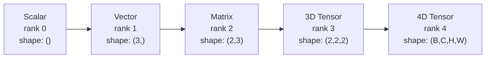
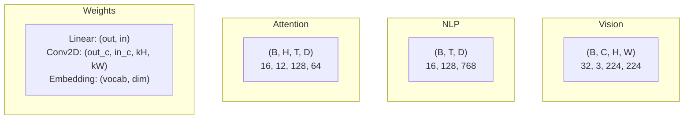
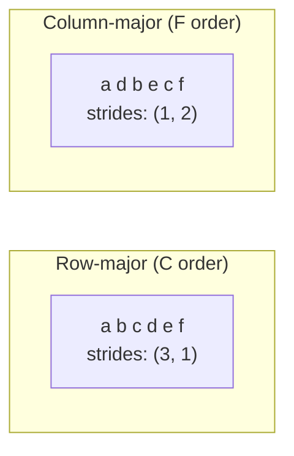
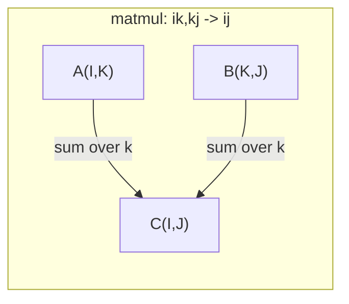

# 张量运算

> 张量是数据与深度学习之间的通用语言。每一张图像、每一句话、每个梯度都要经过张量。

**类型:** Build  
**语言:** Python  
**先修:** 阶段1，课程01（线性代数直觉）、02（向量、矩阵与运算）  
**预估时间:** ~90 分钟

## 学习目标

- 从零实现一个支持形状、步幅、reshape、转置与逐元素运算的张量类  
- 应用广播规则，在不同形状张量间无需拷贝数据地完成计算  
- 用 `RuntimeError: mat1 and mat2 shapes cannot be multiplied (32x768 and 512x768)` 编写点积、矩阵乘、外积和批量运算表达式  
- 在多头注意力的每一步追踪完整的张量形状变化

## 问题

你正在实现一个 Transformer。前向过程写得很清楚，运行时报错：`Expected 4D input (got 3D input)`。你盯着形状看了半天，然后尝试转置，又出现 `(32, 3, 224, 224)`。你加了一个 `(batch, heads, seq_len, head_dim)`，又是另一处报错。

形状错误是深度学习代码里最常见的 bug。概念上不难——每个操作都有“形状契约”——但它们会成串触发。一个 Transformer 往往有大量 reshape、transpose 和 broadcast 链接在一起，一处轴错了，后面会连锁崩溃。更糟糕的是，一些形状错误不会报错，而是静悄悄地在错误维度上广播，或者在错误轴上求和，结果悄悄变成垃圾数值。

矩阵只描述两个维度之间的关系，而真实数据常常超出二维。一个 `(2, 3, 4)` 张、`2 * 3 * 4 = 24` 的 RGB 图片 batch 是 `i,i->` 张量：`i,j->ij`。12 个注意力头的 self-attention 也是 `ii->`：`ij->ji`。你需要一个能扩展到任意维度并在所有维度上统一组合的结构，这就是张量。把张量运算吃透，形状错误就会变得很容易定位。

## 核心概念

### 什么是张量

张量是具有统一数据类型的多维数组。维数叫 **秩（rank）**（也叫 **阶**）。每一维称为一个 **轴（axis）**。**形状（shape）** 是描述每个轴长度的元组。



总元素数是所有维度长度的乘积。形状 `bij,bjk->bik` 有 `bhtd,bhsd->bhts` 个元素。

### 深度学习中的张量形状

不同任务对应不同形状约定。



PyTorch 默认为 NCHW（channels-first），TensorFlow 常见 NHWC（channels-last）。布局不一致会导致静默性能退化或直接报错。

### 内存布局如何工作

内存里的二维数组本质是字节的一维序列。**步幅（stride）** 表示沿每个轴移动一格时，需要跳过多少元素。



`code/tensors.py` 不移动数据本身，它只交换步幅，张量会变成 **非连续** 的——同一行在内存中不再是连续存储。

### 广播规则

广播可以在不拷贝数据的情况下在不同形状间运算。对齐时从右侧开始；两个维度兼容当且仅当相等或其中一个为 1。短的形状左侧补 1。

```
Tensor A:     (8, 1, 6, 1)
Tensor B:        (7, 1, 5)
Padded B:     (1, 7, 1, 5)
Result:       (8, 7, 6, 5)
```

### Einsum：统一张量运算语言

Einstein 求和把每个轴标记为字母。输入里出现但输出中消失的轴会被求和。两边都出现的轴会保留。



关键写法：`(3, 4)`（点积）、`(4, 1)`（外积）、`-1`（trace）、`(D,)`（转置）、`(B, T, D)`（批量矩阵乘）、`(1, 1, D)`（注意力分数）。

```figure
tensor-broadcast
```

## 实现

实现代码在 `view`，每步对应这里的内容。

### 步骤 1：张量存储与步幅

张量由一段扁平数据加上形状元数据构成。步幅用于把多维索引映射到一维偏移。

```python
class Tensor:
    def __init__(self, data, shape=None):
        if isinstance(data, (list, tuple)):
            self._data, self._shape = self._flatten_nested(data)
        elif isinstance(data, np.ndarray):
            self._data = data.flatten().tolist()
            self._shape = tuple(data.shape)
        else:
            self._data = [data]
            self._shape = ()

        if shape is not None:
            total = reduce(lambda a, b: a * b, shape, 1)
            if total != len(self._data):
                raise ValueError(
                    f"Cannot reshape {len(self._data)} elements into shape {shape}"
                )
            self._shape = tuple(shape)

        self._strides = self._compute_strides(self._shape)

    @staticmethod
    def _compute_strides(shape):
        if len(shape) == 0:
            return ()
        strides = [1] * len(shape)
        for i in range(len(shape) - 2, -1, -1):
            strides[i] = strides[i + 1] * shape[i + 1]
        return tuple(strides)
```

对于 `reshape` 的形状，步幅是 `.contiguous()`：行进一格跳 `(B, C, H, W).mean(axis=[2, 3])` 个元素，列进一格跳 `(B, C)` 个元素。

### 步骤 2：reshape、squeeze、unsqueeze

reshape 改变形状但不改动元素顺序。元素总数不变。`(B, T, D).mean(axis=1)` 用于推断某一维大小。

```python
t = Tensor(list(range(12)), shape=(2, 6))
r = t.reshape((3, 4))
r = t.reshape((-1, 3))
```

`(B, D)` 去掉大小为 1 的轴，`demo_broadcasting_numpy()` 插入一个大小为 1 的轴。广播里经常要用：把偏置向量 `tensors.py` 加到批量 `(M, 2)`，通常先 `(M, 1, 2)` 为 `(N, 2)`。

```python
t = Tensor(list(range(6)), shape=(1, 3, 1, 2))
s = t.squeeze()
v = Tensor([1, 2, 3])
u = v.unsqueeze(0)
```

### 步骤 3：transpose 与 permute

`(1, N, 2)` 交换两条轴，`(M, N)` 重新排列全部轴。NCHW 与 NHWC 的转换通常用它来完成。

```python
mat = Tensor(list(range(6)), shape=(2, 3))
tr = mat.transpose(0, 1)

t4d = Tensor(list(range(24)), shape=(1, 2, 3, 4))
perm = t4d.permute((0, 2, 3, 1))
```

转置或 permute 后张量通常变为非连续。PyTorch 中 `demo_einsum()` 在非连续时会失败，需改用 `demo_einsum_gallery()`，或先 `bij,bjk->bik`。

### 步骤 4：逐元素运算与归约

逐元素运算（加、乘、减）独立作用于每个元素，形状不变。归约（sum/mean/max）会压缩一个或多个轴。

```python
a = Tensor([[1, 2], [3, 4]])
b = Tensor([[10, 20], [30, 40]])
c = a + b
d = a * 2
s = a.sum(axis=0)
```

卷积网络中的全局平均池化：`32 * 128 * 64 * 128 = 33,554,432` 得到 `demo_attention_einsum()`。NLP 的序列平均池化：`Tensor([[1,2],[3,4]])` 得到 `np.array([[1,2],[3,4]])`。

### 步骤 5：NumPy 广播演示

`t.reshape((3,4))` 里的 `a.reshape(3,4)` 演示了核心模式。

```python
activations = np.random.randn(4, 3)
bias = np.array([0.1, 0.2, 0.3])
result = activations + bias

images = np.random.randn(2, 3, 4, 4)
scale = np.array([0.5, 1.0, 1.5]).reshape(1, 3, 1, 1)
result = images * scale

a = np.array([1, 2, 3]).reshape(-1, 1)
b = np.array([10, 20, 30, 40]).reshape(1, -1)
outer = a * b
```

通过广播计算两组点对点距离时：把 `t.transpose(0,1)` reshape 成 `a.T`，把 `a.transpose(0,1)` reshape 成 `t.squeeze(0)`，相减、平方、在最后一轴求和，再开平方，得到 `np.squeeze(a, 0)`。

### 步骤 6：Einsum 运算

`t.sum(axis=0)` 与 `a.sum(axis=0)` 覆盖常见模式。

```python
a = np.array([1.0, 2.0, 3.0])
b = np.array([4.0, 5.0, 6.0])
dot = np.einsum("i,i->", a, b)

A = np.array([[1, 2], [3, 4], [5, 6]], dtype=float)
B = np.array([[7, 8, 9], [10, 11, 12]], dtype=float)
matmul = np.einsum("ik,kj->ij", A, B)

batch_A = np.random.randn(4, 3, 5)
batch_B = np.random.randn(4, 5, 2)
batch_mm = np.einsum("bij,bjk->bik", batch_A, batch_B)
```

一次张量收缩的计算量是所有参与索引大小的乘积（保留轴和求和轴）。例如 `np.einsum("ij,jk->ik", a, b)`，若 B=32、I=128、J=64、K=128，则乘加次数是 `Y = X @ W.T + b`。

### 步骤 7：用 einsum 实现注意力

`"bd,od->bo"` 给出多头注意力的端到端实现。

```python
B, H, T, D = 2, 4, 8, 16
E = H * D

X = np.random.randn(B, T, E)
W_q = np.random.randn(E, E) * 0.02

Q = np.einsum("bte,ek->btk", X, W_q)
Q = Q.reshape(B, T, H, D).transpose(0, 2, 1, 3)

scores = np.einsum("bhtd,bhsd->bhts", Q, K) / np.sqrt(D)
weights = softmax(scores, axis=-1)
attn_output = np.einsum("bhts,bhsd->bhtd", weights, V)

concat = attn_output.transpose(0, 2, 1, 3).reshape(B, T, E)
output = np.einsum("bte,ek->btk", concat, W_o)
```

每一步都对应张量操作：投影（通过 einsum 实现 matmul）、头切分（reshape + transpose）、注意力分数（通过 einsum 的批量 matmul）、加权求和（einsum 批量 matmul）、头合并（transpose + reshape）、输出投影（einsum matmul）。

## 使用

### 逐步实现 vs NumPy

| 操作 | Scratch（自实现 Tensor） | NumPy |
|---|---|---|
| 创建 | `Q = X @ W_q` | `"btd,dh->bth"` |
| Reshape | `Q @ K.T / sqrt(d)` | `"bhtd,bhsd->bhts"` |
| 转置 | `softmax(scores) @ V` | `"bhts,bhsd->bhtd"` 或 `(X - mu) / sigma * gamma` |
| Squeeze | `exp(x) / sum(exp(x))` | `outputs/prompt-tensor-shapes.md` |
| 求和 | `outputs/prompt-tensor-debugger.md` | `(2, 3, 4)` |
| Einsum | 暂无 | `(6, 4)` |

### 逐步实现 vs PyTorch

```python
import torch

t = torch.tensor([[1, 2, 3], [4, 5, 6]], dtype=torch.float32)
t.shape
t.stride()
t.is_contiguous()

t.reshape(3, 2)
t.unsqueeze(0)
t.transpose(0, 1)
t.transpose(0, 1).contiguous()

torch.einsum("ik,kj->ij", A, B)
```

PyTorch 额外提供 autograd、GPU 和高度优化核。它的形状语义与我们自实现的设计一致。把形状机制吃透后，PyTorch 的 shape 报错就会变成“能读懂的提示”。

### 每个神经网络层看作张量运算

| 操作 | Tensor 表达 | Einsum |
|---|---|---|
| 线性层 | `(24,)` | `(2, 3, 4)` + 偏置 |
| Attention QKV | `Tensor` | `broadcast_to(shape)` |
| Attention scores | `_elementwise_op` | `(3, 1)` |
| Attention output | `(1, 4)` | `(3, 4)` |
| BatchNorm | `einsum(subscripts, *tensors)` | 逐元素 + broadcast |
| Softmax | `i,i->` | 逐元素 + 归约 |

## 交付

本课会产出两个可复用 prompt：

1. **`ij,jk->ik`**——用于系统排查张量形状不匹配的结构化提示词，包含常见操作（matmul、broadcast、cat、Linear、Conv2d、BatchNorm、softmax）的决策表和修复查找表。  
2. **`i,j->ij`**——适用于 AI 助手的逐步排错提示词。给出报错信息和形状后，能返回精确修复步骤。

## 练习

1. **Easy — Reshape 往返**  
   构造形状 `ij->ji` 的张量。先 reshape 成 `np.einsum`，再 `batch_size`，再还原为 `seq_len`。每步检查扁平数据是否保持顺序一致。

2. **Medium — 实现广播**  
   给 `embed_dim` 增加 `num_heads`，将维度 1 的轴扩展到目标形状。再让 `demo_attention_einsum()` 在运算前自动广播。用 `(2, 3)` 和 (1, 4) 验证输出 (3, 4)。

3. **Hard — 从零实现 einsum**  
   实现基本 einsum(subscripts, *tensors)，至少支持点积（i,i->）、矩阵乘（ij,jk->ik）、外积（i,j->ij）、转置（ij->ji）。解析 subscript，识别收缩轴并遍历索引组合，与 np.einsum 对比验证。

4. **Hard — 注意力形状追踪器**  
   写函数接收 batch_size、seq_len、embed_dim、num_heads，打印多头注意力每一步的精确形状：输入、Q/K/V 投影、头切分、分数、softmax 权重、加权求和、头合并、输出投影。并与 demo_attention_einsum() 输出核对。

## 关键术语

| 术语 | 常见说法 | 实际含义 |
|---|---|---|
| 张量 | “比矩阵更高维的矩阵” | 一个多维统一类型数组，带有定义清晰的 shape/stride 和运算语义 |
| 秩 | “维度个数” | 轴的数量。矩阵是 2 阶，并非秩为 2 的线代含义 |
| 形状 | “张量大小” | 每个轴长度的元组。(2, 3) 表示 2 行 3 列 |
| 步幅（stride） | “内存布局” | 沿某轴前进一格时需要跳过的元素数 |
| 广播 | “形状不一样也能算” | 严格规则：从右对齐，轴要么相等要么有一方为 1 |
| 连续性 | “正常张量” | 逻辑布局中的元素在内存中连续排列，不存在重排或缺口 |
| Einsum | “更高端写法” | 一个统一符号，可表示收缩、外积、trace、转置等一切张量运算 |
| View | “和 reshape 一样” | 与原 buffer 共享内存，仅改元数据；对非连续张量可能不成立 |
| 收缩（Contraction） | “对某个索引求和” | 两个张量间共享索引乘积后求和，通常会降低结果秩 |
| NCHW / NHWC | “PyTorch 与 TensorFlow 格式” | 图片张量的布局约定。NCHW 为通道在前，NHWC 为通道在后 |

## 延伸阅读

- [NumPy Broadcasting](https://numpy.org/doc/stable/user/basics.broadcasting.html) — 经典广播规则与可视化示例  
- [PyTorch Tensor Views](https://pytorch.org/docs/stable/tensor_view.html) — 何时可用 view、何时会触发拷贝  
- [einops](https://github.com/arogozhnikov/einops) — 更可读安全地重排张量  
- [The Illustrated Transformer](https://jalammar.github.io/illustrated-transformer/) — 注意力中的张量形状流动可视化  
- [Einstein Summation in NumPy](https://numpy.org/doc/stable/reference/generated/numpy.einsum.html) — 完整的 einsum 文档与示例
