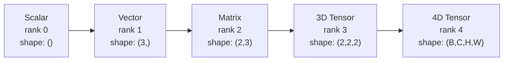
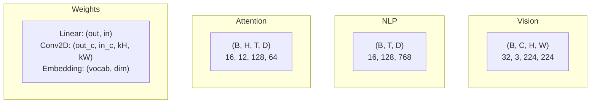
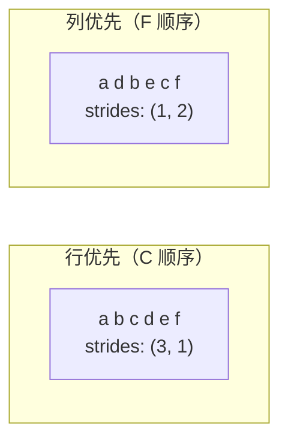
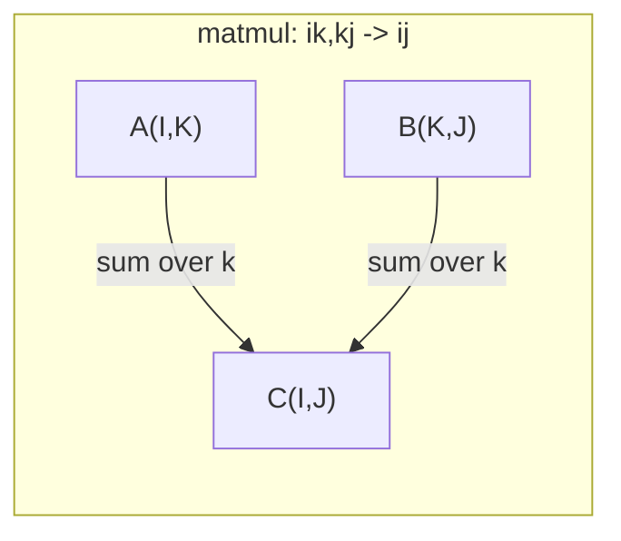

# 张量运算

> 张量是数据与深度学习之间的通用语言。每一张图像、每一句话、每一个梯度，都会流经它。

**类型：** 构建  
**语言：** Python  
**先修：** 第 1 阶段，第 01 课（线性代数直觉），第 02 课（向量、矩阵与运算）  
**时长：** ~90 分钟

## 学习目标

- 从零实现一个张量类，支持 shape、strides、reshape、transpose 和逐元素运算
- 应用广播规则，在不复制数据的前提下操作不同形状的张量
- 使用 `einsum` 表达式实现点积、矩阵乘法、外积和批量运算
- 跟踪多头注意力每一步中的精确张量形状

## 问题

你在搭建 Transformer。前向传播看起来很干净。跑起来却报错：`RuntimeError: mat1 and mat2 shapes cannot be multiplied (32x768 and 512x768)`。你盯着 shape 看了半天，尝试转置。现在它又说：`Expected 4D input (got 3D input)`。你加了一个 unsqueeze。别的地方又坏了。

形状错误是深度学习代码里最常见的 bug。概念上它并不难，每个运算都有自己的形状契约，但一旦串联起来，问题就会迅速放大。一个 Transformer 里有几十次 reshape、transpose 和广播。只要有一个轴错了，错误就会一路级联。更糟的是，有些形状错误根本不会报错。它们会沿着错误的维度静默广播，或者在错误的轴上求和，最后悄悄产出垃圾结果。

矩阵只能处理两组事物之间的两两关系。真实数据并不是二维的。一个包含 32 张 224x224 RGB 图像的批次，是一个 4D 张量：`(32, 3, 224, 224)`。12 个头的自注意力也是 4D：`(batch, heads, seq_len, head_dim)`。你需要一种能推广到任意维度的数据结构，并且它的运算能够在所有维度上干净组合。那种结构就是张量。掌握它的运算后，形状错误就会变得非常容易排查。

## 核心概念

### 什么是张量

张量是一个具有统一数据类型的多维数值数组。维度的数量叫做 **rank**（或 **order**）。每个维度叫做一个 **axis**。**shape** 是一个元组，列出每个轴上的大小。



元素总数 = 所有维度大小的乘积。形状 `(2, 3, 4)` 的张量包含 `2 * 3 * 4 = 24` 个元素。

### 深度学习中的张量形状

不同类型的数据会按照约定映射到特定的张量形状。



PyTorch 使用 NCHW（channels-first）。TensorFlow 默认使用 NHWC（channels-last）。布局不一致会造成静默变慢，或者直接报错。

### 内存布局是怎么工作的

内存中的二维数组本质上是一维字节序列。**strides** 告诉你沿每个轴移动一步时，需要跳过多少个元素。



转置不会移动数据，只会交换 strides，从而让张量变成 **non-contiguous**。也就是说，一个行里的元素不再在内存中相邻。

### 广播规则

广播允许你在不复制数据的前提下，对不同形状的张量进行运算。对齐方式是从右往左。两个维度只要相等，或者其中一个为 1，就兼容。维度更少的张量会在左侧补 1。

```
Tensor A:     (8, 1, 6, 1)
Tensor B:        (7, 1, 5)
Padded B:     (1, 7, 1, 5)
Result:       (8, 7, 6, 5)
```

### Einsum：通用的张量操作

Einstein 求和约定会用字母给每个轴命名。输入里有、输出里没有的轴会被求和。输入和输出都出现的轴会被保留。



常见模式包括：`i,i->`（点积）、`i,j->ij`（外积）、`ii->`（迹）、`ij->ji`（转置）、`bij,bjk->bik`（批量矩阵乘法）、`bhtd,bhsd->bhts`（注意力分数）。

```figure
tensor-broadcast
```

## 动手实现

代码位于 `code/tensors.py`。下面每一步都对应那里实现的功能。

### 第 1 步：张量存储与步幅

张量会保存一个扁平的数字列表，以及 shape 元数据。strides 决定索引逻辑如何把多维索引映射到一维位置。

```python
class Tensor:
    def __init__(self, data, shape=None):
        if isinstance(data, (list, tuple)):
            self._data, self._shape = self._flatten_nested(data)
        elif isinstance(data, np.ndarray):
            self._data = data.flatten().tolist()
            self._shape = tuple(data.shape)
        else:
            self._data = [data]
            self._shape = ()

        if shape is not None:
            total = reduce(lambda a, b: a * b, shape, 1)
            if total != len(self._data):
                raise ValueError(
                    f"Cannot reshape {len(self._data)} elements into shape {shape}"
                )
            self._shape = tuple(shape)

        self._strides = self._compute_strides(self._shape)

    @staticmethod
    def _compute_strides(shape):
        if len(shape) == 0:
            return ()
        strides = [1] * len(shape)
        for i in range(len(shape) - 2, -1, -1):
            strides[i] = strides[i + 1] * shape[i + 1]
        return tuple(strides)
```

对于形状 `(3, 4)`，strides 是 `(4, 1)`，也就是：往下一行跳过 4 个元素，往右一列跳过 1 个元素。

### 第 2 步：`reshape`、`squeeze`、`unsqueeze`

Reshape 只改变形状，不改变元素顺序。元素总数必须保持不变。可以用 `-1` 表示其中一维由系统推断大小。

```python
t = Tensor(list(range(12)), shape=(2, 6))
r = t.reshape((3, 4))
r = t.reshape((-1, 3))
```

Squeeze 会移除大小为 1 的轴。Unsqueeze 会插入一个大小为 1 的轴。Unsqueeze 对广播非常重要，比如把偏置向量 `(D,)` 加到批次 `(B, T, D)` 上时，需要先把它扩展成 `(1, 1, D)`。

```python
t = Tensor(list(range(6)), shape=(1, 3, 1, 2))
s = t.squeeze()
v = Tensor([1, 2, 3])
u = v.unsqueeze(0)
```

### 第 3 步：`transpose` 和 `permute`

Transpose 会交换两个轴。Permute 会重新排列所有轴。这就是在 NCHW 和 NHWC 之间转换的方式。

```python
mat = Tensor(list(range(6)), shape=(2, 3))
tr = mat.transpose(0, 1)

t4d = Tensor(list(range(24)), shape=(1, 2, 3, 4))
perm = t4d.permute((0, 2, 3, 1))
```

经过 transpose 或 permute 之后，张量在内存里会变成 non-contiguous。在 PyTorch 里，`view` 不能作用于 non-contiguous 张量，需要改用 `reshape`，或者先调用 `.contiguous()`。

### 第 4 步：逐元素运算与归约

逐元素运算（add、multiply、subtract）会独立作用于每个元素，并保持形状不变。规约运算（sum、mean、max）会折叠一个或多个轴。

```python
a = Tensor([[1, 2], [3, 4]])
b = Tensor([[10, 20], [30, 40]])
c = a + b
d = a * 2
s = a.sum(axis=0)
```

CNN 中的全局平均池化：`(B, C, H, W).mean(axis=[2, 3])` 会得到 `(B, C)`。NLP 中的序列平均池化：`(B, T, D).mean(axis=1)` 会得到 `(B, D)`。

### 第 5 步：使用 NumPy 实现广播

`tensors.py` 里的 `demo_broadcasting_numpy()` 函数展示了核心模式。

```python
activations = np.random.randn(4, 3)
bias = np.array([0.1, 0.2, 0.3])
result = activations + bias

images = np.random.randn(2, 3, 4, 4)
scale = np.array([0.5, 1.0, 1.5]).reshape(1, 3, 1, 1)
result = images * scale

a = np.array([1, 2, 3]).reshape(-1, 1)
b = np.array([10, 20, 30, 40]).reshape(1, -1)
outer = a * b
```

通过广播计算两两距离：把 `(M, 2)` reshape 成 `(M, 1, 2)`，把 `(N, 2)` reshape 成 `(1, N, 2)`，相减、平方、沿最后一个轴求和，再开方。结果形状是 `(M, N)`。

### 第 6 步：Einsum 运算

`tensors.py` 里的 `demo_einsum()` 和 `demo_einsum_gallery()` 函数会逐个讲解常见模式。

```python
a = np.array([1.0, 2.0, 3.0])
b = np.array([4.0, 5.0, 6.0])
dot = np.einsum("i,i->", a, b)

A = np.array([[1, 2], [3, 4], [5, 6]], dtype=float)
B = np.array([[7, 8, 9], [10, 11, 12]], dtype=float)
matmul = np.einsum("ik,kj->ij", A, B)

batch_A = np.random.randn(4, 3, 5)
batch_B = np.random.randn(4, 5, 2)
batch_mm = np.einsum("bij,bjk->bik", batch_A, batch_B)
```

一次收缩运算的计算量，是所有索引维度大小的乘积（保留的和被求和的都算）。对于 `bij,bjk->bik`，如果 B=32、I=128、J=64、K=128，那么计算量是 `32 * 128 * 64 * 128 = 33,554,432` 次乘加。

### 第 7 步：用 einsum 实现注意力机制

`tensors.py` 里的 `demo_attention_einsum()` 函数实现了端到端的多头注意力。

```python
B, H, T, D = 2, 4, 8, 16
E = H * D

X = np.random.randn(B, T, E)
W_q = np.random.randn(E, E) * 0.02

Q = np.einsum("bte,ek->btk", X, W_q)
Q = Q.reshape(B, T, H, D).transpose(0, 2, 1, 3)

scores = np.einsum("bhtd,bhsd->bhts", Q, K) / np.sqrt(D)
weights = softmax(scores, axis=-1)
attn_output = np.einsum("bhts,bhsd->bhtd", weights, V)

concat = attn_output.transpose(0, 2, 1, 3).reshape(B, T, E)
output = np.einsum("bte,ek->btk", concat, W_o)
```

每一步都是张量运算：投影（通过 `einsum` 做矩阵乘法）、拆分 heads（reshape + transpose）、注意力分数（批量矩阵乘法）、加权求和（批量矩阵乘法）、合并 heads（transpose + reshape）、输出投影（通过 `einsum` 做矩阵乘法）。

## 用起来

### 从零实现 vs NumPy

| 操作 | 从零实现（Tensor 类） | NumPy |
|---|---|---|
| Create | `Tensor([[1,2],[3,4]])` | `np.array([[1,2],[3,4]])` |
| Reshape | `t.reshape((3,4))` | `a.reshape(3,4)` |
| Transpose | `t.transpose(0,1)` | `a.T` or `a.transpose(0,1)` |
| Squeeze | `t.squeeze(0)` | `np.squeeze(a, 0)` |
| Sum | `t.sum(axis=0)` | `a.sum(axis=0)` |
| Einsum | N/A | `np.einsum("ij,jk->ik", a, b)` |

### 从零实现 vs PyTorch

```python
import torch

t = torch.tensor([[1, 2, 3], [4, 5, 6]], dtype=torch.float32)
t.shape
t.stride()
t.is_contiguous()

t.reshape(3, 2)
t.unsqueeze(0)
t.transpose(0, 1)
t.transpose(0, 1).contiguous()

torch.einsum("ik,kj->ij", A, B)
```

PyTorch 额外提供了 autograd、GPU 支持和优化过的 BLAS 内核。形状语义是一样的。只要你理解了从零实现的版本，PyTorch 里的形状报错就会变得可读。

### 把每一层神经网络都看作张量操作

| 操作 | 张量形式 | Einsum |
|---|---|---|
| Linear layer | `Y = X @ W.T + b` | `"bd,od->bo"` + bias |
| Attention QKV | `Q = X @ W_q` | `"btd,dh->bth"` |
| Attention scores | `Q @ K.T / sqrt(d)` | `"bhtd,bhsd->bhts"` |
| Attention output | `softmax(scores) @ V` | `"bhts,bhsd->bhtd"` |
| Batch norm | `(X - mu) / sigma * gamma` | element-wise + broadcast |
| Softmax | `exp(x) / sum(exp(x))` | element-wise + reduction |

## 上线交付

这一课会产出两个可复用的提示词：

1. **`outputs/prompt-tensor-shapes.md`** -- 一个系统化的提示词，用来排查张量形状不匹配问题。里面包含每个常见运算（matmul、broadcast、cat、Linear、Conv2d、BatchNorm、softmax）的决策表，以及修复对照表。

2. **`outputs/prompt-tensor-debugger.md`** -- 一个逐步排查提示词。你把它粘到任何 AI 助手里，再附上报错和张量形状，就能拿到具体修复方案。

## 练习

1. **简单 -- reshape 往返。** 取一个形状为 `(2, 3, 4)` 的张量。把它 reshape 成 `(6, 4)`，再变成 `(24,)`，最后再变回 `(2, 3, 4)`。每一步都打印扁平数据，验证元素顺序保持不变。

2. **中等 -- 实现广播。** 给 `Tensor` 类增加一个 `broadcast_to(shape)` 方法，用于把大小为 1 的维度扩展到目标形状。然后修改 `_elementwise_op`，让它在运算前自动广播。用 `(3, 1)` 和 `(1, 4)` 测试，结果应为 `(3, 4)`。

3. **困难 -- 从零实现 einsum。** 实现一个基础版 `einsum(subscripts, *tensors)`，至少支持：点积（`i,i->`）、矩阵乘法（`ij,jk->ik`）、外积（`i,j->ij`）和转置（`ij->ji`）。解析子脚本字符串，识别被收缩的索引，并遍历所有索引组合。把结果和 `np.einsum` 对比。

4. **困难 -- 注意力形状追踪器。** 写一个函数，输入 `batch_size`、`seq_len`、`embed_dim` 和 `num_heads`，然后打印多头注意力每一步的精确 shape：输入、Q/K/V 投影、head 拆分、注意力分数、softmax 权重、加权求和、head 合并、输出投影。和 `demo_attention_einsum()` 的输出对比验证。

## 关键术语

| 术语 | 常见说法 | 实际含义 |
|---|---|---|
| Tensor | "A matrix but more dimensions" | 多维数组，具有统一数据类型和明确的 shape、strides、操作 |
| Rank | "维度数量" | 轴的数量。矩阵的 rank 是 2，不是矩阵秩 |
| Shape | "张量大小" | 列出每个轴大小的元组。`(2, 3)` 表示 2 行 3 列 |
| Stride | "内存怎么排" | 沿每个轴前进一格需要跳过的元素数 |
| Broadcasting | "形状不同也能直接算" | 一套严格规则：从右对齐，维度必须相等或其中一个为 1 |
| Contiguous | "张量是正常的" | 元素按逻辑布局顺序连续存储，没有空洞或重排 |
| Einsum | "写 matmul 的高级方式" | 一种通用记号，可以一行表达张量收缩、外积、迹或转置 |
| View | "和 reshape 一样" | 共享同一块内存，但 shape/stride 元数据不同的张量。对 non-contiguous 数据会失败 |
| Contraction | "对某个索引求和" | 张量间共享索引先相乘再求和的通用操作，结果秩更低 |
| NCHW / NHWC | "PyTorch 和 TensorFlow 的格式" | 图像张量的内存布局约定。NCHW 把通道放在空间维之前，NHWC 放在后面 |

## 延伸阅读

- [NumPy Broadcasting](https://numpy.org/doc/stable/user/basics.broadcasting.html) -- 带图示的标准规则
- [PyTorch Tensor Views](https://pytorch.org/docs/stable/tensor_view.html) -- view 何时生效、何时会复制
- [einops](https://github.com/arogozhnikov/einops) -- 让张量重排更易读、更安全的库
- [The Illustrated Transformer](https://jalammar.github.io/illustrated-transformer/) -- 展示注意力中张量形状流动的图解
- [Einstein Summation in NumPy](https://numpy.org/doc/stable/reference/generated/numpy.einsum.html) -- 带示例的 einsum 完整文档
