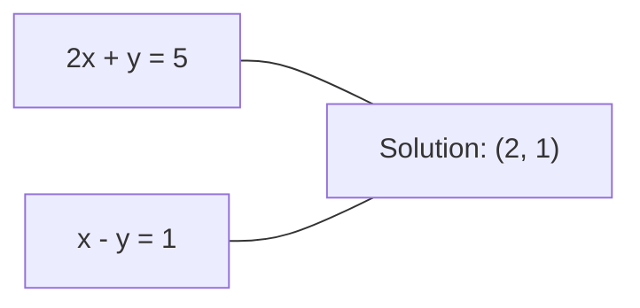

# 线性方程组

> 求解 `y = Wx + b` 是最古老的数学问题，如今它仍在运行你的神经网络。

**类型:** 构建 **语言:** Python  
**先修:** 阶段1，课程01（线性代数直觉）、02（向量与矩阵）、03（矩阵变换）  
**预估时间:** ~120 分钟

## 学习目标

- 用高斯消元（含部分主元）和回代法解 `sklearn.linear_model.LinearRegression.fit()`  
- 使用 LU、QR、Cholesky 分解并知道何时该用哪个  
- 推导最小二乘的正则方程并连接到线性回归 / 岭回归  
- 用条件数诊断病态系统，并用正则化稳定数值

## 问题

每次训练线性回归你都在解线性系统；每次做 least squares 都在解线性系统；每次神经网络层算 `np.linalg.lstsq` 都是在评估一组线性方程。加正则化就是改系统；高斯过程要做矩阵分解；Mahalanobis 距离要逆协方差矩阵，也是在解方程。

形式上我们解的是 `np.linalg.pinv`：`code/linear_systems.py` 是已知系数矩阵，`[[1,2,3],[4,5,6],[7,8,10]] x = [6, 15, 27]` 是已知输出，`np.linalg.solve` 是未知变量。在线性回归里，`np.linalg.qr` 是数据矩阵，`np.linalg.svd` 是目标向量，`np.linalg.lstsq` 是权重向量。问题本质是：找一个 `np.linalg.solve`，使 Ax 尽可能接近 b。

本课从零讲每种主流解法：知道为什么有的方法快、有的方法稳、为什么有的只适合方阵、有的能处理过定问题，以及为什么矩阵条件数决定了答案是否可信。

## 概念

### Ax = b 的几何意义

线性方程组可以几何理解：每条方程对应一个超平面，解是它们的交点/交集。

```
2x + y = 5          Two lines in 2D.
x - y  = 1          They intersect at x=2, y=1.
```



会出现三种情况：


矩阵里，“唯一解”通常对应可逆；“无解”是系统不一致；“无穷解”有非零零空间。ML 中多数是“无精确解”类型，因为约束方程（样本）通常多于未知量（参数），所以我们转向最小二乘。

### 行视角与列视角

Ax=b 有两种读法。

**行视角。** A 的每一行是一条方程，一组超平面交点就是解。

**列视角。** A 的每一列是一个向量。问题变成：b 能否写成列向量的线性组合？

```
A = | 2  1 |    b = | 5 |
    | 1 -1 |        | 1 |

Row picture: solve 2x + y = 5 and x - y = 1 simultaneously.

Column picture: find x1, x2 such that:
  x1 * [2, 1] + x2 * [1, -1] = [5, 1]
  2 * [2, 1] + 1 * [1, -1] = [4+1, 2-1] = [5, 1]   check.
```

列视角更根本：若 b 在 A 的列空间里，系统有解；若不在，就找离它最近的点，这就是最小二乘。

### 高斯消元

高斯消元把 Ax=b 变成上三角系统 Ux=c，再用回代解方程。

```
1. For each column k (the pivot column):
   a. Find the largest entry in column k at or below row k (partial pivoting).
   b. Swap that row with row k.
   c. For each row i below k:
      - Compute multiplier m = A[i][k] / A[k][k]
      - Subtract m times row k from row i.
2. Back substitute: solve from the last equation upward.
```

样例：

```
Original:
| 2  1  1 | 8 |       R2 = R2 - (2)R1     | 2  1   1 |  8 |
| 4  3  3 |20 |  -->  R3 = R3 - (1)R1 --> | 0  1   1 |  4 |
| 2  3  1 |12 |                            | 0  2   0 |  4 |

                       R3 = R3 - (2)R2     | 2  1   1 |  8 |
                                       --> | 0  1   1 |  4 |
                                           | 0  0  -2 | -4 |

Back substitute:
  -2 * x3 = -4    -->  x3 = 2
  x2 + 2  = 4     -->  x2 = 2
  2*x1 + 2 + 2 = 8 --> x1 = 2
```

复杂度 O(n^3)。对 1000x1000 系统约十亿次浮点操作，快，但如果同一个 A 要解多个 b，可以更省。

### 为什么要部分主元

不主元化时，主元可能为 0（除零）或很小（放大误差）。

```
Bad pivot:                       With partial pivoting:
| 0.001  1 | 1.001 |            Swap rows first:
| 1      1 | 2     |            | 1      1 | 2     |
                                 | 0.001  1 | 1.001 |
m = 1/0.001 = 1000              m = 0.001/1 = 0.001
R2 = R2 - 1000*R1               R2 = R2 - 0.001*R1
| 0.001  1     | 1.001   |      | 1      1     | 2     |
| 0     -999   | -999.0  |      | 0      0.999 | 0.999 |

x2 = 1.000 (correct)            x2 = 1.000 (correct)
x1 = (1.001 - 1)/0.001          x1 = (2 - 1)/1 = 1.000 (correct)
   = 0.001/0.001 = 1.000        Stable because the multiplier is small.
```

前者会带来巨量舍入误差；后者稳定得多。部分主元总是选当前列最大绝对值主元以抑制误差放大。

### LU 分解

LU 分解将 A = LU，L 下三角，U 上三角。L 里存的是消元系数。

```
A = L @ U

| 2  1  1 |   | 1  0  0 |   | 2  1   1 |
| 4  3  3 | = | 2  1  0 | @ | 0  1   1 |
| 2  3  1 |   | 1  2  1 |   | 0  0  -2 |
```

用 LU 的优势：第一次分解花 O(n^3)，后续每个新的 b 只需 O(n^2)：

```
Ax = b
LUx = b
Let y = Ux:
  Ly = b    (forward substitution, O(n^2))
  Ux = y    (back substitution, O(n^2))
```

如果有行交换，得到 PA = LU。

### QR 分解

QR 将 A = QR，Q 正交矩阵（列向量单位正交），R 上三角。

```
A = Q @ R

Q has orthonormal columns: Q^T Q = I
R is upper triangular

To solve Ax = b:
  QRx = b
  Rx = Q^T b    (just multiply by Q^T, no inversion needed)
  Back substitute to get x.
```

QR 在最小二乘上通常比 LU 更稳。Gram-Schmidt 构造 Q：

```
Given columns a1, a2, ... of A:

q1 = a1 / ||a1||

q2 = a2 - (a2 . q1) * q1        (subtract projection onto q1)
q2 = q2 / ||q2||                (normalize)

q3 = a3 - (a3 . q1) * q1 - (a3 . q2) * q2
q3 = q3 / ||q3||

R[i][j] = qi . aj    for i <= j
```

每一步都移除在已有 q 方向上的分量，留下新正交方向。

### Cholesky 分解

若 A 对称且正定（对称：A=A^T，特征值都 > 0），可写 A = L L^T，这是 Cholesky。

```
A = L @ L^T

| 4  2 |   | 2  0 |   | 2  1 |
| 2  5 | = | 1  2 | @ | 0  2 |

L[i][i] = sqrt(A[i][i] - sum(L[i][k]^2 for k < i))
L[i][j] = (A[i][j] - sum(L[i][k]*L[j][k] for k < j)) / L[j][j]    for i > j
```

公式：

```
minimize ||Ax - b||^2

This is the sum of squared residuals:
  sum((A[i,:] @ x - b[i])^2 for i in range(m))
```

Cholesky 比 LU 更快（约一半运算量），但要求更严格；它经常出现于：
- 协方差矩阵（加正则后通常 SPD）
- GP 的核矩阵（SPD）
- 凸函数 Hessian（极小点）
- A^T A（半正定）

在 GP 中，K α = y 用 Cholesky 解，且 log det(K)=2 Σ log(diag(L))。

### 最小二乘：当 Ax=b 无精确解

当 A 是 m×n 且 m>n（过定）时通常无精确解，改为最小化残差平方：

```
A^T A x = A^T b
```

对应正规方程：

```
Original system (overdetermined, 4 equations, 2 unknowns):
| 1  1 |         | 3 |
| 1  2 | x     = | 5 |       No exact x satisfies all 4 equations.
| 1  3 |         | 6 |
| 1  4 |         | 8 |

Normal equations:
A^T A = | 4  10 |    A^T b = | 22 |
        | 10 30 |            | 63 |

Solve: x = [1.5, 1.7]

This is linear regression. x[0] is the intercept, x[1] is the slope.
```

推导来自 ||Ax-b||^2 = x^T A^T A x - 2x^T A^T b + b^T b，对 x 求梯度为零。

```
X^T X w = X^T y
w = (X^T X)^(-1) X^T y
```

这就是线性回归里斜率与截距的 closed-form。

### 正规方程与线性回归

线性回归中：

```
(X^T X + lambda * I) w = X^T y
w = (X^T X + lambda * I)^(-1) X^T y
```

Ridge 在左侧加 λI：

```
x = A+ b

where A+ = V Sigma+ U^T    (computed via SVD)
```

正则化提高可逆性和数值稳定，抑制过拟合。X^T X + λI 在 λ>0 时是 SPD，可用 Cholesky。

### 伪逆（Moore-Penrose）

伪逆把“非方阵/奇异”情形统一起来。对任意 A：

```
A = U Sigma V^T        (SVD)

Sigma = | 5  0 |       Sigma+ = | 1/5  0  0 |
        | 0  2 |                | 0  1/2  0 |
        | 0  0 |

A+ = V Sigma+ U^T
```

将非零奇异值取倒数后转置得 Σ+。若 A = U Σ V^T，则 A+ = V Σ+ U^T。

性质：
- 系统一解：A+ b 给该解  
- 无解：A+ b 给最小二乘解  
- 无穷解：A+ b 给最小 ||x|| 的解

np.linalg.lstsq、np.linalg.pinv 本质都依赖 SVD。

### 条件数

条件数衡量输入微小扰动下输出敏感性。

```
kappa(A) = ||A|| * ||A^(-1)|| = sigma_max / sigma_min
```

```
Well-conditioned (kappa ~ 1):        Ill-conditioned (kappa ~ 10^15):
Small change in b -->                Small change in b -->
small change in x                    huge change in x

| 2  0 |   kappa = 2/1 = 2          | 1   1          |   kappa ~ 10^15
| 0  1 |   safe to solve            | 1   1+10^(-15) |   solution is garbage
```

规则：
- κ < 100：通常可放心
- κ≈10^k：约损失 k 位有效数字
- κ≈10^16（float64）：结果可能没意义

```
Algorithm sketch:
  x0 = initial guess (often zero)
  r0 = b - A x0           (residual)
  p0 = r0                 (search direction)

  For k = 0, 1, 2, ...:
    alpha = (rk . rk) / (pk . A pk)
    x_{k+1} = xk + alpha * pk
    r_{k+1} = rk - alpha * A pk
    beta = (r_{k+1} . r_{k+1}) / (rk . rk)
    p_{k+1} = r_{k+1} + beta * pk
    if ||r_{k+1}|| < tolerance: stop
```

在 ML 中，特征近似共线导致 κ 很大。加 λI 时：

```figure
linear-system-conditioning
```

条件改善、解更稳。

### 迭代法：共轭梯度（CG）

超大稀疏系统（百万级未知量）不适合 LU/Cholesky，改用迭代法。CG 解 SPD 系统，通常比直接法便宜。

```python
import numpy as np

def gaussian_elimination(A, b):
    n = len(b)
    Ab = np.hstack([A.astype(float), b.reshape(-1, 1).astype(float)])

    for k in range(n):
        max_row = k + np.argmax(np.abs(Ab[k:, k]))
        Ab[[k, max_row]] = Ab[[max_row, k]]

        if abs(Ab[k, k]) < 1e-12:
            raise ValueError(f"Matrix is singular or nearly singular at pivot {k}")

        for i in range(k + 1, n):
            m = Ab[i, k] / Ab[k, k]
            Ab[i, k:] -= m * Ab[k, k:]

    x = np.zeros(n)
    for i in range(n - 1, -1, -1):
        x[i] = (Ab[i, -1] - Ab[i, i+1:n] @ x[i+1:n]) / Ab[i, i]

    return x
```

CG 在浮点理想下最多 n 步收敛，特征值分布好时通常更快。  
应用：
- 大规模优化中的 Newton-CG
- PDE 离散化求解
- 大核矩阵求解
- 作为其他迭代法的预条件器基础

### 该用哪种方法

| 方法 | 条件 | 复杂度 | 场景 |
|------|------|--------|------|
| 高斯消元 | 方阵且非奇异 | O(n^3) | 一次性解方阵 |
| LU | 方阵且非奇异 | 分解 O(n^3) + 解 O(n^2) | 同一 A 多次解 |
| QR | 任意 m>=n | O(mn^2) | 最小二乘、更稳定 |
| Cholesky | 对称正定 | O(n^3/3) | 协方差、GP、岭回归 |
| 正规方程 | 过定系统 | O(mn^2+n^3) | 回归（n 不大时） |
| SVD/伪逆 | 任意 A | O(mn^2) | 秩亏/最小范数 |
| 共轭梯度 | SPD 且稀疏 | O(n * k * nnz) | 大规模稀疏系统 |

### 与 ML 的连接

本课方法无处不在：
- 线性回归：X^T X w = X^T y 的闭式解（Cholesky/QR/SVD）
- Ridge：(X^T X + λI)w = X^T y 更稳，通常用 Cholesky
- Gaussian process：解 K α = y，并用 log det(K)=2∑log(diag(L))
- NN 初始化：正交初始化使用 QR
- 预条件：大规模优化可用不完全 Cholesky/ LU 做预处理
- 特征工程：X^T X 的条件数揭示共线性，κ 大时降维或加正则

```python
def lu_decompose(A):
    n = A.shape[0]
    L = np.eye(n)
    U = A.astype(float).copy()
    P = np.eye(n)

    for k in range(n):
        max_row = k + np.argmax(np.abs(U[k:, k]))
        if max_row != k:
            U[[k, max_row]] = U[[max_row, k]]
            P[[k, max_row]] = P[[max_row, k]]
            if k > 0:
                L[[k, max_row], :k] = L[[max_row, k], :k]

        for i in range(k + 1, n):
            L[i, k] = U[i, k] / U[k, k]
            U[i, k:] -= L[i, k] * U[k, k:]

    return P, L, U

def lu_solve(P, L, U, b):
    n = len(b)
    Pb = P @ b.astype(float)

    y = np.zeros(n)
    for i in range(n):
        y[i] = Pb[i] - L[i, :i] @ y[:i]

    x = np.zeros(n)
    for i in range(n - 1, -1, -1):
        x[i] = (y[i] - U[i, i+1:] @ x[i+1:]) / U[i, i]

    return x
```

## 实践

### 步骤 1：部分主元高斯消元

```python
def cholesky(A):
    n = A.shape[0]
    L = np.zeros_like(A, dtype=float)

    for i in range(n):
        for j in range(i + 1):
            s = A[i, j] - L[i, :j] @ L[j, :j]
            if i == j:
                if s <= 0:
                    raise ValueError("Matrix is not positive definite")
                L[i, j] = np.sqrt(s)
            else:
                L[i, j] = s / L[j, j]

    return L
```

### 步骤 2：LU 分解

```python
def least_squares_normal(A, b):
    AtA = A.T @ A
    Atb = A.T @ b
    return gaussian_elimination(AtA, Atb)

def ridge_regression(A, b, lam):
    n = A.shape[1]
    AtA = A.T @ A + lam * np.eye(n)
    Atb = A.T @ b
    L = cholesky(AtA)
    y = np.zeros(n)
    for i in range(n):
        y[i] = (Atb[i] - L[i, :i] @ y[:i]) / L[i, i]
    x = np.zeros(n)
    for i in range(n - 1, -1, -1):
        x[i] = (y[i] - L.T[i, i+1:] @ x[i+1:]) / L.T[i, i]
    return x
```

### 步骤 3：Cholesky

```python
def condition_number(A):
    U, S, Vt = np.linalg.svd(A)
    return S[0] / S[-1]
```

### 步骤 4：最小二乘与岭回归

```python
np.random.seed(42)
X_raw = np.random.randn(100, 3)
w_true = np.array([2.0, -1.0, 0.5])
y = X_raw @ w_true + np.random.randn(100) * 0.1

X = np.column_stack([np.ones(100), X_raw])

w_ols = least_squares_normal(X, y)
print(f"OLS weights (ours):    {w_ols}")

w_np = np.linalg.lstsq(X, y, rcond=None)[0]
print(f"OLS weights (numpy):   {w_np}")
print(f"Max difference: {np.max(np.abs(w_ols - w_np)):.2e}")

w_ridge = ridge_regression(X, y, lam=1.0)
print(f"Ridge weights (ours):  {w_ridge}")

from sklearn.linear_model import Ridge
ridge_sk = Ridge(alpha=1.0, fit_intercept=False)
ridge_sk.fit(X, y)
print(f"Ridge weights (sklearn): {ridge_sk.coef_}")
```

### 步骤 5：条件数


## 应用

以下代码用自实现求解做线性/岭回归，并与 NumPy、sklearn 对照：


## 输出产物

- code/linear_systems.py：高斯消元、LU、Cholesky、最小二乘、岭回归的从零实现
- 与 sklearn 解同等结果的演示

## 练习

1. 用你的高斯消元、LU 求解器和 np.linalg.solve 解 [[1,2,3],[4,5,6],[7,8,10]] x = [6,15,27]，对比浮点误差。  
2. 随机生成 50x5 的矩阵 X，令 y = X @ w_true + noise，分别用正规方程、QR（np.linalg.qr）、SVD（np.linalg.svd）和 np.linalg.lstsq 求解。比较 4 个结果，并查看 X^T X 条件数如何影响方法选择。  
3. 构造几乎奇异矩阵（例如一列近似另一列 col2 = col1 + 1e-10 * noise），求条件数。比较不加正则与加正则（+0.01*I）后的 Ax=b 解和残差差异。说明为何正则化有效。  
4. 为 100x100 随机 SPD 矩阵实现共轭梯度，统计收敛到 1e-8 的迭代步数，并与理论 n 上界比较。  
5. 比较 Cholesky、LU 与 np.linalg.solve 在 SPD 系统规模 10、50、200、500 下的耗时（10,50,200,500）。画图并验证 Cholesky 通常约快一倍（与 LU 相比）。

## 关键词

| 术语 | 常见叫法 | 实际含义 |
|------|----------|----------|
| 线性系统 | “解 x” | Ax=b 的解法，找到输入向量把输出变成 b |
| 高斯消元 | “行变换” | 按列消元把下三角变为 0，得到上三角，再回代 |
| 部分主元 | “稳定的行交换” | 每轮选择当前列绝对值最大的主元，抑制小数除法放大误差 |
| LU 分解 | “三角分解” | A=LU，L 下三角 U 上三角，重用 O(n^3) 分解成本 |
| QR 分解 | “正交分解” | A=QR，Q 正交，R 上三角，最小二乘更稳 |
| Cholesky 分解 | “矩阵平方根” | SPD 下 A=LL^T，比 LU 更省时省内存 |
| 最小二乘 | “无精确解时的最佳近似” | 过定系统下最小化 ||Ax-b||^2 |
| 正规方程 | “最小二乘闭式公式” | A^T A x = A^T b |
| 伪逆 | “非方阵的逆” | A+ = VΣ+U^T，给出最小范数最小二乘解 |
| 条件数 | “结果可信度” | κ=σ_max/σ_min，越大越敏感，精度损失越明显 |
| 岭回归 | “正则化最小二乘” | （X^T X + λI）w=X^T y，改善条件数并收缩权重 |
| 共轭梯度 | “大矩阵迭代解法” | 用迭代法解 SPD 系统，常用于大规模稀疏场景 |
| 过定系统 | “样本多于参数” | m>n，通常无精确解，用最小二乘 |
| 回代 | “从下往上解” | 上三角方程组逆向逐个解，O(n^2) |
| 前代 | “从上往下解” | 下三角方程组顺向逐个解，O(n^2) |

## 深入阅读

- [MIT 18.06: Linear Algebra](https://ocw.mit.edu/courses/18-06-linear-algebra-spring-2010/) -- Gilbert Strang 的经典课程：线性系统与矩阵分解  
- [Numerical Linear Algebra](https://people.maths.ox.ac.uk/trefethen/text.html) -- Trefethen & Bau：数值稳定性与条件数基础参考  
- [Matrix Computations](https://www.cs.cornell.edu/cv/GolubVanLoan4/golubandvanloan.htm) -- Golub & Van Loan：矩阵算法百科全书  
- [3Blue1Brown: Inverse Matrices](https://www.3blue1brown.com/lessons/inverse-matrices) -- 直观理解 Ax=b 的几何
