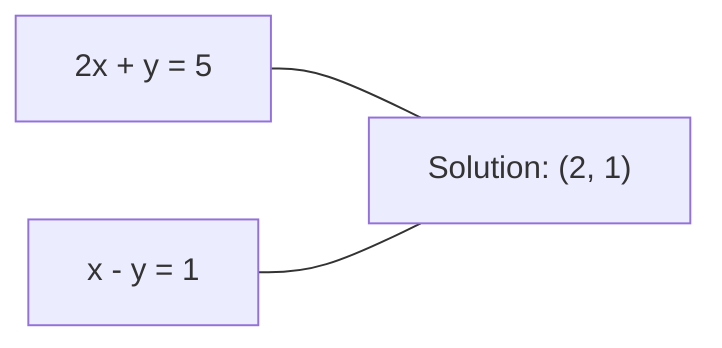
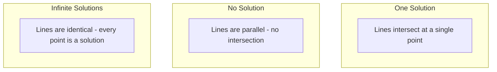

# 线性方程组

> 求解 `Ax = b` 是数学里最古老的问题之一，如今它仍然在驱动你的神经网络。

**类型:** 构建
**语言:** Python
**先修:** 第 1 阶段，第 01 课（线性代数直觉），第 02 课（向量与矩阵），第 03 课（矩阵变换）
**时长:** ~120 分钟

## 学习目标
- 使用带部分主元的高斯消元和回代法求解 `Ax = b`
- 理解 LU、QR 和 Cholesky 分解，并知道各自适用的场景
- 推导最小二乘的正规方程，并将其与线性回归和岭回归联系起来
- 使用条件数诊断病态系统，并通过正则化提升数值稳定性

## 问题

每次训练线性回归，你都在解线性方程组。每次做最小二乘拟合，你都在解线性方程组。每次神经网络层计算 `y = Wx + b`，都是在执行线性方程组的一部分。加入正则化，就是在修改这个系统。使用高斯过程时，你要分解矩阵；在计算 Mahalanobis 距离时，你要逆协方差矩阵，也在解线性方程组。

`Ax = b` 这个式子到处都在出现。A 是已知系数矩阵，b 是已知输出向量，x 是你要寻找的未知量。在线性回归里，A 是数据矩阵，b 是目标向量，x 是权重向量。整个模型最后落到同一件事上：找到一个 x，使得 `Ax` 尽量接近 b。

本课会从零实现求解这类方程的所有主流方法。你会理解为什么有些方法快、有些方法稳，为什么有些方法只适用于方阵，而有些能处理过定系统，以及为什么矩阵的条件数决定了你的答案到底有没有意义。

## 概念

### `Ax = b` 的几何意义

线性方程组有一个几何解释：每个方程都定义一个超平面，解就是这些超平面的交点或交集。

```
2x + y = 5          Two lines in 2D.
x - y  = 1          They intersect at x=2, y=1.
```



会出现三种情况：



在矩阵形式里，“唯一解”意味着 A 可逆；“无解”意味着系统不相容；“无穷多解”意味着 A 有零空间。大多数机器学习问题都落在“没有精确解”这一类，因为方程（数据点）通常比未知量（参数）更多，这时候就要用最小二乘。

### 行视角与列视角

`Ax = b` 有两种读法。

**行视角。** A 的每一行都是一个方程。每个方程都是一个超平面，解就是它们的交点。

**列视角。** A 的每一列都是一个向量。问题就变成：A 的列向量按什么线性组合能得到 b？

```
A = | 2  1 |    b = | 5 |
    | 1 -1 |        | 1 |

Row picture: solve 2x + y = 5 and x - y = 1 simultaneously.

Column picture: find x1, x2 such that:
  x1 * [2, 1] + x2 * [1, -1] = [5, 1]
  2 * [2, 1] + 1 * [1, -1] = [4+1, 2-1] = [5, 1]   check.
```

列视角更根本。如果 b 落在 A 的列空间里，系统就有解；如果不在，就找列空间里离它最近的点，而这个最近点就是最小二乘解。

### 高斯消元

高斯消元会把 `Ax = b` 变成一个上三角系统 `Ux = c`，然后通过回代求解。这是最直接的方法。

算法如下：

```
1. For each column k (the pivot column):
   a. Find the largest entry in column k at or below row k (partial pivoting).
   b. Swap that row with row k.
   c. For each row i below k:
      - Compute multiplier m = A[i][k] / A[k][k]
      - Subtract m times row k from row i.
2. Back substitute: solve from the last equation upward.
```

示例：

```
Original:
| 2  1  1 | 8 |       R2 = R2 - (2)R1     | 2  1   1 |  8 |
| 4  3  3 |20 |  -->  R3 = R3 - (1)R1 --> | 0  1   1 |  4 |
| 2  3  1 |12 |                            | 0  2   0 |  4 |

                       R3 = R3 - (2)R2     | 2  1   1 |  8 |
                                       --> | 0  1   1 |  4 |
                                           | 0  0  -2 | -4 |

Back substitute:
  -2 * x3 = -4    -->  x3 = 2
  x2 + 2  = 4     -->  x2 = 2
  2*x1 + 2 + 2 = 8 --> x1 = 2
```

高斯消元的复杂度是 O(n^3)。对于一个 1000x1000 的系统，这大约是一十亿次浮点运算。它已经够快了，但如果你需要用同一个 A 去解多个不同的 b，还能省一点。

### 为什么部分主元很重要

如果不做主元选取，高斯消元可能直接失败，或者算出垃圾结果。若主元为 0，就会除以 0；若主元很小，就会放大舍入误差。

```
Bad pivot:                       With partial pivoting:
| 0.001  1 | 1.001 |            Swap rows first:
| 1      1 | 2     |            | 1      1 | 2     |
                                 | 0.001  1 | 1.001 |
m = 1/0.001 = 1000              m = 0.001/1 = 0.001
R2 = R2 - 1000*R1               R2 = R2 - 0.001*R1
| 0.001  1     | 1.001   |      | 1      1     | 2     |
| 0     -999   | -999.0  |      | 0      0.999 | 0.999 |

x2 = 1.000 (correct)            x2 = 1.000 (correct)
x1 = (1.001 - 1)/0.001          x1 = (2 - 1)/1 = 1.000 (correct)
   = 0.001/0.001 = 1.000        Stable because the multiplier is small.
```

在浮点精度有限时，不做主元选取的版本会丢失有效数字。部分主元总会选当前列绝对值最大的元素作为主元，以尽量减少误差放大。

### LU 分解

LU 分解会把 A 分解成一个下三角矩阵 L 和一个上三角矩阵 U：`A = LU`。L 矩阵存的是高斯消元中的乘子，U 矩阵是消元后的结果。

```
A = L @ U

| 2  1  1 |   | 1  0  0 |   | 2  1   1 |
| 4  3  3 | = | 2  1  0 | @ | 0  1   1 |
| 2  3  1 |   | 1  2  1 |   | 0  0  -2 |
```

为什么不直接消元，而要分解？因为有了 L 和 U 之后，再解新的 `Ax = b` 只需要 O(n^2)：

```
Ax = b
LUx = b
Let y = Ux:
  Ly = b    (forward substitution, O(n^2))
  Ux = y    (back substitution, O(n^2))
```

O(n^3) 的分解成本只付一次，后面每解一个新的 b 只要 O(n^2)。如果你要对同一个 A 解 1000 个不同的 b，LU 能把总工作量大幅摊薄。

如果带部分主元，就写成 `PA = LU`，其中 P 是记录行交换的置换矩阵。

### QR 分解

QR 分解会把 A 分解成一个正交矩阵 Q 和一个上三角矩阵 R：`A = QR`。

正交矩阵满足 `Q^T Q = I`，它的列向量两两正交且都为单位长度。乘上 Q 不会改变长度和夹角。

```
A = Q @ R

Q has orthonormal columns: Q^T Q = I
R is upper triangular

To solve Ax = b:
  QRx = b
  Rx = Q^T b    (just multiply by Q^T, no inversion needed)
  Back substitute to get x.
```

QR 在解最小二乘问题时通常比 LU 更稳定。Gram-Schmidt 过程能逐列构造 Q：

```
Given columns a1, a2, ... of A:

q1 = a1 / ||a1||

q2 = a2 - (a2 . q1) * q1        (subtract projection onto q1)
q2 = q2 / ||q2||                (normalize)

q3 = a3 - (a3 . q1) * q1 - (a3 . q2) * q2
q3 = q3 / ||q3||

R[i][j] = qi . aj    for i <= j
```

每一步都去掉在之前 q 向量方向上的分量，只保留新的正交方向。

### Cholesky 分解

当 A 是对称矩阵（`A = A^T`）且正定（所有特征值都大于 0）时，能写成 `A = L L^T`，这就是 Cholesky 分解。

```
A = L @ L^T

| 4  2 |   | 2  0 |   | 2  1 |
| 2  5 | = | 1  2 | @ | 0  2 |

L[i][i] = sqrt(A[i][i] - sum(L[i][k]^2 for k < i))
L[i][j] = (A[i][j] - sum(L[i][k]*L[j][k] for k < j)) / L[j][j]    for i > j
```

Cholesky 比 LU 快大约一倍，而且存储更少。但它只适用于对称正定矩阵，而这种矩阵在很多地方都会用到：
- 协方差矩阵是对称半正定的，加入正则后通常变成正定
- 高斯过程里的核矩阵是对称正定的
- 凸函数在极小点处的 Hessian 是对称正定的
- `A^T A` 总是对称半正定的

在高斯过程中，你会用 Cholesky 分解核矩阵 K，然后解 `K alpha = y` 来得到预测均值。Cholesky 因子还能直接给出边际似然里的行列式：`log det(K) = 2 * sum(log(diag(L)))`。

### 最小二乘：当 `Ax = b` 没有精确解时

如果 A 是 `m x n` 且 `m > n`，系统就是过定的。它通常没有精确解。这时要最小化平方误差：

```
minimize ||Ax - b||^2

This is the sum of squared residuals:
  sum((A[i,:] @ x - b[i])^2 for i in range(m))
```

最优解满足正规方程：

```
A^T A x = A^T b
```

推导方式是展开 `||Ax - b||^2 = (Ax - b)^T (Ax - b) = x^T A^T A x - 2 x^T A^T b + b^T b`，然后对 x 求梯度并令其为 0：`2 A^T A x - 2 A^T b = 0`。

```
Original system (overdetermined, 4 equations, 2 unknowns):
| 1  1 |         | 3 |
| 1  2 | x     = | 5 |       No exact x satisfies all 4 equations.
| 1  3 |         | 6 |
| 1  4 |         | 8 |

Normal equations:
A^T A = | 4  10 |    A^T b = | 22 |
        | 10 30 |            | 63 |

Solve: x = [1.5, 1.7]

This is linear regression. x[0] is the intercept, x[1] is the slope.
```

### 正规方程就是线性回归

这里的联系是完全精确的。在线性回归里，数据矩阵 X 的每一行是一条样本，每一列是一个特征。目标向量 y 的每一项对应一个样本。权重向量 w 满足：

```
X^T X w = X^T y
w = (X^T X)^(-1) X^T y
```

这就是线性回归的闭式解。每次调用 `sklearn.linear_model.LinearRegression.fit()`，都在计算这个解，或者一个等价的 QR / SVD 版本。

如果在矩阵里加上正则项 `lambda * I`，就得到岭回归：

```
(X^T X + lambda * I) w = X^T y
w = (X^T X + lambda * I)^(-1) X^T y
```

正则化可以改善条件数，让矩阵更容易精确求逆，同时通过把权重往 0 拉来抑制过拟合。只要 `lambda > 0`，`X^T X + lambda * I` 就是对称正定的，因此可以用 Cholesky 求解。

### 伪逆（Moore-Penrose）

伪逆 `A+` 把非方阵和奇异矩阵的情况统一起来。对任意矩阵 A：

```
x = A+ b

where A+ = V Sigma+ U^T    (computed via SVD)
```

`Sigma+` 的构造方法是：把每个非零奇异值取倒数，再转置结果。如果 `A = U Sigma V^T`，那么 `A+ = V Sigma+ U^T`。

```
A = U Sigma V^T        (SVD)

Sigma = | 5  0 |       Sigma+ = | 1/5  0  0 |
        | 0  2 |                | 0  1/2  0 |
        | 0  0 |

A+ = V Sigma+ U^T
```

伪逆给出的就是最小范数的最小二乘解。如果系统：
- 有唯一解，`A+ b` 就是它
- 没有精确解，`A+ b` 就是最小二乘解
- 有无穷多解，`A+ b` 是范数最小的那个解

NumPy 的 `np.linalg.lstsq` 和 `np.linalg.pinv` 内部都依赖 SVD。

### 条件数

条件数衡量输入有微小扰动时，解会有多敏感。对于矩阵 A，条件数定义为：

```
kappa(A) = ||A|| * ||A^(-1)|| = sigma_max / sigma_min
```

其中 `sigma_max` 和 `sigma_min` 分别是最大和最小奇异值。

```
Well-conditioned (kappa ~ 1):        Ill-conditioned (kappa ~ 10^15):
Small change in b -->                Small change in b -->
small change in x                    huge change in x

| 2  0 |   kappa = 2/1 = 2          | 1   1          |   kappa ~ 10^15
| 0  1 |   safe to solve            | 1   1+10^(-15) |   solution is garbage
```

经验法则：
- `kappa < 100`：通常很安全，解比较准确
- `kappa ~ 10^k`：浮点运算大约会损失 k 位有效数字
- `kappa ~ 10^16`（float64 下）：结果基本没意义，矩阵在数值上等同于奇异

在机器学习里，病态矩阵常常出现在特征近乎共线的时候。加正则项 `lambda * I` 可以把条件数从 `sigma_max / sigma_min` 改善到 `(sigma_max + lambda) / (sigma_min + lambda)`。

### 迭代法：共轭梯度

对于非常大的稀疏系统（未知量有几百万个），LU 或 Cholesky 这样的直接法太贵了。迭代法会从一个初始猜测出发，不断改进答案。

共轭梯度（CG）用于求解对称正定系统 `Ax = b`。在精确算术下，它最多 n 步就能找到精确解；但如果 A 的特征值分布比较集中，通常会更快收敛。

```
Algorithm sketch:
  x0 = initial guess (often zero)
  r0 = b - A x0           (residual)
  p0 = r0                 (search direction)

  For k = 0, 1, 2, ...:
    alpha = (rk . rk) / (pk . A pk)
    x_{k+1} = xk + alpha * pk
    r_{k+1} = rk - alpha * A pk
    beta = (r_{k+1} . r_{k+1}) / (rk . rk)
    p_{k+1} = r_{k+1} + beta * pk
    if ||r_{k+1}|| < tolerance: stop
```

CG 常用于：
- 大规模优化中的 Newton-CG 方法
- PDE 离散化求解
- 核方法里太大而无法直接分解的核矩阵
- 作为其他迭代求解器的预条件基础

收敛速度取决于条件数。条件更好的系统收敛更快，这也是正则化有帮助的另一个原因。

### 该用哪种方法

| 方法 | 条件 | 成本 | 场景 |
|--------|-------------|------|----------|
| 高斯消元 | 方阵且非奇异 | O(n^3) | 一次性求解方阵 |
| LU 分解 | 方阵且非奇异 | 分解 O(n^3) + 求解 O(n^2) | 同一个 A 需要多次求解 |
| QR 分解 | 任意 A（m >= n） | O(mn^2) | 最小二乘，数值更稳定 |
| Cholesky | 对称正定 A | O(n^3/3) | 协方差矩阵、高斯过程、岭回归 |
| 正规方程 | 过定系统（m > n） | O(mn^2 + n^3) | 线性回归（n 不大时） |
| SVD / 伪逆 | 任意 A | O(mn^2) | 秩亏系统、最小范数解 |
| 共轭梯度 | 对称正定且稀疏 A | O(n * k * nnz) | 大规模稀疏系统，k 为迭代次数 |

### 与机器学习的联系

本课里的每种方法都会出现在生产级机器学习里：

**线性回归。** 闭式解就是求解正规方程 `X^T X w = X^T y`。如果 n 很小，通常用 Cholesky；如果更在意数值稳定性，就用 QR；如果矩阵可能秩亏，就用 SVD。

**岭回归。** 在 `X^T X` 上加上 `lambda * I`。正则化后的系统 `(X^T X + lambda * I) w = X^T y` 总能通过 Cholesky 来求解，因为只要 `lambda > 0`，它就是对称正定的。

**高斯过程。** 预测均值需要解 `K alpha = y`，其中 K 是核矩阵。标准做法就是对 K 做 Cholesky 分解。边际似然中的对数行列式也可以通过 `log det(K) = 2 * sum(log(diag(L)))` 计算。

**神经网络初始化。** 正交初始化会用 QR 分解生成列正交的权重矩阵，这样可以防止深层网络中的信号塌缩。

**预条件。** 大规模优化器会用不完全 Cholesky 或不完全 LU 作为共轭梯度的预条件器。

**特征工程。** `X^T X` 的条件数可以告诉你特征是否近似共线。如果条件数很大，就该删特征或者加正则。

```figure
linear-system-conditioning
```

## 实现

### 步骤 1：带部分主元的高斯消元

```python
import numpy as np

def gaussian_elimination(A, b):
    n = len(b)
    Ab = np.hstack([A.astype(float), b.reshape(-1, 1).astype(float)])

    for k in range(n):
        max_row = k + np.argmax(np.abs(Ab[k:, k]))
        Ab[[k, max_row]] = Ab[[max_row, k]]

        if abs(Ab[k, k]) < 1e-12:
            raise ValueError(f"Matrix is singular or nearly singular at pivot {k}")

        for i in range(k + 1, n):
            m = Ab[i, k] / Ab[k, k]
            Ab[i, k:] -= m * Ab[k, k:]

    x = np.zeros(n)
    for i in range(n - 1, -1, -1):
        x[i] = (Ab[i, -1] - Ab[i, i+1:n] @ x[i+1:n]) / Ab[i, i]

    return x
```

### 步骤 2：LU 分解

```python
def lu_decompose(A):
    n = A.shape[0]
    L = np.eye(n)
    U = A.astype(float).copy()
    P = np.eye(n)

    for k in range(n):
        max_row = k + np.argmax(np.abs(U[k:, k]))
        if max_row != k:
            U[[k, max_row]] = U[[max_row, k]]
            P[[k, max_row]] = P[[max_row, k]]
            if k > 0:
                L[[k, max_row], :k] = L[[max_row, k], :k]

        for i in range(k + 1, n):
            L[i, k] = U[i, k] / U[k, k]
            U[i, k:] -= L[i, k] * U[k, k:]

    return P, L, U

def lu_solve(P, L, U, b):
    n = len(b)
    Pb = P @ b.astype(float)

    y = np.zeros(n)
    for i in range(n):
        y[i] = Pb[i] - L[i, :i] @ y[:i]

    x = np.zeros(n)
    for i in range(n - 1, -1, -1):
        x[i] = (y[i] - U[i, i+1:] @ x[i+1:]) / U[i, i]

    return x
```

### 步骤 3：Cholesky 分解

```python
def cholesky(A):
    n = A.shape[0]
    L = np.zeros_like(A, dtype=float)

    for i in range(n):
        for j in range(i + 1):
            s = A[i, j] - L[i, :j] @ L[j, :j]
            if i == j:
                if s <= 0:
                    raise ValueError("Matrix is not positive definite")
                L[i, j] = np.sqrt(s)
            else:
                L[i, j] = s / L[j, j]

    return L
```

### 步骤 4：用正规方程求最小二乘

```python
def least_squares_normal(A, b):
    AtA = A.T @ A
    Atb = A.T @ b
    return gaussian_elimination(AtA, Atb)

def ridge_regression(A, b, lam):
    n = A.shape[1]
    AtA = A.T @ A + lam * np.eye(n)
    Atb = A.T @ b
    L = cholesky(AtA)
    y = np.zeros(n)
    for i in range(n):
        y[i] = (Atb[i] - L[i, :i] @ y[:i]) / L[i, i]
    x = np.zeros(n)
    for i in range(n - 1, -1, -1):
        x[i] = (y[i] - L.T[i, i+1:] @ x[i+1:]) / L.T[i, i]
    return x
```

### 步骤 5：条件数

```python
def condition_number(A):
    U, S, Vt = np.linalg.svd(A)
    return S[0] / S[-1]
```

## 使用方式

把这些拼起来，就可以在真实数据上做线性回归和岭回归：

```python
np.random.seed(42)
X_raw = np.random.randn(100, 3)
w_true = np.array([2.0, -1.0, 0.5])
y = X_raw @ w_true + np.random.randn(100) * 0.1

X = np.column_stack([np.ones(100), X_raw])

w_ols = least_squares_normal(X, y)
print(f"OLS weights (ours):    {w_ols}")

w_np = np.linalg.lstsq(X, y, rcond=None)[0]
print(f"OLS weights (numpy):   {w_np}")
print(f"Max difference: {np.max(np.abs(w_ols - w_np)):.2e}")

w_ridge = ridge_regression(X, y, lam=1.0)
print(f"Ridge weights (ours):  {w_ridge}")

from sklearn.linear_model import Ridge
ridge_sk = Ridge(alpha=1.0, fit_intercept=False)
ridge_sk.fit(X, y)
print(f"Ridge weights (sklearn): {ridge_sk.coef_}")
```

## 产出

本课会产出：
- `code/linear_systems.py`，包含从零实现的高斯消元、LU 分解、Cholesky 分解、最小二乘和岭回归
- 一个演示：说明正规方程和 sklearn 的 LinearRegression 会得到相同的权重

## 练习

1. 用你实现的高斯消元、LU 求解器和 `np.linalg.solve` 求解 `[[1,2,3],[4,5,6],[7,8,10]] x = [6, 15, 27]`。验证三者在浮点容差内给出相同答案。

2. 生成一个 50x5 的随机矩阵 X 和目标 `y = X @ w_true + noise`。分别用正规方程、QR（通过 `np.linalg.qr`）、SVD（通过 `np.linalg.svd`）和 `np.linalg.lstsq` 求解 w。比较四个结果，计算 `X^T X` 的条件数，并解释它如何影响你信任哪种方法。

3. 构造一个几乎奇异的矩阵，例如让两列几乎相同（`col2 = col1 + 1e-10 * noise`）。计算它的条件数。分别在不加正则和加正则（`+ 0.01 * I`）的情况下求解 `Ax = b`，比较解和残差。解释为什么正则化有用。

4. 为一个 100x100 的随机对称正定矩阵实现共轭梯度算法。统计它收敛到 1e-8 容差需要多少次迭代，并与理论上的 n 步上界比较。

5. 在大小为 10、50、200、500 的对称正定矩阵上，比较你的 Cholesky 求解器、LU 求解器和 `np.linalg.solve` 的耗时。画图并验证 Cholesky 通常比 LU 快大约一倍。

## 关键术语

| 术语 | 大家常说 | 实际含义 |
|------|----------|----------|
| 线性系统 | “解 x” | 一组线性方程 `Ax = b`。找到 x，就是找到在 A 的变换下能产生 b 的输入。 |
| 高斯消元 | “行化简” | 通过行变换系统地消去对角线下方的元素，得到可回代求解的上三角系统。复杂度 O(n^3)。 |
| 部分主元 | “为了稳定而交换行” | 在第 k 列消元前，把该列绝对值最大的元素换到主元位置，防止小数除法放大误差。 |
| LU 分解 | “三角分解” | 写成 `A = LU`，其中 L 是下三角矩阵（存乘子），U 是上三角矩阵。把 O(n^3) 的分解成本摊到多次求解上。 |
| QR 分解 | “正交分解” | 写成 `A = QR`，其中 Q 的列正交归一，R 是上三角矩阵。用于最小二乘时比 LU 更稳定。 |
| Cholesky 分解 | “矩阵开方” | 对称正定 A 可写成 `A = LL^T`。比 LU 更省时省内存。常用于协方差矩阵、核矩阵和岭回归。 |
| 最小二乘 | “无法精确求解时的最佳拟合” | 当系统过定时，最小化残差平方和 `||Ax - b||^2`。 |
| 正规方程 | “微积分捷径” | `A^T A x = A^T b`。它就是对 `||Ax - b||^2` 求梯度后令其为 0 得到的闭式解。 |
| 伪逆 | “非方阵的逆” | 通过 SVD 得到的 `A+ = V Sigma+ U^T`。对任意矩阵都能给出最小范数的最小二乘解。 |
| 条件数 | “这个答案有多可信” | `kappa = sigma_max / sigma_min`。衡量输入扰动对输出的敏感性。`kappa` 越大，精度损失越严重。 |
| 岭回归 | “正则化最小二乘” | 求解 `(X^T X + lambda I) w = X^T y`。加入 `lambda I` 可改善条件数并收缩权重。 |
| 共轭梯度 | “大矩阵的迭代解法” | 用于对称正定系统的迭代求解器。最多 n 步收敛，适合大型稀疏系统。 |
| 过定系统 | “数据比参数多” | 在 m-by-n 系统中 m > n。通常没有精确解，用最小二乘找最佳近似。 |
| 回代 | “从下往上解” | 在上三角系统中先解最后一个方程，再逐步向上代入。复杂度 O(n^2)。 |
| 前代 | “从上往下解” | 在下三角系统中先解第一个方程，再逐步向下代入。复杂度 O(n^2)。 |

## 延伸阅读

- [MIT 18.06: Linear Algebra](https://ocw.mit.edu/courses/18-06-linear-algebra-spring-2010/) - Gilbert Strang 的经典线性代数课程，讲线性系统和矩阵分解
- [Numerical Linear Algebra](https://people.maths.ox.ac.uk/trefethen/text.html) - Trefethen & Bau 关于数值稳定性、条件数和算法失效的标准参考
- [Matrix Computations](https://www.cs.cornell.edu/cv/GolubVanLoan4/golubandvanloan.htm) - Golub & Van Loan 的矩阵算法百科全书
- [3Blue1Brown: Inverse Matrices](https://www.3blue1brown.com/lessons/inverse-matrices) - 从几何角度理解 `Ax = b`
