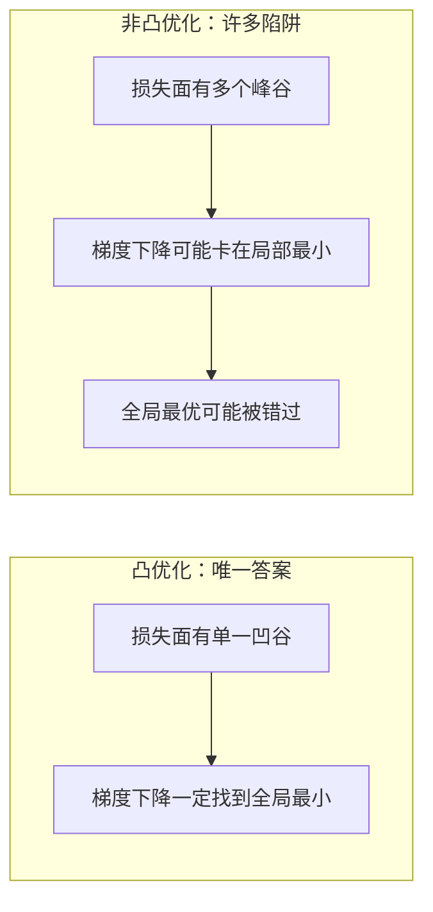
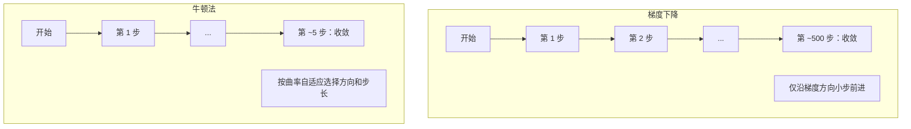
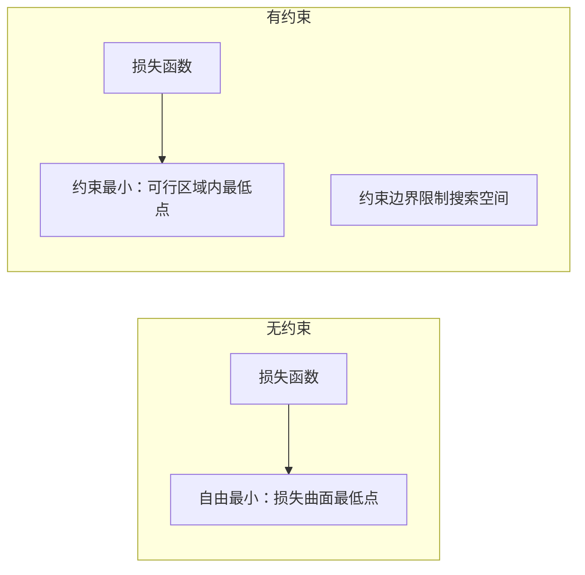
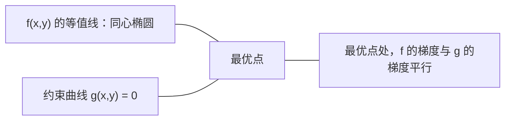

# 凸优化

> 凸问题只有一个谷底；神经网络的损失面却有成千上万个。分清这个差异很关键。

**类型:** 构建
**语言:** Python
**先修:** 第 1 阶段：第 04 课（用于机器学习的微积分）、第 08 课（优化）
**时长:** ~90 分钟

## 学习目标

- 使用定义、二阶导数和 Hessian 标准，判断函数是否为凸函数
- 实现牛顿法并与梯度下降比较二次收敛特性
- 用拉格朗日乘子求解约束优化，并理解 KKT 条件
- 解释为何神经网络损失通常非凸，但 SGD 仍能找到可用解

## 问题

第 08 课讲过梯度下降、Momentum 和 Adam。这些优化器会在任何曲面上“下坡”。但它们不给收敛保证：
在非凸曲面上，梯度下降可能陷入差的局部最优、停在鞍点，或在不良区域振荡。尽管如此，我们仍要用它们，因为神经网络本质上是非凸优化。

但机器学习里也有很多凸优化问题，例如线性回归、逻辑回归、SVM、LASSO、岭回归。对这类问题，我们能得到更强的数学保证。凸问题只有一个谷底，任何下坡算法都能到达全局最优，不需要重启，不需要复杂的学习率策略，不需要祈祷。

理解凸性有三大价值：一是识别“容易解”和“难解”；二是让你在凸问题上使用更快的牛顿类方法；三是在 ML 中理解更多核心思想——正则化作为约束、SVM 的对偶形式，以及为什么深度学习在缺失这些凸优化“好性质”时仍然可行。

## 概念

### 凸集

集合 `S` 是凸的，当且仅当：对 `S` 中任意两点，连接它们的线段也完全落在 `S` 内。

| 凸集 | 非凸集 |
|---|---|
| **矩形**：任意两个内部点可连成一条仍在内部的线段 | **星形/弯月形**：两个内部点之间的连线可能穿出集合 |
| **三角形**：任意两个内部点都满足上面性质 | **环形/中空环（圆环）**：孔洞导致某些线段越界 |
| 两点连线始终在集合内 | 某些点对之间的连线会离开集合 |

形式化定义：对任意 `x, y in S`，以及任意 `t in [0,1]`，点 `tx + (1-t)y` 也必须在 `S` 内。

凸集示例：
- 一条直线、一张平面、整个 `R^n`
- 球（圆、球面、超球）
- 半空间：`{x : a^T x <= b}`
- 任意多个凸集的交集

非凸集示例：
- 圆环（annulus）
- 两个互不相交的圆的并集
- 有“凹痕”或“空洞”的集合

### 凸函数

函数 `f` 在其定义域上是凸集且满足：对任意定义域中的 `x, y`，以及任意 `t in [0,1]`，

```
f(tx + (1-t)y) <= t*f(x) + (1-t)*f(y)
```

几何直觉：函数图像上任意两点连线不低于（即不在）图像下方。

| 性质 | 凸函数 | 非凸函数 |
|---|---|---|
| **弦线检验** | 图像上任意两点连线都在曲线 **上方或重合** | 存在两点连线会下穿曲线 |
| **形状** | 单一碗状、向上弯曲 | 有多个峰谷、曲率混合 |
| **局部极小** | 每个局部极小点都是全局最小 | 可能存在多个高度不同的局部极小 |

常见凸函数：
- `f(x) = x^2`（抛物线）
- `f(x) = |x|`（绝对值）
- `f(x) = e^x`（指数）
- `f(x) = max(0, x)`（ReLU，分段线性）
- `f(x) = -log(x)`，`x > 0`（负对数）
- 任意线性函数 `f(x) = a^T x + b`（既凸又凹）

### 凸性判定

从易到难，常用三种判断方式。

**测试 1：二阶导数（1D）**。若对所有 `x` 都有 `f''(x) >= 0`，则 `f` 为凸函数。

- `f(x) = x^2`：`f''(x) = 2 >= 0`，凸。
- `f(x) = x^3`：`f''(x) = 6x`，在 `x < 0` 时为负，不凸。
- `f(x) = e^x`：`f''(x) = e^x > 0`，凸。

**测试 2：Hessian（多元）**。若 Hessian 矩阵 `H(x)` 对所有 `x` 都是半正定矩阵，则 `f` 凸。Hessian 是所有二阶偏导数组成的矩阵。

**测试 3：按定义直接检验**。直接验证上式在所有 `x,y,t` 下成立。对难以求导的函数尤其有用。

### 为什么凸性重要

凸优化的核心结论：

**对于凸函数，所有局部最小都是全局最小。**

这意味着梯度下降不会被困死：任何下坡路径都指向同一结果，算法能保证收敛到最优解。



这带来三类影响：
- 不必做随机重启
- 不必依赖复杂学习率策略
- 可建立收敛证明（速度受函数性质影响）
- 解通常是唯一的（除了平坦区域）

### ML 中的凸与非凸

| 问题 | 凸？ | 原因 |
|---------|---------|-----|
| 线性回归（MSE） | 是 | 对权重是二次函数 |
| 逻辑回归 | 是 | 对数损失对权重是凸的 |
| SVM（铰链损失） | 是 | 线性函数的最大值仍是凸函数 |
| LASSO（L1 回归） | 是 | 凸函数之和仍凸 |
| 岭回归（L2） | 是 | 二次项 + 二次项仍凸 |
| 神经网络（任意损失） | 否 | 非线性激活带来非凸地形 |
| k-means 聚类 | 否 | 存在离散赋值步骤 |
| 矩阵分解 | 否 | 未知量乘积导致非凸 |

线性模型在凸损失下是凸问题；一旦加上非线性激活和隐藏层，凸性通常被打破。

### Hessian 矩阵

函数 `f: R^n -> R` 的 Hessian `H` 是 `n × n` 的二阶偏导矩阵。

```
H[i][j] = d^2 f / (dx_i dx_j)
```

以 `f(x, y) = x^2 + 3xy + y^2` 为例：

```
df/dx = 2x + 3y       d^2f/dx^2 = 2      d^2f/dxdy = 3
df/dy = 3x + 2y       d^2f/dydx = 3      d^2f/dy^2 = 2

H = [ 2  3 ]
    [ 3  2 ]
```

Hessian 告诉我们曲率：
- 所有特征值都为正：该点各方向都向上弯，属于局部凸
- 所有特征值都为负：各方向都向下弯，属于局部凹（局部最大）
- 特征值正负混合：鞍点（部分方向上凸，部分方向上凹）
- 存在零特征值：该方向平坦（病态/退化）

凸性要求 Hessian 在所有点都半正定（特征值 `>= 0`），而不只是某一点。

### 牛顿法

梯度下降使用一阶信息（梯度）；牛顿法使用二阶信息（Hessian）。牛顿法在当前点构造二次近似，并一步跳到该二次函数的最小点。

```
更新公式:
  x_new = x - H^(-1) * gradient

与梯度下降对比:
  x_new = x - lr * gradient
```

牛顿法把标量学习率替换为 Hessian 逆，能根据局部曲率自动调整步长和方向。



优点：
- 在最小值附近有二次收敛（每步误差平方级降低）
- 无需手工调学习率
- 对参数尺度不敏感（重参数化后表现基本一致）

缺点：
- 计算 Hessian 需要 `O(n^2)` 内存，并且求逆是 `O(n^3)`
- 100 万参数的神经网络意味着约 `10^12` 个条目和 `10^18` 量级运算
- 对深度学习通常不可行

### 约束优化

无约束优化：在全部 `x` 上最小化 `f(x)`。
约束优化：在约束条件下最小化 `f(x)`。

现实问题通常有约束。你想减小代价，但预算有限；想减小误差，但模型复杂度必须受控。



### 拉格朗日乘子

拉格朗日乘子把约束问题转成无约束问题。

问题：最小化 `f(x)` 且满足 `g(x)=0`。

思路：引入一个新变量（拉格朗日乘子 `lambda`），转化为无约束形式：

```
L(x, lambda) = f(x) + lambda * g(x)
```

最优解满足 `L` 的梯度为零：

```
dL/dx = df/dx + lambda * dg/dx = 0
dL/dlambda = g(x) = 0
```

几何理解：在约束最小点，`f` 的梯度与约束 `g` 的梯度必须平行。如果它们不平行，说明可沿约束面继续下调 `f`。



示例：最小化 `f(x,y)=x^2+y^2`，约束 `x+y=1`。

```
L = x^2 + y^2 + lambda(x + y - 1)

dL/dx = 2x + lambda = 0  =>  x = -lambda/2
dL/dy = 2y + lambda = 0  =>  y = -lambda/2
dL/dlambda = x + y - 1 = 0

前两式得：x = y
代入得：2x = 1，故 x = y = 0.5，lambda = -1
```

原点到直线 `x + y = 1` 的最近点就是 `(0.5, 0.5)`。

### KKT 条件

Karush-Kuhn-Tucker（KKT）条件把拉格朗日乘子推广到不等式约束。

问题：最小化 `f(x)`，约束 `g_i(x) <= 0`（`i = 1, ..., m`）。

KKT 条件（最优性的必要条件）：

```
1. 平稳性（Stationarity）:    df/dx + sum(lambda_i * dg_i/dx) = 0
2. 原始可行性（Primal feasibility）:  g_i(x) <= 0  对所有 i
3. 对偶可行性（Dual feasibility）:    lambda_i >= 0  对所有 i
4. 互补松弛性（Complementary slackness）:  lambda_i * g_i(x) = 0  对所有 i
```

互补松弛性是关键：约束要么是**活动约束**（`g_i=0`，最优点在边界上），要么对应乘子为 0（约束不影响解）。

KKT 在 SVM 中很关键：支持向量是乘子 `lambda > 0` 的样本点，其他样本的 `lambda = 0`，不影响分类边界。

### 正则化视角：约束优化

L1 和 L2 正则化不是拍脑袋的技巧，而是“伪装”的约束优化。

**L2 正则化（岭）：**

```
minimize  Loss(w)  subject to  ||w||^2 <= t

等价的无约束形式：
minimize  Loss(w) + lambda * ||w||^2
```

约束 `||w||^2 <= t` 定义了一个球体（2D 中是圆，3D 中是球）。最优解是损失等值线第一次接触该球体的位置。

**L1 正则化（LASSO）：**

```
minimize  Loss(w)  subject to  ||w||_1 <= t

等价的无约束形式：
minimize  Loss(w) + lambda * ||w||_1
```

约束 `||w||_1 <= t` 定义一个菱形（2D 下是旋转后的正方形）。

| 性质 | L2 约束（圆） | L1 约束（菱形） |
|---|---|---|
| **约束形状** | 圆（高维下对应球） | 菱形（2D 下是旋转方形） |
| **损失等值线的切点** | 通常在边界任意位置 | 多在坐标轴对齐的顶点附近 |
| **解的行为** | 权重变小但通常非零 | 一些权重会精确变为 0（稀疏） |
| **结果** | 权重收缩 | 特征选择 |

这就解释了为什么 L1 更容易得到稀疏解（特征选择），而 L2 更多是缩小权重。菱形有角点，等值线更容易在角点相切，从而把某些权重压到 0。

### 对偶（Duality）

每个约束优化问题（原问题）都有一个配对问题（对偶问题）。对凸问题，原问题与对偶问题最优值相同，这就是强对偶。

拉格朗日对偶函数：

```
原问题：最小化 `f(x)`，约束 `g(x) <= 0`
拉格朗日函数：`L(x, lambda) = f(x) + lambda * g(x)`
对偶函数：`d(lambda) = min_x L(x, lambda)`
对偶问题：在 `lambda >= 0` 的条件下最大化 `d(lambda)`
```

为什么对偶有用：
- 对偶问题有时更容易解
- SVM 在对偶形式下求解，目标只依赖样本点点积（于是能用核技巧）
- 对偶解给出原问题最优解的下界，便于检验解的质量

以 SVM 为例：

```
原问题：寻找 `w, b`，在满足
        `y_i(w^T x_i + b) >= 1`（对所有 `i`）的条件下最大化间隔 `2/||w||`

Dual:   maximize sum(alpha_i) - 0.5 * sum_ij(alpha_i * alpha_j * y_i * y_j * x_i^T x_j)
        约束为 `alpha_i >= 0` 且 `sum(alpha_i * y_i) = 0`

对偶形式只涉及点积 `x_i^T x_j`。
把 `x_i^T x_j` 换成 `K(x_i, x_j)`，就得到了核技巧。
```

### 为什么深度学习仍能在非凸中工作

神经网络损失函数通常高度非凸。按传统理论看，优化应当困难重重；但随机梯度下降通常依然能找到不错的解。原因主要有三点。

**大多数局部最小值已经够好了。** 在高维空间中，随机临界点（梯度为 0 的点）多数是鞍点，而不是局部最小。即使有局部最小，大多数其损失值也接近全局最小；参数空间是百万级维度时，掉进“特别差”的局部最小几率非常低。

**真正的障碍是鞍点而非局部最小。** 在有 `n` 个参数的函数中，鞍点通常有正负曲率混合。随机临界点里，全部 `n` 个特征值都为正（局部最小）的概率大约是 `2^(-n)`，几乎全部是鞍点。SGD 的噪声有助于跳出鞍点。

**过参数化让地形更平滑。** 当参数多于训练样本时，损失面更平滑、连通性更强；更宽的网络通常会减少坏的局部极值。这和直觉相反，但和大量经验观察一致。

损失地形对比：

| 性质 | 低维空间 | 高维空间 |
|---|---|---|
| **地形形状** | 孤立的峰谷很多 | 谷底更平滑、连通 |
| **局部最小** | 孤立局部最小很多 | 糟糕局部最小少；多数接近最优 |
| **寻路难度** | 很难全局定位最优 | 多条路径可达较好解 |
| **临界点** | 局部最小与鞍点并存 | 几乎全是鞍点而非局部最小 |

**随机噪声是隐式正则。** 小批量 SGD 的噪声可避免落入尖锐谷底。尖锐最小值容易过拟合，平坦最小值更易泛化。噪声把优化推向更平坦的区域。

### 二阶方法在实践中的使用

纯牛顿法对大模型不现实。常见近似让二阶信息可用。

**L-BFGS（Limited-memory BFGS）**：用最近 `m` 次梯度差分近似 Hessian 逆矩阵。内存从 `O(n^2)` 降到 `O(mn)`。适合约 `10,000` 参数规模的问题，常用于传统 ML（逻辑回归、CRF），而非深度学习。

**自然梯度**：用 Fisher 信息矩阵（对数似然的期望 Hessian）替代标准 Hessian，修正参数空间的几何结构。K-FAC（Kronecker-Factored Approximate Curvature）将 Fisher 矩阵近似成 Kronecker 乘积，使其在神经网络中可用。

**Hessian-free 优化**：用共轭梯度解 `Hx=g`，避免显式构造 `H`。只需 Hessian 向量乘积，通常可用自动微分在 `O(n)` 时间内计算。

**对角近似**：Adam 的二阶动量可看作 Hessian 对角线的近似；AdaHessian 进一步用 Hutchinson 估计直接估计真实 Hessian 对角元。

| 方法 | 内存 | 每步成本 | 适用场景 |
|--------|--------|--------------|-------------|
| 梯度下降 | `O(n)` | `O(n)` | 基线方案，适配大模型 |
| 牛顿法 | `O(n^2)` | `O(n^3)` | 小规模凸问题 |
| L-BFGS | `O(mn)` | `O(mn)` | 中等规模凸问题 |
| Adam | `O(n)` | `O(n)` | 深度学习默认选择 |
| K-FAC | `O(n)` | `O(n)` / 层 | 研究场景，大 batch 训练 |

```figure
convex-vs-nonconvex
```

## 实战

### 步骤 1：凸性检查器

写一个函数，通过采样点直接验证定义，做经验性凸性测试。

```python
import random
import math

def check_convexity(f, dim, bounds=(-5, 5), samples=1000):
    violations = 0
    for _ in range(samples):
        x = [random.uniform(*bounds) for _ in range(dim)]
        y = [random.uniform(*bounds) for _ in range(dim)]
        t = random.uniform(0, 1)
        mid = [t * xi + (1 - t) * yi for xi, yi in zip(x, y)]
        lhs = f(mid)
        rhs = t * f(x) + (1 - t) * f(y)
        if lhs > rhs + 1e-10:
            violations += 1
    return violations == 0, violations
```

### 步骤 2：二维牛顿法

用显式 Hessian 实现牛顿法，并与梯度下降比较收敛速度。

```python
def newtons_method(f, grad_f, hessian_f, x0, steps=50, tol=1e-12):
    x = list(x0)
    history = [x[:]]
    for _ in range(steps):
        g = grad_f(x)
        H = hessian_f(x)
        det = H[0][0] * H[1][1] - H[0][1] * H[1][0]
        if abs(det) < 1e-15:
            break
        H_inv = [
            [H[1][1] / det, -H[0][1] / det],
            [-H[1][0] / det, H[0][0] / det],
        ]
        dx = [
            H_inv[0][0] * g[0] + H_inv[0][1] * g[1],
            H_inv[1][0] * g[0] + H_inv[1][1] * g[1],
        ]
        x = [x[0] - dx[0], x[1] - dx[1]]
        history.append(x[:])
        if sum(gi ** 2 for gi in g) < tol:
            break
    return history
```

### 步骤 3：拉格朗日乘子求解器

用拉格朗日量上的梯度下降求解约束优化。

```python
def lagrange_solve(f_grad, g_val, g_grad, x0, lr=0.01,
                   lr_lambda=0.01, steps=5000):
    x = list(x0)
    lam = 0.0
    history = []
    for _ in range(steps):
        fg = f_grad(x)
        gv = g_val(x)
        gg = g_grad(x)
        x = [
            xi - lr * (fgi + lam * ggi)
            for xi, fgi, ggi in zip(x, fg, gg)
        ]
        lam = lam + lr_lambda * gv
        history.append((x[:], lam, gv))
    return history
```

### 步骤 4：比较一阶与二阶

在同一二次函数上运行梯度下降和牛顿法，并统计收敛步数。

```python
def quadratic(x):
    return 5 * x[0] ** 2 + x[1] ** 2

def quadratic_grad(x):
    return [10 * x[0], 2 * x[1]]

def quadratic_hessian(x):
    return [[10, 0], [0, 2]]
```

对于二次函数，牛顿法一次就能收敛（对二次问题是精确解）；梯度下降会慢得多，因为 Hessian 特征值相差 5 倍，导致长而瘦的谷底。

## 应用

选择 ML 模型与求解器时，凸性分析可直接指导决策。

对于凸问题（逻辑回归、SVM、LASSO）：
- 用专用求解器（liblinear、CVXPY、`scipy.optimize.minimize(method='L-BFGS-B')`）
- 预期得到唯一全局解
- 二阶方法通常实用且更快

对于非凸问题（神经网络）：
- 用一阶方法（SGD、Adam）
- 接受结果受初始化和随机性的影响
- 通过过参数化、噪声与学习率策略形成隐式正则
- 不必浪费时间追求“全局最优”；一个好的局部最优通常足够

```python
from scipy.optimize import minimize

result = minimize(
    fun=lambda w: sum((y - X @ w) ** 2) + 0.1 * sum(w ** 2),
    x0=np.zeros(d),
    method='L-BFGS-B',
    jac=lambda w: -2 * X.T @ (y - X @ w) + 0.2 * w,
)
```

对 SVM 来说，对偶形式天然支持核技巧：

```python
from sklearn.svm import SVC

svm = SVC(kernel='rbf', C=1.0)
svm.fit(X_train, y_train)
print(f"支持向量：{svm.n_support_}")
```

## 练习

1. **凸性画廊。** 用 `check_convexity` 检查以下函数是否凸：`f(x) = x^4`、`f(x) = sin(x)`、`f(x, y) = x^2 + y^2`、`f(x, y) = x * y`、`f(x) = max(x, 0)`。解释每个结果是否合理。
2. **牛顿法 vs 梯度下降对决。** 在 `f(x, y) = 50*x^2 + y^2`、初始点 `(10, 10)` 下跑两种方法。分别统计达到 `loss < 1e-10` 需要的步数；当 Hessian 的条件数（最大特征值与最小特征值比）变大时，梯度下降会怎样变化？
3. **拉格朗日乘子几何。** 最小化 `f(x,y) = (x-3)^2 + (y-3)^2`，约束 `x + 2y = 4`。用 `f` 与约束 `g` 的梯度平行性验证解是否正确。
4. **约束正则实验。** 实现 `L1` 约束优化：最小化 `(x-3)^2 + (y-2)^2`，约束 `|x| + |y| <= 1`。展示解中至少有一个坐标为 0（菱形约束导致的稀疏性）。
5. **Hessian 特征值分析。** 分别计算 Rosenbrock 函数在 `(1,1)` 与 `(-1,1)` 的 Hessian，比较两点特征值。说明它们反映了最小值附近与远离最小值时的曲率差异。

## 关键术语

| 术语 | 含义 |
|------|------|
| 凸集 | 任意两点连线都仍位于集合内的集合 |
| 凸函数 | 图像上任意两点连线位于曲线下方或重合；等价地，Hessian 在全域半正定 |
| 局部最小 | 在邻域内低于周围点。对凸函数，局部最小等于全局最小 |
| 全局最小 | 在整个定义域上的最低点 |
| Hessian 矩阵 | 所有二阶偏导组成的矩阵，刻画函数曲率 |
| 半正定矩阵 | 所有特征值非负；多维下是“二阶导数都不小于 0”的类比 |
| 条件数 | Hessian 最大特征值与最小特征值之比；越大越“窄长谷底”，越慢 |
| 牛顿法 | 用 Hessian 逆估计步长和方向的二阶优化器，在最小值附近具备二次收敛 |
| 拉格朗日乘子 | 引入额外变量将约束问题转为无约束问题的技巧 |
| KKT 条件 | 不等式约束下的最优性必要条件，推广拉格朗日乘子 |
| 互补松弛性 | 在最优点，约束要么激活（`g_i=0`），要么乘子为零，两者不能同时非零 |
| 对偶性 | 每个约束问题有对应对偶问题；凸问题中两者最优值一致 |
| 强对偶 | 原问题与对偶问题最优值相同，满足 Slater 条件时成立 |
| L-BFGS | 近似二阶方法，保存最近 `m` 次梯度差分，替代完整 Hessian |
| 鞍点 | 梯度为 0，但某些方向是局部最小、某些是局部最大 |
| 过参数化 | 参数数多于训练样本，通常让损失地形更平滑，坏局部最优更少 |

## 参考资料

- [Boyd & Vandenberghe: Convex Optimization](https://web.stanford.edu/~boyd/cvxbook/) - 标准教材，线上可免费获取
- [Bottou, Curtis, Nocedal: Optimization Methods for Large-Scale Machine Learning (2018)](https://arxiv.org/abs/1606.04838) - 连接凸优化理论与深度学习实践
- [Choromanska et al.: The Loss Surfaces of Multilayer Networks (2015)](https://arxiv.org/abs/1412.0233) - 为什么非凸神经网络地形没有想象中那么糟
- [Nocedal & Wright: Numerical Optimization](https://link.springer.com/book/10.1007/978-0-387-40065-5) - Newton、L-BFGS 与约束优化的系统参考

