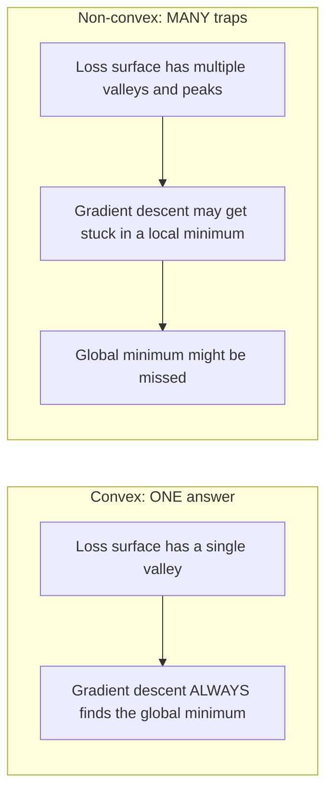
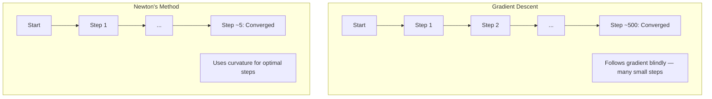
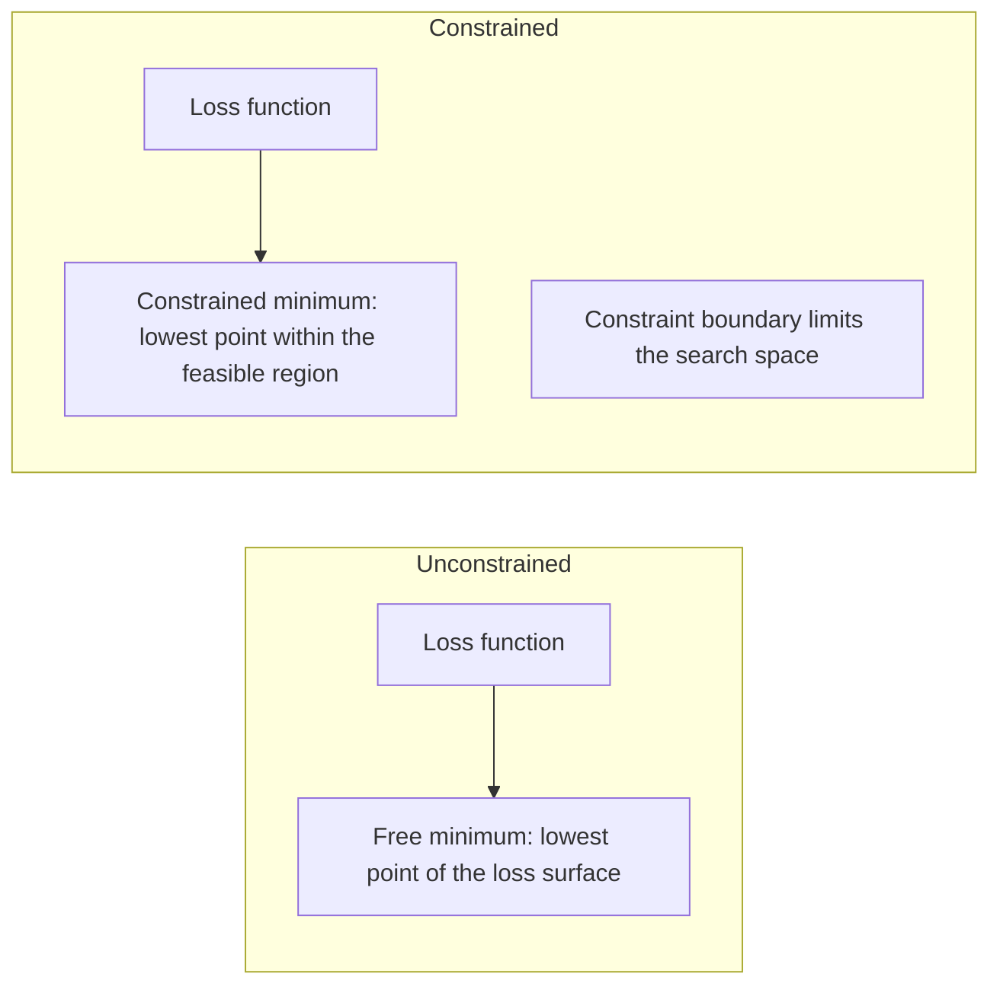
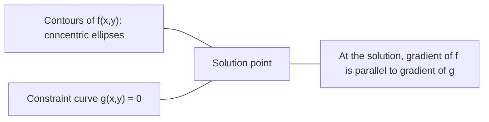

# 凸优化

> 凸问题只有一个“谷底”，而神经网络有上百万个。知道它们的区别很重要。

**Type:** Build  
**Language:** Python  
**Prerequisites:** Phase 1, Lessons 04 (Calculus for ML), 08 (Optimization)  
**Time:** ~90 分钟

## 学习目标

- 使用定义、二阶导和海森矩阵判别函数是否为凸函数
- 实现牛顿法并与梯度下降比较其二次收敛速度
- 用拉格朗日乘子法求解约束优化问题，并理解 KKT 条件
- 解释为什么神经网络损失面非凸，但 SGD 仍能找到较好的解

## 问题

第 08 课讲了梯度下降、动量和 Adam。它们会在任意地形上往下走，但不带数学保证。非凸地形上的梯度下降可能陷入劣质局部最优、停在鞍点，或者长期振荡。我们仍然会用它，是因为神经网络是非凸的，现实里也很难有替代方案。

但机器学习里有不少问题其实是凸的：线性回归、逻辑回归、SVM、LASSO、岭回归。对这些问题，我们有更强的数学保证：凸优化问题可以保证优化结论。凸问题只有一个谷底，任何下降类算法最终都会到达全局最小值，不需要重启，不需要复杂的学习率计划，也不需要祈祷。

理解凸性有三个作用。第一，它告诉你问题是容易（凸）还是困难（非凸）。第二，它给你像牛顿法这样更快的工具。第三，它解释了很多 ML 里的概念：SVM 的对偶、正则化可以视为约束，以及为什么深度学习在缺失这些“凸性质”下仍然有效。

## 核心概念

### 凸集

若集合 \(S\) 中任意两点连接线段仍完全在 \(S\) 内，则 \(S\) 为凸集。

| 凸集 | 非凸集 |
|---|---|
| **矩形**：任意两点之间都可用线段连接且始终在内部 | **星形/新月形**：两点连线可能跑到集合外 |
| **三角形**：任意内点都满足该性质 | **环形（圆环）**：洞让部分线段离开集合 |
| 任意两点连线都在集合内 | 存在某些点对连线不在集合内 |

严格定义：对 \(S\) 任意 \(x, y \in S\)、\(t\in[0,1]\)，点 \(tx + (1-t)y\) 也在 \(S\) 中。

凸集例子：
- 一条直线、一个平面、整个 \(\mathbb R^n\)
- 球（圆、球面、高维球）
- 半空间：\(\{x: a^T x \le b\}\)
- 任意个凸集的交集

非凸集例子：
- 圆环（annulus）
- 两个不相交圆的并集
- 有“凹陷”或“洞”的任意集合

### 凸函数

函数 \(f\) 在定义域为凸集时，如果对任意 \(x, y\) 和 \(t\in[0,1]\) 有

```
f(tx + (1-t)y) <= t*f(x) + (1-t)*f(y)
```

则 \(f\) 是凸函数。

几何上说：图像上任意两点之间的弦都在曲线上方或重合。

| 特性 | 凸函数 | 非凸函数 |
|---|---|---|
| **线段检验** | 曲线上任意两点连线不低于曲线 | 有些连线会下穿曲线 |
| **形状** | 单一开口上凸“碗”形 | 有多个峰谷、弯曲方向混杂 |
| **局部极小** | 任何局部最小就是全局最小 | 可能存在多个局部最小 |

常见凸函数：
- \(f(x)=x^2\)（抛物线）
- \(f(x)=|x|\)（绝对值）
- \(f(x)=e^x\)（指数）
- \(f(x)=\max(0,x)\)（ReLU，分段线性）
- \(f(x)=-\log x,\ x>0\)（负对数）
- 任意线性函数 \(f(x)=a^Tx+b\)（既凸又凹）

### 凸性检验

三个常用测试，按难度从低到高：

**测试 1：二阶导检验（1D）**  
若 \(f''(x)\ge0\) 对所有 \(x\) 成立，则 \(f\) 凸。

- \(f(x)=x^2\): \(f''(x)=2\ge0\)，凸
- \(f(x)=x^3\): \(f''(x)=6x\)，在 \(x<0\) 时为负，不凸
- \(f(x)=e^x\): \(f''(x)=e^x>0\)，凸

**测试 2：海森检验（多维）**  
若海森矩阵 \(H(x)\) 在所有点都半正定，则 \(f\) 凸。海森矩阵是二阶偏导阵。

**测试 3：定义检验**  
直接检查定义式不等式。对不可导或导数难算的函数特别有用。

### 为什么凸性重要

凸优化核心定理：

**对于凸函数，任何局部最小点都是全局最小点。**

这意味着梯度下降不会“困住”；任意一条下降路径都指向同一解，算法收敛到最优解。



推论：
- 不需要随机重启
- 不需要复杂学习率计划
- 可以写出收敛性证明（具体速率取决于函数性质）
- 解通常唯一（除去平坦区域）

### 凸与非凸在 ML 中的对照

| 问题 | 凸？ | 原因 |
|---------|---------|-----|
| 线性回归（MSE） | 是 | 损失对参数是二次函数 |
| 逻辑回归 | 是 | 对数损失对权重凸 |
| SVM（hinge loss） | 是 | 线性函数最大值 |
| LASSO（L1 回归） | 是 | 凸函数之和仍为凸 |
| 岭回归（L2） | 是 | 二次+二次仍为凸 |
| 神经网络（任意损失） | 否 | 非线性激活使地形非凸 |
| k-means 聚类 | 否 | 包含离散分配步骤 |
| 矩阵分解 | 否 | 未知量乘积导致非凸 |

线性模型若用凸损失则整体凸；一旦加入非线性隐层，凸性通常被打破。

### 海森矩阵

函数 \(f:\mathbb R^n\to\mathbb R\) 的海森矩阵 \(H\) 是 \(n\times n\) 二阶偏导矩阵：

```
H[i][j] = d^2 f / (dx_i dx_j)
```

对 \(f(x,y)=x^2+3xy+y^2\)：

```
df/dx = 2x + 3y       d^2f/dx^2 = 2      d^2f/dxdy = 3
df/dy = 3x + 2y       d^2f/dydx = 3      d^2f/dy^2 = 2

H = [ 2  3 ]
    [ 3  2 ]
```

海森矩阵反映曲率：
- 所有特征值大于 0：各方向都向上弯曲（该点局部凸）
- 所有特征值小于 0：各方向都向下弯曲（局部凹、局部极大）
- 正负混合：鞍点（某些方向上升，某些方向下降）
- 有 0 特征值：某方向平坦（退化）

凸性要求海森矩阵处处半正定（所有特征值 \(\ge 0\)），而不是只在某点成立。

### 牛顿法

梯度下降用一阶信息（梯度）；牛顿法用二阶信息（海森）。它先对当前点做二次近似，然后直接跳到该二次函数的最小点。

```
Update rule:
  x_new = x - H^(-1) * gradient

Compare to gradient descent:
  x_new = x - lr * gradient
```

牛顿法把标量学习率替换为 Hessian 逆矩阵，会自动根据局部曲率调节步长和方向。



优点：
- 靠近最优解时二次收敛（误差每步平方）
- 不需要调学习率
- 对尺度不敏感（参数缩放不会影响表现）

缺点：
- 计算海森成本高：内存 \(O(n^2)\)，求逆 \(O(n^3)\)
- 对百万参数网络，矩阵有 \(10^{12}\) 项，求逆达 \(10^{18}\) 量级
- 在深度学习中通常不现实

### 约束优化

无约束优化：在所有 \(x\) 上最小化 \(f(x)\)  
有约束优化：在约束下最小化 \(f(x)\)

真实问题往往有约束：你想降成本，但预算有上限；你想降误差，但模型复杂度也要受限。



### 拉格朗日乘子法

拉格朗日乘子把约束问题转为无约束问题。

问题：最小化 \(f(x)\)，约束 \(g(x)=0\)  

引入新变量（拉格朗日乘子）\(\lambda\)，解：

```
L(x, lambda) = f(x) + lambda * g(x)
```

在最优点，\(L\) 梯度为零：

```
dL/dx = df/dx + lambda * dg/dx = 0
dL/dlambda = g(x) = 0
```

几何直觉：在约束最优点，\(f\) 的梯度必须与约束 \(g\) 的梯度平行。若不平行，沿约束曲面还可以继续减小 \(f\)。



例子：最小化 \(f(x,y)=x^2+y^2\)，约束 \(x+y=1\)

```
L = x^2 + y^2 + lambda(x + y - 1)

dL/dx = 2x + lambda = 0  =>  x = -lambda/2
dL/dy = 2y + lambda = 0  =>  y = -lambda/2
dL/dlambda = x + y - 1 = 0

From first two: x = y
Substituting: 2x = 1, so x = y = 0.5, lambda = -1
```

到原点最近的点就是 \((0.5,0.5)\)。

### KKT 条件

KKT 条件把拉格朗日乘子扩展到不等式约束。

问题：最小化 \(f(x)\)，约束 \(g_i(x)\le 0, i=1,\dots,m\)

KKT（最优性必要条件）：

```
1. Stationarity:    df/dx + sum(lambda_i * dg_i/dx) = 0
2. Primal feasibility:  g_i(x) <= 0  for all i
3. Dual feasibility:    lambda_i >= 0  for all i
4. Complementary slackness:  lambda_i * g_i(x) = 0  for all i
```

互补松弛是关键：要么约束激活（\(g_i=0\)，解在边界上），要么乘子为 0（约束不影响解）。不生效的约束对应 \(\lambda=0\)。

KKT 在 SVM 中很重要。支持向量是 \(\lambda>0\) 的激活约束点；其余点 \(\lambda=0\)，不影响决策边界。

### 正则化视角下的约束

L1 与 L2 正则不是“技巧”，而是带约束的优化问题。

**L2 正则（岭回归）：**

```
minimize  Loss(w)  subject to  ||w||^2 <= t

Equivalent unconstrained form:
minimize  Loss(w) + lambda * ||w||^2
```

约束 \(\|w\|^2 \le t\) 是一个球（2D 下是圆，3D 下是球面）。最优点是损失等高线第一次接触该球的位置。

**L1 正则（LASSO）：**

```
minimize  Loss(w)  subject to  ||w||_1 <= t

Equivalent unconstrained form:
minimize  Loss(w) + lambda * ||w||_1
```

约束 \(\|w\|_1 \le t\) 形成菱形（2D 下是旋转正方形）。

| 特性 | L2 约束（圆） | L1 约束（菱形） |
|---|---|---|
| **约束形状** | 圆（高维下为球） | 菱形（2D 下为旋转正方形） |
| **切触方式** | 边界上任意点切触 | 常在顶点附近切触 |
| **解的表现** | 权重通常非零但偏小 | 某些权重可精确为零（稀疏） |
| **结果** | 权重收缩 | 特征选择 |

这解释了为什么 L1 更容易产出稀疏模型，而 L2 主要只做收缩。菱形的尖角更容易被切线碰到，从而把某些权重压到 0。

### 对偶性

每个原问题（primal）都有一个对应对偶问题。对凸问题，原问题和对偶问题最优值相同，称为强对偶。

拉格朗日对偶函数：

```
Primal: minimize f(x) subject to g(x) <= 0
Lagrangian: L(x, lambda) = f(x) + lambda * g(x)
Dual function: d(lambda) = min_x L(x, lambda)
Dual problem: maximize d(lambda) subject to lambda >= 0
```

对偶为何重要：
- 有时对偶更容易解
- SVM 常在对偶形式下求解，能用点积表达（实现 kernel trick）
- 对偶给出原问题最优值下界，方便检验解质量

SVM 例子：

```
Primal: find w, b that maximize the margin 2/||w|| subject to
        y_i(w^T x_i + b) >= 1 for all i

Dual:   maximize sum(alpha_i) - 0.5 * sum_ij(alpha_i * alpha_j * y_i * y_j * x_i^T x_j)
        subject to alpha_i >= 0 and sum(alpha_i * y_i) = 0

The dual only involves dot products x_i^T x_j.
Replace x_i^T x_j with K(x_i, x_j) to get the kernel trick.
```

### 非凸神经网络为何仍能工作

神经网络损失高度非凸，按传统理论应当“很难优化”。但实际 SGD 能稳定找到不错解，主要因：

**大部分局部极值够好。** 在高维空间中随机临界点（梯度为零）大多是鞍点而非“坏”的局部极小。存在的局部极小通常也接近全局最优。参数空间维度高时，落入极差局部极小的概率很低。

**真正难的是鞍点而不是局部极小。** 在 \(n\) 个参数下，鞍点方向上有正有负曲率。随机临界点出现全部特征值都正（局部最小）的概率约 \(2^{-n}\)，所以几乎所有临界点都是鞍点。SGD 的噪声帮助逃离它们。

**过参数化会平滑地形。** 参数多于训练样本时，损失面往往更平滑、连通性更高，坏的局部最小减少。这看似反常，但经验上成立。

**损失面结构：**

| 特性 | 低维 | 高维 |
|---|---|---|
| **地形** | 孤立峰谷多 | 谷底更平滑连通 |
| **极小值** | 多个孤立局部极小 | 不良局部极小很少，大多数接近最优 |
| **路径搜索** | 难寻全局最小 | 多条路径能到达好解 |
| **临界点** | 局部最小与鞍点混在一起 | 大多为鞍点而非局部最小 |

**随机噪声是隐式正则化。** 小批量 SGD 的噪声使优化不易陷入尖锐最小值。尖锐谷通常更易过拟合，而平坦谷更利于泛化，噪声会推动优化向平坦区域偏置。

### 实践中的二阶方法

纯牛顿法对大模型不实用，常见近似让二阶信息可用：

**L-BFGS（有限内存 BFGS）：** 用最近 \(m\) 次梯度差估计逆 Hessian，内存 \(O(mn)\) 而非 \(O(n^2)\)。适用于 ~10000 参数以下的问题。常见于经典 ML（如逻辑回归、CRF），不常用于深度学习。

**自然梯度：** 用 Fisher 信息矩阵（对数似然的期望 Hessian）替代标准 Hessian，考虑概率分布几何。K-FAC 把 Fisher 矩阵近似为 Kronecker 积，使其在神经网络中可用。

**Hessian-free：** 用共轭梯度解 \(Hx=g\)，不显式构造 \(H\)，只需 Hessian-vector product，可通过自动微分 \(O(n)\) 计算。

**对角近似：** Adam 的二阶动量可看成 Hessian 对角近似；AdaHessian 用 Hutchinson 估计器直接估计 Hessian 对角项。

| 方法 | 内存 | 每步代价 | 适用场景 |
|--------|--------|--------------|-------------|
| 梯度下降 | \(O(n)\) | \(O(n)\) | 基线，大模型 |
| 牛顿法 | \(O(n^2)\) | \(O(n^3)\) | 小规模凸问题 |
| L-BFGS | \(O(mn)\) | \(O(mn)\) | 中等规模凸问题 |
| Adam | \(O(n)\) | \(O(n)\) | 深度学习默认选择 |
| K-FAC | \(O(n)\) | \(O(n)\) 每层 | 研究场景，大批量训练 |

```figure
convex-vs-nonconvex
```

## 动手实现

### 步骤 1：凸性检验器

实现一个通过采样来检验定义式的函数。

```python
import random
import math

def check_convexity(f, dim, bounds=(-5, 5), samples=1000):
    violations = 0
    for _ in range(samples):
        x = [random.uniform(*bounds) for _ in range(dim)]
        y = [random.uniform(*bounds) for _ in range(dim)]
        t = random.uniform(0, 1)
        mid = [t * xi + (1 - t) * yi for xi, yi in zip(x, y)]
        lhs = f(mid)
        rhs = t * f(x) + (1 - t) * f(y)
        if lhs > rhs + 1e-10:
            violations += 1
    return violations == 0, violations
```

### 步骤 2：2D 的牛顿法

实现显式 Hessian 的牛顿法，并与梯度下降对比收敛速度。

```python
def newtons_method(f, grad_f, hessian_f, x0, steps=50, tol=1e-12):
    x = list(x0)
    history = [x[:]]
    for _ in range(steps):
        g = grad_f(x)
        H = hessian_f(x)
        det = H[0][0] * H[1][1] - H[0][1] * H[1][0]
        if abs(det) < 1e-15:
            break
        H_inv = [
            [H[1][1] / det, -H[0][1] / det],
            [-H[1][0] / det, H[0][0] / det],
        ]
        dx = [
            H_inv[0][0] * g[0] + H_inv[0][1] * g[1],
            H_inv[1][0] * g[0] + H_inv[1][1] * g[1],
        ]
        x = [x[0] - dx[0], x[1] - dx[1]]
        history.append(x[:])
        if sum(gi ** 2 for gi in g) < tol:
            break
    return history
```

### 步骤 3：拉格朗日乘子求解器

用拉格朗日函数上的梯度下降来解约束优化。

```python
def lagrange_solve(f_grad, g_val, g_grad, x0, lr=0.01,
                   lr_lambda=0.01, steps=5000):
    x = list(x0)
    lam = 0.0
    history = []
    for _ in range(steps):
        fg = f_grad(x)
        gv = g_val(x)
        gg = g_grad(x)
        x = [
            xi - lr * (fgi + lam * ggi)
            for xi, fgi, ggi in zip(x, fg, gg)
        ]
        lam = lam + lr_lambda * gv
        history.append((x[:], lam, gv))
    return history
```

### 步骤 4：一阶 vs 二阶对比

对同一二次函数跑两种方法并比较收敛步数。

```python
def quadratic(x):
    return 5 * x[0] ** 2 + x[1] ** 2

def quadratic_grad(x):
    return [10 * x[0], 2 * x[1]]

def quadratic_hessian(x):
    return [[10, 0], [0, 2]]
```

牛顿法在 1 步内（对二次函数是精确解）收敛；梯度下降可能要几百步，因为 Hessian 特征值差异为 5，导致高长条谷底。

## 运用

凸性分析可直接用于 ML 模型和求解器选择。

对凸问题（逻辑回归、SVM、LASSO）：
- 用专用求解器（liblinear、CVXPY、scipy.optimize.minimize 的 method='L-BFGS-B'）
- 期待唯一的全局解
- 二阶法通常实用且快速

对非凸问题（神经网络）：
- 使用一阶方法（SGD、Adam）
- 接受解依赖初始化和随机性的事实
- 使用过参数化、噪声和学习率策略作为隐式正则化
- 不要浪费时间去找“全局最小”，一个好的局部最小通常够用

```python
from scipy.optimize import minimize

result = minimize(
    fun=lambda w: sum((y - X @ w) ** 2) + 0.1 * sum(w ** 2),
    x0=np.zeros(d),
    method='L-BFGS-B',
    jac=lambda w: -2 * X.T @ (y - X @ w) + 0.2 * w,
)
```

SVM 的对偶形式可直接用核技巧：

```python
from sklearn.svm import SVC

svm = SVC(kernel='rbf', C=1.0)
svm.fit(X_train, y_train)
print(f"Support vectors: {svm.n_support_}")
```

## 练习

1. **凸性画廊。** 用检验器测试这些函数是否凸：\(f(x)=x^4\)、\(f(x)=\sin x\)、\(f(x,y)=x^2+y^2\)、\(f(x,y)=xy\)、\(f(x)=\max(x,0)\)。解释每个结果是否合理。

2. **牛顿法 vs 梯度下降对决。** 在 \(f(x,y)=50x^2+y^2\) 上从 \((10,10)\) 出发运行两种方法，比较达到 \(loss<1e-10\) 需要多少步。观察当 Hessian 条件数（最大特征值与最小特征值比）变大时，梯度下降如何变慢。

3. **拉格朗日几何。** 最小化 \(f(x,y)=(x-3)^2+(y-3)^2\)，约束 \(x+2y=4\)。验证在解处 \(f\) 的梯度与 \(g\) 的梯度平行。

4. **正则化约束。** 实现 L1 约束优化：最小化 \((x-3)^2+(y-2)^2\)，约束 \(|x|+|y|\le1\)。验证最优解至少有一个坐标为 0（即稀疏性）。

5. **海森特征值分析。** 计算 Rosenbrock 函数在 \((1,1)\) 和 \((-1,1)\) 的海森矩阵及特征值。讨论两点曲率差异及其对优化的意义。

## 术语表

| 名词 | 含义 |
|------|------|
| 凸集 | 任意两点连线都落在集合内的集合 |
| 凸函数 | 图上任意两点连线位于曲线上方或重合的函数；等价于海森处处半正定 |
| 局部最小 | 邻域内低于附近点的点；对凸函数来说局部最小即全局最小 |
| 全局最小 | 在定义域内最小的点（值） |
| 海森矩阵 | 所有二阶偏导组成的矩阵，包含曲率信息 |
| 半正定 | 所有特征值都非负。多维版“二阶导非负” |
| 条件数 | Hessian 最大特征值与最小特征值之比；大条件数意味着长谷和慢梯度下降 |
| 牛顿法 | 用 Hessian 逆阵定步长和方向的二阶优化法；近最优点附近二次收敛 |
| 拉格朗日乘子 | 将约束问题转化为无约束问题的辅助变量 |
| KKT 条件 | 不等式约束最优性的必要条件，拉格朗日乘子的推广 |
| 互补松弛 | 约束或乘子两者其一为 0（或边界活跃、或乘子为 0） |
| 对偶性 | 每个约束问题有对应对偶问题；凸问题下两者最优值相同 |
| 强对偶 | 在满足 Slater 条件等情况下，原问题与对偶问题最优值一致 |
| L-BFGS | 用最近 \(m\) 次梯度差近似 Hessian 逆矩阵的二阶近似法 |
| 鞍点 | 梯度为 0，但某方向最小、某方向最大 |
| 过参数化 | 参数比样本更多；可平滑损失面并减少坏局部最小 |

## 延伸阅读

- [Boyd & Vandenberghe: Convex Optimization](https://web.stanford.edu/~boyd/cvxbook/) — 标准教材，在线免费
- [Bottou, Curtis, Nocedal: Optimization Methods for Large-Scale Machine Learning (2018)](https://arxiv.org/abs/1606.04838) — 将凸优化与深度学习实践连起来
- [Choromanska 等: The Loss Surfaces of Multilayer Networks (2015)](https://arxiv.org/abs/1412.0233) — 为什么非凸神经网络地形没想象中那么糟
- [Nocedal & Wright: Numerical Optimization](https://link.springer.com/book/10.1007/978-0-387-40065-5) — 牛顿法、L-BFGS 和约束优化的经典参考
