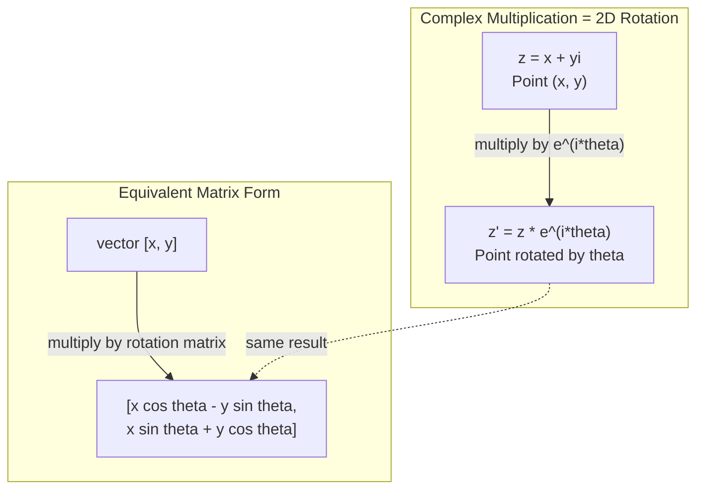
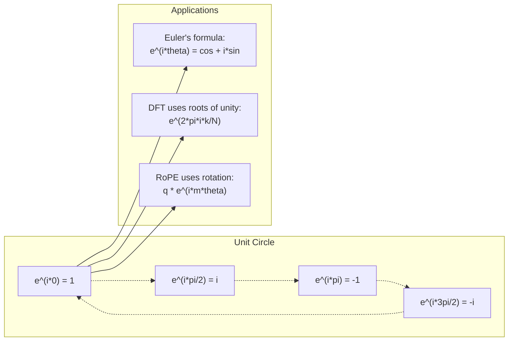

# 机器学习中的复数

> -1 的平方根不是“虚构”，而是旋转、频率和一半信号处理的核心。

**Type:** Learn  
**Language:** Python  
**Prerequisites:** Phase 1, Lessons 01-04（线性代数、微积分）  
**Time:** ~60 分钟

## 学习目标

- 在直角坐标和极坐标形式下进行复数运算（加、乘、除、共轭）
- 用欧拉公式在复指数与三角函数之间互相转换
- 用复数的单位根实现离散傅里叶变换
- 解释复数旋转如何体现在 RoPE 与 Transformer 正弦位置编码中

## 问题

你看《傅里叶变换》论文时到处看到 \(i\)，看到 Transformer 的位置编码里一堆不同频率的 \(\sin/\cos\)，就会意识到它们其实是复指数的实部和虚部。你再读量子计算，会看到全部内容都写在复向量空间里。

复数看起来很抽象，基于 \(-1\) 的平方根似乎像数学技巧。但它不是技巧，而是表示旋转和振荡的自然语言。凡是涉及旋转、振动、振荡的场景，复数通常是最合适的工具。

不理解复数，就很难理解 DFT，不理解 FFT，也很难理解现代语言模型里的 RoPE（旋转位置编码），更无法理解 Transformer 原始论文里正弦位置编码为何选择这些频率。

本课从复数运算开始，建立几何直觉，并说明它在机器学习中的具体落点。

## 核心概念

### 复数是什么

一个复数由实部和虚部组成：

```
z = a + bi

where:
  a is the real part
  b is the imaginary part
  i is the imaginary unit, defined by i^2 = -1
```

这实际上是把数轴扩展成了二维平面：横轴是实数，纵轴是虚数。每个复数对应平面中的一点。

### 复数运算

**加法。** 实部相加，虚部相加。

```
(a + bi) + (c + di) = (a + c) + (b + d)i

Example: (3 + 2i) + (1 + 4i) = 4 + 6i
```

**乘法。** 展开后记住 \(i^2=-1\)。

```
(a + bi)(c + di) = ac + adi + bci + bdi^2
                 = ac + adi + bci - bd
                 = (ac - bd) + (ad + bc)i

Example: (3 + 2i)(1 + 4i) = 3 + 12i + 2i + 8i^2
                            = 3 + 14i - 8
                            = -5 + 14i
```

**共轭。** 改变虚部符号。

```
conjugate of (a + bi) = a - bi
```

复数与其共轭的乘积恒为实数：

```
(a + bi)(a - bi) = a^2 + b^2
```

**除法。** 用分母共轭去乘。

```
(a + bi) / (c + di) = (a + bi)(c - di) / (c^2 + d^2)
```

这样可以消掉分母里的虚部，得到标准形式。

### 复平面

复平面把每个复数映射到二维点。水平轴是实轴，竖直轴是虚轴。

```
z = 3 + 2i  corresponds to the point (3, 2)
z = -1 + 0i corresponds to the point (-1, 0) on the real axis
z = 0 + 4i  corresponds to the point (0, 4) on the imaginary axis
```

复数既是点，也是从原点出的向量，这种“双重解释”正是它适合几何建模的原因。

### 极坐标形式

平面中的任何点都可以用到原点距离和相对正实轴角度描述：

```
z = r * (cos(theta) + i*sin(theta))

where:
  r = |z| = sqrt(a^2 + b^2)     (magnitude, or modulus)
  theta = atan2(b, a)             (phase, or argument)
```

直角形式 \(a+bi\) 方便加法；极坐标 \((r,\theta)\) 方便乘法。

**极坐标乘法。** 幅值相乘，相位相加：

```
z1 = r1 * e^(i*theta1)
z2 = r2 * e^(i*theta2)

z1 * z2 = (r1 * r2) * e^(i*(theta1 + theta2))
```

所以复数乘法天生支持旋转：模长为 1 的乘子就是纯旋转。

### 欧拉公式

复指数与三角之间的桥梁：

```
e^(i*theta) = cos(theta) + i*sin(theta)
```

这是本课最关键公式。取 \(\theta=\pi\)：

```
e^(i*pi) = cos(pi) + i*sin(pi) = -1 + 0i = -1

Therefore: e^(i*pi) + 1 = 0
```

这五个基本常数在一个式子里出现：\(e, i, \pi, 1, 0\)。

### 欧拉公式为何重要

\(e^{i\theta}\) 随着 \(\theta\) 在单位圆上转动：\(\theta=0\) 在 \((1,0)\)，\(\theta=\pi/2\) 在 \((0,1)\)，\(\theta=\pi\) 在 \((-1,0)\)，\(\theta=3\pi/2\) 在 \((0,-1)\)，一圈是 \(2\pi\)。

这说明复指数本质是旋转，而旋转无处不在于信号处理与 ML。

### 与二维旋转的关系

\((x + yi)\) 乘以 \(e^{i\theta}\) 就是把 \((x,y)\) 围绕原点旋转 \(\theta\)：

```
Rotation via complex multiplication:
  (x + yi) * (cos(theta) + i*sin(theta))
  = (x*cos(theta) - y*sin(theta)) + (x*sin(theta) + y*cos(theta))i

Rotation via matrix multiplication:
  [cos(theta)  -sin(theta)] [x]   [x*cos(theta) - y*sin(theta)]
  [sin(theta)   cos(theta)] [y] = [x*sin(theta) + y*cos(theta)]
```

两者完全等价。复数乘法其实就是 2D 旋转，矩阵写法只是展开形式。



### 复指数与正弦信号

\(e^{i\omega t}\) 是一个在单位圆上以角频率 \(\omega\) 旋转的点，\(t\) 增大时会绕一圈又一圈。

实部是 \(\cos(\omega t)\)，虚部是 \(\sin(\omega t)\)。一个正弦信号就是旋转复数在轴上的“阴影”。

```
e^(i*omega*t) = cos(omega*t) + i*sin(omega*t)

Real part:      cos(omega*t)    -- a cosine wave
Imaginary part: sin(omega*t)    -- a sine wave
```

这叫相量表示（phasor）。与其跟踪起伏波形，不如跟踪平滑旋转的箭头。相位平移就是角度偏移，振幅变化就是模长变化，信号相加就是向量相加。

### 单位根

单位根为：

```
w_k = e^(2*pi*i*k/N)    for k = 0, 1, 2, ..., N-1
```

当 \(N=4\) 时，单位根是 \(1,i,-1,-i\)，即四个正交方向；\(N=8\) 则多出四个对角方向点。

单位根是离散傅里叶变换的基底。DFT 把信号分解为这 \(N\) 个等间隔频率分量。

### 与 DFT 的关系

信号 \(x[0], x[1], ..., x[N-1]\) 的 DFT 为：

```
X[k] = sum_{n=0}^{N-1} x[n] * e^(-2*pi*i*k*n/N)
```

每个 \(X[k]\) 衡量信号与第 \(k\) 个单位根（频率 \(k\)）的相关程度。DFT 把信号拆成 \(N\) 个旋转相量，给出每个分量的幅值与相位。

### “虚数”不虚

“虚数”这个名字是历史产物。它并不神秘。i 的核心作用是旋转：

- 乘一次 \(i\)：旋转 \(90^\circ\) 到虚轴；
- 再乘一次 \(i^2\)：再转 \(90^\circ\)，到负实轴，故 \(i^2=-1\)。

这解释了工程里复数无处不在：电磁波、量子态、信号振荡、位置编码都天然由复数描述。

### 复指数 vs 三角形式

工程上原来常写 \(A\cos(\omega t + \phi)\)。这表达清楚，但代数处理较重。不同相位正弦相加会用到繁琐三角恒等式。

复指数形式 \(A e^{i(\omega t+\phi)}\) 下，两个信号相加就是复数相加；调制（乘法）只是幅值相乘、相位相加。相位偏移是角度加法，频率偏移是乘以相量。

因此信号处理中几乎都改用复指数记法，因为运算更干净：真实信号始终是复表示的实部，虚部是“账本”字段，最终会自然给出正确代数。

### 与 Transformer 的关系

**正弦位置编码**（原始 Transformer）：

```
PE(pos, 2i) = sin(pos / 10000^(2i/d))
PE(pos, 2i+1) = cos(pos / 10000^(2i/d))
```

sin/cos 对应不同频率复指数的实部和虚部。高频、低频共同提供不同“分辨率”的编码：低频慢变（粗粒度），高频快变（细粒度），每个位置在频域上形成唯一指纹。

**RoPE（Rotary Position Embedding）** 进一步把查询和键向量显式乘以复旋转矩阵。两个 token 的相对位置对应旋转角，注意力基于旋转后的向量计算，从而实现相对位置信息建模。

| 运算 | 代数形式 | 几何意义 |
|---|---|---|
| 加法 | (a+c)+(b+d)i | 平面向量加法 |
| 乘法 | (ac-bd)+(ad+bc)i | 旋转并缩放 |
| 共轭 | a - bi | 关于实轴反射 |
| 模长 | sqrt(a^2+b^2) | 到原点距离 |
| 相位 | atan2(b,a) | 相对正实轴角度 |
| 除法 | 乘分母共轭 | 反向旋转并重标度 |
| 幂 | r^n * e^(i*n*theta) | 重复旋转 n 次，模长乘 \(r^n\) |



```figure
roots-of-unity
```

## 动手实现

### 步骤 1：Complex 类

实现支持加减乘除、模长、相位，并可在直角与极坐标间转换的复数类。

```python
import math

class Complex:
    def __init__(self, real, imag=0.0):
        self.real = real
        self.imag = imag

    def __add__(self, other):
        return Complex(self.real + other.real, self.imag + other.imag)

    def __mul__(self, other):
        r = self.real * other.real - self.imag * other.imag
        i = self.real * other.imag + self.imag * other.real
        return Complex(r, i)

    def __truediv__(self, other):
        denom = other.real ** 2 + other.imag ** 2
        r = (self.real * other.real + self.imag * other.imag) / denom
        i = (self.imag * other.real - self.real * other.imag) / denom
        return Complex(r, i)

    def magnitude(self):
        return math.sqrt(self.real ** 2 + self.imag ** 2)

    def phase(self):
        return math.atan2(self.imag, self.real)

    def conjugate(self):
        return Complex(self.real, -self.imag)
```

### 步骤 2：极坐标转换与欧拉公式

```python
def to_polar(z):
    return z.magnitude(), z.phase()

def from_polar(r, theta):
    return Complex(r * math.cos(theta), r * math.sin(theta))

def euler(theta):
    return Complex(math.cos(theta), math.sin(theta))
```

验证：`i` 始终为 1，`sin` 得到 (1,0)，`cos` 得到 (-1,0)。

### 步骤 3：旋转

二维点 \((x,y)\) 旋转角度 \(\theta\) 可以直接用一次复数乘法：

```python
point = Complex(3, 4)
rotated = point * euler(math.pi / 4)
```

模长保持不变，只有角度改变。

### 步骤 4：基于复数的 DFT

```python
def dft(signal):
    N = len(signal)
    result = []
    for k in range(N):
        total = Complex(0, 0)
        for n in range(N):
            angle = -2 * math.pi * k * n / N
            total = total + Complex(signal[n], 0) * euler(angle)
        result.append(total)
    return result
```

这是 \(O(N^2)\) 的朴素 DFT。每个输出 \(X[k]\) 都是输入样本与单位根乘积之和。

### 步骤 5：逆 DFT

逆变换与前向差别仅在指数符号和除以 \(N\)：

```python
def idft(spectrum):
    N = len(spectrum)
    result = []
    for n in range(N):
        total = Complex(0, 0)
        for k in range(N):
            angle = 2 * math.pi * k * n / N
            total = total + spectrum[k] * euler(angle)
        result.append(Complex(total.real / N, total.imag / N))
    return result
```

做完 DFT 再做 IDFT，可基本原样恢复原始信号（数值误差内）。

### 步骤 6：单位根

```python
def roots_of_unity(N):
    return [euler(2 * math.pi * k / N) for k in range(N)]
```

验证两条性质：
- 所有单位根模长都为 1；
- N 个单位根之和为 0（对称抵消）。

这两点是 DFT 可逆性的根本原因，也是单位根形成正交频域基的依据。

## 应用

Python 内建复数支持，`e^(i*theta)` 是虚数单位。

```python
z = 3 + 2j
w = 1 + 4j

print(z + w)
print(z * w)
print(abs(z))

import cmath
print(cmath.phase(z))
print(cmath.exp(1j * cmath.pi))
```

NumPy 对数组复数也有原生支持：

```python
import numpy as np

z = np.array([1+2j, 3+4j, 5+6j])
print(np.abs(z))
print(np.angle(z))
print(np.conj(z))
print(np.real(z))
print(np.imag(z))

signal = np.sin(2 * np.pi * 5 * np.linspace(0, 1, 128))
spectrum = np.fft.fft(signal)
freqs = np.fft.fftfreq(128, d=1/128)
```

## 实战输出

运行 `euler(theta).magnitude()` 生成 `euler(0)`。

## 练习

1. **手工复数运算。** 计算 \((2 + 3i)(4 - i)\)，再用代码验证。接着算 \((5 + 2i)/(1 - 3i)\)。在复平面上画出结果，确认乘法带来旋转与缩放。

2. **连续旋转。** 从点 \((1, 0)\) 出发，连续乘以 \(e^{i\pi/6}\) 12 次。验证 12 次后回到 \((1,0)\)，并打印每步坐标，确认形成正十二边形。

3. **已知信号的 DFT。** 构造 \(\sin(2\pi*3*t)+0.5\sin(2\pi*7*t)\) 在 32 点采样的信号。运行 DFT，验证幅值谱在频率 3、7 处有峰，且 7 处峰值约为 3 处的一半。

4. **单位根可视化。** 计算 8 次单位根，验证和为 0。验证任一根乘以基本根 \(e^{2\pi i/8}\) 会得到下一个根。

5. **旋转矩阵一致性。** 随机取 10 个角度和 10 个点，验证复数乘法与 2x2 旋转矩阵逐元素乘法结果一致，报告最大数值误差。

## 术语

| 术语 | 含义 |
|------|------|
| 复数 | \(a+bi\)，其中 \(a\) 是实部，\(b\) 是虚部，满足 \(i^2=-1\) |
| 虚数单位 | 满足 \(i^2=-1\) 的数，不必理解为“虚构”，它本质是旋转算子 |
| 复平面 | 2D 平面，横轴为实部、纵轴为虚部（Argand 平面） |
| 模长 | 到原点距离 \(\sqrt{a^2+b^2}\)，记作 \(|z|\) |
| 相位 | 相对正实轴角度 \(atan2(b,a)\)，即 \(arg(z)\) |
| 共轭 | 关于实轴的镜像，\(a+bi\) 的共轭为 \(a-bi\) |
| 极坐标 | 将 \(z\) 写为 \(r e^{i\theta}\)，便于乘法与旋转推导 |
| 欧拉公式 | \(e^{i\theta}=cos\theta+i\sin\theta\)，连接指数与三角 |
| 相量（phasor） | \(e^{i\omega t}\) 形式，表示正弦信号 |
| 单位根 | \(e^{2\pi i k / N}\)，单位圆上均匀分布的 \(N\) 个点 |
| DFT | 离散傅里叶变换，用单位根把信号分解为复指数分量 |
| RoPE | 旋转位置编码，通过复乘将相对位置信息编码到 attention 中 |

## 延伸阅读

- [Visual Introduction to Euler's Formula](https://betterexplained.com/articles/intuitive-understanding-of-eulers-formula/)：用几何直觉讲清欧拉公式
- [Su et al.: RoFormer (2021)](https://arxiv.org/abs/2104.09864)：首次引入 RoPE 的工作，核心就是复数旋转
- [Vaswani et al.: Attention Is All You Need (2017)](https://arxiv.org/abs/1706.03762)：原始 Transformer 的正弦位置编码
- [3Blue1Brown: Euler 的几何讲解](https://www.youtube.com/watch?v=mvmuCPvRoWQ)：为何 \(e^{i\pi}=-1\) 的直觉视角
- [Needham: Visual Complex Analysis](https://global.oup.com/academic/product/visual-complex-analysis-9780198534464)：复数几何理解的经典教材
- [Strang: Intro to Linear Algebra, Ch.10](https://math.mit.edu/~gs/linearalgebra/)：在矩阵与特征值背景下看复数
