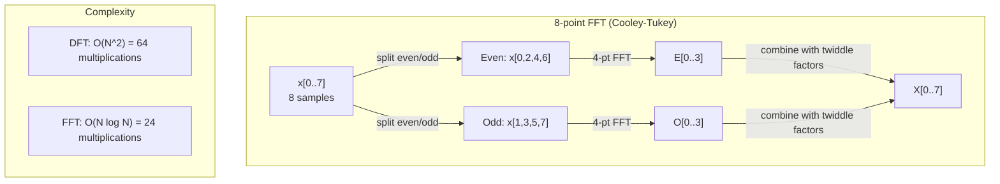
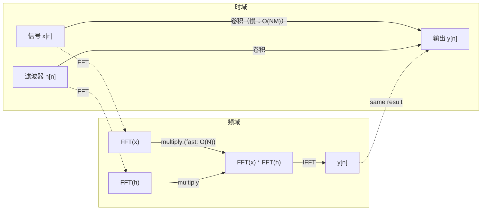

# 傅里叶变换

> 每个信号都可以写成一堆正弦波之和。傅里叶变换告诉你它们是哪些成分。

**类型：** 构建  
**语言：** Python  
**先修：** 第 1 阶段课程 01-04、19（复数）  
**时长：** ~90 分钟

## 学习目标

- 从头实现 DFT，并和 \(O(N\log N)\) 的 Cooley-Tukey FFT 对比验证
- 解读频域系数：从信号中提取振幅、相位和功率谱
- 用卷积定理通过 FFT 的点乘做卷积
- 把傅里叶频域分解与 Transformer 位置编码、CNN 卷积层关联起来

## 问题

音频是随时间的压力值序列，股价是按天的数值序列，图像是空间上像素强度网格。这些都在“时域”（或“空域”）里：我们看到的是随索引变化的数值。

但很多结构在时域里不显眼。这个音频是纯音还是和弦？股价有没周周期？图像有无重复纹理？这些都属于“频率内容”问题，时域往往看不出来。

傅里叶变换把时域数据转到频域。它把一个信号分解成若干不同频率的正弦波。每条正弦波有振幅（强度）和相位（起始相位）。傅里叶变换同时给出这两个信息。

AI 里到处都用到频域思路：CNN 做卷积，频域里对应乘法；Transformer 的位置编码使用频率分解编码位置；音频模型（语音识别、音乐生成）常以 spectrogram 为输入；时间序列模型靠周期性模式。理解傅里叶变换等于有了这一层共通语言。

## 核心概念

### DFT 定义

给定 \(N\) 个样本 \(x[0],x[1],...,x[N-1]\)，离散傅里叶变换得到 \(N\) 个频率系数 \(X[0],X[1],...,X[N-1]\)：

```
X[k] = sum_{n=0}^{N-1} x[n] * e^(-2*pi*i*k*n/N)

for k = 0, 1, ..., N-1
```

每个 \(X[k]\) 是复数。其模 \(|X[k]|\) 是频率 \(k\) 的幅值，\(\angle(X[k])\) 是该频率分量的相位偏移。

核心洞见：\(e^{-2\pi i k n/N}\) 是频率为 \(k\) 的旋转相量。DFT 计算信号与这 \(N\) 个等间隔频率基的相关性：若信号在该频率有能量，相关值较大；反之接近 0。

### 系数含义

**\(X[0]\)：DC 分量。** 是所有样本之和，和平均值成正比，代表零频常量偏置。

```
X[0] = sum_{n=0}^{N-1} x[n] * e^0 = sum of all samples
```

**\(X[k]\)，\(1 \le k \le N/2\)：正频率。** 表示每 \(N\) 个采样点里的 \(k\) 个周期。\(k\) 越大，频率越高、振荡越快。

**\(X[N/2]\)：奈奎斯特频率。** 采样下可表示的最高频率。再高会发生混叠。

**\(X[k]\)，\(N/2 < k < N\)：负频率。** 对实值信号有 \(X[N-k] = conj(X[k])\)，负频率是正频率的镜像，因此有用信息主要在前 \(N/2+1\) 个系数里。

### 逆 DFT

逆变换可以从频域系数恢复时域信号：

```
x[n] = (1/N) * sum_{k=0}^{N-1} X[k] * e^(2*pi*i*k*n/N)

for n = 0, 1, ..., N-1
```

与前向 DFT 的区别是指数号变正，以及额外的 \(1/N\) 归一化。

逆变换是无损重构：时域和频域只是同一信息的不同坐标系表示。

### 快速傅里叶变换（FFT）

按定义的 DFT 是 \(O(N^2)\)：每个输出都对 \(N\) 个输入求和。\(N=10^6\) 时有 \(10^{12}\) 次运算。

快速傅里叶变换（FFT）在 \(O(N \log N)\) 下得到同样结果。\(N=10^6\) 时约两千万次级别，而不是万亿次。这使频域分析可落地。

Cooley-Tukey（最常见 FFT）采用分治：

1. 分成偶数下标和奇数下标两组
2. 递归计算两组 DFT
3. 用“旋转因子” \(e^{-2\pi i k/N}\) 合并

```
X[k] = E[k] + e^(-2*pi*i*k/N) * O[k]          for k = 0, ..., N/2 - 1
X[k + N/2] = E[k] - e^(-2*pi*i*k/N) * O[k]    for k = 0, ..., N/2 - 1

where E = DFT of even-indexed samples
      O = DFT of odd-indexed samples
```

每一层递归做 \(O(N)\) 工作，深度 \(\log_2 N\)，总复杂度 \(O(N\log N)\)。



FFT 要求长度为 2 的整数次幂，实际会补零到下一个 2 的幂。

### 谱分析

**功率谱** 是 \(|X[k]|^2\)，即每个频率系数的能量大小。

**相位谱** 是 \(\angle(X[k])\)，表示每个频率的相位偏移。多数分析任务里主要看功率谱，忽略相位。

```
Power at frequency k:  P[k] = |X[k]|^2 = X[k].real^2 + X[k].imag^2
Phase at frequency k:  phi[k] = atan2(X[k].imag, X[k].real)
```

### 频率分辨率

DFT 的分辨率由样本数 \(N\) 和采样率 \(f_s\) 决定：

```
Frequency of bin k:      f_k = k * fs / N
Frequency resolution:    delta_f = fs / N
Maximum frequency:       f_max = fs / 2  (Nyquist)
```

要区分更接近的两个频率，需要更多样本；要看更高频，需要更高采样率。

### 卷积定理

这是信号处理最核心之一，也直接关联 CNN：

**时域卷积 = 频域逐点乘。**

```
x * h = IFFT(FFT(x) . FFT(h))

where * is convolution and . is element-wise multiplication
```

为什么重要：

- 直接做长度为 \(N\) 与 \(M\) 的卷积是 \(O(NM)\)
- FFT 方式卷积是 \(O(N\log N)\)：先变换、逐点乘、再反变换
- 大卷积核时 FFT 卷积显著更快
- 这也解释了 CNN 中大感受野卷积为何受益

注意：DFT 自然对应的是**循环卷积**。线性卷积要先把两信号补零到长度 \(N+M-1\)。



### 窗函数

DFT 假设信号是周期的，把这 \(N\) 个样本当作一个周期重复。若端点不衔接，会在边界产生不连续，表现在频域上就是泄漏（spectral leakage）。

窗函数在两端将信号逐渐压到 0，减少泄漏。

常见窗：

| 窗 | 形状 | 主瓣宽度 | 旁瓣幅度 | 典型场景 |
|---|---|---|---|---|
| 矩形 | 平顶（无窗） | 最窄 | 最高（-13 dB） | 当信号在 N 点内正好周期重复 |
| Hann | 抬升余弦 | 中等 | 低（-31 dB） | 通用频谱分析 |
| Hamming | 修正余弦 | 中等 | 更低（-42 dB） | 音频处理、语音分析 |
| Blackman | 三余弦 | 较宽 | 很低（-58 dB） | 需强旁瓣抑制时 |

```
Hann window:    w[n] = 0.5 * (1 - cos(2*pi*n / (N-1)))
Hamming window: w[n] = 0.54 - 0.46 * cos(2*pi*n / (N-1))
```

使用时先与信号逐点相乘再做 DFT：`e^(-2*pi*i*k*n/N)`。

### DFT 性质

| 性质 | 时域 | 频域 |
|---|---|---|
| 线性 | a*x + b*y | a*X + b*Y |
| 时间移位 | x[n - k] | X[f] * e^(-2*pi*i*f*k/N) |
| 频率移位 | x[n] * e^(2*pi*i*f0*n/N) | X[f - f0] |
| 卷积 | x * h | X * H（逐点） |
| 相乘 | x[n]h[n]（逐点） | X * H（循环卷积并缩放 1/N） |
| Parseval | sum \|x[n]\|^2 | (1/N) * sum \|X[k]\|^2 |
| 共轭对称（实值输入） | x[n] 为实 | X[k]=conj(X[N-k]) |

Parseval 定理表明能量在两个域里一致，变换不会改变总能量。

### 与位置编码的关系

原始 Transformer 的正弦位置编码：

```
PE(pos, 2i)   = sin(pos / 10000^(2i/d_model))
PE(pos, 2i+1) = cos(pos / 10000^(2i/d_model))
```

每个维度对（2i,2i+1）对应不同频率。高维度对变化快（细粒度），低维度对变化慢（粗粒度）。这让每个位置在不同频带上形成独特模式，类似傅里叶系数唯一标识信号。

其关键性质：

- 唯一性：不同位置不会有完全相同编码
- 有界性：sin/cos 始终在 \([-1,1]\) 内
- 相对位置：\(p+k\) 的编码可由 \(p\) 的编码线性得到（带相位），模型更容易利用相对位置

### 与 CNN 的关系

卷积层本质上就是在信号/图像上滑动卷积核。根据卷积定理可写为：

1. FFT 输入
2. FFT 卷积核
3. 频域逐点乘
4. IFFT 回到时域

多数常规实现中，小核（如 3x3）直接卷积更快；但核大时，FFT 卷积更有优势。某些架构（如 FNet）甚至用 FFT 直接替换注意力，复杂度从 \(O(N^2)\) 降到 \(O(N\log N)\)。

### 频谱图与 STFT

单次 FFT 给全局频谱，但无法给出“在什么时间出现”。线性调频信号和同时含多频分量的和弦，可能有相同全局幅值谱。

短时傅里叶变换（STFT）在重叠窗口上做 FFT，得到频谱图（spectrogram）：一个时间-频率二维矩阵。

```
STFT procedure:
1. Choose a window size (e.g., 1024 samples)
2. Choose a hop size (e.g., 256 samples -- 75% overlap)
3. 对每个窗口位置：
   a. 截取对应的窗口片段
   b. 乘上 Hann/Hamming 窗
   c. 计算 FFT
   d. 把幅度谱作为频谱图的一列存起来
```

音频模型的标准输入通常是频谱图。语音模型（Whisper、DeepSpeech）常用 mel 频谱图（mel-spectrogram，符合人耳感知的频率刻度）。

### 混叠

若信号含有高于 \(f_s/2\) 的频率，用采样率 \(f_s\) 采样会发生混叠。比如 90Hz 在 100Hz 采样下看起来和 10Hz 一样：

```
示例：
  真实信号：90 Hz 正弦波
  采样率：100 Hz
  表观频率：100 - 90 = 10 Hz

  以 100 Hz 采样率采到的 90 Hz 信号样本
  与 10 Hz 信号的样本完全一致。
  再多的数学也无法还原原始的 90 Hz。
```

因此 ADC 必须加抗混叠滤波，先去掉奈奎斯特以上频率。ML 里也类似：下采样特征图若无低通滤波，会产生伪高频别名，别的架构会用抗混叠池化缓解。

### 零填充不提高真实分辨率

常见误区：FFT 前零填充会提高分辨率。实际上不提升真实分辨率，只是在已有频点间插值，使谱线更平滑。它不能创造采样中不存在的频率细节。

真实分辨率由观测时长 \(T = N/f_s\) 决定。要分辨 \(\Delta f\) 间隔的两个频率，至少需要 \(T \approx 1/\Delta f\) 秒的观测，不管零填多少都不变。

```figure
fourier-synthesis
```

## 动手实现

### 步骤 1：朴素 DFT

按定义直接实现 \(O(N^2)\) DFT。

```python
import math

class Complex:
    ...

def dft(x):
    N = len(x)
    result = []
    for k in range(N):
        total = Complex(0, 0)
        for n in range(N):
            angle = -2 * math.pi * k * n / N
            w = Complex(math.cos(angle), math.sin(angle))
            xn = x[n] if isinstance(x[n], Complex) else Complex(x[n])
            total = total + xn * w
        result.append(total)
    return result
```

### 步骤 2：逆 DFT

同样结构，指数符号变正并除以 \(N\)。

```python
def idft(X):
    N = len(X)
    result = []
    for n in range(N):
        total = Complex(0, 0)
        for k in range(N):
            angle = 2 * math.pi * k * n / N
            w = Complex(math.cos(angle), math.sin(angle))
            total = total + X[k] * w
        result.append(Complex(total.real / N, total.imag / N))
    return result
```

### 步骤 3：Cooley-Tukey FFT

递归 FFT 要求长度为 2 的幂；先分奇偶，再递归，再用旋转因子合并。

```python
def fft(x):
    N = len(x)
    if N <= 1:
        return [x[0] if isinstance(x[0], Complex) else Complex(x[0])]
    if N % 2 != 0:
        return dft(x)

    even = fft([x[i] for i in range(0, N, 2)])
    odd = fft([x[i] for i in range(1, N, 2)])

    result = [Complex(0)] * N
    for k in range(N // 2):
        angle = -2 * math.pi * k / N
        twiddle = Complex(math.cos(angle), math.sin(angle))
        t = twiddle * odd[k]
        result[k] = even[k] + t
        result[k + N // 2] = even[k] - t
    return result
```

### 步骤 4：谱分析工具

```python
def power_spectrum(X):
    return [xk.real ** 2 + xk.imag ** 2 for xk in X]

def convolve_fft(x, h):
    N = len(x) + len(h) - 1
    padded_N = 1
    while padded_N < N:
        padded_N *= 2

    x_padded = x + [0.0] * (padded_N - len(x))
    h_padded = h + [0.0] * (padded_N - len(h))

    X = fft(x_padded)
    H = fft(h_padded)

    Y = [xk * hk for xk, hk in zip(X, H)]

    y = idft(Y)
    return [y[n].real for n in range(N)]
```

## 应用

工程上建议使用 NumPy 优化后的 FFT（底层 C 实现）：

```python
import numpy as np

signal = np.sin(2 * np.pi * 5 * np.arange(256) / 256)
spectrum = np.fft.fft(signal)
freqs = np.fft.fftfreq(256, d=1/256)

power = np.abs(spectrum) ** 2

positive_freqs = freqs[:len(freqs)//2]
positive_power = power[:len(power)//2]
```

窗函数与更高级频谱分析：

```python
from scipy.signal import windows, stft

window = windows.hann(256)
windowed = signal * window
spectrum = np.fft.fft(windowed)
```

卷积：

```python
from scipy.signal import fftconvolve

result = fftconvolve(signal, kernel, mode='full')
```

Spectrogram：

```python
from scipy.signal import stft

frequencies, times, Zxx = stft(signal, fs=sample_rate, nperseg=256)
spectrogram = np.abs(Zxx) ** 2
```

spectrogram 矩阵形状为 \((n_frequencies, n_time_frames)\)，每列是某时间窗的功率谱，正是语音和音频模型的常见输入。

## 实战输出

运行 `X = DFT(x * w)` 生成 `code/fourier.py`。

## 练习

1. **纯音识别。** 构造在 1 秒、采样 128Hz 下 1~50Hz 的单频正弦信号。用 DFT 找到频率。再加高斯噪声（标准差 0.5）重复实验，观察噪声对谱线的影响。

2. **FFT 与 DFT 对比。** 生成长度 64 的随机信号。分别计算 DFT（\(O(N^2)\)）和 FFT，比较系数误差是否在 \(1e-10\) 内。再在长度 256、512、1024、2048 上计时并作比。

3. **卷积定理示例验证。** 取 \(x=[1,2,3,4,0,0,0,0]\)，\(h=[1,1,1,0,0,0,0,0]\)。先直接循环计算循环卷积，再通过 FFT（变换-乘法-逆变换）验证一致。再按零填充做线性卷积。

4. **窗口效应。** 构造 10Hz 与 12Hz 两个接近频率的正弦和（采样 128Hz，时长 1 秒），比较未加窗、Hann、Hamming 的功率谱，哪个更容易分辨两个峰？为什么？

5. **位置编码分析。** 生成 \(d_model=128, max_pos=512\) 的正弦位置编码。取多个位置对 \((p1,p2)\)，计算其编码点积，验证点积只与 \(|p1-p2|\) 相关，不依赖绝对位置。距离变大时点积如何变化？

## 术语

| 术语 | 含义 |
|---|---|
| DFT（离散傅里叶变换） | 把 \(N\) 个时域样本映射为 \(N\) 个频域系数；每个系数是与对应复正弦基的相关系数 |
| FFT（快速傅里叶变换） | 以 \(O(N\log N)\) 计算 DFT 的算法（Cooley-Tukey） |
| 逆 DFT | 从频率系数重建时域信号；与 DFT 公式结构相同仅指数符号与 \(1/N\) 缩放不同 |
| 频率 bin | DFT 输出索引 \(k\) 对应 \(k f_s/N\) 的离散频率 |
| DC 分量 | \(X[0]\)，零频率成分，跟均值成正比 |
| 奈奎斯特频率 | \(f_s/2\)，采样率下可表示的最高频率，以上会混叠 |
| 功率谱 | \(|X[k]|^2\)，每个频率的能量分布 |
| 相位谱 | \(\angle(X[k])\)，每个频率分量的相位 |
| 谱泄漏 | 非周期信号被当成周期处理时产生的虚假频谱分量 |
| 窗函数 | Hann/Hamming/Blackman 等加在 DFT 前、用于平滑边界的函数 |
| Twiddle factor | FFT 蝶形合并中的旋转因子 \(e^{-2\pi i k/N}\) |
| 卷积定理 | 时域卷积等价于频域逐点乘法 |
| 循环卷积 | DFT 自然对应的环形卷积 |
| 线性卷积 | 无环绕卷积，需要在 DFT 前补零到 \(N+M-1\) |
| Parseval 定理 | 能量守恒：\(\sum \|x[n]\|^2 = (1/N)\sum \|X[k]\|^2\) |
| 混叠 | 高频在采样后折叠成低频外观的现象 |

## 延伸阅读

- [Cooley & Tukey 论文（1965）](https://www.ams.org/journals/mcom/1965-19-090/S0025-5718-1965-0178586-1/)：开创性 FFT 算法
- [3Blue1Brown: But what is the Fourier Transform?](https://www.youtube.com/watch?v=spUNpyF58BY)：直观视角，非常适合快速建立图像
- [Lee-Thorp et al.: FNet (2021)](https://arxiv.org/abs/2105.03824)：在 Transformer 中用 FFT 替代 self-attention 的思路
- [Smith: The Scientist and Engineer's Guide to DSP](http://www.dspguide.com/)：深入覆盖 FFT、窗函数与谱分析
- [Vaswani et al.: Attention Is All You Need (2017)](https://arxiv.org/abs/1706.03762)：原始 Transformer 的频率位置编码基础
- [Radford et al.: Whisper (2022)](https://arxiv.org/abs/2212.04356)：基于 mel-spectrogram 的语音识别示例
