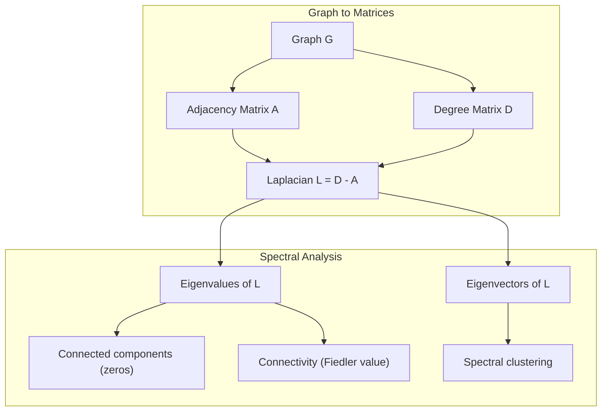
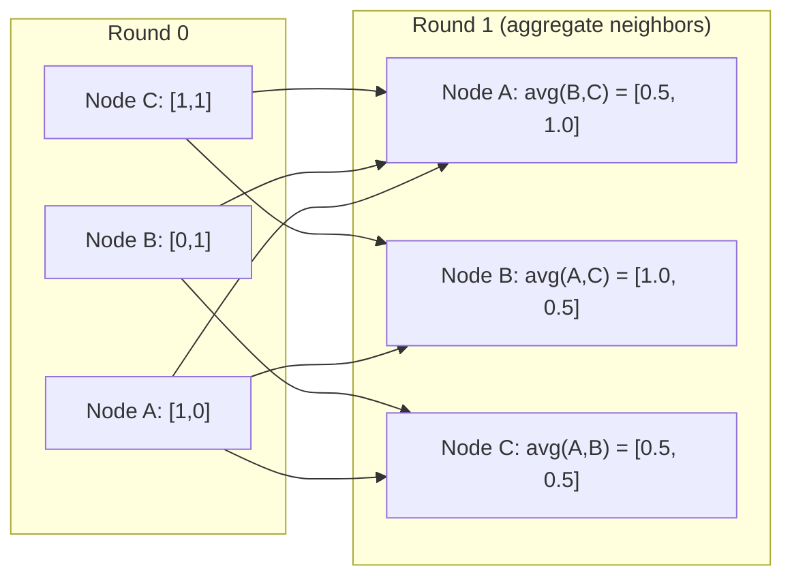

# 图论与机器学习

> 图是“关系”这类数据的原生结构；只要数据有连接关系，就应当用图论来表达。

**类型：** 构建  
**语言：** Python  
**先修：** 第 1 阶段课程 01-03（线性代数、矩阵）  
**时长：** ~90 分钟

## 学习目标

- 实现图结构（邻接矩阵/邻接表）并写出 BFS、DFS 遍历
- 计算图拉普拉斯矩阵，并用特征值判断连通分量与做聚类
- 实现一轮 GNN 风格的消息传递（归一化邻接乘法）
- 用 Fiedler 向量做谱聚类划分图

## 问题

社交网络、分子、知识图谱、引用网络、道路图：这些都不是表格数据。传统 ML 多把数据当平面表，行是独立样本，列是特征；但当连接关系是核心结构时，这种表示会丢信息。

比如社交网络里预测某用户购买行为，不仅看他自己的历史，还要看朋友。又比如分子性质预测，不是只有单个原子，而是“原子如何连边”决定性质。

图神经网络（GNN）正是因为解决这类关系数据而兴起的。它驱动了药物发现、社交推荐、反欺诈、知识图推理。GNN 的基础正是图论的四件事：

1. 用矩阵表示图，便于线性代数计算  
2. 遍历算法揭示拓扑结构  
3. 拉普拉斯矩阵及其谱性质  
4. 消息传递，把邻居信息聚合到节点

## 概念

### 图与边

图 \(G=(V,E)\)，顶点（节点）集合 \(V\)，边集合 \(E\)，每条边连接两个节点。

**无向 vs 有向。** 无向边 \((u,v)\) 表示双向连接；有向边只表示 \(u\to v\)。

**有权 vs 无权。** 无权图边只表示存在与否；加权图有数值权重（距离、代价、强度）。

| 图类型 | 示例 |
|---|---|
| 无向无权 | 好友关系网 |
| 有向无权 | 关注关系 |
| 无向加权 | 道路网络（距离） |
| 有向加权 | 网页链接关系 |

### 邻接矩阵

对含 \(n\) 个节点的图：

```
A[i][j] = 1    if there is an edge from node i to node j
A[i][j] = 0    otherwise
```

无向图中 \(A\) 对称；加权图中 \(A[i][j]\) 是边权值。

三角形例子：

```
Nodes: 0, 1, 2
Edges: (0,1), (1,2), (0,2)

A = [[0, 1, 1],
     [1, 0, 1],
     [1, 1, 0]]
```

邻接矩阵是所有 GNN 的入口，后续的矩阵乘法都是对它的操作。

### 度与度矩阵

节点度为与其相连边的数量。对有向图要分入度/出度。

度矩阵 \(D\) 是对角矩阵：

```
D[i][i] = degree of node i
D[i][j] = 0    for i != j
```

三角形中每个节点度为 2，所以 \(D=diag(2,2,2)\)。

### BFS 与 DFS

两种基本遍历方式都要会。

**BFS（广度优先）：** 先访问同层邻居，再访问更远层。用队列（FIFO）。

BFS 可在无权图求最短跳数路径。

**DFS（深度优先）：** 一直往深处走，回溯后继续。可用栈或递归实现。

DFS 常用于连通分量、环检测、拓扑排序。

| 算法 | 数据结构 | 找到什么 | 场景 |
|---|---|---|---|
| BFS | 队列 | 最短路径 | 社交距离、知识图遍历 |
| DFS | 栈 | 分量、环 | 连通性、拓扑排序 |

### 图拉普拉斯

核心定义：\(L = D - A\)。

三角形的 \(L\)：

```
BFS from node 0:
  Visit 0
  Queue: [1, 2]        (neighbors of 0)
  Visit 1
  Queue: [2, 3]        (add neighbors of 1)
  Visit 2
  Queue: [3]           (neighbors of 2 already visited)
  Visit 3
  Queue: []            (done)
```

拉普拉斯性质：

1. \(L\) 是半正定矩阵（特征值 \(\ge 0\)）。
2. 零特征值个数 = 连通分量数。连通图有且只有 1 个零特征值。
3. 第二小特征值（Fiedler 值）反映连通性强弱。
4. Fiedler 向量可用于二分聚类，符号决定划分。

```
DFS from node 0:
  Visit 0
  Stack: [1, 2]        (neighbors of 0)
  Visit 2               (pop from stack)
  Stack: [1, 3]         (add neighbors of 2)
  Visit 3               (pop from stack)
  Stack: [1]
  Visit 1               (pop from stack)
  Stack: []             (done)
```

### 谱性质与谱聚类

谱聚类流程：

1. 计算 \(L\)
2. 求最小的 k 个特征向量（跳过常数向量）
3. 用这些特征向量作为每个节点的新坐标
4. 在该坐标上做 k-means

直觉上，\(L\) 的低阶特征向量表示“最平滑”函数：强连接的节点取值接近，不同簇则差异更大。最小割相关。

### 消息传递

GNN 的核心公式：

```
D = [[2, 0, 0],    A = [[0, 1, 1],    L = [[2, -1, -1],
     [0, 2, 0],         [1, 0, 1],         [-1, 2, -1],
     [0, 0, 2]]         [1, 1, 0]]         [-1, -1,  2]]
```

最简化版本可写为平均聚合 + 线性变换 + 激活：



等价矩阵形式：

```
h_v^(k+1) = UPDATE(h_v^(k), AGGREGATE({h_u^(k) : u in neighbors(v)}))
```

其中 \(A_{norm}\) 行归一化，使每行和为 1。消息传递一轮让每个节点看到一跳邻居，k 轮后可看到 k 跳邻居。

```
h_v^(k+1) = sigma(W * mean({h_u^(k) : u in neighbors(v)}))
```

## 动手实现

### 步骤 1：图类

```
H^(k+1) = sigma(A_norm * H^(k) * W)
```

### 步骤 2：BFS 与 DFS



BFS 用双端队列的 \(popleft\)，DFS 用列表栈。都在 \(O(V+E)\) 内遍历一次所有可达节点。

### 步骤 3：连通分量与谱值

```figure
graph-degree-distribution
```

`self.adj` 返回对称矩阵实特征值，排序后零特征值个数即连通分量数。

### 步骤 4：谱聚类

```python
class Graph:
    def __init__(self, n_nodes, directed=False):
        self.n = n_nodes
        self.directed = directed
        self.adj = {i: {} for i in range(n_nodes)}

    def add_edge(self, u, v, weight=1.0):
        self.adj[u][v] = weight
        if not self.directed:
            self.adj[v][u] = weight

    def neighbors(self, node):
        return list(self.adj[node].keys())

    def degree(self, node):
        return len(self.adj[node])

    def adjacency_matrix(self):
        import numpy as np
        A = np.zeros((self.n, self.n))
        for u in range(self.n):
            for v, w in self.adj[u].items():
                A[u][v] = w
        return A

    def degree_matrix(self):
        import numpy as np
        D = np.zeros((self.n, self.n))
        for i in range(self.n):
            D[i][i] = self.degree(i)
        return D

    def laplacian(self):
        return self.degree_matrix() - self.adjacency_matrix()
```

### 步骤 5：消息传递

```python
from collections import deque

def bfs(graph, start):
    visited = set()
    order = []
    distances = {}
    queue = deque([(start, 0)])
    visited.add(start)
    while queue:
        node, dist = queue.popleft()
        order.append(node)
        distances[node] = dist
        for neighbor in graph.neighbors(node):
            if neighbor not in visited:
                visited.add(neighbor)
                queue.append((neighbor, dist + 1))
    return order, distances


def dfs(graph, start):
    visited = set()
    order = []
    stack = [start]
    while stack:
        node = stack.pop()
        if node in visited:
            continue
        visited.add(node)
        order.append(node)
        for neighbor in reversed(graph.neighbors(node)):
            if neighbor not in visited:
                stack.append(neighbor)
    return order
```

上面是单轮消息传递：每个节点取邻居均值后再线性变换。多层堆叠可获得更远的信息。

## 实践

用 networkx + numpy 可快速复现：

```python
def connected_components(graph):
    visited = set()
    components = []
    for node in range(graph.n):
        if node not in visited:
            order, _ = bfs(graph, node)
            visited.update(order)
            components.append(order)
    return components


def laplacian_eigenvalues(graph):
    import numpy as np
    L = graph.laplacian()
    eigenvalues = np.linalg.eigvalsh(L)
    return eigenvalues
```

### numpy 谱分析

```python
def spectral_clustering(graph, k=2):
    import numpy as np
    L = graph.laplacian()
    eigenvalues, eigenvectors = np.linalg.eigh(L)
    features = eigenvectors[:, 1:k+1]

    labels = np.zeros(graph.n, dtype=int)
    for i in range(graph.n):
        if features[i, 0] >= 0:
            labels[i] = 0
        else:
            labels[i] = 1
    return labels
```

## 输出文件

本课产出：
- `eigvalsh`：图结构数据分析技能说明

## 应用关联

| 概念 | 应用 |
|---|---|
| 邻接矩阵 | GCN、GAT、GraphSAGE 输入 |
| 拉普拉斯 | 谱聚类、社区检测 |
| BFS/DFS | 知识图检索与遍历 |
| 度分布 | 节点重要性分析、特征工程 |
| 消息传递 | GNN 每一层核心操作 |
| 谱间隙 | 连通性、随机游走混合速度 |
| 连接分量 | 预处理时拆分子图 |
| PageRank | 节点重要度 |

GCN（Kipf & Welling, 2017）使用自环后的归一化形式：

```python
def message_passing(graph, features, weight_matrix):
    import numpy as np
    A = graph.adjacency_matrix()
    row_sums = A.sum(axis=1, keepdims=True)
    row_sums[row_sums == 0] = 1
    A_norm = A / row_sums
    aggregated = A_norm @ features
    output = aggregated @ weight_matrix
    return output
```

其中 \(A_{hat}=A+I\)，\(D_{hat}\) 是 \(A_{hat}\) 的度矩阵。自环意味着每个节点保留自己的特征。该归一化和 \(L_{sym}=I-D^{-1/2}AD^{-1/2}\) 的谱性质高度相关。

## 练习

1. **从零实现 PageRank。** 用统一初始分数，迭代 \(score(v)=(1-d)/n + d\sum_{u\to v} score(u)/out\_degree(u)\)，d=0.85，直到收敛（变化 <1e-6），在小型网页图测试。
2. **用谱聚类找社区。** 构造两簇强连接、少量跨边的图，验证谱聚类分对是否正确。逐步增加跨边，看是否分界变模糊。
3. **实现 Dijkstra。** 对加权图求最短路，与 BFS 在单位边权图上比较结果。
4. **构建两层消息传递网络。** 用两次 message_passing 与不同权重矩阵，展示两轮后节点包含二跳信息。
5. **真实图分析。** 使用 Karate Club 图（34 个节点、78 条边），统计度分布、拉普拉斯谱、谱聚类结果并与论文中的真实分组对照。

## 术语

| 术语 | 含义 |
|---|---|
| 图 | 表示两两关系的数学结构 \(G=(V,E)\) |
| 邻接矩阵 | \(A[i][j]=1\) 表示节点连接关系 |
| 度 | 与某节点关联的边数 |
| 拉普拉斯 | \(L=D-A\)，揭示图结构的核心矩阵 |
| Fiedler 值 | \(L\) 的最小非零特征值，衡量图连通性 |
| BFS | 按层探索，找到无权图最短路径 |
| DFS | 深度优先搜索，先走到底再回溯 |
| 消息传递 | 节点聚合邻居信息，是 GNN 的核心 |
| 谱聚类 | 用拉普拉斯特征向量做节点划分 |
| 连通分量 | 图中的独立“块”，每个块内任意两点互通 |

## 延伸阅读

- Kipf & Welling (2017): GCN 的奠基论文  
- Spielman (2012): 《谱图论》课程讲义  
- Hamilton (2020): 《Graph Representation Learning》  
- Bronstein et al. (2021): 几何深度学习框架  
- Veličković et al. (2018): 图注意力网络（GAT）

```python
import networkx as nx
import numpy as np

G = nx.karate_club_graph()

A = nx.adjacency_matrix(G).toarray()
L = nx.laplacian_matrix(G).toarray()

eigenvalues = np.linalg.eigvalsh(L.astype(float))
print(f"Smallest eigenvalues: {eigenvalues[:5]}")
print(f"Connected components: {nx.number_connected_components(G)}")

communities = nx.community.greedy_modularity_communities(G)
print(f"Communities found: {len(communities)}")

pr = nx.pagerank(G)
top_nodes = sorted(pr.items(), key=lambda x: x[1], reverse=True)[:5]
print(f"Top 5 PageRank nodes: {top_nodes}")
```

```python
import numpy as np

A = np.array([
    [0, 1, 1, 0, 0],
    [1, 0, 1, 0, 0],
    [1, 1, 0, 1, 0],
    [0, 0, 1, 0, 1],
    [0, 0, 0, 1, 0]
])

D = np.diag(A.sum(axis=1))
L = D - A

eigenvalues, eigenvectors = np.linalg.eigh(L)
print(f"Eigenvalues: {np.round(eigenvalues, 4)}")
print(f"Fiedler value: {eigenvalues[1]:.4f}")
print(f"Fiedler vector: {np.round(eigenvectors[:, 1], 4)}")

fiedler = eigenvectors[:, 1]
group_a = np.where(fiedler >= 0)[0]
group_b = np.where(fiedler < 0)[0]
print(f"Cluster A: {group_a}")
print(f"Cluster B: {group_b}")
```

```text
H^(l+1) = sigma(D_hat^(-1/2) * A_hat * D_hat^(-1/2) * H^(l) * W^(l))
```
