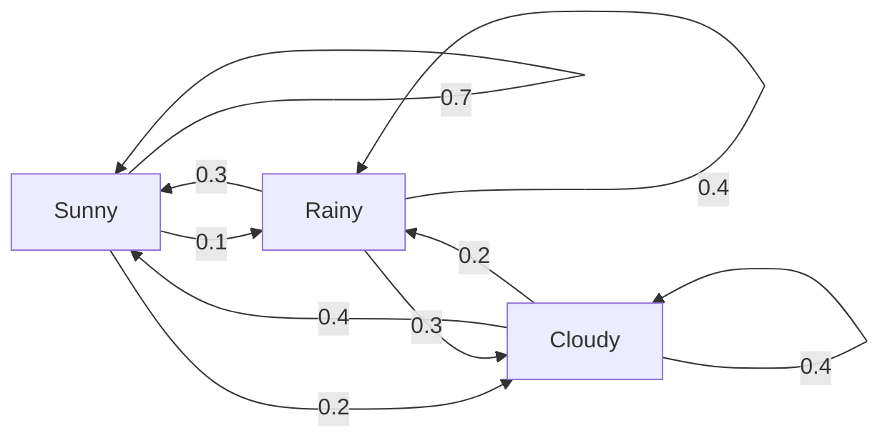
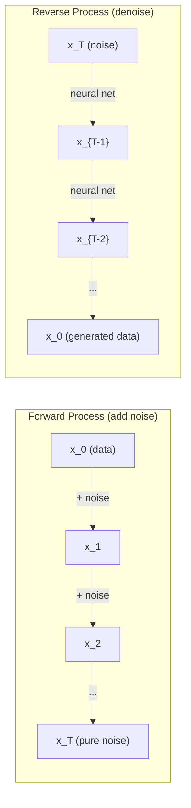

# 随机过程

> 有结构的随机性：随机游走、马尔可夫链与扩散模型背后的数学。

**类型:** 学习  
**语言:** Python  
**先修:** 第 1 阶段课程 06-07（概率论、贝叶斯）  
**时长:** ~75 分钟

## 学习目标

- 模拟一维和二维随机游走，并验证位移规模 \(\sqrt n\) 规律
- 构建马尔可夫链模拟器，并用特征分解求稳态分布
- 实现 Metropolis-Hastings MCMC 与 Langevin 动力学采样
- 将前向扩散与布朗运动联系起来，解释逆过程如何逐步生成数据

## 问题

很多 AI 系统里的随机性是“随时间演化的随机”——不是独立同分布，而是每一步依赖前一步。

语言模型按 token 一步步采样生成，每步分布取决于当前上下文。扩散模型不断往样本里加噪直到纯噪声，再学习逆向去噪恢复图像。强化学习中的环境交互，每个动作带来状态转移都是概率性的。MCMC 采样则构造马尔可夫链，让样本最终按目标后验分布出现。

这些都建立在四个基础上：
1. 随机游走  
2. 马尔可夫链（转移矩阵）  
3. Langevin 动力学（含噪梯度下降）  
4. Metropolis-Hastings（任意分布采样）

## 概念

### 随机游走

从 0 开始，每步抛公平硬币：正面向右 (+1)，反面向左 (-1)。

做 \(n\) 步后位置是 \(n\) 个 \(\pm1\) 的和。期望位置是 0，但期望到原点距离是 \(\sqrt n\)。

```
Step 0:  Position = 0
Step 1:  Position = +1 or -1
Step 2:  Position = +2, 0, or -2
...
Step 100: Expected distance from origin ~ 10 (sqrt(100))
Step 10000: Expected distance from origin ~ 100 (sqrt(10000))
```

二维随机游走（上下左右）同理，距离原点仍按 \(\sqrt n\) 增长。路径看上去像“分形样”扩散。

### 频域理解

每步 \(\pm1\) 的独立性使
\(Var(S_n)=n\)，所以标准差 \(= \sqrt n\)。中心极限定理还告诉 \(S_n/\sqrt n\) 收敛标准正态。
\(\sqrt n\) 在 ML 常见：SGD 噪声标度为 \(1/\sqrt{\text{batch}}\)，嵌入长度常取 \(\sqrt d\)。

**与布朗运动。** 若步长按 \(1/\sqrt n\) 缩放并让 \(n\to\infty\)，离散随机游走收敛到布朗运动 \(B(t)\)。

### 马尔可夫链

马尔可夫链下一个状态仅依赖当前状态，不依赖历史：

```
P(X_{t+1} = j | X_t = i, X_{t-1} = ...) = P(X_{t+1} = j | X_t = i)
```

用转移矩阵 \(P\) 表示：

```
P[i][j] = probability of going from state i to state j
```

每行和为 1。

**例子：天气链**

```
States: Sunny (0), Rainy (1), Cloudy (2)

P = [[0.7, 0.1, 0.2],    (if sunny: 70% sunny, 10% rainy, 20% cloudy)
     [0.3, 0.4, 0.3],    (if rainy: 30% sunny, 40% rainy, 30% cloudy)
     [0.4, 0.2, 0.4]]    (if cloudy: 40% sunny, 20% rainy, 40% cloudy)
```

经过多步后分布会收敛到稳态 \(\pi\)，满足 \(\pi P = \pi\)（\(P\) 的左特征向量，特征值 1）。



稳态计算方法：
- **幂法**：反复乘以 \(P\)
- **特征值法**：求 \(P^T\) 的特征值 1 的左/右特征向量

收敛条件：
- **不可约**：任意状态可到任意状态
- **非周期**：无固定周期循环

吸收态：\(P[i][i]=1\) 且无出边，表示终止状态（聊天 EOS、游戏结束）。

### 与语言模型的关系

LLM 的下一 token 分布可近似看作马尔可夫过程：

```
P(token_i) = exp(logit_i / temperature) / sum(exp(logit_j / temperature))
```

温度 \(T\) 调节随机性（越低越确定，越高越随机），top-k/top-p 是对转移分布的截断变换。

### 布朗运动

布朗运动 \(B(t)\) 的性质：
1. \(B(0)=0\)
2. \(B(t)-B(s)\sim N(0, t-s)\)
3. 不重叠区间增量独立

离散近似：

```
B(t + dt) = B(t) + sqrt(dt) * z,    where z ~ N(0, 1)
```

### Langevin 动力学

梯度下降找到能量最小点。Langevin 在其中加噪，使样本分布收敛到 \(\exp(-U(x)/T)\)：

```
x_{t+1} = x_t - dt * gradient(U(x_t)) + sqrt(2 * T * dt) * z_t
```

前半段是梯度项，后半段是随机项。\(T=0\) 时近似纯梯度下降；高温更像随机游走。

### 扩散模型链接

前向过程是马尔可夫链：

```
x_t = sqrt(alpha_t) * x_{t-1} + sqrt(1 - alpha_t) * noise
```

经过足够步后 \(x_T\) 近似高斯噪声。逆过程 \(x_{T}\to x_0\) 也用马尔可夫链参数化，由神经网络学习噪声预测并反向去噪。

### MCMC

MCMC 用于目标分布 \(p(x)\) 只能“按比例”算出但难直接采样的场景（如贝叶斯后验）。

**Metropolis-Hastings**

1. 当前点 \(x\)
2. 提议 \(x'\sim Q(x'|x)\)
3. 计算接受比 \(a=\frac{p(x')Q(x|x')}{p(x)Q(x'|x)}\)
4. 以概率 \(\min(1,a)\) 接受

对称提议下 \(a=p(x')/p(x)\)，归一化常数可消掉。收敛慢快取决于提议步长。

实践注意：
- **burn-in** 丢弃前期样本
- **thinning** 间隔采样降低相关性
- **多链验证** 从不同初值跑并比较结果

### AI 里的随机过程

| 过程 | 应用 |
|---|---|
| 随机游走 | RL 探索、Node2Vec |
| 马尔可夫链 | LLM 采样、MCMC |
| 布朗运动 | 扩散模型前向过程 |
| Langevin | SGLD、score-based 模型 |
| MDP | 强化学习 |
| Metropolis-Hastings | 贝叶斯后验采样 |



## 动手实现

### 步骤 1：随机游走

```figure
random-walk-diffusion
```

### 步骤 2：马尔可夫链

```python
import numpy as np

def random_walk_1d(n_steps, seed=None):
    rng = np.random.RandomState(seed)
    steps = rng.choice([-1, 1], size=n_steps)
    positions = np.concatenate([[0], np.cumsum(steps)])
    return positions


def random_walk_2d(n_steps, seed=None):
    rng = np.random.RandomState(seed)
    directions = rng.choice(4, size=n_steps)
    dx = np.zeros(n_steps)
    dy = np.zeros(n_steps)
    dx[directions == 0] = 1   # right
    dx[directions == 1] = -1  # left
    dy[directions == 2] = 1   # up
    dy[directions == 3] = -1  # down
    x = np.concatenate([[0], np.cumsum(dx)])
    y = np.concatenate([[0], np.cumsum(dy)])
    return x, y
```

### 步骤 3：Langevin

```python
class MarkovChain:
    def __init__(self, transition_matrix, state_names=None):
        self.P = np.array(transition_matrix, dtype=float)
        self.n_states = len(self.P)
        self.state_names = state_names or [str(i) for i in range(self.n_states)]

    def step(self, current_state, rng=None):
        if rng is None:
            rng = np.random.RandomState()
        probs = self.P[current_state]
        return rng.choice(self.n_states, p=probs)

    def simulate(self, start_state, n_steps, seed=None):
        rng = np.random.RandomState(seed)
        states = [start_state]
        current = start_state
        for _ in range(n_steps):
            current = self.step(current, rng)
            states.append(current)
        return states

    def stationary_distribution(self):
        eigenvalues, eigenvectors = np.linalg.eig(self.P.T)
        idx = np.argmin(np.abs(eigenvalues - 1.0))
        stationary = np.real(eigenvectors[:, idx])
        stationary = stationary / stationary.sum()
        return np.abs(stationary)
```

### 步骤 4：Metropolis-Hastings

```python
def langevin_dynamics(grad_U, x0, dt, temperature, n_steps, seed=None):
    rng = np.random.RandomState(seed)
    x = np.array(x0, dtype=float)
    trajectory = [x.copy()]
    for _ in range(n_steps):
        noise = rng.randn(*x.shape)
        x = x - dt * grad_U(x) + np.sqrt(2 * temperature * dt) * noise
        trajectory.append(x.copy())
    return np.array(trajectory)
```

## 应用

```python
def metropolis_hastings(target_log_prob, proposal_std, x0, n_samples, seed=None):
    rng = np.random.RandomState(seed)
    x = np.array(x0, dtype=float)
    samples = [x.copy()]
    accepted = 0
    for _ in range(n_samples - 1):
        x_proposed = x + rng.randn(*x.shape) * proposal_std
        log_ratio = target_log_prob(x_proposed) - target_log_prob(x)
        if np.log(rng.rand()) < log_ratio:
            x = x_proposed
            accepted += 1
        samples.append(x.copy())
    acceptance_rate = accepted / (n_samples - 1)
    return np.array(samples), acceptance_rate
```

### 使用转移矩阵

```python
import numpy as np

rng = np.random.RandomState(42)
walk = np.cumsum(rng.choice([-1, 1], size=10000))
print(f"Final position: {walk[-1]}")
print(f"Expected distance: {np.sqrt(10000):.1f}")
print(f"Actual distance: {abs(walk[-1])}")
```

### 与框架对齐

- `DDPMScheduler` 中的 `diffusers`：实现前向/逆向马尔可夫链  
- `outputs/prompt-stochastic-process-advisor.md`/PyMC：用 MCMC（如 NUTS）做贝叶斯推断  
- Gymnasium：环境 step 定义了 MDP

### 验证收敛

```python
import numpy as np

P = np.array([[0.7, 0.1, 0.2],
              [0.3, 0.4, 0.3],
              [0.4, 0.2, 0.4]])

distribution = np.array([1.0, 0.0, 0.0])
for _ in range(100):
    distribution = distribution @ P

print(f"Stationary distribution: {np.round(distribution, 4)}")
```

谱间隙越大，混合越快。

## 实战输出

本课产出：
- outputs/prompt-stochastic-process-advisor.md：帮助判断问题对应何种随机过程的模板 prompt

## 进一步联系

扩散模型中 DDPM（Ho et al.）可写成：

```python
import numpy as np

P = np.array([[0.9, 0.1], [0.3, 0.7]])

eigenvalues = np.linalg.eigvals(P)
spectral_gap = 1 - sorted(np.abs(eigenvalues))[-2]
print(f"Eigenvalues: {eigenvalues}")
print(f"Spectral gap: {spectral_gap:.4f}")
print(f"Approximate mixing time: {1/spectral_gap:.1f} steps")
```

每步后向生成：

```
q(x_t | x_{t-1}) = N(x_t; sqrt(1-beta_t) * x_{t-1}, beta_t * I)
```

所以每步采样都是学习到的马尔可夫链。理解马尔可夫链就理解了“为啥扩散能生成数据”。

SGLD 把小批量梯度和 Langevin 噪声结合，学习率衰减后从优化过渡为采样，自动给出不确定性估计。

## 练习

1. **大规模随机游走。** 模拟 1000 条长度 10000 的随机游走，画终点分布，验证近似高斯，均值 0、标准差约 100。
2. **文本马尔可夫生成。** 用小语料统计词转移，构建转移矩阵后采样生成句子。
3. **实现模拟退火。** 以 MH 实现高温到低温退火，找多峰函数全局近似最小值。
4. **不同温度下的 Langevin。** 对双阱势 \(U(x)=(x^2-1)^2\) 采样。低温集中在单一势阱，高温会跨越两侧，找出混合临界温度。
5. **实现前向扩散。** 1D 正弦波上逐步加噪（100 步线性调度），观察从信号到噪声，再写简单去噪器反向恢复。

## 术语

| 术语 | 含义 |
|---|---|
| 随机游走 | 每步以随机增量演化的位置过程 |
| 马尔可夫性质 | 未来只与当前状态相关，不与历史关联 |
| 转移矩阵 | \(P[i][j]\)：从 i 到 j 的概率 |
| 稳态分布 | \(\pi P=\pi\)，链长时一致分布 |
| 布朗运动 | 随机游走极限，\(B(0)=0\)、增量正态且独立 |
| Langevin 动力学 | 梯度项 + 噪声项的动力学 |
| MCMC | 构造目标分布的马尔可夫链采样 |
| Metropolis-Hastings | 提议-接受-拒绝的采样框架 |
| 温度 | 决定探索与利用权重 |
| 扩散过程 | 逐步加噪再去噪生成数据 |

## 延伸阅读

- Ho, Jain, Abbeel (2020): DDPM 原始论文  
- Song & Ermon (2019): Score-based / Langevin 采样  
- Roberts & Rosenthal (2004): MCMC 理论基础  
- Norris (1997): 《Markov Chains》  
- Welling & Teh (2011): SGLD 与贝叶斯学习

```
p_theta(x_{t-1} | x_t) = N(x_{t-1}; mu_theta(x_t, t), sigma_t^2 * I)
```
