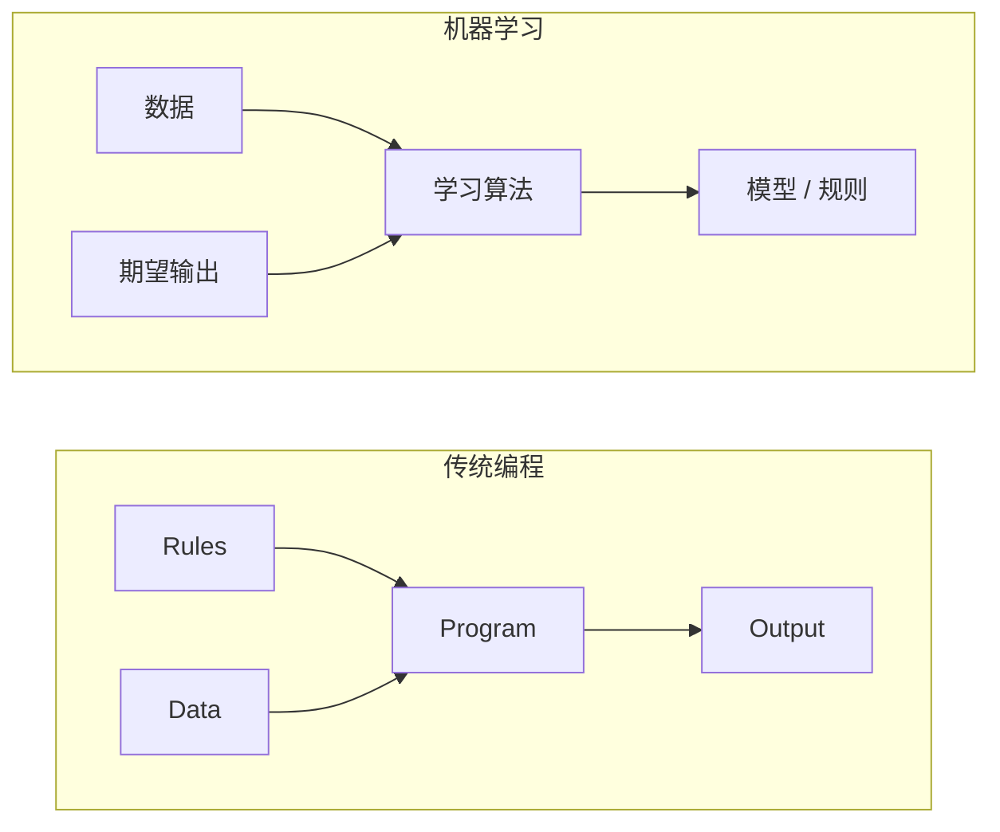
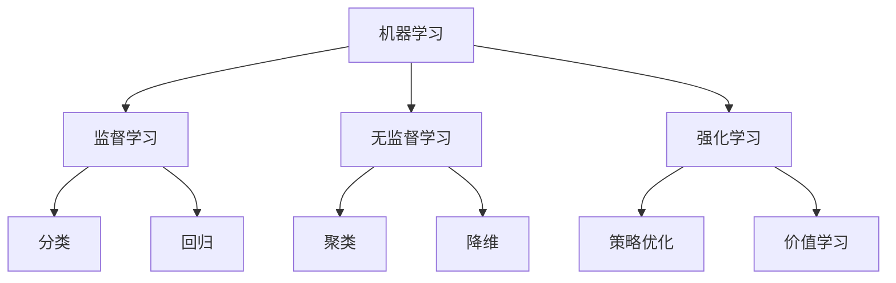
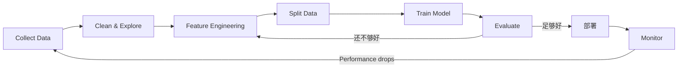
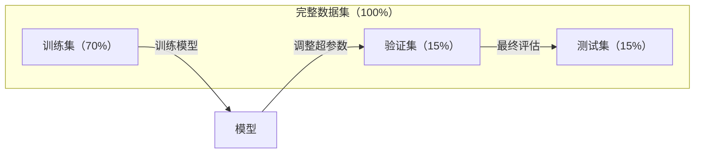
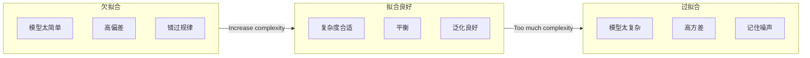
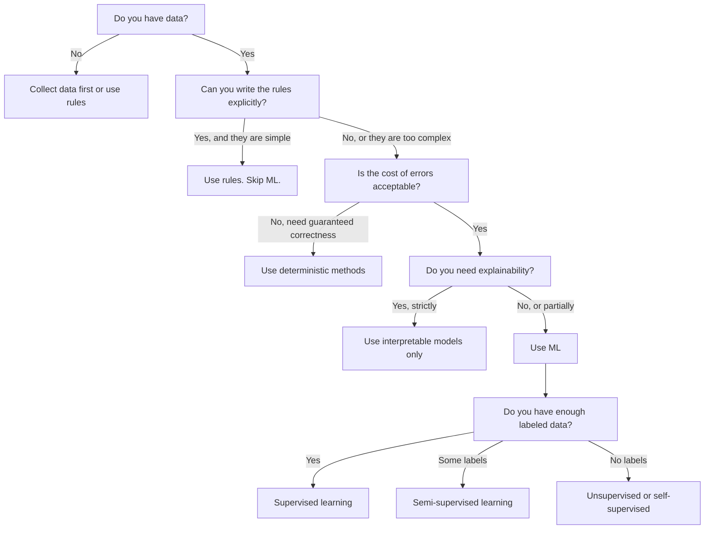

# 什么是机器学习

> 机器学习是让计算机从数据中学习规律，而不是手工编写规则。

**类型：** 学习
**语言：** Python
**先修：** 第一阶段（数学基础）
**预计时长：** 约 45 分钟

## 学习目标

- 解释监督学习、无监督学习和强化学习的区别，并判断某个问题属于哪一类
- 从零实现最近质心分类器，并与随机基线进行对比评估
- 区分类别任务和回归任务，并为二者分别选择合适的损失函数
- 评估某个业务问题是否适合机器学习，还是更适合确定性规则

## 问题背景

你想要构建一个垃圾邮件过滤器。传统做法是：坐下来手写上百条规则。比如“如果邮件里包含 FREE MONEY，则标记为垃圾邮件；如果感叹号超过 3 个，也标记为垃圾邮件。”你可能会花几周写规则。然后垃圾邮件发送者换词了，你的规则失效，你又要继续写规则，周而复始，循环不止。

机器学习改变了这一点。你不再手写规则，而是给计算机成千上万封已标注邮件（spam 或 not spam），让它自己归纳规则。计算机能发现你从未想到过的规律。垃圾邮件改了套路后，你只需用新数据重训模型，而不是重写代码。

从“写规则”到“从数据中学习”的这种转变，就是机器学习的核心。每个推荐系统、语音助手、自动驾驶和语言模型都在用这种思路。

## 关键概念

### 从数据学习，而非从规则学习

传统编程和机器学习是反向解决问题的方法。



传统编程：你先写规则，程序再把规则应用到数据上得到输出。

机器学习：你先给数据和期望输出，再让算法自己去发现规则。

训练后得到的“模型”本质上就是这些规则的数字化形式（权重、参数）。它能把见过的样本模式泛化到未见过的新数据上做预测。

### 机器学习三大范式



**监督学习（Supervised Learning）**：你有成对的“输入-输出”。模型学习把输入映射到输出。
- “这里有 10,000 张猫狗图片，并带有标签。学习如何区分它们。”
- “这里有房屋特征和价格。学习预测价格。”

**无监督学习（Unsupervised Learning）**：只有输入，没有标签。模型自己寻找数据结构。
- “这里有 10,000 条客户购买历史。找出自然分组。”
- “这里有 1,000 维数据点。降到 2 维并尽量保留结构。”

**强化学习（Reinforcement Learning）**：智能体在环境中采取动作并获得奖励或惩罚。它学习一套策略，使累计奖励最大化。
- “玩这个游戏。赢了得 +1，输了得 -1。找出策略。”
- “控制机械臂。抓起物体得 +1，每浪费 1 秒扣 0.01。”

你将来实践中主要会用到监督学习。无监督学习常用于预处理和探索。强化学习主要用于游戏 AI、机器人和语言模型中的 RLHF。

### 超越三大范式

上面三类分类清晰，但真实世界中的机器学习常常并不那么分明。

**半监督学习（Semi-supervised learning）** 使用少量有标签样本和大量无标签样本。比如有 100 张有标签医学影像，和 100,000 张无标签影像。常见方法包括：

- **标签传播（Label propagation）：** 构建连接相似样本的图。标签从有标签节点扩散到无标签邻居。
- **伪标签（Pseudo-labeling）：** 先用有标签数据训练模型，再预测无标签数据，接着用全部数据继续训练，模型用自己的预测结果“自举”。
- **一致性正则化（Consistency regularization）：** 对输入做轻微扰动后，模型应输出一致预测。即使没有标签，也可以工作。

**自监督学习（Self-supervised learning）** 从数据自身生成监督信号，不依赖人工标签。模型从数据结构中构造自己的预测任务。

- **掩码语言建模（Masked Language Modeling，BERT）：** 隐藏句子中 15% 的词，训练模型预测缺失词。标签来自原始文本本身。
- **对比学习（Contrastive Learning，SimCLR）：** 对一张图像做两次增强，训练模型判别这两张增强图来自同一张原图，同时与其他图像的增强图区分开。
- **下一词预测（Next-token prediction，GPT）：** 给定历史词预测下一个词。每一篇文本都可成为训练样本。

这些并不是和三大范式完全独立的类别，而是将监督与无监督思想组合的策略。严格地讲，自监督是监督的一种形式：模型在预测一个目标，只是标签自动生成，不需要人工标注。

### 分类 vs 回归

这是监督学习中两类核心任务。

| 维度 | 分类 | 回归 |
|------|------|------|
| 输出 | 离散类别 | 连续数值 |
| 示例 | “这封邮件是垃圾邮件吗？” | “这套房价格是多少？” |
| 输出空间 | {cat, dog, bird} | 任意实数 |
| 损失函数 | 交叉熵、准确率 | 均方误差（MSE）、MAE |
| 决策 | 类别边界 | 拟合数据的曲线 |

分类回答的是“是哪一类”，回归回答的是“多少”。

有些问题可按两种方式建模。预测股票涨跌是分类问题；预测具体价格则是回归问题。

### 机器学习工作流

不管算法如何，机器学习项目通常都遵循同一条流水线。



**收集数据：** 获取原始数据。通常数据越多越好，但数据质量更重要。

**清洗与探索：** 处理缺失值、去重、可视化分布、发现异常。这一步往往占总时间的 60%-80%。

**特征工程：** 把原始数据转成模型可用特征。将日期转为星期几、标准化数值列、对类别变量编码。好的特征通常比复杂算法更关键。

**划分数据：** 将数据分为训练集、验证集、测试集。模型在训练集上学习，在验证集上调参，在测试集上报告最终效果。

**训练模型：** 用训练数据喂给算法，算法通过优化减小损失函数来更新参数。

**评估：** 在验证/测试集上评估。如果效果不理想，返回上游尝试不同特征、算法或超参数。

**上线：** 将模型投放到线上，让它对新数据进行预测。

**监控：** 持续跟踪模型表现。输入分布会变化（数据漂移），模型会衰减。性能下降时就要重训。

### 训练集、验证集与测试集划分

这是新手最容易搞错的关键点之一。你必须在训练时从未见过的数据上评估模型，否则测到的是“背诵”，不是“学习”。



| 划分 | 目的 | 使用时机 | 常见比例 |
|------|------|----------|----------|
| 训练集 | 模型基于其学习参数 | 训练阶段 | 60%-80% |
| 验证集 | 调超参数、比较模型 | 每次训练后 | 10%-20% |
| 测试集 | 最终无偏性能估计 | 最后一次 | 10%-20% |

测试集应保持“圣洁”，只看一次。如果你不断根据测试集结果调模型，就等价于在测试集上训练，报告的数值就失真了。

对小样本数据，使用 k 折交叉验证更合适：将数据分成 k 份，训练 k-1 份，验证 1 份，轮换后取平均结果。

### 过拟合与欠拟合



**欠拟合：** 模型太简单，无法捕捉数据中的模式。拿一条直线去拟合非线性关系。训练误差高、测试误差也高。

**过拟合：** 模型过于复杂，会记住训练数据中的噪声。曲线穿过几乎每个训练点，但在新数据上表现差。训练误差低、测试误差高。

**拟合良好：** 模型抓住真实规律且不记噪声，训练误差与测试误差都在可接受范围内。

过拟合信号：
- 训练准确率明显高于验证准确率
- 模型在训练集上表现很好，但在新数据上很差
- 增加训练数据可明显改善效果（说明模型更像“背答案”而非“学规律”）

过拟合修复：
- 增加训练数据
- 降低模型复杂度（更少参数、更简单结构）
- 使用正则化（对大权重加罚）
- 使用 Dropout（训练时随机将神经元置零）
- 早停（验证误差开始上升时停止训练）

欠拟合修复：
- 使用更复杂的模型
- 增加更多特征
- 降低正则化强度
- 训练更久

### 偏差-方差权衡

这是过拟合与欠拟合背后的数学框架。

**偏差（Bias）：** 来自模型错误假设的误差。例如真实关系是非线性的，线性模型就会有高偏差，导致欠拟合。

**方差（Variance）：** 对训练样本微小波动过于敏感导致的误差。高方差模型在不同训练子集上给出的预测差异很大，通常对应过拟合。

| 模型复杂度 | 偏差 | 方差 | 结果 |
|------------|------|------|------|
| 过低（线性模型去拟合曲线数据） | 高 | 低 | 欠拟合 |
| 适中 | 中 | 中 | 泛化良好 |
| 过高（10 个点拟合 20 阶多项式） | 低 | 高 | 过拟合 |

总误差 = Bias² + Variance + 不可约噪声

你无法减少不可约噪声（它是数据本身的随机性）。你要找的是偏差²与方差之和最小的平衡点。

### 无免费午餐定理

不存在一个对所有问题都最优的算法。某类问题上表现好的方法，在另一类问题上可能很差。这就是为什么数据科学家要尝试多个模型并比较结果。

实际中模型选择取决于：
- 你有多少数据
- 特征数量有多少
- 关系是线性还是非线性
- 是否需要可解释性
- 你能承受多少计算资源

### 什么时候不该用机器学习

机器学习强大，但并非万能。开模型前先问自己是不是真的需要。

**以下场景不建议用机器学习：**

- **规则简单且清晰。** 例如税费计算、排序算法、单位换算。如果逻辑能用几个 if 语句写清，用模型通常只是增加复杂度。
- **没有数据或数据太少。** 机器学习需要样本学习。只有十条数据无法训练出有意义的模型，先去采集数据。
- **错误代价高且必须保证正确。** 药物剂量计算、核反应堆控制、密码学校验。机器学习本质上是概率型方法，可能出错；如果“可能出错”不可接受，就应使用确定性方法。
- **查表法或启发式就能解决。** 如果一个阈值或规则表能覆盖 99% 情况，机器学习只会显著提高维护成本。
- **必须可解释且需给出决策依据。** 某些受监管行业（信贷、保险、司法）要求每个决策可解释。部分模型可解释（线性回归、小型决策树），多数深度模型不行。
- **问题变化速度快于你重训速度。** 如果规则每天变化，但重训要一周以上，模型会一直过时。

使用以下决策流程图：



## 动手实践

`code/ml_intro.py` 中实现了最简单的最近质心分类器。这段代码展示了机器学习的核心：先从数据中学习，再在新数据上预测。

### 步骤 1：从头实现最近质心分类器

最近质心分类器计算每类样本的中心点（均值）。预测时，把新样本归到离它最近的中心所属类别。

```python
class NearestCentroid:
    def fit(self, X, y):
        self.classes = np.unique(y)
        self.centroids = np.array([
            X[y == c].mean(axis=0) for c in self.classes
        ])

    def predict(self, X):
        distances = np.array([
            np.sqrt(((X - c) ** 2).sum(axis=1))
            for c in self.centroids
        ])
        return self.classes[distances.argmin(axis=0)]
```

这就是完整算法：fit 只算两个均值，predict 只算距离，没有梯度下降、没有迭代、没有超参数。

### 步骤 2：在合成数据上训练

我们生成一个二维二分类数据集，两类样本轻微重叠。质心分类器在两个类中心之间给出近似线性决策边界。

```python
rng = np.random.RandomState(42)
X_class0 = rng.randn(100, 2) + np.array([1.0, 1.0])
X_class1 = rng.randn(100, 2) + np.array([-1.0, -1.0])
X = np.vstack([X_class0, X_class1])
y = np.array([0] * 100 + [1] * 100)
```

### 步骤 3：与基线比较

每个 ML 模型都应和朴素基线对比。这里基线就是随机猜类别。如果你的模型不超过随机猜测，说明有问题。

```python
baseline_preds = rng.choice([0, 1], size=len(y_test))
baseline_acc = np.mean(baseline_preds == y_test)
```

在这个干净数据集上，质心分类器通常能达到约 90% 以上准确率。随机基线大约是 50%。

### 为什么这很重要

最近质心分类器非常简单：没有超参数，没有迭代，没有梯度下降。但它抓住了机器学习最核心的套路：

1. **学习** 训练数据中的表征（质心）
2. **预测** 新数据上的标签（最近距离）
3. **评估** 与基线比较（随机猜测）

从逻辑回归到 Transformer，所有算法都遵循这三步：表征越来越复杂，但工作流不变。

### 步骤 4：质心分类器的局限

最近质心分类器默认每类只有一个聚类，会生成线性决策边界。它在以下场景会失败：

- 某类存在多个簇（例如数字 “1” 的书写有多种形态）
- 决策边界是非线性的（例如一类环绕另一类）
- 特征尺度差异巨大（距离会被大尺度特征主导）

这些局限性正是后续所有算法出现的动机。KNN 处理多簇，决策树处理非线性边界，特征缩放解决尺度问题。每一课都建立在上一课限制的基础上。

## 直接应用

sklearn 提供了 `NearestCentroid` 和合成数据生成器：

```python
from sklearn.neighbors import NearestCentroid
from sklearn.datasets import make_classification
from sklearn.model_selection import train_test_split

X, y = make_classification(
    n_samples=500, n_features=2, n_redundant=0,
    n_clusters_per_class=1, random_state=42
)
X_train, X_test, y_train, y_test = train_test_split(X, y, test_size=0.3)

clf = NearestCentroid()
clf.fit(X_train, y_train)
print(f"准确率：{clf.score(X_test, y_test):.3f}")
```

## 交付

本课会输出 `outputs/prompt-ml-problem-framer.md`。这是一个用于把模糊业务需求转为可执行 ML 任务的提示词：你输入“降低流失率”“预测下季度需求”等描述，它会识别学习类型、定义预测目标、列出候选特征、挑选成功指标、建立基线，并标出数据泄漏或类别不平衡等风险。用它可避免一开始就构建错方向的项目。

## 关键术语

| 术语 | 人们常说 | 实际含义 |
|------|----------|----------|
| 模型 | “AI 本身” | 一个可学习参数的数学函数，把输入映射到输出 |
| 训练 | “教 AI” | 运行优化算法，调整参数使预测接近已知输出 |
| 特征 | “一列输入” | 数据中可量化属性，模型据此做预测 |
| 标签 | “答案” | 训练样本的已知输出，用于计算误差信号 |
| 超参数 | “你调的设置” | 在训练前就设定、控制学习过程的参数（学习率、层数等） |
| 损失函数 | “模型错了多少” | 衡量预测值与真实值差距、指导优化最小化目标的函数 |
| 过拟合 | “它把测试集背下来了” | 模型记住了训练噪声而非规律，导致新数据上表现差 |
| 欠拟合 | “它啥也没学到” | 模型过于简单，无法捕捉真实规律 |
| 泛化 | “在新数据上也能用” | 模型对未见过的数据保持准确预测的能力 |
| 交叉验证 | “换几个分片测试” | 重复划分训练/测试折并平均结果，得到更稳健的性能估计 |
| 正则化 | “把权重压小” | 在损失函数里加惩罚项，抑制过于复杂的模型 |
| 数据漂移 | “世界在变化” | 进入模型的输入分布随时间发生变化，导致性能下降 |

## 练习

1. 选任意一个数据集（如 Iris、Titanic），按 70/15/15 划分训练集、验证集和测试集。说明为什么不能在测试集上调超参数。
2. 列出三个真实业务问题。分别判断是分类、回归还是聚类问题，并判断是监督学习还是无监督学习。
3. 某模型在训练集准确率 99%，在测试集只有 60%。判断问题根因并写出你会尝试的 3 个修复方法。

## 拓展阅读

- [An Introduction to Statistical Learning](https://www.statlearning.com/) - 免费教材，覆盖经典机器学习方法并有实用示例
- [Google's Machine Learning Crash Course](https://developers.google.com/machine-learning/crash-course) - 简明可视化的机器学习入门课程
- [Scikit-learn User Guide](https://scikit-learn.org/stable/user_guide.html) - Python 中实现机器学习的实用参考
