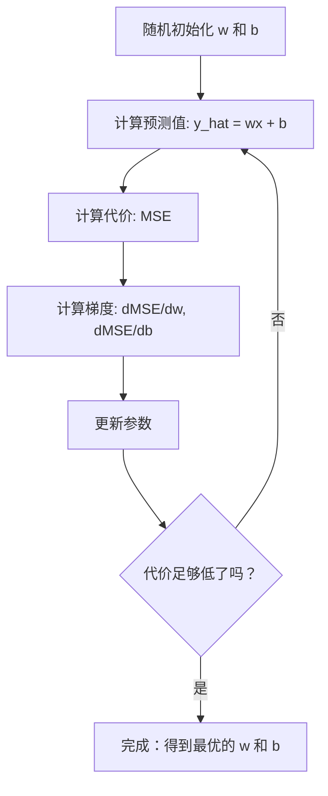

# 线性回归

> 线性回归会在数据点中拟合出一条最合适的直线，是机器学习里最常见的入门案例。

**类型:** 构建
**语言:** Python
**先修:** 第一阶段（线性代数、微积分、优化），第二阶段第 1 课
**时长:** ~90 分钟

## 学习目标

- 推导均方误差（MSE）的梯度下降更新公式，并从头实现线性回归
- 对比梯度下降与正规方程在复杂度和适用场景上的差异
- 用特征标准化建立多元线性回归模型，并解读学习到的权重
- 说明岭回归（L2 正则化）如何通过惩罚大权重来抑制过拟合

## 问题定义

你有一组样本：房屋面积和对应的售价。你想根据房屋面积去预测一栋新房的售价。你可以在散点图上大致“拍脑袋”画条线，但真正可用的是一条可计算的公式：一条能用于任意面积输入、输出价格预估的直线。

线性回归就是这条线。更重要的是，它完整地展示了机器学习训练闭环：先定义模型，再定义代价函数，最后优化参数。每个机器学习方法都遵循这个框架。先在最简单的场景里把这一套吃透，你会在后续课程里反复看到它。

它不只是“玩具问题”。在真实系统里，线性回归常用于需求预测、A/B 实验分析、金融建模，通常也是回归任务的首发基线。

## 核心概念

### 模型

线性回归假设输入 `x` 与输出 `y` 存在线性关系：

```text
y = wx + b
```

- `w`（权重/斜率）：`x` 增加 1 时 `y` 的变化量
- `b`（偏置/截距）：`x = 0` 时的 `y` 值

若有多个输入特征，模型扩展为：

```text
y = w1*x1 + w2*x2 + ... + wn*xn + b
```

或用向量表示为：`y = w^T * x + b`

目标是找到 `w`、`b` 的一组取值，使预测值 `y_hat` 与真实值 `y` 在全部训练样本上尽可能接近。

### 代价函数（均方误差）

如何衡量“接近”？你需要一个数值汇总，让它反映所有样本的误差。最常用的是均方误差（MSE）：

```text
MSE = (1/n) * sum((y_predicted - y_actual)^2)
```

为什么要平方？两个原因。第一，平方会更重惩罚大误差（误差 10 的惩罚是误差 1 的 100 倍，而不是 10 倍）。第二，平方函数在全域平滑且可导，方便做优化。

代价函数可以看成一个“曲面”。当只有 `w` 和 `b` 两个参数时，MSE 的曲面像一个碗，且是凸的。曲面最低点就是代价最小处，训练的目的就是找到这个点。

### 梯度下降

梯度下降就是沿着“下坡”方向不断前进，逐步寻找最低点。



梯度提供两类信息：每个参数应朝哪个方向改，以及改动幅度。

对于 `y_hat = wx + b` 的 MSE：

```text
dMSE/dw = (2/n) * sum((y_hat - y) * x)
dMSE/db = (2/n) * sum(y_hat - y)
```

更新公式为：

```text
w = w - learning_rate * dMSE/dw
b = b - learning_rate * dMSE/db
```

学习率控制步长。太大时可能越过最小值发散；太小时收敛很慢。常见起始值是 `0.01`、`0.001` 或 `0.0001`。

### 正规方程（闭式解）

对于线性回归，还有一套直接求解公式，能一步算出最优参数，不需要迭代：

```text
w = (X^T * X)^(-1) * X^T * y
```

这一步等价于对矩阵做逆运算。在小规模数据上通常很快；但面对百万行或上千特征的大表时，梯度下降通常更实用，因为矩阵求逆的复杂度与特征数相关，通常是 `O(n^3)`。

### 多元线性回归

当有多个特征时，模型变成：

```text
y = w1*x1 + w2*x2 + ... + wn*xn + b
```

规则仍然一致：代价函数仍是 MSE，梯度下降同样同步更新全部权重。唯一差别是，你拟合的是高维空间中的超平面，而不再是一条 2D 直线。

在这里，特征缩放很关键。若某特征范围是 0~1，另一个是 0~1,000,000，梯度下降会很难收敛，因为代价曲面被拉得很“扁”。训练前先标准化（减均值除标准差）可以显著改善收敛。

### 多项式回归

如果关系并非线性，依然可以用线性回归：先构造多项式特征。

```text
y = w1*x + w2*x^2 + w3*x^3 + b
```

这仍然叫线性回归，因为相对于参数 `(w1, w2, w3)` 模型是线性的；只是输入特征变成了非线性函数。

高阶多项式能拟合更复杂曲线，但更容易过拟合。10 个点的样本上，10 次多项式几乎可以穿过所有点，但在新数据上常常泛化很差。

### R 平方（R-Squared）

MSE 告诉你误差大小，但它依赖 `y` 的量纲。R 平方（R²）提供了与尺度无关的衡量：

```text
R^2 = 1 - (sum of squared residuals) / (sum of squared deviations from mean)
    = 1 - SS_res / SS_tot
```

- `R^2 = 1.0`：预测完美
- `R^2 = 0.0`：模型效果不如每次都预测均值
- `R^2 < 0.0`：模型还不如“直接猜均值”有用

### 正则化预告（岭回归）

特征很多时，模型容易把训练噪声也拟合进去，权重被推得很大。岭回归（L2 正则化）会在代价里加一个惩罚项：

```text
Cost = MSE + lambda * sum(w_i^2)
```

惩罚项会抑制大权重。超参数 `lambda` 决定强弱：`lambda` 越大，权重越小、正则化越强。这部分内容将在后续课程展开。先记住它的目的与效果。

```figure
linear-regression-fit
```

## 动手做

### 步骤 1：生成示例数据

```python
import random
import math

random.seed(42)

TRUE_W = 3.0
TRUE_B = 7.0
N_SAMPLES = 100

X = [random.uniform(0, 10) for _ in range(N_SAMPLES)]
y = [TRUE_W * x + TRUE_B + random.gauss(0, 2.0) for x in X]

print(f"Generated {N_SAMPLES} samples")
print(f"True relationship: y = {TRUE_W}x + {TRUE_B} (+ noise)")
print(f"First 5 points: {[(round(X[i], 2), round(y[i], 2)) for i in range(5)]}")
```

### 步骤 2：从头用梯度下降实现线性回归

```python
class LinearRegression:
    def __init__(self, learning_rate=0.01):
        self.w = 0.0
        self.b = 0.0
        self.lr = learning_rate
        self.cost_history = []

    def predict(self, X):
        return [self.w * x + self.b for x in X]

    def compute_cost(self, X, y):
        predictions = self.predict(X)
        n = len(y)
        cost = sum((pred - actual) ** 2 for pred, actual in zip(predictions, y)) / n
        return cost

    def compute_gradients(self, X, y):
        predictions = self.predict(X)
        n = len(y)
        dw = (2 / n) * sum((pred - actual) * x for pred, actual, x in zip(predictions, y, X))
        db = (2 / n) * sum(pred - actual for pred, actual in zip(predictions, y))
        return dw, db

    def fit(self, X, y, epochs=1000, print_every=200):
        for epoch in range(epochs):
            dw, db = self.compute_gradients(X, y)
            self.w -= self.lr * dw
            self.b -= self.lr * db
            cost = self.compute_cost(X, y)
            self.cost_history.append(cost)
            if epoch % print_every == 0:
                print(f"  轮次 {epoch:4d} | 代价 {cost:.4f} | w: {self.w:.4f} | b: {self.b:.4f}")
        return self

    def r_squared(self, X, y):
        predictions = self.predict(X)
        y_mean = sum(y) / len(y)
        ss_res = sum((actual - pred) ** 2 for actual, pred in zip(y, predictions))
        ss_tot = sum((actual - y_mean) ** 2 for actual in y)
        return 1 - (ss_res / ss_tot)


print("=== Training Linear Regression (Gradient Descent) ===")
model = LinearRegression(learning_rate=0.005)
model.fit(X, y, epochs=1000, print_every=200)
print(f"\nLearned: y = {model.w:.4f}x + {model.b:.4f}")
print(f"True:    y = {TRUE_W}x + {TRUE_B}")
print(f"R-squared: {model.r_squared(X, y):.4f}")
```

### 步骤 3：正规方程（闭式解）

```python
class LinearRegressionNormal:
    def __init__(self):
        self.w = 0.0
        self.b = 0.0

    def fit(self, X, y):
        n = len(X)
        x_mean = sum(X) / n
        y_mean = sum(y) / n
        numerator = sum((X[i] - x_mean) * (y[i] - y_mean) for i in range(n))
        denominator = sum((X[i] - x_mean) ** 2 for i in range(n))
        self.w = numerator / denominator
        self.b = y_mean - self.w * x_mean
        return self

    def predict(self, X):
        return [self.w * x + self.b for x in X]

    def r_squared(self, X, y):
        predictions = self.predict(X)
        y_mean = sum(y) / len(y)
        ss_res = sum((actual - pred) ** 2 for actual, pred in zip(y, predictions))
        ss_tot = sum((actual - y_mean) ** 2 for actual in y)
        return 1 - (ss_res / ss_tot)


print("\n=== Normal Equation (Closed-Form) ===")
model_normal = LinearRegressionNormal()
model_normal.fit(X, y)
print(f"\nClosed form: y = {model_normal.w:.4f}x + {model_normal.b:.4f}")
print(f"R-squared: {model_normal.r_squared(X, y):.4f}")
```

### 步骤 4：多元线性回归（含标准化）

```python
class MultipleLinearRegression:
    def __init__(self, n_features, learning_rate=0.01):
        self.weights = [0.0] * n_features
        self.bias = 0.0
        self.lr = learning_rate
        self.cost_history = []

    def predict(self, X):
        return [sum(w * xi for w, xi in zip(self.weights, x)) + self.bias for x in X]

    def compute_cost(self, X, y):
        predictions = self.predict(X)
        n = len(y)
        return sum((pred - actual) ** 2 for pred, actual in zip(predictions, y)) / n

    def fit(self, X, y, epochs=1000, print_every=200):
        n_features = len(X[0])
        n = len(y)
        for epoch in range(epochs):
            predictions = self.predict(X)
            errors = [pred - actual for pred, actual in zip(predictions, y)]
            for j in range(n_features):
                grad = (2 / n) * sum(errors[i] * X[i][j] for i in range(n))
                self.weights[j] -= self.lr * grad
            grad_b = (2 / n) * sum(errors)
            self.bias -= self.lr * grad_b
            cost = self.compute_cost(X, y)
            self.cost_history.append(cost)
            if epoch % print_every == 0:
                print(f"  轮次 {epoch:4d} | 代价 {cost:.4f}")
        return self

    def r_squared(self, X, y):
        predictions = self.predict(X)
        y_mean = sum(y) / len(y)
        ss_res = sum((actual - pred) ** 2 for actual, pred in zip(y, predictions))
        ss_tot = sum((actual - y_mean) ** 2 for actual in y)
        return 1 - (ss_res / ss_tot)


random.seed(42)
N = 100
X_multi = []
y_multi = []
for _ in range(N):
    size = random.uniform(500, 3000)
    bedrooms = random.randint(1, 5)
    age = random.uniform(0, 50)
    price = 50 * size + 10000 * bedrooms - 1000 * age + 50000 + random.gauss(0, 20000)
    X_multi.append([size, bedrooms, age])
    y_multi.append(price)


def standardize(X):
    n_features = len(X[0])
    means = [sum(X[i][j] for i in range(len(X))) / len(X) for j in range(n_features)]
    stds = []
    for j in range(n_features):
        variance = sum((X[i][j] - means[j]) ** 2 for i in range(len(X))) / len(X)
        stds.append(variance ** 0.5)
    X_scaled = []
    for i in range(len(X)):
        row = [(X[i][j] - means[j]) / stds[j] if stds[j] > 0 else 0 for j in range(n_features)]
        X_scaled.append(row)
    return X_scaled, means, stds


y_mean_val = sum(y_multi) / len(y_multi)
y_std_val = (sum((yi - y_mean_val) ** 2 for yi in y_multi) / len(y_multi)) ** 0.5
y_scaled = [(yi - y_mean_val) / y_std_val for yi in y_multi]

X_scaled, x_means, x_stds = standardize(X_multi)

print("\n=== Multiple Linear Regression (3 features) ===")
print("Features: house size, bedrooms, age")
multi_model = MultipleLinearRegression(n_features=3, learning_rate=0.01)
multi_model.fit(X_scaled, y_scaled, epochs=1000, print_every=200)

print(f"\nWeights (standardized): {[round(w, 4) for w in multi_model.weights]}")
print(f"Bias (standardized): {multi_model.bias:.4f}")
print(f"R-squared: {multi_model.r_squared(X_scaled, y_scaled):.4f}")
```

### 步骤 5：多项式回归

```python
class PolynomialRegression:
    def __init__(self, degree, learning_rate=0.01):
        self.degree = degree
        self.weights = [0.0] * degree
        self.bias = 0.0
        self.lr = learning_rate

    def make_features(self, X):
        return [[x ** (d + 1) for d in range(self.degree)] for x in X]

    def predict(self, X):
        features = self.make_features(X)
        return [sum(w * f for w, f in zip(self.weights, row)) + self.bias for row in features]

    def fit(self, X, y, epochs=1000, print_every=200):
        features = self.make_features(X)
        n = len(y)
        for epoch in range(epochs):
            predictions = [sum(w * f for w, f in zip(self.weights, row)) + self.bias for row in features]
            errors = [pred - actual for pred, actual in zip(predictions, y)]
            for j in range(self.degree):
                grad = (2 / n) * sum(errors[i] * features[i][j] for i in range(n))
                self.weights[j] -= self.lr * grad
            grad_b = (2 / n) * sum(errors)
            self.bias -= self.lr * grad_b
            if epoch % print_every == 0:
                cost = sum(e ** 2 for e in errors) / n
                print(f"  轮次 {epoch:4d} | 代价 {cost:.6f}")
        return self

    def r_squared(self, X, y):
        predictions = self.predict(X)
        y_mean = sum(y) / len(y)
        ss_res = sum((actual - pred) ** 2 for actual, pred in zip(y, predictions))
        ss_tot = sum((actual - y_mean) ** 2 for actual in y)
        return 1 - (ss_res / ss_tot)


random.seed(42)
X_poly = [x / 10.0 for x in range(0, 50)]
y_poly = [0.5 * x ** 2 - 2 * x + 3 + random.gauss(0, 1.0) for x in X_poly]

x_max = max(abs(x) for x in X_poly)
X_poly_norm = [x / x_max for x in X_poly]
y_poly_mean = sum(y_poly) / len(y_poly)
y_poly_std = (sum((yi - y_poly_mean) ** 2 for yi in y_poly) / len(y_poly)) ** 0.5
y_poly_norm = [(yi - y_poly_mean) / y_poly_std for yi in y_poly]

print("\n=== Polynomial Regression (degree 2 vs degree 5) ===")
print("True relationship: y = 0.5x^2 - 2x + 3")

print("\nDegree 2:")
poly2 = PolynomialRegression(degree=2, learning_rate=0.1)
poly2.fit(X_poly_norm, y_poly_norm, epochs=2000, print_every=500)
print(f"  R-squared: {poly2.r_squared(X_poly_norm, y_poly_norm):.4f}")

print("\nDegree 5:")
poly5 = PolynomialRegression(degree=5, learning_rate=0.1)
poly5.fit(X_poly_norm, y_poly_norm, epochs=2000, print_every=500)
print(f"  R-squared: {poly5.r_squared(X_poly_norm, y_poly_norm):.4f}")

print("\nDegree 2 fits the true curve well. Degree 5 fits training data slightly better")
print("but risks overfitting on new data.")
```

### 步骤 6：岭回归（L2 正则化）

```python
class RidgeRegression:
    def __init__(self, n_features, learning_rate=0.01, alpha=1.0):
        self.weights = [0.0] * n_features
        self.bias = 0.0
        self.lr = learning_rate
        self.alpha = alpha

    def predict_single(self, x):
        return sum(w * xi for w, xi in zip(self.weights, x)) + self.bias

    def predict(self, X):
        return [self.predict_single(x) for x in X]

    def fit(self, X, y, epochs=1000, print_every=200):
        n = len(y)
        n_features = len(X[0])
        for epoch in range(epochs):
            predictions = self.predict(X)
            errors = [pred - actual for pred, actual in zip(predictions, y)]
            mse = sum(e ** 2 for e in errors) / n
            reg_term = self.alpha * sum(w ** 2 for w in self.weights)
            cost = mse + reg_term
            for j in range(n_features):
                grad = (2 / n) * sum(errors[i] * X[i][j] for i in range(n))
                grad += 2 * self.alpha * self.weights[j]
                self.weights[j] -= self.lr * grad
            grad_b = (2 / n) * sum(errors)
            self.bias -= self.lr * grad_b
            if epoch % print_every == 0:
                print(f"  轮次 {epoch:4d} | 代价 {cost:.4f} | L2 惩罚 {reg_term:.4f}")
        return self


print("\n=== Ridge Regression (L2 Regularization) ===")
print("Same data as multiple regression, with alpha=0.1")
ridge = RidgeRegression(n_features=3, learning_rate=0.01, alpha=0.1)
ridge.fit(X_scaled, y_scaled, epochs=1000, print_every=200)
print(f"\nRidge weights: {[round(w, 4) for w in ridge.weights]}")
print(f"Plain weights: {[round(w, 4) for w in multi_model.weights]}")
print("Ridge weights are smaller (shrunk toward zero) due to the L2 penalty.")
```

## 实战应用

再看一遍同样流程，但使用 scikit-learn；生产环境通常会直接用库，而不是从头写训练代码。

```python
from sklearn.linear_model import LinearRegression as SklearnLR
from sklearn.linear_model import Ridge
from sklearn.preprocessing import PolynomialFeatures, StandardScaler
from sklearn.model_selection import train_test_split
from sklearn.metrics import mean_squared_error, r2_score
import numpy as np

np.random.seed(42)
X_sk = np.random.uniform(0, 10, (100, 1))
y_sk = 3.0 * X_sk.squeeze() + 7.0 + np.random.normal(0, 2.0, 100)

X_train, X_test, y_train, y_test = train_test_split(X_sk, y_sk, test_size=0.2, random_state=42)

lr = SklearnLR()
lr.fit(X_train, y_train)
y_pred = lr.predict(X_test)

print("=== Scikit-learn Linear Regression ===")
print(f"Coefficient (w): {lr.coef_[0]:.4f}")
print(f"Intercept (b): {lr.intercept_:.4f}")
print(f"R-squared (test): {r2_score(y_test, y_pred):.4f}")
print(f"MSE (test): {mean_squared_error(y_test, y_pred):.4f}")

poly = PolynomialFeatures(degree=2, include_bias=False)
X_poly_sk = poly.fit_transform(X_train)
X_poly_test = poly.transform(X_test)

lr_poly = SklearnLR()
lr_poly.fit(X_poly_sk, y_train)
print(f"\nPolynomial degree 2 R-squared: {r2_score(y_test, lr_poly.predict(X_poly_test)):.4f}")

scaler = StandardScaler()
X_train_scaled = scaler.fit_transform(X_train)
X_test_scaled = scaler.transform(X_test)

ridge = Ridge(alpha=1.0)
ridge.fit(X_train_scaled, y_train)
print(f"Ridge R-squared: {r2_score(y_test, ridge.predict(X_test_scaled)):.4f}")
print(f"Ridge coefficient: {ridge.coef_[0]:.4f}")
```

你的从头实现和 scikit-learn 在结果上应保持一致。差别在于：scikit-learn 会处理更多边界情况、数值稳定性和性能优化。工程里优先用库实现，从头实现用于理解内部机制。

## 输出

本课产出：
- `outputs/skill-regression.md` -- 一个用于按问题特征选择回归策略的 skill

## 练习

1. 实现批量梯度下降、随机梯度下降（SGD）和小批量梯度下降。用同一数据集对比收敛速度，谁最快？谁的损失曲线更平滑？
2. 生成一个三次函数数据（`y = ax^3 + bx^2 + cx + d + noise`）。分别拟合一阶、三阶、十阶多项式，比较训练集和测试集的 `R^2`。在哪个阶数开始明显过拟合？
3. 实现 Lasso 回归（L1 正则化：`penalty = alpha * sum(|w_i|)`）。在同一组多特征房价数据上训练，比较哪些权重会变成 0。为什么 L1 会得到稀疏解，而 L2 不会？

## 关键术语

| 术语 | 常见说法 | 实际含义 |
|------|---------|---------|
| Linear regression（线性回归） | “画一条线穿过数据” | 找到 `w` 与 `b`，使 `wx + b` 与真实 `y` 的平方误差和最小 |
| Cost function（代价函数） | “模型有多差” | 把模型参数映射为一个标量，代表预测误差，优化目标是最小化它 |
| Mean squared error（均方误差） | “误差平方均值” | `(1/n) * sum((predicted - actual)^2)`，对大误差有更大惩罚 |
| Gradient descent（梯度下降） | “往低点走” | 利用偏导方向逐步更新参数，使代价下降 |
| Learning rate（学习率） | “步长” | 每步更新中参数变化的比例 |
| Normal equation（正规方程） | “直接解出来” | 闭式解 `w = (X^T X)^-1 X^T y`，无需迭代 |
| R-squared（R 平方） | “拟合得好不好” | 模型解释了多少 `y` 方差，范围可从负无穷到 1.0 |
| Feature scaling（特征缩放） | “把特征放在同一量级” | 将特征转到相近范围（如零均值、单位方差）以加快收敛 |
| Regularization（正则化） | “惩罚复杂度” | 在代价函数里加惩罚项，让权重更小，减少过拟合 |
| Ridge regression（岭回归） | “L2 正则化” | 在 MSE 基础上增加 `lambda * sum(w_i^2)` 的惩罚项 |
| Polynomial regression（多项式回归） | “用线性数学拟合曲线” | 在多项式特征（`x, x^2, x^3, ...`）上做线性回归，参数仍是线性的 |
| Overfitting（过拟合） | “把训练集背下来” | 模型太复杂，把训练噪声也学进去，导致新数据表现变差 |

## 延伸阅读

- [An Introduction to Statistical Learning (ISLR)](https://www.statlearning.com/) -- 免费 PDF，第三章和第六章覆盖线性回归与正则化，并附有 R 示例
- [The Elements of Statistical Learning (ESL)](https://hastie.su.domains/ElemStatLearn/) -- 免费 PDF，比 ISLR 更偏数学，含岭回归和 Lasso 更深入说明
- [Stanford CS229 Lecture Notes on Linear Regression](https://cs229.stanford.edu/main_notes.pdf) -- Andrew Ng 的讲义，逐步推导正规方程与梯度下降
- [scikit-learn LinearRegression documentation](https://scikit-learn.org/stable/modules/linear_model.html) -- LinearRegression、Ridge、Lasso、ElasticNet 的实战参考
