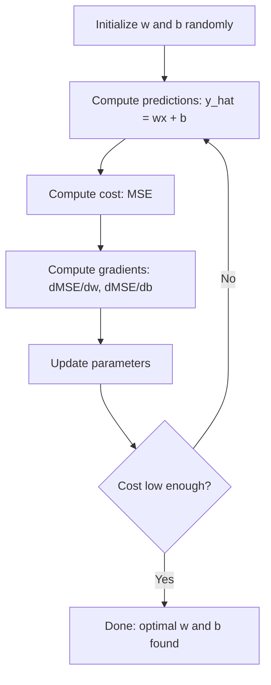

# 线性回归

> 线性回归在数据中找一条最贴近的直线。它是机器学习里的“Hello World”。

**类型：** Build
**语言：** Python
**先修课程：** 第一阶段（线性代数、微积分、优化）、第二阶段课程 1
**时长：** ~90 分钟

## 学习目标

- 从头推导均方误差的梯度下降更新公式，并实现线性回归
- 比较梯度下降与正规方程在复杂度与适用场景上的差异
- 构建带有特征标准化的多元线性回归，并解读得到的权重
- 解释岭回归（L2 正则化）如何通过惩罚大权重来抑制过拟合

## 问题

现在你有一组数据：房屋面积和对应售价。你想根据面积预测一栋新房的售价。你可以在散点图上“猜”一条线，但你需要的是一个公式。你需要一条最能贴合数据的直线，这样就能把任意面积代入后得到价格预测。

线性回归就是做这件事的。更重要的是，它把完整的机器学习训练闭环讲透了：先定义模型，再定义代价函数，再优化参数。每个机器学习算法都遵循这个模式。我们先从最简单的情况掌握它，后续你会在很多地方看到同样的结构。

它不仅适用于简单题。线性回归在生产系统里也大量使用，例如需求预测、A/B 检验分析、金融建模，以及作为各种回归任务的基线。

## 概念

### 模型

线性回归假设输入（x）与输出（y）之间是线性关系：

```
y = wx + b
```

- `w`（权重/斜率）：x 增加 1 时 y 的变化量
- `b`（偏置/截距）：x = 0 时的 y 值

对于多个输入（特征），可扩展为：

```
y = w1*x1 + w2*x2 + ... + wn*xn + b
```

也可以写成向量形式：`y = w^T * x + b`

目标是找到 w 与 b 的取值，使得预测值 y 与真实值 y 在所有训练样本上尽可能接近。

### 代价函数（均方误差）

怎么量化“尽可能接近”？你需要一个标量，把“预测错误程度”汇总起来。最常见的选择是均方误差（MSE）：

```
MSE = (1/n) * sum((y_predicted - y_actual)^2)
```

为什么要平方？有两个原因。第一，平方会放大大误差的惩罚（误差为 10 的惩罚是 100，而不是 10）；第二，平方函数在整个定义域光滑可导，优化更顺手。

代价函数会形成一张曲面。对单个权重 w 和偏置 b 来说，MSE 曲面像一个碗（凸抛物面）。碗底是 MSE 的最小点。训练就是要找到这个底部。

### 梯度下降

梯度下降通过沿着“下坡方向”逐步前进来找到碗底。



梯度告诉你两件事：每个参数该往哪个方向走、以及步幅大小。

对 y_hat = wx + b 的 MSE，梯度为：

```
dMSE/dw = (2/n) * sum((y_hat - y) * x)
dMSE/db = (2/n) * sum(y_hat - y)
```

更新规则如下：

```
w = w - learning_rate * dMSE/dw
b = b - learning_rate * dMSE/db
```

学习率控制步长。太大：会跨过最小值并发散。太小：训练会很慢。常见起始值有 0.01、0.001、0.0001。

### 正规方程（闭式解）

对线性回归来说，存在一个直接公式可以直接得到最优权重，不需要迭代：

```
w = (X^T * X)^(-1) * X^T * y
```

这个公式通过矩阵求逆一步得到答案。对于小数据集它非常有效；但在大规模数据（百万行、上千特征）下，梯度下降更常用，因为矩阵求逆在特征数上是 O(n^3)。

### 多元线性回归

有多个特征时，模型变为：

```
y = w1*x1 + w2*x2 + ... + wn*xn + b
```

逻辑仍然一致：代价函数仍是 MSE，梯度下降同时更新全部权重。唯一不同的是你拟合的是超平面，而不是一条线。

特征缩放在这里很关键。如果一个特征范围是 0~1，另一个是 0~1,000,000，梯度下降会很难收敛，因为代价曲面会拉得很长。训练前先标准化特征（减均值再除以标准差）。

### 多项式回归

如果关系不是线性的，仍可以通过构造多项式特征来用线性回归：

```
y = w1*x + w2*x^2 + w3*x^3 + b
```

这仍是“线性”回归，因为模型对权重（w1, w2, w3）是线性的，只是对 x 使用了非线性特征。

更高阶多项式能拟合更复杂的曲线，但会更容易过拟合。一个 10 点数据集上的 10 次多项式会穿过每个点，却可能在新数据上预测很差。

### 决定系数（R-Squared）

MSE 告诉你误差有多大，但它依赖 y 的量纲。R 平方（R^2）提供了与尺度无关的指标：

```
R^2 = 1 - (sum of squared residuals) / (sum of squared deviations from mean)
    = 1 - SS_res / SS_tot
```

- R^2 = 1.0：完美拟合
- R^2 = 0.0：模型效果不如每次都预测均值
- R^2 < 0.0：模型比“总是预测均值”还差

### 正则化预览（岭回归）

当特征很多时，模型可能通过赋予很大权重来过拟合。岭回归（L2 正则化）会加一个惩罚项：

```
Cost = MSE + lambda * sum(w_i^2)
```

这个惩罚项会抑制权重过大。超参数 lambda 决定权衡强度：lambda 越大，权重更小、正则化更强。这个内容将在后续课程详细讲解。现在先知道它的作用和原因。

```figure
linear-regression-fit
```

## 动手做

### 步骤 1：生成示例数据

```python
import random
import math

random.seed(42)

TRUE_W = 3.0
TRUE_B = 7.0
N_SAMPLES = 100

X = [random.uniform(0, 10) for _ in range(N_SAMPLES)]
y = [TRUE_W * x + TRUE_B + random.gauss(0, 2.0) for x in X]

print(f"Generated {N_SAMPLES} samples")
print(f"True relationship: y = {TRUE_W}x + {TRUE_B} (+ noise)")
print(f"First 5 points: {[(round(X[i], 2), round(y[i], 2)) for i in range(5)]}")
```

### 步骤 2：用梯度下降从头实现线性回归

```python
class LinearRegression:
    def __init__(self, learning_rate=0.01):
        self.w = 0.0
        self.b = 0.0
        self.lr = learning_rate
        self.cost_history = []

    def predict(self, X):
        return [self.w * x + self.b for x in X]

    def compute_cost(self, X, y):
        predictions = self.predict(X)
        n = len(y)
        cost = sum((pred - actual) ** 2 for pred, actual in zip(predictions, y)) / n
        return cost

    def compute_gradients(self, X, y):
        predictions = self.predict(X)
        n = len(y)
        dw = (2 / n) * sum((pred - actual) * x for pred, actual, x in zip(predictions, y, X))
        db = (2 / n) * sum(pred - actual for pred, actual in zip(predictions, y))
        return dw, db

    def fit(self, X, y, epochs=1000, print_every=200):
        for epoch in range(epochs):
            dw, db = self.compute_gradients(X, y)
            self.w -= self.lr * dw
            self.b -= self.lr * db
            cost = self.compute_cost(X, y)
            self.cost_history.append(cost)
            if epoch % print_every == 0:
                print(f"  Epoch {epoch:4d} | Cost: {cost:.4f} | w: {self.w:.4f} | b: {self.b:.4f}")
        return self

    def r_squared(self, X, y):
        predictions = self.predict(X)
        y_mean = sum(y) / len(y)
        ss_res = sum((actual - pred) ** 2 for actual, pred in zip(y, predictions))
        ss_tot = sum((actual - y_mean) ** 2 for actual in y)
        return 1 - (ss_res / ss_tot)


print("=== 训练线性回归（梯度下降） ===")
model = LinearRegression(learning_rate=0.005)
model.fit(X, y, epochs=1000, print_every=200)
print(f"\nLearned: y = {model.w:.4f}x + {model.b:.4f}")
print(f"True:    y = {TRUE_W}x + {TRUE_B}")
print(f"R-squared: {model.r_squared(X, y):.4f}")
```

### 步骤 3：用正规方程（闭式解）

```python
class LinearRegressionNormal:
    def __init__(self):
        self.w = 0.0
        self.b = 0.0

    def fit(self, X, y):
        n = len(X)
        x_mean = sum(X) / n
        y_mean = sum(y) / n
        numerator = sum((X[i] - x_mean) * (y[i] - y_mean) for i in range(n))
        denominator = sum((X[i] - x_mean) ** 2 for i in range(n))
        self.w = numerator / denominator
        self.b = y_mean - self.w * x_mean
        return self

    def predict(self, X):
        return [self.w * x + self.b for x in X]

    def r_squared(self, X, y):
        predictions = self.predict(X)
        y_mean = sum(y) / len(y)
        ss_res = sum((actual - pred) ** 2 for actual, pred in zip(y, predictions))
        ss_tot = sum((actual - y_mean) ** 2 for actual in y)
        return 1 - (ss_res / ss_tot)


print("\n=== 正规方程（闭式解） ===")
model_normal = LinearRegressionNormal()
model_normal.fit(X, y)
print(f"Learned: y = {model_normal.w:.4f}x + {model_normal.b:.4f}")
print(f"R-squared: {model_normal.r_squared(X, y):.4f}")
```

### 步骤 4：多元线性回归

```python
class MultipleLinearRegression:
    def __init__(self, n_features, learning_rate=0.01):
        self.weights = [0.0] * n_features
        self.bias = 0.0
        self.lr = learning_rate
        self.cost_history = []

    def predict_single(self, x):
        return sum(w * xi for w, xi in zip(self.weights, x)) + self.bias

    def predict(self, X):
        return [self.predict_single(x) for x in X]

    def compute_cost(self, X, y):
        predictions = self.predict(X)
        n = len(y)
        return sum((pred - actual) ** 2 for pred, actual in zip(predictions, y)) / n

    def fit(self, X, y, epochs=1000, print_every=200):
        n = len(y)
        n_features = len(X[0])
        for epoch in range(epochs):
            predictions = self.predict(X)
            errors = [pred - actual for pred, actual in zip(predictions, y)]
            for j in range(n_features):
                grad = (2 / n) * sum(errors[i] * X[i][j] for i in range(n))
                self.weights[j] -= self.lr * grad
            grad_b = (2 / n) * sum(errors)
            self.bias -= self.lr * grad_b
            cost = self.compute_cost(X, y)
            self.cost_history.append(cost)
            if epoch % print_every == 0:
                print(f"  Epoch {epoch:4d} | Cost: {cost:.4f}")
        return self

    def r_squared(self, X, y):
        predictions = self.predict(X)
        y_mean = sum(y) / len(y)
        ss_res = sum((actual - pred) ** 2 for actual, pred in zip(y, predictions))
        ss_tot = sum((actual - y_mean) ** 2 for actual in y)
        return 1 - (ss_res / ss_tot)


random.seed(42)
N = 100
X_multi = []
y_multi = []
for _ in range(N):
    size = random.uniform(500, 3000)
    bedrooms = random.randint(1, 5)
    age = random.uniform(0, 50)
    price = 50 * size + 10000 * bedrooms - 1000 * age + 50000 + random.gauss(0, 20000)
    X_multi.append([size, bedrooms, age])
    y_multi.append(price)


def standardize(X):
    n_features = len(X[0])
    means = [sum(X[i][j] for i in range(len(X))) / len(X) for j in range(n_features)]
    stds = []
    for j in range(n_features):
        variance = sum((X[i][j] - means[j]) ** 2 for i in range(len(X))) / len(X)
        stds.append(variance ** 0.5)
    X_scaled = []
    for i in range(len(X)):
        row = [(X[i][j] - means[j]) / stds[j] if stds[j] > 0 else 0 for j in range(n_features)]
        X_scaled.append(row)
    return X_scaled, means, stds


y_mean_val = sum(y_multi) / len(y_multi)
y_std_val = (sum((yi - y_mean_val) ** 2 for yi in y_multi) / len(y_multi)) ** 0.5
y_scaled = [(yi - y_mean_val) / y_std_val for yi in y_multi]

X_scaled, x_means, x_stds = standardize(X_multi)

print("\n=== Multiple Linear Regression (3 features) ===")
print("Features: house size, bedrooms, age")
multi_model = MultipleLinearRegression(n_features=3, learning_rate=0.01)
multi_model.fit(X_scaled, y_scaled, epochs=1000, print_every=200)

print(f"\nWeights (standardized): {[round(w, 4) for w in multi_model.weights]}")
print(f"Bias (standardized): {multi_model.bias:.4f}")
print(f"R-squared: {multi_model.r_squared(X_scaled, y_scaled):.4f}")
```

### 步骤 5：多项式回归

```python
class PolynomialRegression:
    def __init__(self, degree, learning_rate=0.01):
        self.degree = degree
        self.weights = [0.0] * degree
        self.bias = 0.0
        self.lr = learning_rate

    def make_features(self, X):
        return [[x ** (d + 1) for d in range(self.degree)] for x in X]

    def predict(self, X):
        features = self.make_features(X)
        return [sum(w * f for w, f in zip(self.weights, row)) + self.bias for row in features]

    def fit(self, X, y, epochs=1000, print_every=200):
        features = self.make_features(X)
        n = len(y)
        for epoch in range(epochs):
            predictions = [sum(w * f for w, f in zip(self.weights, row)) + self.bias for row in features]
            errors = [pred - actual for pred, actual in zip(predictions, y)]
            for j in range(self.degree):
                grad = (2 / n) * sum(errors[i] * features[i][j] for i in range(n))
                self.weights[j] -= self.lr * grad
            grad_b = (2 / n) * sum(errors)
            self.bias -= self.lr * grad_b
            if epoch % print_every == 0:
                cost = sum(e ** 2 for e in errors) / n
                print(f"  Epoch {epoch:4d} | Cost: {cost:.6f}")
        return self

    def r_squared(self, X, y):
        predictions = self.predict(X)
        y_mean = sum(y) / len(y)
        ss_res = sum((actual - pred) ** 2 for actual, pred in zip(y, predictions))
        ss_tot = sum((actual - y_mean) ** 2 for actual in y)
        return 1 - (ss_res / ss_tot)


random.seed(42)
X_poly = [x / 10.0 for x in range(0, 50)]
y_poly = [0.5 * x ** 2 - 2 * x + 3 + random.gauss(0, 1.0) for x in X_poly]

x_max = max(abs(x) for x in X_poly)
X_poly_norm = [x / x_max for x in X_poly]
y_poly_mean = sum(y_poly) / len(y_poly)
y_poly_std = (sum((yi - y_poly_mean) ** 2 for yi in y_poly) / len(y_poly)) ** 0.5
y_poly_norm = [(yi - y_poly_mean) / y_poly_std for yi in y_poly]

print("\n=== Polynomial Regression (degree 2 vs degree 5) ===")
print("True relationship: y = 0.5x^2 - 2x + 3")

print("\nDegree 2:")
poly2 = PolynomialRegression(degree=2, learning_rate=0.1)
poly2.fit(X_poly_norm, y_poly_norm, epochs=2000, print_every=500)
print(f"  R-squared: {poly2.r_squared(X_poly_norm, y_poly_norm):.4f}")

print("\nDegree 5:")
poly5 = PolynomialRegression(degree=5, learning_rate=0.1)
poly5.fit(X_poly_norm, y_poly_norm, epochs=2000, print_every=500)
print(f"  R-squared: {poly5.r_squared(X_poly_norm, y_poly_norm):.4f}")

print("\nDegree 2 fits the true curve well. Degree 5 fits training data slightly better")
print("but risks overfitting on new data.")
```

### 步骤 6：岭回归（L2 正则化）

```python
class RidgeRegression:
    def __init__(self, n_features, learning_rate=0.01, alpha=1.0):
        self.weights = [0.0] * n_features
        self.bias = 0.0
        self.lr = learning_rate
        self.alpha = alpha

    def predict_single(self, x):
        return sum(w * xi for w, xi in zip(self.weights, x)) + self.bias

    def predict(self, X):
        return [self.predict_single(x) for x in X]

    def fit(self, X, y, epochs=1000, print_every=200):
        n = len(y)
        n_features = len(X[0])
        for epoch in range(epochs):
            predictions = self.predict(X)
            errors = [pred - actual for pred, actual in zip(predictions, y)]
            mse = sum(e ** 2 for e in errors) / n
            reg_term = self.alpha * sum(w ** 2 for w in self.weights)
            cost = mse + reg_term
            for j in range(n_features):
                grad = (2 / n) * sum(errors[i] * X[i][j] for i in range(n))
                grad += 2 * self.alpha * self.weights[j]
                self.weights[j] -= self.lr * grad
            grad_b = (2 / n) * sum(errors)
            self.bias -= self.lr * grad_b
            if epoch % print_every == 0:
                print(f"  Epoch {epoch:4d} | Cost: {cost:.4f} | L2 penalty: {reg_term:.4f}")
        return self


print("\n=== Ridge Regression (L2 Regularization) ===")
print("Same data as multiple regression, with alpha=0.1")
ridge = RidgeRegression(n_features=3, learning_rate=0.01, alpha=0.1)
ridge.fit(X_scaled, y_scaled, epochs=1000, print_every=200)
print(f"\nRidge weights: {[round(w, 4) for w in ridge.weights]}")
print(f"Plain weights: {[round(w, 4) for w in multi_model.weights]}")
print("Ridge weights are smaller (shrunk toward zero) due to the L2 penalty.")
```

## 应用

现在我们再看一遍用 scikit-learn 来做实际工程里常用的方式。

```python
from sklearn.linear_model import LinearRegression as SklearnLR
from sklearn.linear_model import Ridge
from sklearn.preprocessing import PolynomialFeatures, StandardScaler
from sklearn.model_selection import train_test_split
from sklearn.metrics import mean_squared_error, r2_score
import numpy as np

np.random.seed(42)
X_sk = np.random.uniform(0, 10, (100, 1))
y_sk = 3.0 * X_sk.squeeze() + 7.0 + np.random.normal(0, 2.0, 100)

X_train, X_test, y_train, y_test = train_test_split(X_sk, y_sk, test_size=0.2, random_state=42)

lr = SklearnLR()
lr.fit(X_train, y_train)
y_pred = lr.predict(X_test)

print("=== Scikit-learn Linear Regression ===")
print(f"Coefficient (w): {lr.coef_[0]:.4f}")
print(f"Intercept (b): {lr.intercept_:.4f}")
print(f"R-squared (test): {r2_score(y_test, y_pred):.4f}")
print(f"MSE (test): {mean_squared_error(y_test, y_pred):.4f}")

poly = PolynomialFeatures(degree=2, include_bias=False)
X_poly_sk = poly.fit_transform(X_train)
X_poly_test = poly.transform(X_test)

lr_poly = SklearnLR()
lr_poly.fit(X_poly_sk, y_train)
print(f"\nPolynomial degree 2 R-squared: {r2_score(y_test, lr_poly.predict(X_poly_test)):.4f}")

scaler = StandardScaler()
X_train_scaled = scaler.fit_transform(X_train)
X_test_scaled = scaler.transform(X_test)

ridge = Ridge(alpha=1.0)
ridge.fit(X_train_scaled, y_train)
print(f"Ridge R-squared: {r2_score(y_test, ridge.predict(X_test_scaled)):.4f}")
print(f"Ridge coefficient: {ridge.coef_[0]:.4f}")
```

从头实现和 scikit-learn 的输出应当一致。不同的是，scikit-learn 会处理更多边界条件、数值稳定性和性能优化问题。工程里用库，理解原理时用从头实现。

## 输出

本节产出：
- `outputs/skill-regression.md`：一份用于选择合适回归方法的 skill

## 练习

1. 实现批量梯度下降、随机梯度下降（SGD）和小批量梯度下降，并在同一数据集上比较收敛速度。谁最快？谁最平滑？
2. 生成三次函数数据（y = ax^3 + bx^2 + cx + d + noise）。分别拟合 1、3、10 次多项式，比较训练集和测试集上的 R^2。过拟合从几阶开始明显？
3. 实现 Lasso 回归（L1 正则化：penalty = alpha * sum(|w_i|)）。在同一多特征房价数据上训练，比较哪些权重会变为 0。为什么 L1 会产生稀疏解，而 L2 不会？

## 关键词

| 术语 | 常见表述 | 实际含义 |
|------|---------|---------|
| Linear regression（线性回归） | “画一条线穿过数据” | 找到权重 w 与偏置 b，使 wx+b 与真实 y 的平方误差和最小 |
| Cost function（代价函数） | “模型有多坏” | 把参数映射为一个标量，表示预测误差，优化时要最小化 |
| Mean squared error（均方误差） | “误差平方的平均值” | (1/n) * sum((predicted - actual)^2)，对大误差惩罚更重 |
| Gradient descent（梯度下降） | “往下坡走” | 利用偏导数沿着减小代价的方向迭代更新参数 |
| Learning rate（学习率） | “步长” | 每次梯度更新中参数变化的比例 |
| Normal equation（正规方程） | “直接算出来” | 闭式解 w = (X^T X)^-1 X^T y，无需迭代 |
| R-squared（决定系数） | “拟合多好” | 模型解释的方差占比，范围从负无穷到 1.0 |
| Feature scaling（特征缩放） | “把特征放在同一量级” | 把特征变换到相近范围（如零均值、单位方差）加速收敛 |
| Regularization（正则化） | “惩罚模型复杂度” | 在代价函数中加入惩罚项，压缩权重，降低过拟合 |
| Ridge regression（岭回归） | “L2 正则化” | 对 MSE 增加 lambda * sum(w_i^2) 的线性回归 |
| Polynomial regression（多项式回归） | “用线性回归拟合曲线” | 用 (x, x^2, x^3, ...) 等多项式特征进行线性回归 |
| Overfitting（过拟合） | “记住训练集” | 模型太复杂，把训练噪声也学进去了，泛化变差 |

## 延伸阅读

- [An Introduction to Statistical Learning (ISLR)](https://www.statlearning.com/) -- 免费 PDF，第三章和第六章覆盖线性回归与正则化（带 R 示例）
- [The Elements of Statistical Learning (ESL)](https://hastie.su.domains/ElemStatLearn/) -- 免费 PDF，是 ISLR 的数学化扩展，深入讲岭回归与 Lasso
- [Stanford CS229 Lecture Notes on Linear Regression](https://cs229.stanford.edu/main_notes.pdf) -- Andrew Ng 的讲义，推导正规方程和梯度下降
- [scikit-learn LinearRegression documentation](https://scikit-learn.org/stable/modules/linear_model.html) -- LinearRegression、Ridge、Lasso、ElasticNet 的实战参考
