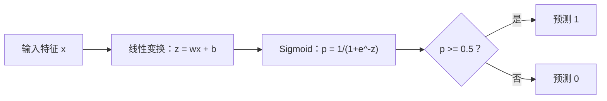
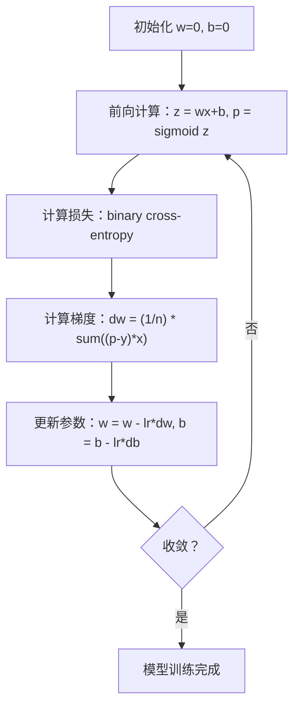

# 逻辑回归

> 逻辑回归把线性模型输出通过 sigmoid 映射到 0~1 区间，用概率形式回答分类问题。

**类型:** 构建 **语言:** Python  
**先修:** 第 2 期第 1-2 课（机器学习概览、线性回归）  
**时长:** ~90 分钟

## 学习目标

- 用 sigmoid 和二元交叉熵从零实现逻辑回归。
- 计算并解读二分类任务的精确率、召回率、F1 和混淆矩阵。
- 解释线性回归为何不适合分类任务，以及为什么二元交叉熵是凸损失。
- 扩展到 softmax，完成多分类建模并理解阈值调节带来的权衡。

## 问题背景

你想根据肿瘤大小预测是恶性还是良性。若用线性回归，模型可能输出 0.3、1.7 或 -0.5。1.7 代表“非常恶性”吗？-0.5 代表“非常良性”吗？分类任务的输出应落在 \([0,1]\) 之间并能给出明确的是/否决策。

逻辑回归解决这个问题：沿用线性回归的线性组合 \(wx+b\)，再经过 sigmoid 映射，把任意实数压缩到概率范围。通常用阈值 0.5 做决策。

这是一类工程上非常常用的算法。它名字里有 “regression”，但本质是分类模型，名字来自它使用的 logistic（sigmoid）函数。

## 核心概念

### 线性回归为何不适合分类

假设用学习时长预测是否及格（0/1）。线性回归会拟合一条直线：

```text
hours:  1   2   3   4   5   6   7   8   9   10
actual: 0   0   0   0   1   1   1   1   1   1
```

拟合结果可能在 1 小时时给出 -0.2，在 10 小时时给出 1.3。这个值不是概率，且会被离群点（比如学习 50 小时的人）严重拉偏，改变大多数样本的预测。

分类需要满足：

- 输出必须在 0 到 1 之间（概率）
- 有清晰的决策边界
- 对远离边界的离群点不应过度敏感

### Sigmoid 函数

Sigmoid 正是用于完成上面三个约束：

```text
sigmoid(z) = 1 / (1 + e^(-z))
```

性质：

- \(z\) 很大时，sigmoid(z) 趋向于 1
- \(z\) 很小时，sigmoid(z) 趋向于 0
- \(z=0\) 时，sigmoid(z)=0.5
- 值域固定在 0~1
- 处处可导且平滑

导数形式很方便：\(\sigma'(z) = \sigma(z)(1-\sigma(z))\)，利于梯度计算。

### 逻辑回归 = 线性模型 + Sigmoid

模型先算 \(z = wx + b\)，再经过 sigmoid：



输出 \(p\) 解读为 \(P(y=1|x)\)，即样本属于正类的概率。决策边界发生在 \(wx+b=0\)，此时 sigmoid 的输出是 0.5。

### 二元交叉熵损失

逻辑回归不能直接用 MSE。把 sigmoid 与 MSE 组合会导致代价函数非凸，局部最小点较多。应使用二元交叉熵（log loss）：

```text
Loss = -(1/n) * sum(y * log(p) + (1-y) * log(1-p))
```

为什么有效：

- 当 \(y=1, p\approx1\) 时，\(\log(1)=0\)，损失接近 0（预测正确）
- 当 \(y=1, p\approx0\) 时，\(\log(0)\to-\infty\)，损失很大（高置信错误）
- 当 \(y=0, p\approx0\) 时，损失接近 0（预测正确）
- 当 \(y=0, p\approx1\) 时，损失也会很大（高置信错误）

这个损失函数在逻辑回归问题上是凸的，能够保证全局最优解唯一。

### 逻辑回归中的梯度下降

二元交叉熵 + sigmoid 的梯度形式很简洁：

```text
dL/dw = (1/n) * sum((p - y) * x)
dL/db = (1/n) * sum(p - y)
```

与线性回归梯度看起来形式一致，区别在于 \(p = sigmoid(wx+b)\) 而不是 \(p=wx+b\)。非线性来自 sigmoid，而更新规则结构不变。



### 决策边界

在二维特征（两个特征）下，决策边界是：

```text
w1*x1 + w2*x2 + b = 0
```

边界一侧分类为 1，另一侧分类为 0。逻辑回归总是给出线性边界；若业务需要更复杂边界，可改用多项式特征或非线性模型。

### 用 Softmax 做多分类

二分类逻辑回归只处理两类。若有 \(k\) 类，改用 softmax：

```text
softmax(z_i) = e^(z_i) / sum(e^(z_j) for all j)
```

每类一个权重向量。模型先算每类得分 \(z_i\)，再经过 softmax 得到和为 1 的概率。概率最高者为预测类别。

损失变为分类交叉熵：

```text
Loss = -(1/n) * sum(sum(y_k * log(p_k)))
```

其中 \(y_k\) 是真值类别为 1，其它为 0（即 one-hot 编码）。

### 评估指标

仅看准确率常常不够。若数据集中负样本占 95%、正样本占 5%，一直预测负类会得到 95% 的准确率，但模型几乎没用。

**混淆矩阵**：

| | 预测为正 | 预测为负 |
|---|---|---|
| 实际为正 | 真正例（TP） | 假反例（FN） |
| 实际为负 | 假正例（FP） | 真负例（TN） |

**精确率**：被预测为正的样本里，实际正例比例。

```text
Precision = TP / (TP + FP)
```

**召回率（灵敏度）**：真实正例里，被正确识别出的比例。

```text
Recall = TP / (TP + FN)
```

**F1 值**：精确率和召回率的调和平均，兼顾两项指标。

```text
F1 = 2 * (Precision * Recall) / (Precision + Recall)
```

何时优先关注：

- **精确率**：误报代价高（垃圾邮件场景，不希望误拦正常邮件）
- **召回率**：漏报代价高（癌症筛查，不允许漏检）
- **F1**：需要单一综合指标时

```figure
logistic-sigmoid
```

## 实践

### 步骤 1：定义 sigmoid 与数据生成

```python
import random
import math

def sigmoid(z):
    z = max(-500, min(500, z))
    return 1.0 / (1.0 + math.exp(-z))


random.seed(42)
N = 200
X = []
y = []

for _ in range(N // 2):
    X.append([random.gauss(2, 1), random.gauss(2, 1)])
    y.append(0)

for _ in range(N // 2):
    X.append([random.gauss(5, 1), random.gauss(5, 1)])
    y.append(1)

combined = list(zip(X, y))
random.shuffle(combined)
X, y = zip(*combined)
X = list(X)
y = list(y)

print(f"Generated {N} samples (2 classes, 2 features)")
print(f"Class 0 center: (2, 2), Class 1 center: (5, 5)")
print(f"First 5 samples:")
for i in range(5):
    print(f"  Features: [{X[i][0]:.2f}, {X[i][1]:.2f}], Label: {y[i]}")
```

### 步骤 2：从头实现逻辑回归

```python
class LogisticRegression:
    def __init__(self, n_features, learning_rate=0.01):
        self.weights = [0.0] * n_features
        self.bias = 0.0
        self.lr = learning_rate
        self.loss_history = []

    def predict_proba(self, x):
        z = sum(w * xi for w, xi in zip(self.weights, x)) + self.bias
        return sigmoid(z)

    def predict(self, x, threshold=0.5):
        return 1 if self.predict_proba(x) >= threshold else 0

    def compute_loss(self, X, y):
        n = len(y)
        total = 0.0
        for i in range(n):
            p = self.predict_proba(X[i])
            p = max(1e-15, min(1 - 1e-15, p))
            total += y[i] * math.log(p) + (1 - y[i]) * math.log(1 - p)
        return -total / n

    def fit(self, X, y, epochs=1000, print_every=200):
        n = len(y)
        n_features = len(X[0])
        for epoch in range(epochs):
            dw = [0.0] * n_features
            db = 0.0
            for i in range(n):
                p = self.predict_proba(X[i])
                error = p - y[i]
                for j in range(n_features):
                    dw[j] += error * X[i][j]
                db += error
            for j in range(n_features):
                self.weights[j] -= self.lr * (dw[j] / n)
            self.bias -= self.lr * (db / n)
            loss = self.compute_loss(X, y)
            self.loss_history.append(loss)
            if epoch % print_every == 0:
                print(f"  Epoch {epoch:4d} | Loss: {loss:.4f} | w: [{self.weights[0]:.3f}, {self.weights[1]:.3f}] | b: {self.bias:.3f}")
        return self

    def accuracy(self, X, y):
        correct = sum(1 for i in range(len(y)) if self.predict(X[i]) == y[i])
        return correct / len(y)


split = int(0.8 * N)
X_train, X_test = X[:split], X[split:]
y_train, y_test = y[:split], y[split:]

print("\n=== Training Logistic Regression ===")
model = LogisticRegression(n_features=2, learning_rate=0.1)
model.fit(X_train, y_train, epochs=1000, print_every=200)

print(f"\nTrain accuracy: {model.accuracy(X_train, y_train):.4f}")
print(f"Test accuracy:  {model.accuracy(X_test, y_test):.4f}")
print(f"Weights: [{model.weights[0]:.4f}, {model.weights[1]:.4f}]")
print(f"Bias: {model.bias:.4f}")
```

### 步骤 3：从头实现混淆矩阵与指标

```python
class ClassificationMetrics:
    def __init__(self, y_true, y_pred):
        self.tp = sum(1 for t, p in zip(y_true, y_pred) if t == 1 and p == 1)
        self.tn = sum(1 for t, p in zip(y_true, y_pred) if t == 0 and p == 0)
        self.fp = sum(1 for t, p in zip(y_true, y_pred) if t == 0 and p == 1)
        self.fn = sum(1 for t, p in zip(y_true, y_pred) if t == 1 and p == 0)

    def accuracy(self):
        total = self.tp + self.tn + self.fp + self.fn
        return (self.tp + self.tn) / total if total > 0 else 0

    def precision(self):
        denom = self.tp + self.fp
        return self.tp / denom if denom > 0 else 0

    def recall(self):
        denom = self.tp + self.fn
        return self.tp / denom if denom > 0 else 0

    def f1(self):
        p = self.precision()
        r = self.recall()
        return 2 * p * r / (p + r) if (p + r) > 0 else 0

    def print_confusion_matrix(self):
        print(f"\n  Confusion Matrix:")
        print(f"                  Predicted")
        print(f"                  Pos   Neg")
        print(f"  Actual Pos     {self.tp:4d}  {self.fn:4d}")
        print(f"  Actual Neg     {self.fp:4d}  {self.tn:4d}")

    def print_report(self):
        self.print_confusion_matrix()
        print(f"\n  Accuracy:  {self.accuracy():.4f}")
        print(f"  Precision: {self.precision():.4f}")
        print(f"  Recall:    {self.recall():.4f}")
        print(f"  F1 Score:  {self.f1():.4f}")


y_pred_test = [model.predict(x) for x in X_test]
print("\n=== Classification Report (Test Set) ===")
metrics = ClassificationMetrics(y_test, y_pred_test)
metrics.print_report()
```

### 步骤 4：决策边界分析

```python
print("\n=== Decision Boundary ===")
w1, w2 = model.weights
b = model.bias
print(f"Decision boundary: {w1:.4f}*x1 + {w2:.4f}*x2 + {b:.4f} = 0")
if abs(w2) > 1e-10:
    print(f"Solved for x2:     x2 = {-w1/w2:.4f}*x1 + {-b/w2:.4f}")

print("\nSample predictions near the boundary:")
test_points = [
    [3.0, 3.0],
    [3.5, 3.5],
    [4.0, 4.0],
    [2.5, 2.5],
    [5.0, 5.0],
]
for point in test_points:
    prob = model.predict_proba(point)
    pred = model.predict(point)
    print(f"  [{point[0]}, {point[1]}] -> prob={prob:.4f}, class={pred}")
```

### 步骤 5：Softmax 多分类示例

```python
class SoftmaxRegression:
    def __init__(self, n_features, n_classes, learning_rate=0.01):
        self.n_features = n_features
        self.n_classes = n_classes
        self.lr = learning_rate
        self.weights = [[0.0] * n_features for _ in range(n_classes)]
        self.biases = [0.0] * n_classes

    def softmax(self, scores):
        max_score = max(scores)
        exp_scores = [math.exp(s - max_score) for s in scores]
        total = sum(exp_scores)
        return [e / total for e in exp_scores]

    def predict_proba(self, x):
        scores = [
            sum(self.weights[k][j] * x[j] for j in range(self.n_features)) + self.biases[k]
            for k in range(self.n_classes)
        ]
        return self.softmax(scores)

    def predict(self, x):
        probs = self.predict_proba(x)
        return probs.index(max(probs))

    def fit(self, X, y, epochs=1000, print_every=200):
        n = len(y)
        for epoch in range(epochs):
            grad_w = [[0.0] * self.n_features for _ in range(self.n_classes)]
            grad_b = [0.0] * self.n_classes
            total_loss = 0.0
            for i in range(n):
                probs = self.predict_proba(X[i])
                for k in range(self.n_classes):
                    target = 1.0 if y[i] == k else 0.0
                    error = probs[k] - target
                    for j in range(self.n_features):
                        grad_w[k][j] += error * X[i][j]
                    grad_b[k] += error
                true_prob = max(probs[y[i]], 1e-15)
                total_loss -= math.log(true_prob)
            for k in range(self.n_classes):
                for j in range(self.n_features):
                    self.weights[k][j] -= self.lr * (grad_w[k][j] / n)
                self.biases[k] -= self.lr * (grad_b[k] / n)
            if epoch % print_every == 0:
                print(f"  Epoch {epoch:4d} | Loss: {total_loss / n:.4f}")
        return self

    def accuracy(self, X, y):
        correct = sum(1 for i in range(len(y)) if self.predict(X[i]) == y[i])
        return correct / len(y)


random.seed(42)
X_3class = []
y_3class = []

centers = [(1, 1), (5, 1), (3, 5)]
for label, (cx, cy) in enumerate(centers):
    for _ in range(50):
        X_3class.append([random.gauss(cx, 0.8), random.gauss(cy, 0.8)])
        y_3class.append(label)

combined = list(zip(X_3class, y_3class))
random.shuffle(combined)
X_3class, y_3class = zip(*combined)
X_3class = list(X_3class)
y_3class = list(y_3class)

split_3 = int(0.8 * len(X_3class))
X_train_3 = X_3class[:split_3]
y_train_3 = y_3class[:split_3]
X_test_3 = X_3class[split_3:]
y_test_3 = y_3class[split_3:]

print("\n=== Multi-class Softmax Regression (3 classes) ===")
softmax_model = SoftmaxRegression(n_features=2, n_classes=3, learning_rate=0.1)
softmax_model.fit(X_train_3, y_train_3, epochs=1000, print_every=200)
print(f"\nTrain accuracy: {softmax_model.accuracy(X_train_3, y_train_3):.4f}")
print(f"Test accuracy:  {softmax_model.accuracy(X_test_3, y_test_3):.4f}")

print("\nSample predictions:")
for i in range(5):
    probs = softmax_model.predict_proba(X_test_3[i])
    pred = softmax_model.predict(X_test_3[i])
    print(f"  True: {y_test_3[i]}, Predicted: {pred}, Probs: [{', '.join(f'{p:.3f}' for p in probs)}]")
```

### 步骤 6：阈值调优

```python
print("\n=== Threshold Tuning ===")
print("Default threshold: 0.5. Adjusting the threshold trades precision for recall.\n")

thresholds = [0.3, 0.4, 0.5, 0.6, 0.7]
print(f"{'Threshold':>10} {'Accuracy':>10} {'Precision':>10} {'Recall':>10} {'F1':>10}")
print("-" * 52)

for t in thresholds:
    y_pred_t = [1 if model.predict_proba(x) >= t else 0 for x in X_test]
    m = ClassificationMetrics(y_test, y_pred_t)
    print(f"{t:>10.1f} {m.accuracy():>10.4f} {m.precision():>10.4f} {m.recall():>10.4f} {m.f1():>10.4f}")
```

## 应用

使用 `scikit-learn` 复现一遍流程，看看库级实现与手写实现的一致性：

```python
from sklearn.linear_model import LogisticRegression as SklearnLR
from sklearn.metrics import accuracy_score, precision_score, recall_score, f1_score
from sklearn.metrics import confusion_matrix, classification_report
from sklearn.model_selection import train_test_split
from sklearn.preprocessing import StandardScaler
import numpy as np

np.random.seed(42)
X_0 = np.random.randn(100, 2) + [2, 2]
X_1 = np.random.randn(100, 2) + [5, 5]
X_sk = np.vstack([X_0, X_1])
y_sk = np.array([0] * 100 + [1] * 100)

X_tr, X_te, y_tr, y_te = train_test_split(X_sk, y_sk, test_size=0.2, random_state=42)

scaler = StandardScaler()
X_tr_sc = scaler.fit_transform(X_tr)
X_te_sc = scaler.transform(X_te)

lr = SklearnLR()
lr.fit(X_tr_sc, y_tr)
y_pred = lr.predict(X_te_sc)

print("=== Scikit-learn Logistic Regression ===")
print(f"Accuracy:  {accuracy_score(y_te, y_pred):.4f}")
print(f"Precision: {precision_score(y_te, y_pred):.4f}")
print(f"Recall:    {recall_score(y_te, y_pred):.4f}")
print(f"F1:        {f1_score(y_te, y_pred):.4f}")
print(f"\nConfusion Matrix:\n{confusion_matrix(y_te, y_pred)}")
print(f"\nClassification Report:\n{classification_report(y_te, y_pred)}")
```

从零实现与 scikit-learn 在决策边界和指标上应当对齐。后者提供了更多求解器（如 liblinear、lbfgs、saga）、自动正则化、多分类策略（one-vs-rest、multinomial）以及更多数值稳定性优化。

## 产出

本课会产出：

- `code/logistic_regression.py`：从零实现逻辑回归，并内置指标计算

## 练习

1. 构造一个线性不可分的数据集（如同心圆）。先用逻辑回归训练并观察失败，再加入多项式特征（如 \(x_1^2\), \(x_2^2\), \(x_1x_2\)）重训，观察性能变化。
2. 给三分类 softmax 模型实现多分类混淆矩阵，计算每一类精确率和召回率，找出最难分的类别。
3. 从零构建 ROC 曲线：对阈值 0~1 取 100 个值，计算 TPR 与 FPR，并用梯形公式算 AUC。

## 关键词

| 术语 | 常见表述 | 实际含义 |
|------|----------------|----------------------|
| 逻辑回归 | “回归式分类” | 先线性变换再接 Sigmoid 的模型，输出类别概率 |
| Sigmoid 函数 | “S 型函数” | 公式为 \(1/(1+e^{-z})\)，将任意实数压到 0~1 |
| 二元交叉熵 | “Log loss” | 损失 \(-[y\log p + (1-y)\log(1-p)]\)，会对高置信错误给更重惩罚 |
| 决策边界 | “分界线” | 模型输出概率等于 0.5 的边界，左右对应不同类别 |
| Softmax | “多分类 sigmoid” | 把多个得分转成和为 1 的概率分布 |
| 精确率 | “预测正例里有多少真阳性” | \(TP/(TP+FP)\)，预测为正中真实正例占比 |
| 召回率 | “真实正例抓住了多少” | \(TP/(TP+FN)\)，真实正例中被命中的比例 |
| F1 值 | “精确率与召回率平衡指标” | \(2PR/(P+R)\) |
| 混淆矩阵 | “错误拆解表” | 显示 \(TP/TN/FP/FN\) 的统计表 |
| 阈值 | “截断点” | 概率高于该点判为正类，默认 0.5，可调整 |
| One-hot 编码 | “类别二值向量” | 用长度为 K 的向量表示类别，真实类别位置为 1，其它位置为 0 |
| 分类交叉熵 | “多分类 log loss” | 用 one-hot 标签把二元交叉熵扩展到多分类场景 |
