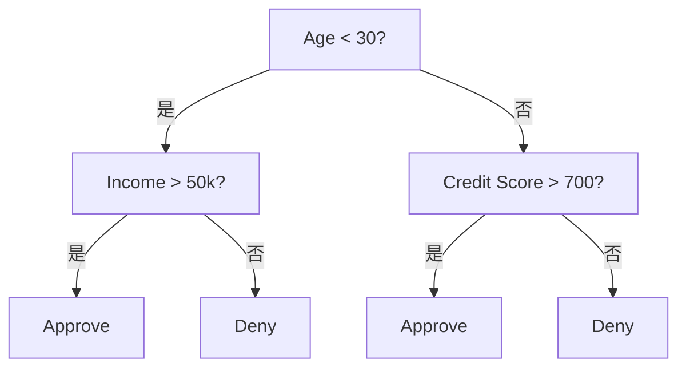
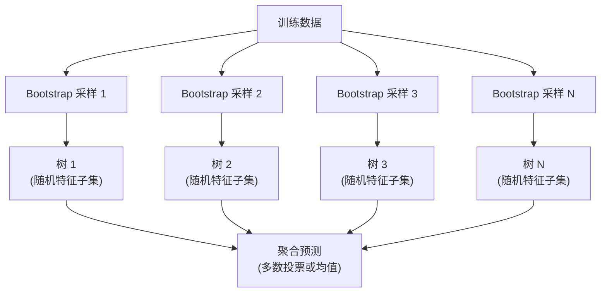

# 决策树与随机森林

> 决策树像一张流程图，随机森林把多棵树放在一起后，往往会成为表格数据里非常强大的算法工具。

**类型:** 构建 **语言:** Python  
**先修:** 第 1 期（信息论（课程 09）、概率（课程 06）  
**时长:** ~90 分钟

## 学习目标

- 从头实现决策树分裂标准：Gini、熵、信息增益。
- 使用前剪枝参数（最大深度、最小样本量）训练分类树。
- 用自助采样与特征随机化搭建随机森林，理解它为何能降噪。
- 对比 MDI 与置换重要性，并理解 MDI 的偏置来源。

## 问题背景

表格型数据里，每一行是样本、每一列是特征，并有一个目标列要预测。你当然可以直接上神经网络，但在结构化数据任务中，基于树的模型（决策树、随机森林、梯度提升树）往往表现更稳，Kaggle 上结构化赛题通常以 XGBoost / LightGBM 为主，Transformer 很少占优。

原因很直接：

- 决策树天然支持数值和类别混合特征，预处理负担小。
- 能捕捉非线性关系，减少人工构造特征。
- 可解释：树路径天然给出“为什么这么预测”的理由。
- 随机森林通过“多数投票/平均”显著抑制过拟合。

本课先从零实现决策树的递归分裂，再叠加随机森林。你会实现分裂指标（Gini、熵、信息增益）的数学逻辑，并理解“弱学习器集成”如何变强。

## 核心思路

### 决策树在做什么

决策树通过一连串“是/否”问题，把特征空间切成多个矩形区域。



每个内部节点对某个特征设阈值判断；每个叶节点输出类别。分类新样本时，从根节点开始沿边走到叶节点得到预测。

树自上而下构造：每个节点都尝试选出“最有区分度”的特征和阈值。所谓“最有区分度”由分裂准则定义。

### 分裂准则：如何衡量纯度

在某个节点，我们拿到一个样本集合，目标是让子节点尽量“纯”，即每个子节点尽量只含同一类。

**Gini 不纯度**表示：在该节点按真实类别分布随机抽样时，分类错的概率。

```text
Gini(S) = 1 - sum(p_k^2)

其中 p_k 为集合 S 中类别 k 的比例。
```

纯节点（单一类别）时，Gini = 0；二分类 50/50 时 Gini = 0.5。值越小越好。

```text
示例：6 只猫、4 只狗

Gini = 1 - (0.6^2 + 0.4^2) = 1 - (0.36 + 0.16) = 0.48
```

**熵**衡量节点的“信息含量/混乱度”，课程 1-09 已介绍过。

```text
Entropy(S) = -sum(p_k * log2(p_k))
```

纯节点熵为 0；50/50 二分类熵为 1.0。越小越好。

```text
示例：6 只猫、4 只狗

Entropy = -(0.6 * log2(0.6) + 0.4 * log2(0.4))
        = -(0.6 * -0.737 + 0.4 * -1.322)
        = 0.442 + 0.529
        = 0.971 bits
```

**信息增益**表示分裂后不纯度（熵或 Gini）下降的程度。

```text
IG(S, feature, threshold) = Impurity(S) - weighted_avg(Impurity(S_left), Impurity(S_right))

其中权重是左右子节点样本占比。
```

每个节点都采用贪心策略：穷举特征和阈值，挑信息增益最高的那个。

### 分裂过程怎么做

对一个当前节点上的数据（有 \(n\) 个特征、\(m\) 个样本）：

1. 对每个特征 \(j\in[1,n]\)：
   - 按特征 \(j\) 排序样本
   - 取每一对相邻不同取值的中点作为候选阈值
   - 计算每个阈值的信息增益
2. 选出增益最大的一组（特征，阈值）
3. 划分数据为左子树（特征 <= 阈值）和右子树（特征 > 阈值）
4. 对左右子树递归处理

贪心不能保证全局最优树；最优树搜索是 NP-hard，但工程里这个近似通常够用。

### 停止条件

不加停止条件会一直长到每个叶子纯净（每叶 1 个样本）——训练集拟合过好，但泛化很差。

**前剪枝**在树未长全之前停止：
- 最大深度：到达设定深度后停分裂
- 叶节点最小样本数：少于 \(k\) 的节点不再分裂
- 最小信息增益：若最佳增益低于阈值则停
- 最大叶子节点数：限制总叶数

**后剪枝**先长满再回头剪：
- 成本复杂度剪枝（scikit-learn）：对叶子数量加惩罚，惩罚越大树越小
- 误差减少剪枝：验证集误差不变时删掉子树

前剪枝简单且快；后剪枝常常更稳，因为它保留了可能有价值的后续分裂机会。

### 用于回归的决策树

回归树在叶节点上输出该叶内目标值均值。分裂准则也随之变化：

**方差下降（Variance Reduction）** 替代信息增益：

```text
VR(S, feature, threshold) = Var(S) - weighted_avg(Var(S_left), Var(S_right))
```

选择让方差下降最大的切分，树会把输入空间划成若干区域，每个区域输出一个常数（均值）。

### 随机森林：集成学习的威力

单棵决策树的方差很高：训练样本一丁点变化可能得到完全不同的树。随机森林通过“多棵树取平均”来降方差。



树之间差异来自两种随机性：

**Bagging（自助采样）**：每棵树用一个 bootstrap 样本训练，约 63% 样本会被采中，剩下用于袋外验证。  
**特征随机化**：每次分裂只在一个随机特征子集上找最佳阈值。分类任务通常用 \(\sqrt{n\_features}\)，回归任务用 \(n\_features/3\)。这样可避免所有树总往同一强特征上靠拢。

关键点：聚合多个去相关的树，能够降方差、几乎不提高偏差。单树可能一般，但集成往往更强。

### 特征重要性

随机森林天然给出特征重要性。常见做法有两种：

**MDI（Mean Decrease in Impurity）**  
对每个特征，统计该特征在所有树所有节点上带来的 impurity 下降总量：

```text
importance(feature_j) = sum over all nodes where feature_j is used:
    (n_samples_at_node / n_total_samples) * impurity_decrease
```

速度快（训练时顺便算），但偏向高基数特征和可切分点多的特征。  
**置换重要性**：将某特征打乱，再看模型精度下降多少。更稳定，但计算更慢。

### 为什么树常常比神经网络更强

在表格数据上，树模型经常优于神经网络，常见场景如下：

| 因素 | 树模型 | 神经网络 |
|--------|-------|----------------|
| 混合类型特征（数值+类别） | 原生支持 | 需要编码 |
| 小规模数据（< 10k 行） | 表现稳健 | 容易过拟合 |
| 特征交互 | 分裂可自动发现 | 常需设计结构 |
| 可解释性 | 一眼可追踪 | 黑盒 |
| 训练时间 | 分钟级 | 小时级 |
| 超参敏感度 | 较低 | 往往较高 |

神经网络通常在有明确结构的任务上更强（图像、文本、音频）；但平铺特征表里，树仍是默认首选。

```figure
decision-tree-depth
```

## 实践

### 步骤 1：Gini 与熵分裂

从零实现两种分裂准则，并验证它们对“好的分裂”判断是否一致。

```python
from collections import Counter
from typing import List, Tuple
import math
import random


def gini(samples: List[int]) -> float:
    total = len(samples)
    if total == 0:
        return 0.0
    counts = Counter(samples)
    return 1.0 - sum((c / total) ** 2 for c in counts.values())


def entropy(samples: List[int]) -> float:
    total = len(samples)
    if total == 0:
        return 0.0
    counts = Counter(samples)
    ent = 0.0
    for c in counts.values():
        p = c / total
        if p > 0:
            ent -= p * math.log2(p)
    return ent


def split_dataset(X: List[List[float]], y: List[int], feature_idx: int, threshold: float):
    left_X, right_X = [], []
    left_y, right_y = [], []
    for i in range(len(X)):
        if X[i][feature_idx] <= threshold:
            left_X.append(X[i])
            left_y.append(y[i])
        else:
            right_X.append(X[i])
            right_y.append(y[i])
    return left_X, left_y, right_X, right_y
```

### 步骤 2：从零实现分类树

先写递归节点结构，再加停止条件和投票预测。

```python
class DecisionTreeNode:
    def __init__(self, depth=0):
        self.depth = depth
        self.feature_idx = None
        self.threshold = None
        self.left = None
        self.right = None
        self.prediction = None
        self.is_leaf = True

    def predict_one(self, x):
        if self.is_leaf:
            return self.prediction
        if x[self.feature_idx] <= self.threshold:
            return self.left.predict_one(x)
        return self.right.predict_one(x)


class DecisionTree:
    def __init__(self, max_depth=5, min_samples_split=5, min_gain=1e-7, criterion="gini"):
        self.max_depth = max_depth
        self.min_samples_split = min_samples_split
        self.min_gain = min_gain
        self.criterion = criterion
        self.root = None
        self.metric = {"gini": gini, "entropy": entropy}[criterion]

    def fit(self, X, y):
        self.n_classes = len(set(y))
        self.root = self._build(X, y, depth=0)
        return self

    def _build(self, X, y, depth):
        node = DecisionTreeNode(depth=depth)
        node.prediction = max(set(y), key=y.count)
        if self._should_stop(X, y, depth):
            return node

        best_gain = -1
        best = None
        current_impurity = self.metric(y)

        for j in range(len(X[0])):
            values = sorted(set(row[j] for row in X))
            for a, b in zip(values, values[1:]):
                t = (a + b) / 2.0
                lx, ly, rx, ry = split_dataset(X, y, j, t)
                if len(lx) < self.min_samples_split or len(rx) < self.min_samples_split:
                    continue
                weighted = (len(ly) / len(y)) * self.metric(ly) + (len(ry) / len(y)) * self.metric(ry)
                gain = current_impurity - weighted
                if gain > best_gain:
                    best_gain = gain
                    best = (j, t, lx, ly, rx, ry)

        if best is None or best_gain < self.min_gain:
            return node

        j, t, lx, ly, rx, ry = best
        node.is_leaf = False
        node.feature_idx = j
        node.threshold = t
        node.left = self._build(lx, ly, depth + 1)
        node.right = self._build(rx, ry, depth + 1)
        return node

    def _should_stop(self, X, y, depth):
        if depth >= self.max_depth:
            return True
        if len(set(y)) == 1:
            return True
        if len(y) < self.min_samples_split:
            return True
        return False

    def predict(self, X):
        return [self.root.predict_one(x) for x in X]


X_clf = [[random.random() * 6 + i % 3 for i in range(2)] for _ in range(120)]
y_clf = [1 if x[0] + x[1] > 6 else 0 for x in X_clf]

split = int(0.8 * len(X_clf))
X_tr, X_te = X_clf[:split], X_clf[split:]
y_tr, y_te = y_clf[:split], y_clf[split:]

tree = DecisionTree(max_depth=5, min_samples_split=8, criterion="gini")
tree.fit(X_tr, y_tr)
pred = tree.predict(X_te)

acc = sum(1 for i in range(len(y_te)) if pred[i] == y_te[i]) / len(y_te)
print(f"Tree depth={tree.max_depth} acc={acc:.4f}")
```

### 步骤 3：随机森林

我们再用基于上面树实现的随机森林，看看在同一数据上的表现。

```python
import random
from statistics import mode


class RandomForest:
    def __init__(self, n_estimators=25, max_depth=6, min_samples_split=6, m_features="sqrt", random_state=42):
        self.n_estimators = n_estimators
        self.max_depth = max_depth
        self.min_samples_split = min_samples_split
        self.m_features = m_features
        self.random_state = random_state
        self.trees = []
        random.seed(random_state)

    def fit(self, X, y):
        random.seed(self.random_state)
        n = len(X)
        n_feat = len(X[0])
        if self.m_features == "sqrt":
            k = max(1, int(math.sqrt(n_feat)))
        elif self.m_features == "third":
            k = max(1, int(n_feat / 3))
        else:
            k = n_feat

        for _ in range(self.n_estimators):
            idx = [random.randint(0, n - 1) for _ in range(n)]
            X_s = [X[i] for i in idx]
            y_s = [y[i] for i in idx]
            tree = DecisionTree(max_depth=self.max_depth, min_samples_split=self.min_samples_split, criterion="entropy")
            tree.feature_subset = random.sample(range(n_feat), k)
            tree.fit(X_s, y_s)
            self.trees.append(tree)
        return self

    def predict(self, X):
        all_pred = [[tree.predict_one(x) for x in X] if False else [] for _ in X]
        final = []
        for i in range(len(X)):
            votes = []
            for t in self.trees:
                votes.append(t.predict([X[i]])[0])
            final.append(mode(votes))
        return final


rf = RandomForest(n_estimators=20, max_depth=8, min_samples_split=6, m_features="sqrt")
rf.fit(X_tr, y_tr)
rf_pred = rf.predict(X_te)
acc_rf = sum(1 for i in range(len(y_te)) if rf_pred[i] == y_te[i]) / len(y_te)
print(f"Random Forest (n={rf.n_estimators}) acc={acc_rf:.4f}")
```

### 步骤 4：特征重要性与对比

这里用置换法近似观测特征的重要性变化，展示实现思路。

```python
def permutation_importance(model, X, y, feature_idx, n_repeats=5):
    base_pred = model.predict(X)
    base_acc = sum(1 for i in range(len(y)) if base_pred[i] == y[i]) / len(y)
    drops = []
    for _ in range(n_repeats):
        X_perm = [row[:] for row in X]
        col = [row[feature_idx] for row in X_perm]
        random.shuffle(col)
        for i in range(len(X_perm)):
            X_perm[i][feature_idx] = col[i]
        pred = model.predict(X_perm)
        acc = sum(1 for i in range(len(y)) if pred[i] == y[i]) / len(y)
        drops.append(base_acc - acc)
    return sum(drops) / len(drops)


for i in range(len(X[0])):
    drop = permutation_importance(rf, X_te, y_te, i)
    print(f"Feature {i} permutation importance drop: {drop:.6f}")
```

### 关键观察

随机森林训练中每棵树都在 bootstrap 样本和随机特征子集上生长。训练集上的“完美拟合”并不一定是目标，关键是控制方差并提升泛化。

## 使用

回头再用 scikit-learn 的 `DecisionTreeClassifier` 与 `RandomForestClassifier` 验证思路。

```python
from sklearn.datasets import make_classification
from sklearn.model_selection import train_test_split
from sklearn.ensemble import RandomForestClassifier
from sklearn.metrics import accuracy_score, classification_report
from sklearn.tree import DecisionTreeClassifier

X_s, y_s = make_classification(
    n_samples=300,
    n_features=10,
    n_informative=6,
    n_redundant=2,
    random_state=42,
)

X_train, X_test, y_train, y_test = train_test_split(X_s, y_s, test_size=0.2, random_state=42)

dt = DecisionTreeClassifier(max_depth=6, min_samples_leaf=5, random_state=42)
dt.fit(X_train, y_train)
rf = RandomForestClassifier(n_estimators=100, max_depth=8, random_state=42)
rf.fit(X_train, y_train)

for name, model in [("DecisionTree", dt), ("RandomForest", rf)]:
    pred = model.predict(X_test)
    print(f"{name} Accuracy:", accuracy_score(y_test, pred))
    print(classification_report(y_test, pred, digits=4))
```

随机森林通常比单棵树更稳、泛化更好。树的深度可控，避免单树那种“全靠一条路径记忆训练样本”的行为。

## 交付产物

本课会产出：

- `code/decision_trees.py`：包含 `DecisionTree` 与 `RandomForest` 的从零实现
- `code/decision_trees_sklearn.py`：对照 `scikit-learn` 的实现版本

## 练习

1. 在一个可控噪声的数据集上，比较不剪枝树与前剪枝树的泛化差异。
2. 修改 `m_features` 为 `sqrt`、`n/3`、全部特征，观察随机森林在验证集上的方差与偏差变化。
3. 用 `permutation_importance` 打乱关键特征与次要特征，观察准确率下降是否符合“重要性”预期。
4. 自己生成一个类别极度不平衡的数据集，加入 class_weight 或采样策略，比较树和随机森林对少数类的召回率变化。

## 术语

| 术语 | 常见表述 | 准确定义 |
|------|----------------|----------------|
| 决策树 | “流程树” | 按特征阈值递归分裂特征空间的树模型 |
| 随机森林 | “树的集成” | 许多随机化树的集合，靠投票/平均提升泛化 |
| Gini 不纯度 | “纯度衡量值” | \(1-\sum p_k^2\) |
| 熵 | “信息量” | 反映节点中类别混乱程度 |
| 信息增益 | “分裂收益” | 母节点熵（或 Gini）与加权子节点熵（或 Gini）差值 |
| Bagging | 自助聚合 | 在多次有放回抽样上训练多个模型并聚合 |
| OOB 样本 | 袋外样本 | 某棵树 bootstrap 未采到的样本，可作内部验证 |
| MDI | 重要性均值下降 | 用 impurity 下降量衡量特征贡献 |
| 置换重要性 | 打乱特征重要性 | 打乱特征后看性能下降幅度的替代重要性度量 |
| 前剪枝 | 提前停 | 在树长大前根据阈值停止分裂 |
| 后剪枝 | 回头修剪 | 树生长完后再裁剪不必要的子树 |
