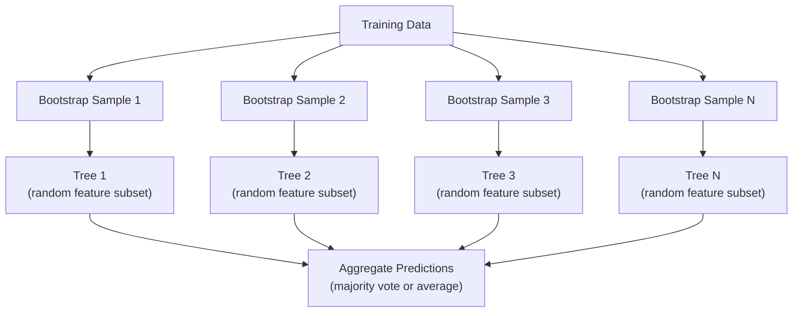

# 决策树与随机森林

> 决策树就像一张流程图。但把很多棵树放在一起，就是机器学习里最强的工具之一。

**类型:** 构建
**语言:** Python
**先修:** 第 1 阶段（信息论第 09 课、概率第 06 课）
**时长:** ~90 分钟

## 学习目标

- 从零实现 Gini 不纯度、熵和信息增益，找出最优的决策树分裂
- 从零构建带前剪枝控制的决策树分类器（最大深度、最小样本数）
- 使用自助采样和特征随机化搭建随机森林，并解释它为什么能降方差
- 对比 MDI 特征重要性与置换重要性，并识别 MDI 的偏置来源

## 问题是什么

你手里有表格数据。每一行是样本，每一列是特征，还有一列是你想预测的目标。你当然可以直接把神经网络扔上去。但在表格数据上，树模型（决策树、随机森林、梯度提升树）通常更强。Kaggle 上的结构化数据比赛，也往往是 XGBoost 和 LightGBM 的主场，而不是 Transformer。

为什么？树可以原生处理数值特征和类别特征，不需要额外预处理。树可以直接拟合非线性关系，不依赖特征工程。树还很可解释：你可以沿着路径看清楚模型为什么会做出这个预测。随机森林则通过对很多棵树取平均，在中等规模数据上非常抗过拟合。

这一课会先从递归分裂开始，从零实现决策树，再在此基础上搭建随机森林。你会实现分裂准则背后的数学逻辑（Gini 不纯度、熵、信息增益），并理解为什么一组弱学习器能组合成强模型。

## 核心概念

### 决策树在做什么

决策树通过一连串“是/否”问题，把特征空间切成多个矩形区域。


每个内部节点都会对某个特征做阈值判断；每个叶节点都会输出一个预测。分类新样本时，从根节点开始一路走到叶子，最终得到结果。

树是自上而下构建的：在每个节点，都会挑出最能把数据分开的特征和阈值。“最能分开”由分裂准则来定义。

### 分裂准则：衡量不纯度

在某个节点上，我们有一批样本。目标是把它们分成更“纯”的子节点，也就是让每个子节点尽量只包含一类样本。

**Gini 不纯度**衡量的是：如果按照该节点里的类别分布随机抽样并贴标签，样本被分错的概率有多大。

```text
Gini(S) = 1 - sum(p_k^2)

where p_k is the proportion of class k in set S.
```

纯节点（全是同一类）时，Gini = 0。二分类且比例 50/50 时，Gini = 0.5。越小越好。

```text
Example: 6 cats, 4 dogs

Gini = 1 - (0.6^2 + 0.4^2) = 1 - (0.36 + 0.16) = 0.48
```

**熵**衡量的是节点里的信息含量和混乱程度。第 1 阶段第 09 课已经讲过。

```text
Entropy(S) = -sum(p_k * log2(p_k))
```

纯节点的熵为 0。50/50 的二分类节点熵为 1.0。越小越好。

```text
Example: 6 cats, 4 dogs

Entropy = -(0.6 * log2(0.6) + 0.4 * log2(0.4))
        = -(0.6 * -0.737 + 0.4 * -1.322)
        = 0.442 + 0.529
        = 0.971 bits
```

**信息增益**表示一次分裂后，不纯度下降了多少（可以是熵，也可以是 Gini）。

```text
IG(S, feature, threshold) = Impurity(S) - weighted_avg(Impurity(S_left), Impurity(S_right))

where the weights are the proportions of samples in each child.
```

每个节点都采用贪心策略：把所有特征、所有可能阈值都试一遍，选信息增益最大的那个。

### 分裂是怎么工作的

对于当前节点上的一个数据集，如果有 n 个特征、m 个样本：

1. 对每个特征 j（j = 1 到 n）：
   - 按特征 j 对样本排序
   - 把相邻不同取值之间的中点都试一遍，作为候选阈值
   - 计算每个阈值的信息增益
2. 选出信息增益最高的特征和阈值
3. 把数据分成左子树（特征 <= 阈值）和右子树（特征 > 阈值）
4. 对每个子节点递归执行

这种贪心方法不能保证全局最优树。寻找最优决策树是 NP-hard 问题。不过在实践里，贪心分裂通常已经足够好。

### 停止条件

如果不加停止条件，树会一直长到每个叶子都纯净为止（每个叶子只剩一个样本）。这会把训练集记得死死的，但泛化会很差。

**前剪枝**会在树长满之前停下来：
- 最大深度：当树达到设定深度时停止分裂
- 每个叶子的最小样本数：如果节点样本少于 k，就不再继续分裂
- 最小信息增益：如果最佳分裂带来的改进低于阈值，就停止
- 最大叶子数：限制总叶子数量

**后剪枝**先把整棵树长出来，再往回裁：
- 代价复杂度剪枝（scikit-learn 采用）：给叶子数量加惩罚项，惩罚越大树越小
- 简化误差剪枝：如果删掉一个子树后验证集误差没有变差，就删掉它

前剪枝更简单也更快。后剪枝常常更好，因为它不会太早停止那些本来可能继续长出有用分裂的节点。

### 回归树

在回归任务里，叶节点输出的是该叶里目标值的平均数。分裂准则也要改。

**方差下降**取代信息增益：

```text
VR(S, feature, threshold) = Var(S) - weighted_avg(Var(S_left), Var(S_right))
```

选择让方差下降最大的分裂。树会把输入空间切成多个区域，并在每个区域输出一个常数，也就是均值。

### 随机森林：集成的力量

单棵决策树的方差很高。数据轻微变化一下，树的形状就可能完全不同。随机森林通过对很多棵树取平均来解决这个问题。



让树彼此不同的随机性主要来自两处：

**Bagging（自助聚合）：** 每棵树都在一个 bootstrap 样本上训练，也就是从训练集里有放回地随机抽样。每次 bootstrap 大约会覆盖原始样本的 63%，剩下的样本就是袋外样本，可以拿来验证。

**特征随机化：** 每次分裂时，只在一个随机特征子集里找最优切分。分类任务默认是 sqrt(n_features)，回归任务默认是 n_features/3。这样可以避免所有树都总盯着同一个最强特征。

核心结论是：对很多彼此去相关的树取平均，可以显著降低方差，而不会明显增加偏差。单棵树可能一般，但集成结果会很强。

### 特征重要性

随机森林天然能给出特征重要性。最常见的方法是：

**MDI（Mean Decrease in Impurity，平均不纯度下降）：** 对每个特征，统计它在所有树、所有节点里带来的不纯度下降总量。能在更早分裂中带来更大不纯度下降的特征，重要性更高。

```text
importance(feature_j) = sum over all nodes where feature_j is used:
    (n_samples_at_node / n_total_samples) * impurity_decrease
```

它速度很快（训练时顺手就能算），但会偏向高基数特征和可切分点很多的特征。

**置换重要性**是另一种方法：把某个特征打乱，再观察模型准确率下降了多少。更可靠，但计算更慢。

### 为什么树经常比神经网络更强

在表格数据上，树和随机森林经常比神经网络更强，原因有很多：

| 因素 | 树 | 神经网络 |
|--------|-------|----------------|
| 混合类型特征（数值 + 类别） | 原生支持 | 需要编码 |
| 小数据集（< 10k 行） | 表现好 | 容易过拟合 |
| 特征交互 | 靠分裂自动发现 | 往往需要设计结构 |
| 可解释性 | 完全透明 | 黑盒 |
| 训练时间 | 分钟级 | 小时级 |
| 超参数敏感性 | 较低 | 较高 |

当数据具有空间结构或序列结构时，神经网络更有优势，比如图像、文本、音频。但如果只是平铺的特征表，树通常是默认首选。

```figure
decision-tree-depth
```

## 动手实现

### 第 1 步：Gini 不纯度和熵

从零实现这两个分裂准则，并验证它们对“好分裂”的判断是否一致。

```python
import math

def gini_impurity(labels):
    n = len(labels)
    if n == 0:
        return 0.0
    counts = {}
    for label in labels:
        counts[label] = counts.get(label, 0) + 1
    return 1.0 - sum((c / n) ** 2 for c in counts.values())

def entropy(labels):
    n = len(labels)
    if n == 0:
        return 0.0
    counts = {}
    for label in labels:
        counts[label] = counts.get(label, 0) + 1
    return -sum(
        (c / n) * math.log2(c / n) for c in counts.values() if c > 0
    )
```

### 第 2 步：寻找最佳分裂

尝试每个特征和每个阈值，返回信息增益最高的那个。

```python
def information_gain(parent_labels, left_labels, right_labels, criterion="gini"):
    measure = gini_impurity if criterion == "gini" else entropy
    n = len(parent_labels)
    n_left = len(left_labels)
    n_right = len(right_labels)
    if n_left == 0 or n_right == 0:
        return 0.0
    parent_impurity = measure(parent_labels)
    child_impurity = (
        (n_left / n) * measure(left_labels) +
        (n_right / n) * measure(right_labels)
    )
    return parent_impurity - child_impurity
```

### 第 3 步：构建 `DecisionTree` 类

实现递归分裂、预测和特征重要性跟踪。

```python
class DecisionTree:
    def __init__(self, max_depth=None, min_samples_split=2,
                 min_samples_leaf=1, criterion="gini",
                 max_features=None):
        self.max_depth = max_depth
        self.min_samples_split = min_samples_split
        self.min_samples_leaf = min_samples_leaf
        self.criterion = criterion
        self.max_features = max_features
        self.tree = None
        self.feature_importances_ = None

    def fit(self, X, y):
        self.n_features = len(X[0])
        self.feature_importances_ = [0.0] * self.n_features
        self.n_samples = len(X)
        self.tree = self._build(X, y, depth=0)
        total = sum(self.feature_importances_)
        if total > 0:
            self.feature_importances_ = [
                fi / total for fi in self.feature_importances_
            ]

    def predict(self, X):
        return [self._predict_one(x, self.tree) for x in X]
```

### 第 4 步：构建 `RandomForest` 类

实现 bootstrap 采样、特征随机化和多数投票。

```python
class RandomForest:
    def __init__(self, n_trees=100, max_depth=None,
                 min_samples_split=2, max_features="sqrt",
                 criterion="gini"):
        self.n_trees = n_trees
        self.max_depth = max_depth
        self.min_samples_split = min_samples_split
        self.max_features = max_features
        self.criterion = criterion
        self.trees = []

    def fit(self, X, y):
        n = len(X)
        for _ in range(self.n_trees):
            indices = [random.randint(0, n - 1) for _ in range(n)]
            X_boot = [X[i] for i in indices]
            y_boot = [y[i] for i in indices]
            tree = DecisionTree(
                max_depth=self.max_depth,
                min_samples_split=self.min_samples_split,
                max_features=self.max_features,
                criterion=self.criterion,
            )
            tree.fit(X_boot, y_boot)
            self.trees.append(tree)

    def predict(self, X):
        all_preds = [tree.predict(X) for tree in self.trees]
        predictions = []
        for i in range(len(X)):
            votes = {}
            for preds in all_preds:
                v = preds[i]
                votes[v] = votes.get(v, 0) + 1
            predictions.append(max(votes, key=votes.get))
        return predictions
```

完整实现和辅助方法都在 `code/trees.py` 中。

## 用起来

用 scikit-learn 训练随机森林只要三行：

```python
from sklearn.ensemble import RandomForestClassifier
from sklearn.datasets import load_iris
from sklearn.model_selection import train_test_split

X, y = load_iris(return_X_y=True)
X_train, X_test, y_train, y_test = train_test_split(X, y, random_state=42)

rf = RandomForestClassifier(n_estimators=100, random_state=42)
rf.fit(X_train, y_train)
print(f"Accuracy: {rf.score(X_test, y_test):.4f}")
print(f"Feature importances: {rf.feature_importances_}")
```

实际工程里，梯度提升树（XGBoost、LightGBM、CatBoost）经常比随机森林更强，因为它们是顺序建树，每棵树都在修正前一棵树的错误。但随机森林更不容易配错参数，几乎不需要调参。

## 上线交付

本课产出 `outputs/prompt-tree-interpreter.md`，这是一个用于向业务方解释决策树分裂的 prompt。把训练好的树结构（深度、特征、分裂阈值、准确率）喂给它，它会把模型翻译成自然语言规则，排序特征重要性，标出过拟合或数据泄漏风险，并给出下一步建议。只要你需要向不看代码的人解释树模型，就可以用它。

## 练习

1. 在一个 2D、3 分类数据集上训练单棵决策树。手动追踪每次分裂，并画出矩形决策边界。对比 max_depth=2 和 max_depth=10 时边界的差异。

2. 为回归树实现方差下降分裂。生成 200 个点的 y = sin(x) + noise 数据，并拟合你的回归树。把树的分段常数预测和真实曲线画在一起。

3. 分别构建包含 1、5、10、50、200 棵树的随机森林。画出训练准确率和测试准确率随树数变化的曲线。观察测试准确率会进入平台期，但不会明显下降（随机森林抗过拟合）。

4. 在 5 个不同数据集上比较 Gini 不纯度和熵作为分裂准则的差异。衡量准确率和树深度。多数情况下，两者结果几乎一样。解释为什么。

5. 实现置换重要性。把它和 MDI 在一个“某个特征是高基数随机噪声”的数据集上对比。MDI 往往会把这个噪声特征排得很高，而置换重要性不会。

## 关键术语

| Term | What people say | What it actually means |
|------|----------------|----------------------|
| Decision tree | "A flowchart for predictions" | 一种模型，通过学习一串 if/else 分裂，把特征空间切成多个矩形区域 |
| Gini impurity | "How mixed the node is" | 节点中随机抽一个样本并按节点分布分类时被分错的概率。0 表示纯节点，0.5 是二分类下的最大不纯度 |
| Entropy | "The disorder in a node" | 节点中的信息量。0 表示纯节点，1.0 是二分类下的最大不确定性，来自信息论 |
| Information gain | "How good a split is" | 一次分裂后不纯度下降多少。是选择分裂的贪心准则 |
| Pre-pruning | "Stop the tree early" | 通过设置最大深度、最小样本数或最小增益阈值，提前停止树的生长 |
| Post-pruning | "Trim the tree after" | 先长满整棵树，再删掉那些无法提升验证集表现的子树 |
| Bagging | "Train on random subsets" | Bootstrap aggregating。对不同的随机有放回样本训练每个模型 |
| Random forest | "A bunch of trees" | 决策树集成；每棵树都在 bootstrap 样本上训练，并且每次分裂时只看随机特征子集 |
| Feature importance (MDI) | "Which features matter" | 每个特征在所有树和节点里贡献的不纯度下降总量 |
| Permutation importance | "Shuffle and check" | 把某个特征随机打乱后准确率下降多少；对噪声特征比 MDI 更可靠 |
| Variance reduction | "The regression version of info gain" | 回归树版的信息增益，选择能最大程度降低目标方差的分裂 |
| Bootstrap sample | "Random sample with repeats" | 从原始数据集中有放回抽样得到的随机样本，样本数相同但有重复 |

## 延伸阅读

- [Breiman: Random Forests (2001)](https://link.springer.com/article/10.1023/A:1010933404324) - 原始随机森林论文
- [Grinsztajn et al.: Why do tree-based models still outperform deep learning on tabular data? (2022)](https://arxiv.org/abs/2207.08815) - 表格任务上树模型与神经网络的严谨对比
- [scikit-learn Decision Trees documentation](https://scikit-learn.org/stable/modules/tree.html) - 带可视化工具的实用指南
- [XGBoost: A Scalable Tree Boosting System (Chen & Guestrin, 2016)](https://arxiv.org/abs/1603.02754) - Kaggle 里很强势的梯度提升论文
