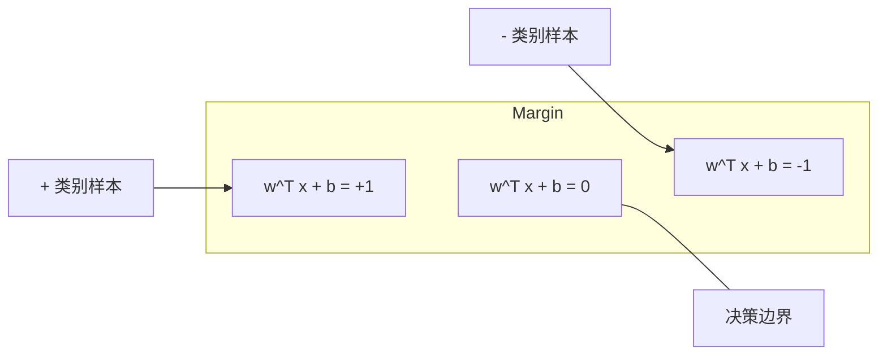
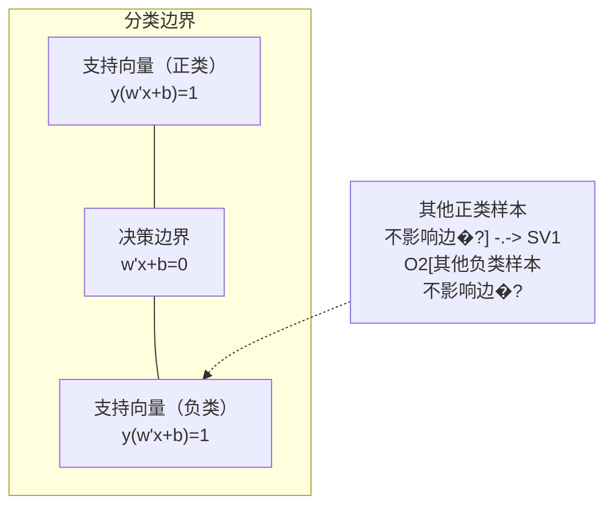

# 支持向量�?
> 核心思路很直接：在两类之间寻找“最宽的过街道”�?
**类型:** 构建 **语言:** Python  
**先修:** �?1 期（课程 08 优化�?4 范数与距离�?8 凸优化）  
**时长:** ~90 分钟

## 学习目标

- 用铰链损失（hinge loss）和原始形式的梯度下降从零实现线�?SVM�?- 理解最大间隔原理，找出支持向量�?- 对比线性、多项式�?RBF 核，并解释核技巧如何避免显式高维映射�?- 理解参数 C 在“间隔宽�?vs 误分类率”之间的权衡�?
## 问题背景

你有两类样本，要画一条线（或高维超平面）把它们分开。可行的分割线有无数条，关键问题是：该选哪一条？

答案是“间隔最大的那一条”。间隔是决策边界到两侧最近样本点的距离。间隔越宽，模型通常越自信，泛化也更稳�?
这个直觉就是支持向量机（SVM）。它�?ML 里最有数学美感的一类算法之一。深度学习流行前，SVM 常是分类主力；在小样本、高维、需要可解释理论保证的场景今天仍然很有价值�?
它和前置课程关系紧密：优化部分是凸问题（课程 18），间隔用范数衡量（课程 14），核技巧基于内积在高维特征空间做非线性分割�?
## 核心概念

### 最大间隔分类器

对可线性分割数据，标签 \(y_i\in\{-1,+1\}\)，特征向�?\(x_i\)，目标是找一个超平面 \(w^Tx+b=0\)�?
点到超平面的距离为：

```text
distance = |w^T x_i + b| / ||w||
```

当点分类正确时，�?\(y_i(w^Tx_i+b)>0\)。两侧最近点到边界的距离之和即为间隔（对应几何上两条平行边界之间的宽度）�?


标准形式可写为：

```text
maximize    2 / ||w||     （间隔宽度）
subject to  y_i * (w^T x_i + b) >= 1  对所�?i
```

等价地写成最小化 \(\|w\|^2\) 更易求解�?
```text
minimize    (1/2) ||w||^2
subject to  y_i * (w^T x_i + b) >= 1  对所�?i
```

这是一个凸二次规划问题，存在唯一全局解。满�?\(y_i(w^Tx_i+b)=1\) 的点落在“支持向量”边界上。只有这些点决定了边界；你只要改动或删掉非支持向量点，决策边界基本不变�?
### 支持向量：关键少�?


多数训练点对边界无影响，只有支持向量关键。预测时也正因此更省内存——不必保存全部训练样本，只需决策上真正起作用的点�?
支持向量的数量与泛化能力有关：支持向量越少，通常说明模型边界越稳定�?
### 软间隔：�?C 处理噪声

真实数据往往不可完全线性分割，样本可能落在错误侧或间隔内部。软间隔通过松弛变量来允许这种违反�?
```text
minimize    (1/2) ||w||^2 + C * sum(xi_i)
subject to  y_i * (w^T x_i + b) >= 1 - xi_i
            xi_i >= 0   (对全�?i)
```

\(\xi_i\) 表示�?\(i\) 违反间隔的程度。C 的作用是权衡�?
| C �?| 行为 |
|---|---|
| �?C | 严惩违反，间隔偏窄，误分类少，易过拟�?|
| �?C | 允许更多违反，间隔偏宽，误分类多，易欠拟�?|

从正则化角度看：C 越大，等价正则化越弱；C 越小，正则化越强�?
### Hinge loss：SVM 的损失函�?
软间隔形式可改写为无约束优化�?
```text
minimize    (1/2) ||w||^2 + C * sum(max(0, 1 - y_i * (w^T x_i + b)))
```

\(max(0, 1 - y_i f(x_i))\) 就是铰链损失。样本在正确分类且超出间隔时，损失为 0；落在间隔内或误分类时，损失线性增长�?
```text
单点�?hinge loss�?
loss
  |
  | \
  |  \
  |   \
  |    \
  |     \_______________
  |
  +-----|-----|-------->  y * f(x)
       0     1

�?y*f(x) >= 1 �?loss �?0（分类正确且在间隔外）；
�?y*f(x) < 1 时线性惩罚�?```

对比 logistic loss（逻辑回归）：

```text
Hinge:     max(0, 1 - y*f(x))          在边界处是硬截断
Logistic:  log(1 + exp(-y*f(x)))        平滑，不会严格归�?```

Hinge loss 更稀疏：只有支持向量对决策有非零贡献；逻辑回归所有点都会参与更新。故在预测阶段，SVM 更偏向内存友好�?
### 用梯度下降训练线�?SVM

你可以用原始形式直接对铰链损�?+ L2 正则进行梯度下降，不必解受约�?QP�?
```text
L(w, b) = (lambda/2) * ||w||^2 + (1/n) * sum(max(0, 1 - y_i * (w^T x_i + b)))

�?w 的梯度：
  �?y_i * (w^T x_i + b) >= 1�?dL/dw = lambda * w
  �?y_i * (w^T x_i + b) < 1�? dL/dw = lambda * w - y_i * x_i

�?b 的梯度：
  �?y_i * (w^T x_i + b) >= 1�?dL/db = 0
  �?y_i * (w^T x_i + b) < 1�? dL/db = -y_i
```

这就是原始形式（primal）视角，每轮复杂度为 \(O(n \times d)\)。对于文本等高维稀疏数据，通常很快�?
### 对偶形式与核技�?
SVM 的拉格朗日对偶形式（课程 1 �?KKT）为�?
```text
maximize    sum(alpha_i) - (1/2) * sum_ij(alpha_i * alpha_j * y_i * y_j * (x_i · x_j))
subject to  0 <= alpha_i <= C
            sum(alpha_i * y_i) = 0
```

对偶问题只依赖样本间内积 \(x_i\cdot x_j\)。这就是关键：把每个内积替换为核函数 \(K(x_i,x_j)\)，就能在不显式构造高维映射的前提下学习非线性边界�?
```text
线性核:      K(x, z) = x · z
多项式核:    K(x, z) = (x · z + c)^d
RBF（高斯）: K(x, z) = exp(-gamma * ||x - z||^2)
```

RBF 将数据映射到无限维空间。输入空间里越近的点，核值越接近 1；越远越接近 0。它能拟合非常平滑的复杂边界�?
```mermaid
graph LR
    subgraph "输入空间（线性不可分�?
        A["2D 数据�?br>圆形边界"]
    end
    subgraph "特征空间（线性可分）"
        B["高维后数据点<br>线性边�?]
    end
    A -->|"核技�?br>K(x,z)=phi(x)·phi(z)"| B
```

核技巧的优势在于：不需要显式算 \(\phi(x)\)，就能拿到高维空间里的内积。对�?\(D\) 维数据，多项式核在显式展开下可能是 \(O(D^d)\) 维特征空间，�?\(K(x,z)\) 可在 \(O(D)\) 时间算出�?
### 支持向量回归（SVR�?
SVR 不再找边界，而是拟合一条在样本附近的“\(\epsilon\)-管道”。落在管道内损失�?0，超出管道则线性惩罚�?
```text
minimize    (1/2) ||w||^2 + C * sum(xi_i + xi_i*)
subject to  y_i - (w^T x_i + b) <= epsilon + xi_i
            (w^T x_i + b) - y_i <= epsilon + xi_i*
            xi_i, xi_i* >= 0
```

\(\epsilon\) 决定管道宽度。宽管道带来更平滑、支持向量更少；窄管道则拟合更紧，但支持向量更多�?
### 深度学习为何压过 SVM（以�?SVM 仍会赢的情况�?
SVM 从上世纪 90 年代�?2010 年前后是主力。深度学习后来在若干方面更占优：

| 因素 | SVM | 深度学习 |
|---|---|---|
| 特征工程 | 需要手工设�?| 自动学习 |
| 可扩展�?| 核方法多�?\(O(n^2)\sim O(n^3)\) | SGD 每轮可接近线�?|
| 图像/文本/音频 | 往往需手工特征 | 可直接从原始数据学习 |
| 大规模数据（>100k�?| 训练�?| 更容易扩�?|
| GPU 加�?| 收益有限 | 可显著加�?|

SVM 依然强的场景�?- 小样本（几百到几千）
- 高维稀疏数据（�?TF-IDF 文本特征�?- 需要数学可解释性（间隔边界、泛化上界）
- 训练预算非常受限（线�?SVM 非常快）
- 二分类且边界结构清晰
- 异常检测（one-class SVM�?
```figure
svm-margin
```

## 实践

### 步骤 1：铰链损失与梯度

先写一个批量版�?hinge loss 和梯度基础�?
```python
def hinge_loss(X, y, w, b):
    n = len(X)
    total_loss = 0.0
    for i in range(n):
        margin = y[i] * (dot(w, X[i]) + b)
        total_loss += max(0.0, 1.0 - margin)
    return total_loss / n
```

### 步骤 2：用梯度下降训练线�?SVM

不依�?QP 求解器，直接用正则化 hinge loss 最小化训练�?
```python
class LinearSVM:
    def __init__(self, lr=0.001, lambda_param=0.01, n_epochs=1000):
        self.lr = lr
        self.lambda_param = lambda_param
        self.n_epochs = n_epochs
        self.w = None
        self.b = 0.0

    def fit(self, X, y):
        n_features = len(X[0])
        self.w = [0.0] * n_features
        self.b = 0.0

        for epoch in range(self.n_epochs):
            for i in range(len(X)):
                margin = y[i] * (dot(self.w, X[i]) + self.b)
                if margin >= 1:
                    self.w = [wj - self.lr * self.lambda_param * wj
                              for wj in self.w]
                else:
                    self.w = [wj - self.lr * (self.lambda_param * wj - y[i] * X[i][j])
                              for j, wj in enumerate(self.w)]
                    self.b -= self.lr * (-y[i])

    def predict(self, X):
        return [1 if dot(self.w, x) + self.b >= 0 else -1 for x in X]
```

### 步骤 3：核函数实现

实现线性核、多项式核、RBF 核�?
```python
def linear_kernel(x, z):
    return dot(x, z)

def polynomial_kernel(x, z, degree=3, c=1.0):
    return (dot(x, z) + c) ** degree

def rbf_kernel(x, z, gamma=0.5):
    diff = [xi - zi for xi, zi in zip(x, z)]
    return math.exp(-gamma * dot(diff, diff))
```

### 步骤 4：识别支持向量与间隔宽度

训练后找出支持向量，估计间隔�?
```python
def find_support_vectors(X, y, w, b, tol=1e-3):
    support_vectors = []
    for i in range(len(X)):
        margin = y[i] * (dot(w, X[i]) + b)
        if abs(margin - 1.0) < tol:
            support_vectors.append(i)
    return support_vectors
```

完整可运行版本见 `code/svm.py`�?
## 应用

下面�?`scikit-learn` 的等价写法�?
```python
from sklearn.svm import SVC, LinearSVC, SVR
from sklearn.preprocessing import StandardScaler
from sklearn.pipeline import Pipeline

clf = Pipeline([
    ("scaler", StandardScaler()),
    ("svm", SVC(kernel="rbf", C=1.0, gamma="scale")),
])
clf.fit(X_train, y_train)
print(f"׼ȷ�ʣ�{clf.score(X_test, y_test):.4f}")
print(f"֧����������{clf['svm'].n_support_}")
```

关键提醒：训�?SVM 前通常要先标准化特征。SVM 对特征量纲非常敏感，间隔�?\(\|w\|\) 强耦合，未归一化会改变几何结构�?
大规模数据上，用 `LinearSVC`（原始形式，单次�?\(O(n)\)）通常�?`SVC`（对偶形式，常见 \(O(n^2)\sim O(n^3)\)）更合适�?
```python
from sklearn.svm import LinearSVC

clf = Pipeline([
    ("scaler", StandardScaler()),
    ("svm", LinearSVC(C=1.0, max_iter=10000)),
])
```

## 练习

1. 生成二维可线性分割数据，用自实现 LinearSVM 找支持向量。验证支持向量恰好是离决策边界最近的点�?2. 在有噪声的数据上�?C �?0.001 �?1000 之间变化，绘制不�?C 下的决策边界。观察从“宽间隔（欠拟合）”到“窄间隔（过拟合）”的变化�?3. 生成圆形边界的数据，验证线�?SVM 失效；再�?RBF 核矩阵，展示在核诱导空间中可被线性分离�?4. 在同一数据上对�?hinge loss �?logistic loss：分别训练线�?SVM 和逻辑回归。比较哪些点参与决策边界（支持向�?vs 全部样本）�?5. 实现 SVR（\(\epsilon\)-不敏感损失），拟�?\(y=\sin(x)+noise\)。绘制预测的 \(\epsilon\)-tube，并标出位于管道外的支持向量�?
## 术语

| 术语 | 实际含义 |
|---|---|
| 支持向量 | 距离决策边界最近的一批训练点，决定超平面 |
| 间隔 | 决策边界到最近支持向量的距离，SVM 目标是最大化 |
| 铰链损失（hinge loss�?| \(\max(0, 1 - y f(x))\)。正确且在间隔外�?0，否则线性惩�?|
| C 参数 | 在间隔宽度与误分类之间做权衡；大 C 更窄、更少误分类 |
| 软间�?| 允许有松弛变量的 SVM 形式，可处理不可分数�?|
| 核技�?| 用核函数替代显式映射，等价在高维空间计算内积 |
| 线性核 | \(K(x,z)=x\cdot z\)，等价标准内积，适用于线性可分场�?|
| RBF �?| \(K(x,z)=\exp(-\gamma\|x-z\|^2)\)。映射到无限维，拟合平滑复杂边界 |
| 多项式核 | \(K(x,z)=(x\cdot z + c)^d\)，对应多项式组合特征空间 |
| 对偶形式 | SVM 的重写形式，仅依赖样本两两内积，天然支持�?|
| SVR | 支持向量回归；拟�?\(\epsilon\)-管道，管内点损失�?0 |
| 松弛变量 | \(\xi_i\) 表示点违反间隔的程度；分类正确且在间隔外时为 0 |
| 最大间�?| 选择使两侧最近点距离最大的超平�?|

## 延伸阅读

- [Vapnik: The Nature of Statistical Learning Theory (1995)](https://link.springer.com/book/10.1007/978-1-4757-3264-1)
- [Cortes & Vapnik: Support-vector networks (1995)](https://link.springer.com/article/10.1007/BF00994018)
- [Platt: Sequential Minimal Optimization (1998)](https://www.microsoft.com/en-us/research/publication/sequential-minimal-optimization-a-fast-algorithm-for-training-support-vector-machines/)
- [scikit-learn SVM 文档](https://scikit-learn.org/stable/modules/svm.html)
- [LIBSVM 官方文档](https://www.csie.ntu.edu.tw/~cjlin/libsvm/)
