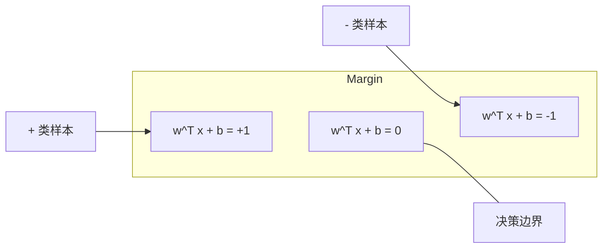
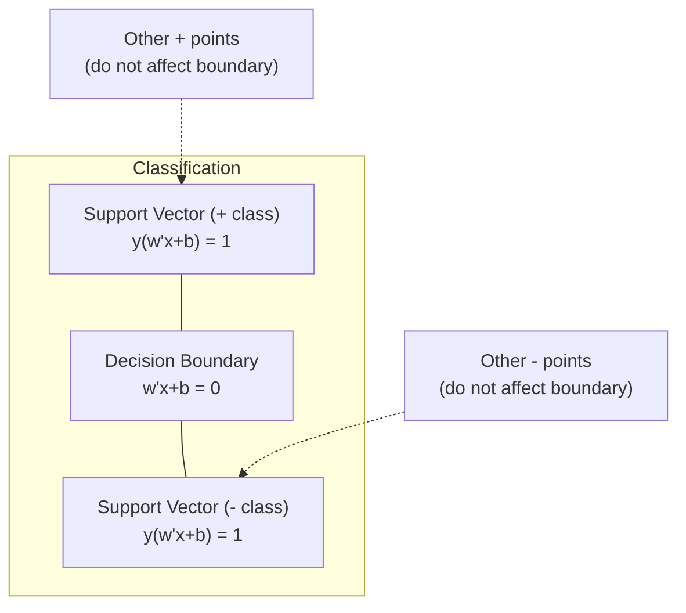
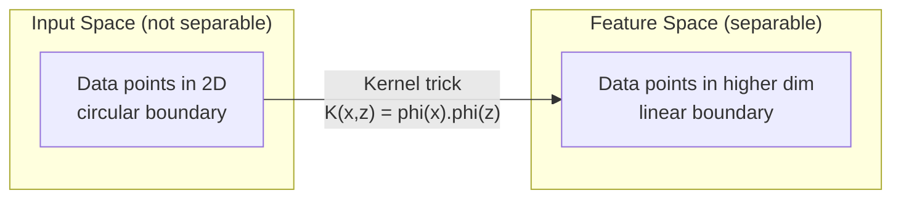

# 支持向量机

> 在两类样本之间找一条最宽的“马路”。这就是全部思路。

**类型：** 构建
**语言：** Python
**先修：** 第 1 阶段（第 08 课优化、第 14 课范数与距离、第 18 课凸优化）
**时长：** ~90 分钟

## 学习目标

- 使用铰链损失和原始形式上的梯度下降，从零实现线性 SVM
- 解释最大间隔原理，并从训练好的模型中找出支持向量
- 对比线性核、多项式核和 RBF 核，并解释核技巧如何避免显式高维映射
- 理解参数 C 在间隔宽度和分类错误之间的权衡

## 问题

你有两类数据点，需要画一条线（或者超平面）把它们分开。能用的线有无穷多条。该选哪一条？

选间隔最大的那条。间隔是决策边界和两侧最近数据点之间的距离。间隔越宽，分类器通常越自信，也越能泛化到未见过的数据。

这就是支持向量机（SVM）的直觉。它是机器学习里最有数学美感的算法之一。深度学习流行之前，SVM 长期是分类任务的主力；在小数据集、高维数据，以及需要清晰理论保证的场景里，它至今仍然很有价值。

SVM 也和第 1 阶段紧密相连：优化部分是凸问题（第 18 课），间隔用范数来衡量（第 14 课），核技巧则利用内积在不显式进入高维空间的情况下处理非线性边界。

## 核心概念

### 最大间隔分类器

对于可线性分割的数据，标签 `y_i` 取 `{-1, +1}`，特征向量为 `x_i`，我们要找一个超平面 `w^T x + b = 0` 把两类分开。

点 `x_i` 到超平面的距离为：

```text
distance = |w^T x_i + b| / ||w||
```

当点被正确分类时，`y_i * (w^T x_i + b) > 0`。间隔就是超平面到两侧最近点的距离之和。



优化目标可以写成：

```text
maximize    2 / ||w||     (the margin width)
subject to  y_i * (w^T x_i + b) >= 1  for all i
```

等价地，最小化 `||w||^2` 更容易优化：

```text
minimize    (1/2) ||w||^2
subject to  y_i * (w^T x_i + b) >= 1  for all i
```

这是一个凸二次规划问题，存在唯一全局解。恰好落在间隔边界上的点，也就是满足 `y_i * (w^T x_i + b) = 1` 的点，叫作支持向量。它们是唯一真正决定决策边界的点。移动或删除非支持向量，边界通常不会变。

### 支持向量：最关键的少数点



大多数训练点其实不重要，真正重要的是支持向量。这也是 SVM 在预测时很省内存的原因：你只需要保存支持向量，不用保存整个训练集。

支持向量的数量也能反映泛化能力。支持向量越少，通常意味着边界越稳定。

### 软间隔：用 C 处理噪声

真实数据往往不是完全可分的。有些点会落到边界错误的一侧，或者落进间隔内部。软间隔通过引入松弛变量来允许这种违反。

```text
minimize    (1/2) ||w||^2 + C * sum(xi_i)
subject to  y_i * (w^T x_i + b) >= 1 - xi_i
            xi_i >= 0  for all i
```

松弛变量 `xi_i` 表示第 `i` 个点违反间隔的程度。`C` 控制权衡：

| C value | Behavior |
|---------|----------|
| Large C | 严厉惩罚违反。间隔更窄，误分类更少，更容易过拟合 |
| Small C | 允许更多违反。间隔更宽，误分类更多，更容易欠拟合 |

`C` 可以理解为反向的正则化强度。`C` 越大，正则化越弱；`C` 越小，正则化越强。

### Hinge loss：SVM 的损失函数

软间隔 SVM 还能写成无约束优化：

```text
minimize    (1/2) ||w||^2 + C * sum(max(0, 1 - y_i * (w^T x_i + b)))
```

`max(0, 1 - y_i * f(x_i))` 就是铰链损失。样本被正确分类并且超出间隔时，损失为 0；样本落在间隔内或者被误分类时，损失线性增长。

```text
Hinge loss for a single point:

loss
  |
  | \
  |  \
  |   \
  |    \
  |     \_______________
  |
  +-----|-----|-------->  y * f(x)
       0     1

Zero loss when y*f(x) >= 1 (correctly classified, outside margin).
Linear penalty when y*f(x) < 1.
```

和 logistic loss 做对比：

```text
Hinge:     max(0, 1 - y*f(x))          Hard cutoff at margin
Logistic:  log(1 + exp(-y*f(x)))        Smooth, never exactly zero
```

铰链损失会产生稀疏解，只有支持向量对结果有非零贡献；逻辑损失则会让所有点都参与。也因此，SVM 在预测时更节省内存。

### 用梯度下降训练线性 SVM

你可以直接在铰链损失加 L2 正则上做梯度下降，而不必求解受约束的 QP：

```text
L(w, b) = (lambda/2) * ||w||^2 + (1/n) * sum(max(0, 1 - y_i * (w^T x_i + b)))

Gradient with respect to w:
  If y_i * (w^T x_i + b) >= 1:  dL/dw = lambda * w
  If y_i * (w^T x_i + b) < 1:   dL/dw = lambda * w - y_i * x_i

Gradient with respect to b:
  If y_i * (w^T x_i + b) >= 1:  dL/db = 0
  If y_i * (w^T x_i + b) < 1:   dL/db = -y_i
```

这叫原始形式（primal）。每个 epoch 的复杂度是 `O(n * d)`，其中 `n` 是样本数，`d` 是特征数。对于文本这类高维稀疏数据，速度通常很快。

### 对偶形式和核技巧

SVM 的拉格朗日对偶形式是：

```text
maximize    sum(alpha_i) - (1/2) * sum_ij(alpha_i * alpha_j * y_i * y_j * (x_i . x_j))
subject to  0 <= alpha_i <= C
            sum(alpha_i * y_i) = 0
```

对偶问题只依赖样本两两之间的点积 `x_i . x_j`。这就是关键点。把每个点积换成核函数 `K(x_i, x_j)`，SVM 就能在不显式计算高维映射的情况下学习非线性边界。

```text
Linear kernel:      K(x, z) = x . z
Polynomial kernel:  K(x, z) = (x . z + c)^d
RBF (Gaussian):     K(x, z) = exp(-gamma * ||x - z||^2)
```

RBF 核会把数据映射到无限维空间。输入空间里越近的点，核值越接近 1；越远的点，核值越接近 0。它可以学习任何平滑的决策边界。



核技巧的重点在于：你不需要显式计算 `phi(x)`，就能得到高维空间的点积。对 `D` 维数据来说，多项式核在显式展开后可能对应 `O(D^d)` 维特征空间，但 `K(x, z)` 本身可以在 `O(D)` 时间内计算。

### 支持向量回归（SVR）

支持向量回归不是找边界，而是在数据周围拟合一条宽度为 `epsilon` 的“管道”。落在管道内的点损失为 0，落在管道外的点则受到线性惩罚。

```text
minimize    (1/2) ||w||^2 + C * sum(xi_i + xi_i*)
subject to  y_i - (w^T x_i + b) <= epsilon + xi_i
            (w^T x_i + b) - y_i <= epsilon + xi_i*
            xi_i, xi_i* >= 0
```

`epsilon` 决定管道宽度。管道越宽，支持向量越少，拟合越平滑；管道越窄，支持向量越多，拟合越紧。

### 为什么 SVM 输给了深度学习，以及它为什么仍然会赢

SVM 从 20 世纪 90 年代末到 2010 年前后一直很强。深度学习后来在几个方面超过了它：

| Factor | SVMs | Deep learning |
|--------|------|---------------|
| Feature engineering | 需要手工设计 | 自动学习特征 |
| 可扩展性 | 核方法通常是 `O(n^2)` 到 `O(n^3)` | SGD 每个轮次可接近线性 |
| 图像/文本/音频 | 需要手工特征 | 可直接从原始数据学习 |
| 大型数据集（>100k） | 较慢 | 扩展性更好 |
| GPU 加速 | 收益有限 | 加速非常明显 |

SVM 仍然在这些场景很强：
- 小数据集（几百到几千个样本）
- 高维稀疏数据（例如 TF-IDF 文本特征）
- 需要数学保证的时候（间隔界）
- 训练时间必须很短的时候（线性 SVM 非常快）
- 二分类且间隔结构清晰的时候
- 异常检测（one-class SVM）

```figure
svm-margin
```

## 动手实现

### 第 1 步：铰链损失和梯度

基础部分。先计算一个 batch 的铰链损失及其梯度。

```python
def hinge_loss(X, y, w, b):
    n = len(X)
    total_loss = 0.0
    for i in range(n):
        margin = y[i] * (dot(w, X[i]) + b)
        total_loss += max(0.0, 1.0 - margin)
    return total_loss / n
```

### 第 2 步：用梯度下降训练线性 SVM

通过最小化正则化 hinge loss 训练，不需要 QP 求解器。

```python
class LinearSVM:
    def __init__(self, lr=0.001, lambda_param=0.01, n_epochs=1000):
        self.lr = lr
        self.lambda_param = lambda_param
        self.n_epochs = n_epochs
        self.w = None
        self.b = 0.0

    def fit(self, X, y):
        n_features = len(X[0])
        self.w = [0.0] * n_features
        self.b = 0.0

        for epoch in range(self.n_epochs):
            for i in range(len(X)):
                margin = y[i] * (dot(self.w, X[i]) + self.b)
                if margin >= 1:
                    self.w = [wj - self.lr * self.lambda_param * wj
                              for wj in self.w]
                else:
                    self.w = [wj - self.lr * (self.lambda_param * wj - y[i] * X[i][j])
                              for j, wj in enumerate(self.w)]
                    self.b -= self.lr * (-y[i])

    def predict(self, X):
        return [1 if dot(self.w, x) + self.b >= 0 else -1 for x in X]
```

### 第 3 步：核函数

实现线性核、多项式核和 RBF 核。

```python
def linear_kernel(x, z):
    return dot(x, z)

def polynomial_kernel(x, z, degree=3, c=1.0):
    return (dot(x, z) + c) ** degree

def rbf_kernel(x, z, gamma=0.5):
    diff = [xi - zi for xi, zi in zip(x, z)]
    return math.exp(-gamma * dot(diff, diff))
```

### 第 4 步：识别支持向量和间隔

训练结束后，找出支持向量并计算间隔宽度。

```python
def find_support_vectors(X, y, w, b, tol=1e-3):
    support_vectors = []
    for i in range(len(X)):
        margin = y[i] * (dot(w, X[i]) + b)
        if abs(margin - 1.0) < tol:
            support_vectors.append(i)
    return support_vectors
```

完整实现见 `code/svm.py`。

## 使用方式

用 scikit-learn：

```python
from sklearn.svm import SVC, LinearSVC, SVR
from sklearn.preprocessing import StandardScaler
from sklearn.pipeline import Pipeline

clf = Pipeline([
    ("scaler", StandardScaler()),
    ("svm", SVC(kernel="rbf", C=1.0, gamma="scale")),
])
clf.fit(X_train, y_train)
print(f"Accuracy: {clf.score(X_test, y_test):.4f}")
print(f"Support vectors: {clf['svm'].n_support_}")
```

注意：训练 SVM 前一定要先做特征缩放。SVM 对特征量纲很敏感，因为间隔和 `||w||` 强耦合，不缩放会扭曲几何结构。

对大数据集，通常用 `LinearSVC`（原始形式，单轮 `O(n)`）而不是 `SVC`（对偶形式，常见 `O(n^2)` 到 `O(n^3)`)：

```python
from sklearn.svm import LinearSVC

clf = Pipeline([
    ("scaler", StandardScaler()),
    ("svm", LinearSVC(C=1.0, max_iter=10000)),
])
```

## 练习

1. 生成二维线性可分数据，用你自己的 `LinearSVM` 训练并找出支持向量。验证支持向量确实是离决策边界最近的点。
2. 在有噪声的数据上把 `C` 从 `0.001` 调到 `1000`。画出不同 `C` 下的决策边界，观察从“宽间隔（欠拟合）”到“窄间隔（过拟合）”的变化。
3. 构造一个圆形边界的数据集，证明线性 SVM 会失败。再计算 RBF 核矩阵，展示在核诱导空间里它们变得可线性分割。
4. 在同一数据集上比较 hinge loss 和 logistic loss：分别训练线性 SVM 和逻辑回归，统计哪些点参与了决策边界（支持向量 vs 全部样本）。
5. 实现 SVR（`epsilon` 不敏感损失），拟合 `y = sin(x) + noise`。画出预测的 `epsilon` 管道，并标出位于管道外的支持向量。

## 关键术语

| 术语 | 实际含义 |
|------|----------------------|
| Support vectors | 距离决策边界最近的一批训练点，真正决定超平面的点 |
| Margin | 决策边界到最近支持向量的距离，SVM 要把它最大化 |
| Hinge loss | `max(0, 1 - y*f(x))`。正确分类且在间隔外时为 0，否则线性惩罚 |
| C parameter | 间隔宽度和分类错误之间的权衡；`C` 越大，间隔越窄 |
| Soft margin | 允许通过松弛变量违反间隔的 SVM 形式，可处理不可分数据 |
| Kernel trick | 不显式映射到高维空间，却能在那个空间里算点积 |
| Linear kernel | `K(x, z) = x . z`，等价于标准点积，适用于线性可分场景 |
| RBF kernel | `K(x, z) = exp(-gamma * ||x-z||^2)`，映射到无限维，能拟合平滑复杂边界 |
| Polynomial kernel | `K(x, z) = (x . z + c)^d`，对应多项式组合特征空间 |
| Dual formulation | SVM 的重写形式，只依赖样本两两点积，因此天然支持核 |
| SVR | 支持向量回归，拟合 `epsilon` 管道，管内点损失为 0 |
| Slack variables | `xi_i`，表示一个点违反间隔的程度；正确且在间隔外时为 0 |
| Maximum margin | 选择使两侧最近点距离最大的超平面的原则 |

## 延伸阅读

- [Vapnik: The Nature of Statistical Learning Theory (1995)](https://link.springer.com/book/10.1007/978-1-4757-3264-1) - SVM 和统计学习理论的基础著作
- [Cortes & Vapnik: Support-vector networks (1995)](https://link.springer.com/article/10.1007/BF00994018) - 原始 SVM 论文
- [Platt: Sequential Minimal Optimization (1998)](https://www.microsoft.com/en-us/research/publication/sequential-minimal-optimization-a-fast-algorithm-for-training-support-vector-machines/) - 让 SVM 训练可用的 SMO 算法
- [scikit-learn SVM documentation](https://scikit-learn.org/stable/modules/svm.html) - 带实现细节的实用参考
- [LIBSVM: A Library for Support Vector Machines](https://www.csie.ntu.edu.tw/~cjlin/libsvm/) - 大多数 SVM 实现背后的 C++ 库

