# K 近邻���
> 先把训练数�“记��，�根�最近的邻居�预测；看似朴素，�而常常很有用�
**类�:** �建 **语言:** Python  
**先修:** �1 期（课程 14 范数��离）  
**时长:** ~90 分钟

## 学习目标

- �零�� KNN 分类和�归，支���置的 K ��离加�投票�- 解释特�尺度为什么会影��离计算，并演示标准化的��性�- 对比欧��曼哈顿�余弦等�离度�在文本�高维场景的适用性�- �解维度�难对邻域结�的影�，以�K����投票策略对��方差的作用�
## 问题背景

你有一批��数�，�了一�新样本，需�分类或�归。�线性��SVM ��，�先拟��数，而是直�找出�离该点最近的 \(K\) 个训练点，用它们的标�目标��断输出�
这就�KNN。它没有训练过程，没有�学习�数，甚至没有优化�失函数。核心动作是：�存全�训练集，在预测时按�离找邻居�
它看起�简�到有些“��算法�，但在中�规模问题上常常表��错。更��的是，它把你带�几个根本问题：�离度��么选�维度�难如何�生�惰性学习�积�学习的差异�
�代 AI 里，KNN 也无处�在：��数�库� embedding 检索�RAG 找相�chunk���系统找相似用户或物�，本质动作都在�近邻�索�
## 核心概念

### KNN 的工作方�
有一个带标签的数�集和一个查询点�
1. 计算查询点到训练集中�个点的�离  
2. 按�离���� 
3. �最近的 K 个邻� 
4. 分类任务：对 K 个邻居投� 
5. �归任务：对 K 个邻居���加���
```mermaid
graph TD
    Q["查询�?"] --> D["计算到所有训练点的��]
    D --> S["按�离��]
    S --> K["选出 K 个最近邻"]
    K --> C{"分类 or �归�}
    C -->|分类| V["多数投票"]
    C -->|�归| A["平��]
    V --> P["预测结�"]
    A --> P
```

整个算法就是这些：无拟��无��传播�无 epoch�
### 如何�K

K 是核心超�数，直��制��方差�衡�
| K �| 行为 |
|---|---|
| K=1 | 决策边界紧贴�个点，训练误差�，方差高，容易过拟�|
| �K（如 3~5�| 对局部结��感，�学到更��边界 |
| �K | 边界更平滑，对噪声更稳，但�能欠拟� |
| K=N | �个点都投�一结�，�差最�|

一个常用起点是 \(K=\sqrt{N}\)，二分类�优先用奇数��平票�
```mermaid
graph LR
    subgraph "K=1（过拟��
        A["锯齿边界<br>�点贴�"]
    end
    subgraph "K=15（平衡）"
        B["平滑边界<br>�留主�结�"]
    end
    subgraph "K=N（欠拟��
        C["几�平�边界<br>全局多数�]
    end
    A -->|"�大 K"| B -->|"�大 K"| C
```

### �离度�

“近�是什么，完全�决��离定义，���离会改�邻居�预测�
**L2（欧��离）**是默认选择，几何�义是直线�离�
```text
d(a, b) = sqrt(sum((a_i - b_i)^2))
```

它对特�尺度�感，先标准化�常关键�
**L1（曼哈顿�离�*是�对差之和，对离群值更稳，因为没有平方放大�
```text
d(a, b) = sum(|a_i - b_i|)
```

**余弦�离**比较��夹角，�看模长。文本和 embedding 常用�
```text
d(a, b) = 1 - (a · b) / (||a|| * ||b||)
```

**闵�夫斯基��*用��\(p\) 统一 L1/L2 家��
```text
d(a, b) = (sum(|a_i - b_i|^p))^(1/p)

p=1：曼哈顿
p=2：欧�p->inf：Chebyshev（�维最大�对差�```

度�选�建议�
| 数�类� | 常用度� | �因 |
|---|---|---|
| 数值特�且�纲�近 | L2 | 空间直观，默认首�|
| 数值特�且有异常�| L1 | 抗离群值更�|
| 文本 embedding | 余弦 | 幅值通常是噪声，方�更代表语�|
| 高维稀�| 余弦�L1 | L2 在高维下更容易退�|
| 混�特� | 自定义组�| �类特�用�适�离��� |

### 加� KNN

标准 KNN �K 个邻居等��，但�离更近的点通常更有信�。�用�离倒数�加�：

```text
weight_i = 1 / (distance_i + epsilon)

分类：加�投��归：weighted average = sum(w_i * y_i) / sum(w_i)
```

\(\epsilon\) ��查询点�训练点��时除零。加��，对 K 的�赖通常更弱，因为远邻贡献被���
### 维度�难

高维空间�KNN 退化是“慢性病�，且有数学解释�
**问题一：�离集�*  
维度�高时，最大�离�最��离之比趋�1� 
点间�离分布过��近，“最近邻�失��义�
```text
�机�匀点在 d 维下�d=2:    max/min �离比�化较�d=100:  max/min �离比大�1.01
d=1000: max/min �离比大�1.001
```

**问题二：体积爆炸**  
�在固定比例内�续找�K 邻居，邻域�径�快速�大，最终覆盖几�整个空间�
**问题三：角�主导**  
��超立方体里，体积主�集中在角�；内切��比�维度上�急剧缩水�
�践�验：KNN 在约 20~50 维�还能稳定工作，超过�通常需�先�维（PCA�UMAP�t-SNE），或者使用能处�高维近邻结�的树/近似算法�
### KD-Tree：加速近邻查�
朴素 KNN �次都对全部点算�离，��度�次查询 \(O(n\cdot d)\)。KD-tree �到按轴划分空间�
- �层选择一个维度；
- 按该维中�数切分�- 形�二�树���

```mermaid
graph TD
    R["�x1 �5.0 划分"] -->|"x1 <= 5.0"| L["�x2 �3.0 划分"]
    R -->|"x1 > 5.0"| RR["�x2 �7.0 划分"]
    L -->|"x2 <= 3.0"| LL["��� 个点"]
    L -->|"x2 > 3.0"| LR["��� 个点"]
    RR -->|"x2 <= 7.0"| RL["��� 个点"]
    RR -->|"x2 > 7.0"| RRR["��� 个点"]
```


查询时先下沉到包�查询点的��，��溯检查�能有更近点的分支。�维常�为 \(O(\log n)\)，高维通常退化到 \(O(n)\)�
### Ball Tree：中高维更稳一�
Ball tree 用�心�而�是轴对�盒�分区，�个节点是“中��径�的�壳�
优势�- 对中等维度（�50 以内）比 KD-tree 更稳�- 更适��轴�结�；
- 边界包络更紧，剪�更有效�
KD-tree �ball tree 都是精确近邻。真正大规模（百万级 + 上百维）通常改用近似近邻（HNSW�IVF�PQ），课程 1 的内容会覆盖这部分�
### 惰性学�vs 积�学习

KNN 是惰性学习：训练基本��事，预测全在��时� 
大多数模�（线性模�SVM/��网）是积�学习：训练时�大�计算，��时快�
| 维度 | 惰性学习（KNN�| 积�学习（SVM/��网） |
|---|---|---|
| 训练�本 | 存数�\(O(1)\) | 一般是 \(O(n\cdot epochs)\) |
| 预测�本 | �次 \(O(n\cdot d)\) | 通常 \(O(d)\) 或�数��|
| ��内存 | 需�存全部训练数� | �需模��数 |
| 新数�适� | 新�点��生�| 常需�训 |
| 决策边界 | 在线计算 | 训练�固�|

惰性学习适用�- 数��续�化频�（�删样本无需�训� 
- 查询�很� 
- 训练时间必须��  
- 数�规模�大，朴素�索����
### KNN 的��
�归任务中，KNN �K 个近邻的目标值�平�（或�离加�平�）：

```text
prediction = (1/K) * sum(y_i for i in K 最近邻)
预测 = sum(w_i * y_i) / sum(w_i)  # 加�版本
where w_i = 1 / distance_i
```

其预测通常是分段常值（加��更平滑），无法外�。训练目标若�\([0,100]\)，预测也�会跳出这个范围�
```figure
knn-smoothness
```

## �践

### 步骤 1：���离函�
�� L1�L2�余弦和 Minkowski �离�
```python
import math

def l2_distance(a, b):
    return math.sqrt(sum((ai - bi) ** 2 for ai, bi in zip(a, b)))

def l1_distance(a, b):
    return sum(abs(ai - bi) for ai, bi in zip(a, b))

def cosine_distance(a, b):
    dot_val = sum(ai * bi for ai, bi in zip(a, b))
    norm_a = math.sqrt(sum(ai ** 2 for ai in a))
    norm_b = math.sqrt(sum(bi ** 2 for bi in b))
    if norm_a == 0 or norm_b == 0:
        return 1.0
    return 1.0 - dot_val / (norm_a * norm_b)

def minkowski_distance(a, b, p=2):
    if p == float('inf'):
        return max(abs(ai - bi) for ai, bi in zip(a, b))
    return sum(abs(ai - bi) ** p for ai, bi in zip(a, b)) ** (1 / p)
```

### 步骤 2：KNN 分类��归器

��完整 KNN 类：�� K��离函数�是��离加�，以�分类/�归模��
```python
class KNN:
    def __init__(self, k=5, distance_fn=l2_distance, weighted=False,
                 task="classification"):
        self.k = k
        self.distance_fn = distance_fn
        self.weighted = weighted
        self.task = task
        self.X_train = None
        self.y_train = None

    def fit(self, X, y):
        self.X_train = X
        self.y_train = y

    def predict(self, X):
        return [self._predict_one(x) for x in X]
```

### 步骤 3：KD-Tree（选��
�� KD-tree：�层按当�维度中�数划分，查询时先下沉��溯�
```python
class KDTree:
    def __init__(self, X, indices=None, depth=0):
        # 递归切分空间
        self.axis = depth % len(X[0])
        # 按当�轴中�数划�        ...

    def query(self, point, k=1):
        # 先到��，��溯检查邻近区�        ...
```

完整���`code/knn.py`�
### 步骤 4：特�标准化

KNN 对�纲特别�感，�能直�比较���纲特��
```python
def standardize(X):
    n = len(X)
    d = len(X[0])
    means = [sum(X[i][j] for i in range(n)) / n for j in range(d)]
    stds = [
        max(1e-10, (sum((X[i][j] - means[j]) ** 2 for i in range(n)) / n) ** 0.5)
        for j in range(d)
    ]
    return [[((X[i][j] - means[j]) / stds[j]) for j in range(d)] for i in range(n)], means, stds
```

## 应用

�`scikit-learn` 比对�
```python
from sklearn.neighbors import KNeighborsClassifier
from sklearn.preprocessing import StandardScaler
from sklearn.pipeline import Pipeline

clf = Pipeline([
    ("scaler", StandardScaler()),
    ("knn", KNeighborsClassifier(n_neighbors=5, metric="euclidean")),
])
clf.fit(X_train, y_train)
print(f"׼ȷÂÊ£º{clf.score(X_test, y_test):.4f}")
```

`scikit-learn` 会在�维大样本时自动�试 KD-tree �ball-tree。高维则�退朴素检索。`algorithm` �数�手动指定�
在�万级��检索中，通常�FAISS/Annoy/��数�库：

```python
import faiss

index = faiss.IndexFlatL2(dimension)
index.add(embeddings)
distances, indices = index.search(query_vectors, k=5)
```

## 练习

1. 在二维三类数�上�分�KNN，分别比�\(K=1,5,15,N\) 的决策边界。观察过拟�到欠拟�过程�2. 生� 1000 个点，分别在 2��0�0�00�00 维下，计算最�最��对�离比值并作图，观察维度�难�3. 在文本分类（TF-IDF）上比较 L1/L2/余弦�离，说�余弦通常更适�文本的�因�4. �� KD-tree，比�2D�0D�0D �1k�0k�00k 点的查询耗时和朴素检索，找出转折维度�5. �\(y=\sin(x)+noise\) ��加���加� KNN �归，比�K=3/10/30 的平滑性差异�
## 术语

| 术语 | �际�义 |
|---|---|
| KNN | ��数方法。对查询点找 K 个最近邻��投票或平�|
| 惰性学�| �在训练期��数学习；��期�计�|
| 积�学习 | 训练期进行大�计算得到紧凑�数化模� |
| 维度�难 | 高维下�离集中�邻域退化，导致 KNN 失效 |
| KD-tree | 按轴递归划分的二�树，�维时查询更快 |
| Ball tree | 用�体嵌套的树结�，中维度下常优�KD-tree |
| 加� KNN | 邻近点��更高的 KNN �体 |
| 特�标准�| 将���纲映射到�比尺度，KNN 必需步骤 |
| 多数投票 | 分类场景下按 K 邻居类别计数 |
| 朴素检�| 对全部训练点算�离，精确但慢 |
| 近似近邻 | HNSW�LSH�IVF 等，牺牲精度�速度 |
| Voronoi 划分 | K=1 下�个点定义的最近域，边界是 Voronoi �|

## 延伸阅读

- [Cover & Hart: Nearest Neighbor Pattern Classification (1967)](https://ieeexplore.ieee.org/document/1053964)
- [Friedman, Bentley, Finkel: An Algorithm for Finding Best Matches in Logarithmic Expected Time (1977)](https://dl.acm.org/doi/10.1145/355744.355745)
- [Beyer et al.: When Is "Nearest Neighbor" Meaningful? (1999)](https://link.springer.com/chapter/10.1007/3-540-49257-7_15)
- [scikit-learn Nearest Neighbors 文档](https://scikit-learn.org/stable/modules/neighbors.html)
- [FAISS: A Library for Efficient Similarity Search](https://github.com/facebookresearch/faiss)
